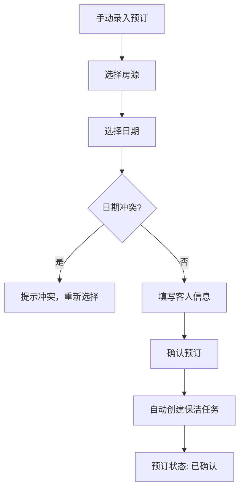
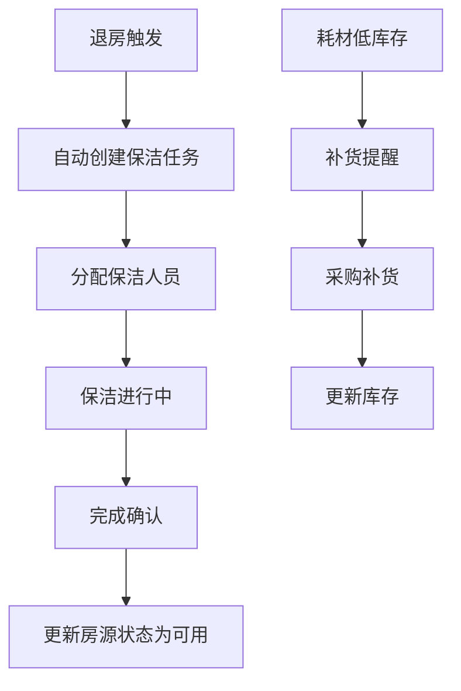

# 民宿短租房东管理系统 PRD

## 1. Product Overview

民宿短租房东管理系统是一款面向个人房东和小型民宿经营者的全流程管理工具，解决多房源、多平台预订统一管理的痛点，帮助房东高效管理房源、预订、客户、运营和财务。

- **目标用户**：拥有1-20套房源的个人房东、小型民宿经营者
- **核心价值**：统一管理多平台预订、动态定价、客户关系维护、运营任务追踪、财务分析

---

## 2. Core Features

### 2.1 User Roles

| Role | Registration Method | Core Permissions |
|------|---------------------|------------------|
| 房东/管理员 | 系统内置（单用户模式） | 所有功能的完整访问权限 |

### 2.2 Feature Module

1. **仪表盘（Dashboard）**：关键数据概览、今日任务提醒、近期预订
2. **房源管理**：房源档案、动态定价、入住规则配置
3. **预订管理**：预订日历、多平台预订汇总、预订详情管理
4. **客户关系**：房客档案、优质客人标注、黑名单管理
5. **运营管理**：保洁任务安排、耗材库存追踪、维修任务管理
6. **财务管理**：收入统计、佣金计算、年度经营报告

### 2.3 Page Details

| Page Name | Module Name | Feature description |
|-----------|-------------|---------------------|
| 仪表盘 | 数据概览 | 总收入、入住率、平均客单价、今日/本周任务 |
| 仪表盘 | 预订日历 | 迷你日历显示近期入住/退房 |
| 房源列表 | 房源卡片 | 展示房源基本信息、当前状态、快捷操作 |
| 房源详情 | 房源档案 | 地址、户型、面积、设施清单、特色卖点、照片管理 |
| 房源定价 | 价格设置 | 基础价格、节假日定价、自定义日期定价、最低入住天数 |
| 预订日历 | 月视图 | 各房源的入住/退房可视化、冲突检测、状态颜色标识 |
| 预订列表 | 预订汇总 | 支持按平台、状态筛选，手动录入新预订 |
| 预订详情 | 预订管理 | 预订信息、客人联系信息、确认状态、备注 |
| 客户列表 | 房客档案 | 入住历史、评价记录、消费统计 |
| 客户详情 | 客户标签 | 优质客人/普通客人/黑名单标注，优惠管理 |
| 保洁任务 | 任务列表 | 待分配/进行中/已完成，任务分配、完成确认 |
| 耗材库存 | 库存管理 | 库存列表、低库存预警、补货记录 |
| 维修任务 | 维修管理 | 报修登记、维修进度、费用记录 |
| 财务概览 | 收入统计 | 月度收入图表、各房源收入对比 |
| 财务详情 | 佣金计算 | 平台佣金扣除明细、实收金额计算 |
| 年度报告 | 经营分析 | 总收入、入住率、平均客单价、趋势图表 |

---

## 3. Core Process

### 3.1 预订处理流程

### 3.2 运营任务流程

---

## 4. User Interface Design

### 4.1 Design Style

**设计理念**：专业、高效、温暖的民宿管理体验

- **主色调**：暖橙色 `#F59E0B` - 代表热情、活力、家的温度
- **辅助色**：深墨绿 `#065F46` - 代表信任、自然、高品质服务
- **中性色**：深灰 `#1F2937`、中灰 `#6B7280`、浅灰 `#F3F4F6`
- **按钮风格**：圆角矩形（radius 8px），渐变背景，悬浮有微放大效果
- **字体**：
  - 标题：'Playfair Display' serif - 优雅高端
  - 正文：'Inter' sans-serif - 清晰易读
- **布局风格**：侧边栏导航 + 顶部栏 + 内容区域三栏式
- **图标**：Lucide React 图标库，线性风格
- **卡片设计**：白色背景 + 柔和阴影（shadow-sm）+ 圆角 12px

### 4.2 Page Design Overview

| Page Name | Module Name | UI Elements |
|-----------|-------------|-------------|
| 仪表盘 | 数据卡片 | 渐变背景卡片、数据可视化、趋势箭头、图标装饰 |
| 仪表盘 | 任务列表 | 时间线布局、状态标签、优先级标识 |
| 房源列表 | 房源卡片 | 封面图、状态徽章、关键信息网格、快捷操作按钮 |
| 预订日历 | 月历视图 | 色块状态（绿色可订/橙色预订中/红色冲突）、悬停详情提示 |
| 财务报表 | 数据图表 | 柱状图/折线图、对比色、数据标签、交互式悬停 |
| 客户详情 | 客户画像 | 头像卡片、标签系统、时间线入住历史、星级评价展示 |

### 4.3 Responsiveness

- **Desktop-first** 设计，主断点 1024px
- **侧边栏**：桌面端固定 240px，移动端折叠为抽屉菜单
- **卡片布局**：桌面端 3-4 列，平板 2 列，移动端 1 列
- **表格**：桌面端完整表格，移动端转为卡片列表形式

---

## 5. 功能规格详细说明

### 5.1 房源管理模块

**房源档案**：
- 基础信息：房源名称、地址（省市区街道门牌号）、户型（几室几厅几卫）、面积（㎡）、可住人数
- 设施清单：多选（空调、WiFi、电视、洗衣机、厨房、停车位、泳池等）
- 特色卖点：文本描述，支持多条
- 房源照片：多图上传、封面设置、排序

**动态定价**：
- 基础价格：平日价格设置
- 周末定价：周六/周日溢价
- 节假日定价：特殊日期范围价格覆盖
- 自定义日期：支持单天/连续日期的特殊价格
- 价格预览：日历视图显示各日期价格

**入住规则**：
- 最低入住天数（默认1晚）
- 入住时间（如14:00后）
- 退房时间（如12:00前）
- 是否允许宠物
- 是否允许吸烟
- 取消政策

### 5.2 预订管理模块

**预订日历**：
- 月视图/周视图切换
- 每行为一个房源，显示日期状态
- 颜色编码：可订（浅绿）、已预订（橙色）、入住中（深橙）、冲突（红色）
- 悬停显示预订详情
- 点击日期快速创建预订

**预订列表**：
- 平台来源：Airbnb、途家、美团、携程、Booking、直接预订
- 状态筛选：待确认、已确认、入住中、已退房、已取消
- 批量操作：批量确认、批量导出

**预订详情**：
- 预订编号、房源、入住/退房日期、入住天数
- 客人姓名、电话、身份证号、联系方式
- 预订金额、平台佣金、实收金额
- 确认状态、备注信息

### 5.3 客户关系模块

**房客档案**：
- 基本信息：姓名、电话、邮箱、身份证号
- 入住历史：所有预订记录
- 累计消费、入住次数、平均评分
- 评价记录：客人评价及回复

**客户标签**：
- 优质客人（VIP）：入住次数≥3次 或 消费金额高
- 回头客：重复入住自动标注
- 黑名单：差评或问题客人

**优惠管理**：
- 对优质客人设置专属折扣
- 回头客自动应用优惠

### 5.4 运营管理模块

**保洁任务**：
- 退房自动生成保洁任务
- 任务状态：待分配、进行中、已完成
- 分配保洁人员、预计完成时间
- 完成确认、费用记录
- 任务历史

**耗材库存**：
- 耗材分类：洗漱用品、床品、清洁剂、其他
- 库存数量、最低库存预警线
- 低库存自动提醒
- 出入库记录

**维修任务**：
- 报修登记：房源、问题描述、紧急程度
- 维修进度：待处理、处理中、已完成
- 维修费用记录
- 维修人员信息

### 5.5 财务管理模块

**收入统计**：
- 按月/季度/年度查看
- 各房源收入对比
- 图表可视化

**佣金计算**：
- 各平台佣金比例设置
- 预订佣金自动计算
- 实收金额 = 预订金额 - 平台佣金

**年度经营报告**：
- 总收入
- 总入住天数
- 入住率（%）
- 平均客单价
- 同比/环比趋势
- 平台收入分布

---

## 6. 数据结构说明

**核心实体关系**：
- 房源 → 一对多 → 预订
- 房源 → 一对多 → 保洁任务
- 房源 → 一对多 → 维修任务
- 房源 → 一对多 → 价格规则
- 客户 → 一对多 → 预订
- 预订 → 一对一 → 保洁任务
- 耗材 → 一对多 → 出入库记录
