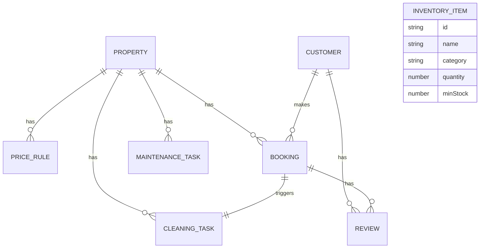

# 民宿短租房东管理系统 技术架构

## 1. Architecture Design

```mermaid
flowchart TB
    subgraph Frontend["前端 (React + Vite)"]
        UI["UI组件 (React/Tailwind)"]
        Store["状态管理 (Zustand)"]
        Router["路由 (React Router)"]
        Client["API客户端"]
    end
    
    subgraph Backend["后端 (Express + TypeScript)"]
        Routes["API路由层"]
        Middleware["中间件"]
        Service["业务逻辑层"]
        Data["数据访问层"]
    end
    
    subgraph Data["数据存储"]
        JSON["JSON文件存储 (lowdb)
        File["文件存储 (图片)"]
    end
    
    UI --> Router
    UI --> Store
    Client --> Routes
    Routes --> Middleware
    Middleware --> Service
    Service --> Data
    Data --> JSON
```

---

## 2. Technology Description

- **Frontend**: React@18 + TypeScript + TailwindCSS@3 + Vite
- **状态管理**: Zustand
- **路由**: React Router DOM@6
- **图标**: Lucide React
- **图表**: Recharts
- **后端**: Express@4 + TypeScript
- **数据持久化**: lowdb (JSON文件)
- **初始化工具**: vite-init

**技术选型说明**:
- 使用本地JSON文件存储数据，无需数据库
- 全栈TypeScript，前后端类型共享
- 支持本地开发模式：Express提供RESTful API
- 响应式设计，TailwindCSS 3 +自定义主题

---

## 3. Route Definitions

| Route | Page Component | Purpose |
|-------|----------------|---------|
| `/` | Dashboard | 仪表盘 |
| `/properties` | PropertyList | 房源列表 |
| `/properties/:id` | PropertyDetail | 房源详情/编辑 |
| `/bookings` | BookingCalendar | 预订日历 |
| `/bookings/list` | BookingList | 预订列表 |
| `/bookings/new` | BookingForm | 新建预订 |
| `/customers` | CustomerList | 客户列表 |
| `/customers/:id` | CustomerDetail | 客户详情 |
| `/operations/cleaning` | CleaningTasks | 保洁任务 |
| `/operations/inventory` | Inventory | 耗材库存 |
| `/operations/maintenance` | MaintenanceTasks | 维修任务 |
| `/finance` | FinanceOverview | 财务概览 |
| `/finance/report` | FinanceReport | 年度报告 |

---

## 4. API Definitions

### 4.1 API 响应格式

```typescript
interface ApiResponse<T> {
  success: boolean;
  data?: T;
  message?: string;
}
```

### 4.2 房源 API

```typescript
interface Property {
  id: string;
  name: string;
  address: {
    province: string;
    city: string;
    district: string;
    street: string;
    detail: string;
  };
  layout: {
    bedrooms: number;
    livingRooms: number;
    bathrooms: number;
  };
  area: number;
  maxGuests: number;
  facilities: string[];
  features: string[];
  photos: string[];
  basePrice: number;
  weekendPrice: number;
  rules: {
    minNights: number;
    checkInTime: string;
    checkOutTime: string;
    allowPets: boolean;
    allowSmoking: boolean;
    cancellationPolicy: string;
  };
  status: 'available' | 'occupied' | 'maintenance';
  createdAt: string;
  updatedAt: string;
}

interface PriceRule {
  id: string;
  propertyId: string;
  type: 'holiday' | 'custom';
  name: string;
  startDate: string;
  endDate: string;
  price: number;
  createdAt: string;
}

GET /api/properties
GET /api/properties/:id
POST /api/properties
PUT /api/properties/:id
DELETE /api/properties/:id/price-rules
POST /api/properties/:id/price-rules
PUT /api/price-rules/:id
DELETE /api/price-rules/:id
```

### 4.3 预订 API

```typescript
interface Booking {
  id: string;
  propertyId: string;
  customerId: string;
  customerName: string;
  customerPhone: string;
  customerIdNo: string;
  checkIn: string;
  checkOut: string;
  nights: number;
  platform: 'airbnb' | 'tujia' | 'meituan' | 'ctrip' | 'booking' | 'direct';
  status: 'pending' | 'confirmed' | 'checked-in' | 'checked-out' | 'cancelled';
  totalAmount: number;
  commission: number;
  platformCommissionRate: number;
  notes: string;
  createdAt: string;
  updatedAt: string;
}

GET /api/bookings
GET /api/bookings/:id
POST /api/bookings
PUT /api/bookings/:id
DELETE /api/bookings/:id/confirm
PUT /api/bookings/:id/check-in
PUT /api/bookings/:id/check-out
PUT /api/bookings/:id/cancel
GET /api/bookings/calendar?start=&end=
```

### 4.4 客户 API

```typescript
interface Customer {
  id: string;
  name: string;
  phone: string;
  email: string;
  idNo: string;
  tags: ('vip' | 'returning' | 'blacklist')[];
  totalBookings: number;
  totalSpent: number;
  avgRating: number;
  notes: string;
  discount: number;
  createdAt: string;
}

interface Review {
  id: string;
  customerId: string;
  bookingId: string;
  propertyId: string;
  rating: number;
  comment: string;
  reply?: string;
  createdAt: string;
}

GET /api/customers
GET /api/customers/:id
POST /api/customers
PUT /api/customers/:id
DELETE /api/customers/:id/reviews
GET /api/customers/:id/bookings
```

### 4.5 运营 API

```typescript
interface CleaningTask {
  id: string;
  propertyId: string;
  bookingId?: string;
  status: 'pending' | 'assigned' | 'in-progress' | 'completed';
  assignee: string;
  scheduledAt: string;
  completedAt?: string;
  cost: number;
  notes: string;
  createdAt: string;
}

interface InventoryItem {
  id: string;
  name: string;
  category: 'toiletries' | 'bedding' | 'cleaning' | 'other';
  quantity: number;
  minStock: number;
  unit: string;
  lastRestockedAt?: string;
  notes: string;
}

interface MaintenanceTask {
  id: string;
  propertyId: string;
  title: string;
  description: string;
  priority: 'low' | 'medium' | 'high' | 'urgent';
  status: 'pending' | 'in-progress' | 'completed';
  assignee?: string;
  cost: number;
  completedAt?: string;
  notes: string;
  createdAt: string;
}

// 保洁任务
GET /api/operations/cleaning
POST /api/operations/cleaning
PUT /api/operations/cleaning/:id
PUT /api/operations/cleaning/:id/complete
DELETE /api/operations/cleaning/:id

// 耗材库存
GET /api/operations/inventory
POST /api/operations/inventory
PUT /api/operations/inventory/:id
DELETE /api/operations/inventory/:id
POST /api/operations/inventory/:id/restock

// 维修任务
GET /api/operations/maintenance
POST /api/operations/maintenance
PUT /api/operations/maintenance/:id
PUT /api/operations/maintenance/:id/complete
DELETE /api/operations/maintenance/:id
```

### 4.6 财务 API

```typescript
interface PlatformCommission {
  platform: string;
  rate: number;
}

interface FinanceSummary {
  totalRevenue: number;
  totalNights: number;
  occupancyRate: number;
  avgDailyRate: number;
  totalCommission: number;
  netRevenue: number;
}

GET /api/finance/summary?start=&end=
GET /api/finance/monthly?year=
GET /api/finance/properties?start=&end=
GET /api/finance/platforms?start=&end=
GET /api/finance/annual-report?year=
GET /api/finance/commissions
PUT /api/finance/commissions
```

---

## 5. Server Architecture Diagram

```mermaid
flowchart LR
    subgraph Express Server
        A[app.ts] --> B[路由层 (Routes)]
        B --> C[中间件层 (Middleware)]
        C --> D[业务逻辑层 (Services)]
        D --> E[数据访问层 (Repositories)]
        E --> F[lowdb 数据文件]
    end
```

### 5.1 目录结构

```
project/
├── api/                    # 后端代码
│   ├── src/
│   │   ├── routes/       # API路由
│   │   ├── services/     # 业务逻辑
│   │   ├── repositories/ # 数据访问
│   │   ├── middleware/   # 中间件
│   │   ├── types/        # TypeScript类型
│   │   ├── data/       # 数据文件
│   │   └── index.ts     # 入口文件
│   └── package.json
│   └── tsconfig.json
├── src/                   # 前端代码
│   ├── components/       # React组件
│   ├── pages/           # 页面组件
│   ├── stores/          # Zustand状态
│   ├── hooks/           # 自定义hooks
│   ├── utils/           # 工具函数
│   ├── types/          # 前端类型
│   ├── api/             # API客户端
│   └── main.tsx        # 入口文件
├── shared/               # 共享类型
│   └── types.ts
├── vite.config.ts
├── tailwind.config.js
├── tsconfig.json
└── package.json
```

---

## 6. Data Model

### 6.1 Data Model Definition



### 6.2 初始化数据

系统将包含以下示例数据：

**房源数据**：
- 温馨一居室公寓（市中心）
- 豪华海景两居室
- 花园别墅三居室
- 现代Loft工作室

**预订数据**：
- 未来30天内的预订记录
- 包含各平台示例预订

**客户数据**：
- 示例客户档案
- 包含VIP客户、普通客户、黑名单客户

**运营数据**：
- 保洁任务示例
- 耗材库存示例
- 维修任务示例

### 6.3 数据文件结构

```json
{
  "properties": [...],
  "priceRules": [...],
  "bookings": [...],
  "customers": [...],
  "reviews": [...],
  "cleaningTasks": [...],
  "inventoryItems": [...],
  "maintenanceTasks": [...],
  "platformCommissions": [
    { "platform": "airbnb", "rate": 0.03 },
    { "platform": "tujia", "rate": 0.08 },
    { "platform": "meituan", "rate": 0.10 },
    { "platform": "ctrip", "rate": 0.08 },
    { "platform": "booking", "rate": 0.15 },
    { "platform": "direct", "rate": 0 }
  ]
}
```

---

## 7. 前端组件结构

### 7.1 主要组件

```
components/
├── layout/
│   ├── Sidebar.tsx        # 侧边栏导航
│   ├── Header.tsx         # 顶部栏
│   └── Layout.tsx       # 布局组件
├── common/
│   ├── Card.tsx           # 卡片组件
│   ├── Button.tsx        # 按钮组件
│   ├── Modal.tsx          # 弹窗组件
│   ├── Table.tsx         # 表格组件
│   ├── Badge.tsx          # 标签组件
│   └── Loading.tsx       # 加载组件
│   └── Empty.tsx        # 空状态组件
├── dashboard/
│   ├── StatsCard.tsx      # 统计卡片
│   ├── TaskList.tsx       # 任务列表
│   └── MiniCalendar.tsx   # 迷你日历
├── property/
│   ├── PropertyCard.tsx   # 房源卡片
│   ├── PropertyForm.tsx   # 房源表单
│   ├── PriceRuleForm.tsx  # 价格规则表单
│   └── PropertyGallery.tsx  # 房源图库
├── booking/
│   ├── BookingCalendar.tsx  # 预订日历
│   ├── BookingForm.tsx     # 预订表单
│   └── BookingCard.tsx    # 预订卡片
├── customer/
│   ├── CustomerCard.tsx     # 客户卡片
│   └── CustomerForm.tsx  # 客户表单
├── operations/
│   ├── CleaningTaskCard.tsx  # 保洁任务卡片
│   ├── InventoryItemCard.tsx # 库存项目卡片
│   └── MaintenanceTaskCard.tsx # 维修任务卡片
└── finance/
│   ├── RevenueChart.tsx    # 收入图表
│   ├── PropertyRevenueChart.tsx # 房源收入图表
│   └── AnnualReport.tsx  # 年度报告
```

### 7.2 状态管理

```typescript
// useAppStore.ts
interface AppState {
  properties: Property[];
  bookings: Booking[];
  customers: Customer[];
  cleaningTasks: CleaningTask[];
  inventoryItems: InventoryItem[];
  maintenanceTasks: MaintenanceTask[];
  platformCommissions: PlatformCommission[];
  
  // Actions: {
    fetchAll: () => Promise<void>;
    // 各种CRUD操作
  }
}
```

---

## 8. 开发环境配置

### 8.1 脚本命令

```json
{
  "scripts": {
    "dev": "concurrently \"npm run dev:api\" \"npm run dev:client\"",
    "dev:client": "vite",
    "dev:api": "ts-node api/src/index.ts",
    "build": "tsc && vite build",
    "build:api": "tsc -p api/tsconfig.json",
    "preview": "vite preview",
    "lint": "eslint . --ext ts,tsx --report-unused-disable-directives --max-warnings 0"
  }
}
```

### 8.2 依赖包

**前端**:
- react@18
- react-dom@18
- react-router-dom@6
- zustand
- lucide-react
- recharts
- date-fns
- clsx
- tailwind-merge

**后端**:
- express@4
- cors
- morgan
- lowdb
- uuid

**开发依赖**:
- typescript
- vite
- @types/node
- @types/express
- @types/cors
- @types/morgan
- @types/uuid
- concurrently
- ts-node
