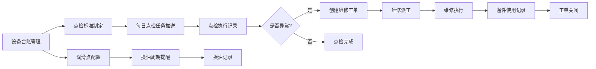

# 工业设备点检和台账管理系统 PRD

## 1. Product Overview

工业设备点检和台账管理系统是一套完整的设备全生命周期管理解决方案，旨在帮助企业规范化设备管理流程，提高设备可靠性，降低维护成本。

- **目标用户**: 生产企业设备管理部门、维修工程师、点检员
- **解决的问题**: 设备台账分散、点检执行不到位、维修记录不完整、润滑管理混乱、缺乏数据分析
- **核心价值**: 规范化设备管理、提高设备利用率、降低维护成本、实现数据驱动决策

## 2. Core Features

### 2.1 User Roles

| Role | 描述 | 核心权限 |
|------|------|----------|
| 管理员 | 系统管理员 | 所有模块的完整访问权限、用户管理 |
| 设备管理员 | 设备管理负责人 | 设备台账管理、点检标准制定、统计分析 |
| 点检员 | 日常点检人员 | 点检任务执行、点检记录录入 |
| 维修工程师 | 设备维修人员 | 维修工单处理、备件使用记录 |

### 2.2 Feature Module

1. **首页仪表盘**: 今日待办、设备状态概览、关键指标统计
2. **设备台账模块**: 设备基础信息录入、技术参数记录、随机资料管理
3. **点检管理模块**: 点检标准制定、点检任务推送、点检记录录入
4. **维修工单模块**: 故障报修、维修派工、备件使用记录
5. **润滑管理模块**: 润滑点档案、换油记录追踪、周期提醒
6. **统计分析模块**: MTBF/MTTR计算、维修成本分析、点检完成率追踪

### 2.3 Page Details

| 页面名称 | 模块名称 | 功能描述 |
|----------|----------|----------|
| 仪表盘 | 首页 | 今日点检任务数、待处理工单数、设备运行状态、关键指标卡片 |
| 设备列表 | 设备台账 | 设备列表展示、搜索筛选、新增/编辑/删除设备 |
| 设备详情 | 设备台账 | 设备基础信息、技术参数、关联资料、相关记录 |
| 点检标准 | 点检管理 | 点检项目标准配置、频率设置、负责人分配 |
| 点检任务 | 点检管理 | 今日待点检列表、历史记录查询、点检执行 |
| 点检记录 | 点检管理 | 实测值录入、异常记录、处理措施 |
| 工单列表 | 维修工单 | 故障报修创建、工单状态跟踪 |
| 工单详情 | 维修工单 | 派工记录、维修内容、备件使用、工时统计 |
| 润滑点管理 | 润滑管理 | 润滑点配置、润滑油牌号、换油周期设置 |
| 换油记录 | 润滑管理 | 换油历史、即将到期提醒 |
| 故障率统计 | 统计分析 | MTBF/MTTR图表、设备故障排行 |
| 成本分析 | 统计分析 | 月度维修成本趋势、备件成本占比 |
| 完成率分析 | 统计分析 | 点检完成率趋势、人员绩效对比 |

## 3. Core Process

### 3.1 设备管理流程
设备管理员录入设备基础信息 → 配置技术参数 → 上传相关文档 → 设备台账完成

### 3.2 点检执行流程
制定点检标准 → 系统自动生成每日点检任务 → 点检员执行点检并记录 → 异常设备触发报修流程

### 3.3 维修流程
故障报修 → 工单创建 → 派工给维修人员 → 维修执行并记录 → 备件使用登记 → 工单关闭

### 3.4 润滑管理流程
建立润滑点档案 → 设置换油周期 → 系统自动提醒 → 执行换油并记录

## 4. User Interface Design

### 4.1 Design Style
- **主色调**: 工业蓝 (#1e40af) - 专业、稳重、科技感
- **辅助色**: 橙色 (#f97316) - 警示提醒、操作按钮
- **成功色**: 绿色 (#22c55e) - 正常状态、完成
- **警告色**: 红色 (#ef4444) - 异常、故障
- **背景色**: 浅灰色背景 (#f8fafc)，白色卡片
- **字体**: 系统默认无衬线字体，清晰易读
- **按钮样式**: 圆角4px，悬浮效果，点击反馈
- **布局风格**: 侧边栏导航 + 内容区域卡片式布局
- **图标风格**: Lucide 图标库，线性风格

### 4.2 Page Design Overview

| 页面名称 | 模块名称 | UI Elements |
|----------|----------|-------------|
| 仪表盘 | 首页 | 顶部导航栏、侧边菜单、统计卡片、数据表格、图表 |
| 设备列表 | 设备台账 | 搜索栏、筛选器、数据表格、操作按钮、分页 |
| 设备详情 | 设备台账 | 标签页导航、表单输入、文件上传、关联数据列表 |
| 点检任务 | 点检管理 | 待办列表、任务卡片、执行按钮、状态标签 |
| 工单列表 | 维修工单 | 状态筛选、工单卡片、紧急程度标识、时间线 |
| 统计分析 | 统计分析 | 柱状图、折线图、饼图、数据表格、时间范围选择器 |

### 4.3 Responsiveness
- 桌面端优先设计，支持1200px+分辨率
- 平板端自适应，侧边栏可折叠
- 移动端简化界面，优化触摸操作

### 4.4 交互设计
- 表单输入即时验证
- 数据加载状态显示骨架屏
- 操作成功/失败Toast提示
- 确认对话框防止误操作
- 表格支持行悬停高亮
