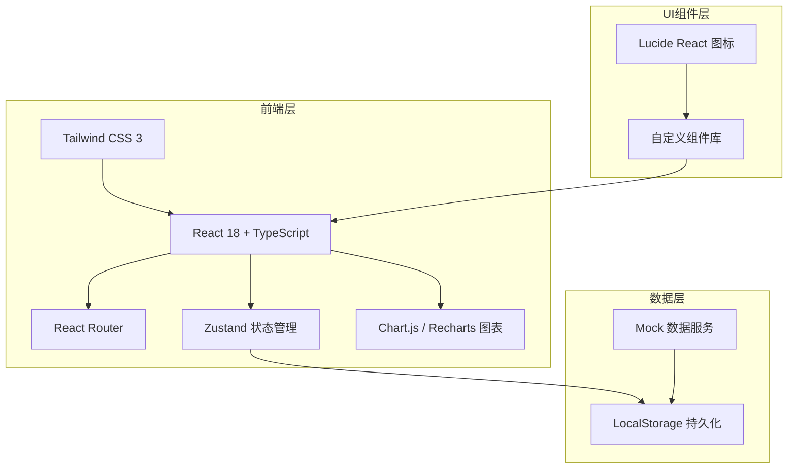
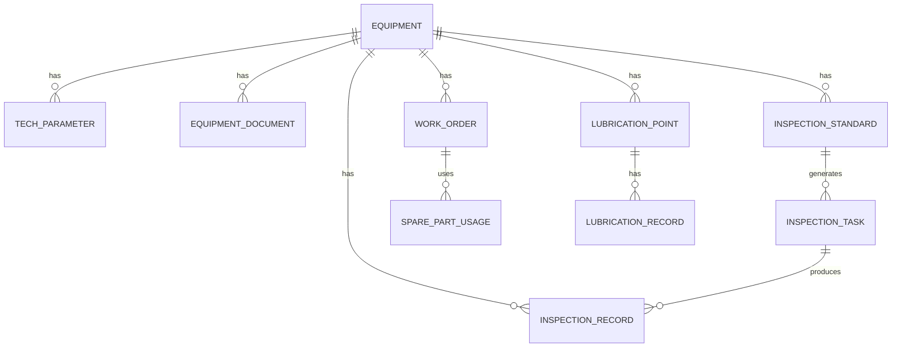

# 工业设备点检和台账管理系统 技术架构文档

## 1. Architecture Design



## 2. Technology Description

- **前端框架**: React 18 + TypeScript
- **构建工具**: Vite 5
- **样式方案**: Tailwind CSS 3
- **路由管理**: React Router DOM 6
- **状态管理**: Zustand 4
- **图表库**: Recharts 2
- **图标库**: Lucide React
- **数据存储**: LocalStorage（前端持久化）
- **后端**: 无后端，前端纯Mock实现

## 3. Route Definitions

| 路由路径 | 页面组件 | 功能描述 |
|---------|---------|----------|
| / | Dashboard | 首页仪表盘 |
| /equipment | EquipmentList | 设备列表 |
| /equipment/new | EquipmentForm | 新增设备 |
| /equipment/:id | EquipmentDetail | 设备详情 |
| /equipment/:id/edit | EquipmentForm | 编辑设备 |
| /inspection/standards | InspectionStandards | 点检标准 |
| /inspection/tasks | InspectionTasks | 点检任务 |
| /inspection/records | InspectionRecords | 点检记录 |
| /workorders | WorkOrderList | 工单列表 |
| /workorders/new | WorkOrderForm | 新建工单 |
| /workorders/:id | WorkOrderDetail | 工单详情 |
| /lubrication/points | LubricationPoints | 润滑点管理 |
| /lubrication/records | LubricationRecords | 换油记录 |
| /statistics/failure | FailureStatistics | 故障率统计 |
| /statistics/cost | CostAnalysis | 成本分析 |
| /statistics/completion | CompletionRate | 完成率分析 |

## 4. Data Model

### 4.1 数据模型定义



### 4.2 数据实体定义

#### 设备 (Equipment)
```typescript
interface Equipment {
  id: string;
  code: string;           // 设备编号
  name: string;           // 设备名称
  model: string;          // 型号
  manufacturer: string;   // 制造商
  location: string;       // 安装位置
  productionDate: string; // 出厂日期
  commissioningDate: string; // 投用日期
  status: 'running' | 'standby' | 'maintenance' | 'fault';
  createdAt: string;
  updatedAt: string;
}
```

#### 技术参数 (TechParameter)
```typescript
interface TechParameter {
  id: string;
  equipmentId: string;
  name: string;           // 参数名称
  value: string;          // 参数值
  unit: string;           // 单位
  remark?: string;        // 备注
}
```

#### 设备资料 (EquipmentDocument)
```typescript
interface EquipmentDocument {
  id: string;
  equipmentId: string;
  name: string;           // 文档名称
  type: 'manual' | 'certificate' | 'drawing' | 'other';
  fileName: string;       // 文件名
  uploadDate: string;
}
```

#### 点检标准 (InspectionStandard)
```typescript
interface InspectionStandard {
  id: string;
  equipmentId: string;
  itemName: string;       // 点检项目
  checkStandard: string;  // 检查标准
  standardValue?: string; // 标准值
  unit?: string;          // 单位
  frequency: 'daily' | 'weekly' | 'monthly' | 'quarterly';
  responsiblePerson: string; // 负责人
}
```

#### 点检任务 (InspectionTask)
```typescript
interface InspectionTask {
  id: string;
  standardId: string;
  equipmentId: string;
  taskDate: string;       // 任务日期
  status: 'pending' | 'completed' | 'overdue';
  completedAt?: string;
  inspector?: string;
}
```

#### 点检记录 (InspectionRecord)
```typescript
interface InspectionRecord {
  id: string;
  taskId: string;
  equipmentId: string;
  standardId: string;
  measuredValue?: string; // 实测值
  isNormal: boolean;      // 是否正常
  abnormalDesc?: string;  // 异常描述
  handlingMeasures?: string; // 处理措施
  inspector: string;
  inspectionTime: string;
}
```

#### 维修工单 (WorkOrder)
```typescript
interface WorkOrder {
  id: string;
  equipmentId: string;
  faultDesc: string;      // 故障描述
  urgency: 'low' | 'medium' | 'high' | 'urgent';
  reporter: string;       // 上报人
  reportTime: string;     // 上报时间
  status: 'pending' | 'assigned' | 'processing' | 'completed' | 'closed';
  assignee?: string;      // 维修人员
  startTime?: string;     // 开始时间
  endTime?: string;       // 结束时间
  repairContent?: string; // 维修内容
  workHours?: number;     // 工时（小时）
}
```

#### 备件使用 (SparePartUsage)
```typescript
interface SparePartUsage {
  id: string;
  workOrderId: string;
  partCode: string;       // 备件编号
  partName: string;       // 备件名称
  quantity: number;       // 数量
  unitPrice: number;      // 单价
  totalCost: number;      // 总成本
}
```

#### 润滑点 (LubricationPoint)
```typescript
interface LubricationPoint {
  id: string;
  equipmentId: string;
  location: string;       // 润滑部位
  oilType: string;        // 润滑油牌号
  changeCycle: number;    // 换油周期（天）
  lastChangeDate: string; // 上次换油日期
  nextChangeDate: string; // 下次换油日期
  responsiblePerson: string;
}
```

#### 换油记录 (LubricationRecord)
```typescript
interface LubricationRecord {
  id: string;
  pointId: string;
  equipmentId: string;
  oilType: string;        // 润滑油牌号
  changeDate: string;     // 换油日期
  operator: string;       // 操作人员
  remark?: string;
}
```

## 5. Project Structure

```
project102/
├── src/
│   ├── components/
│   │   ├── Layout/          # 布局组件
│   │   ├── common/          # 公共组件（表格、表单、卡片等）
│   │   └── charts/          # 图表组件
│   ├── pages/
│   │   ├── Dashboard/
│   │   ├── Equipment/
│   │   ├── Inspection/
│   │   ├── WorkOrder/
│   │   ├── Lubrication/
│   │   └── Statistics/
│   ├── store/               # Zustand状态管理
│   ├── types/               # TypeScript类型定义
│   ├── data/                # Mock数据
│   ├── utils/               # 工具函数
│   ├── hooks/               # 自定义Hooks
│   ├── App.tsx
│   ├── main.tsx
│   └── index.css
├── .trae/documents/
├── package.json
├── vite.config.ts
├── tailwind.config.js
└── tsconfig.json
```

## 6. 核心功能实现方案

### 6.1 数据持久化
- 使用 localStorage 存储所有数据
- 使用 zustand-persist 中间件实现状态持久化
- 提供数据导入/导出功能

### 6.2 点检任务生成
- 根据点检标准的频率自动计算生成任务
- 首次加载时检查并生成待处理任务

### 6.3 提醒功能
- 首页展示今日待办任务
- 润滑换油到期提醒
- 故障设备状态醒目显示

### 6.4 统计分析
- MTBF = 总运行时间 / 故障次数
- MTTR = 总维修时间 / 维修次数
- 使用 Recharts 绘制各类图表

## 7. 状态管理设计

### Store 划分
- equipmentStore: 设备台账相关状态
- inspectionStore: 点检管理相关状态
- workOrderStore: 维修工单相关状态
- lubricationStore: 润滑管理相关状态
- statsStore: 统计分析计算
