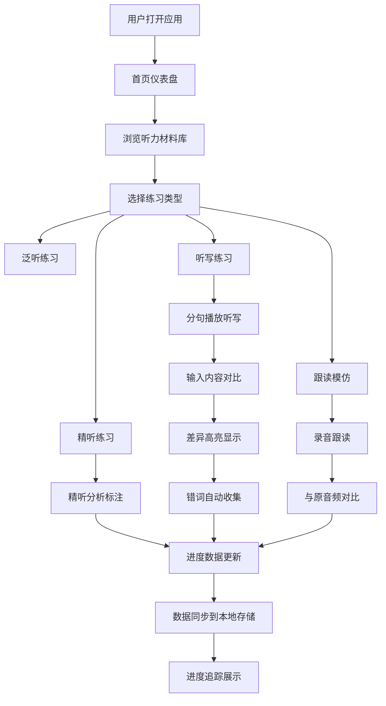

## 1. Product Overview
一个完整的在线英语听力训练和听写练习工具，帮助用户提升英语听力水平。
- 主要目的：提供系统化的英语听力训练，包括多种材料、听写练习、精听分析、跟读模仿和进度追踪
- 目标用户：英语学习者，从初级到高级，希望通过有针对性的训练提升听力能力
- 市场价值：解决传统听力训练材料单一、缺乏反馈机制、进度难以追踪的问题

## 2. Core Features

### 2.1 User Roles
| Role | Registration Method | Core Permissions |
|------|---------------------|------------------|
| Normal User | 使用应用本地存储 | 使用所有功能，进度数据本地保存 |

### 2.2 Feature Module
1. **首页/仪表盘**: 功能导航、今日进度概览、推荐练习
2. **听力材料库**: 材料分类筛选、难度分级、精听/泛听标注
3. **听写练习**: 分句播放、听写输入、差异高亮、错词收集
4. **精听分析**: 发音注释、规则归纳、难点分类
5. **跟读模仿**: 录音对比、语调节奏练习、口音分析
6. **进度追踪**: 练习时长记录、正确率趋势、掌握材料统计

### 2.3 Page Details
| Page Name | Module Name | Feature description |
|-----------|-------------|---------------------|
| 首页/仪表盘 | 进度概览 | 今日练习时长、正确率、掌握材料数 |
| 首页/仪表盘 | 快速开始 | 推荐练习、随机材料、继续上次练习 |
| 听力材料库 | 材料列表 | 分类筛选（新闻/TED/电影/歌曲/播客）、难度筛选 |
| 听力材料库 | 材料详情 | 播放控制、难度显示、精听/泛听标注、加入学习计划 |
| 听写练习 | 播放控制 | 分句播放、速度调节（慢速/正常/快速）、循环播放 |
| 听写练习 | 输入对比 | 实时输入、提交后对比标准文本、高亮差异（颜色编码） |
| 听写练习 | 错词收集 | 自动识别错误词汇、加入强化列表、统计易错词 |
| 精听分析 | 发音注释 | 标注连读/弱读/吞音/语调位置、交互式显示 |
| 精听分析 | 规则学习 | 从实例中总结发音规则、分类展示 |
| 精听分析 | 难点分析 | 识别听力障碍类型（词汇/发音/语速）、针对性建议 |
| 跟读模仿 | 录音功能 | 录制跟读音频、波形显示、播放对比 |
| 跟读模仿 | 对比分析 | 与原音频对比、相似度评分、差异标注 |
| 跟读模仿 | 口音练习 | 美音/英音/澳音特征对比、针对性练习 |
| 进度追踪 | 数据统计 | 每日练习时长图表、听写正确率趋势、掌握材料累计 |

## 3. Core Process

## 4. User Interface Design

### 4.1 Design Style
- **主色调**: 深蓝色 (#1E3A5F) - 专业、专注、学习氛围
- **辅助色**: 橙黄色 (#F59E0B) - 强调、提醒、激励
- **背景色**: 浅灰蓝 (#F8FAFC) - 柔和、护眼
- **按钮风格**: 圆角矩形，有轻微阴影，hover时颜色加深
- **字体**: 
  - 标题: Playfair Display (优雅、专业)
  - 正文: Lato (清晰、易读)
- **布局风格**: 卡片式布局、顶部导航、侧边栏功能菜单
- **图标风格**: Lucide React 图标库，线性简洁风格

### 4.2 Page Design Overview
| Page Name | Module Name | UI Elements |
|-----------|-------------|-------------|
| 首页/仪表盘 | 进度卡片 | 网格布局、渐变背景、统计数字动画 |
| 听力材料库 | 材料卡片 | 封面图、标题、难度标签、类型图标、播放按钮 |
| 听写练习 | 播放器 | 进度条、波形可视化、播放控制、速度选择 |
| 听写练习 | 对比区域 | 上下分栏、标准文本、用户输入、差异高亮 |
| 精听分析 | 注释面板 | 时间线、标注点、点击展开详情 |
| 跟读模仿 | 录音界面 | 录音按钮、波形可视化、播放控制、评分显示 |
| 进度追踪 | 图表区 | 折线图（正确率趋势）、柱状图（练习时长）、环形图（材料掌握） |

### 4.3 Responsiveness
- Desktop-first 设计
- 断点: 1024px (平板), 640px (手机)
- 平板: 侧边栏收起为汉堡菜单，卡片网格变为2列
- 手机: 顶部导航固定，卡片单列布局，播放器简化，图表自适应

### 4.4 视觉特效
- 页面加载: 淡入动画，元素依次出现
- 卡片悬停: 轻微上浮，阴影加深
- 按钮点击: 缩放效果
- 进度条: 平滑过渡动画
- 差异高亮: 闪烁提示效果

## 5. 数据管理
- 所有数据使用 localStorage 本地存储
- 示例听力材料内置在应用中
- 支持导入自定义音频文件和文本
