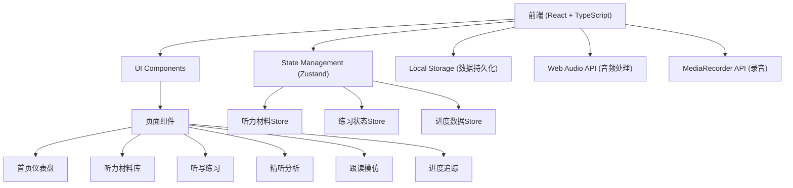

## 1. Architecture Design



## 2. Technology Description

- **Frontend**: React@18 + TypeScript@5 + TailwindCSS@3
- **Build Tool**: Vite@5
- **State Management**: Zustand@4
- **Routing**: React Router@6
- **Icons**: Lucide React
- **Charts**: Recharts
- **Audio**: Web Audio API, MediaRecorder API
- **Storage**: localStorage
- **Styling**: TailwindCSS, CSS Animations

## 3. Route Definitions

| Route | Purpose |
|-------|---------|
| / | 首页仪表盘 - 展示进度概览、快速开始、推荐练习 |
| /materials | 听力材料库 - 材料列表、筛选、分类浏览 |
| /materials/:id | 材料详情 - 材料信息、播放控制、练习入口 |
| /dictation/:id | 听写练习 - 分句听写、对比分析、错词收集 |
| /analysis/:id | 精听分析 - 发音注释、规则学习、难点分析 |
| /speaking/:id | 跟读模仿 - 录音对比、语调节奏、口音练习 |
| /progress | 进度追踪 - 数据统计、图表展示、趋势分析 |

## 4. 核心数据模型

### 4.1 TypeScript 类型定义

```typescript
// 听力材料类型
type MaterialType = 'news' | 'ted' | 'movie' | 'song' | 'podcast';

// 难度等级
type Difficulty = 'beginner' | 'intermediate' | 'advanced';

// 练习类型
type PracticeType = 'intensive' | 'extensive';

// 发音标注类型
type AnnotationType = 'linking' | 'reduction' | 'elision' | 'intonation';

// 听力难点类型
type DifficultyType = 'vocabulary' | 'pronunciation' | 'speed';

// 口音类型
type AccentType = 'american' | 'british' | 'australian';

// 听力材料
interface ListeningMaterial {
  id: string;
  title: string;
  type: MaterialType;
  difficulty: Difficulty;
  practiceType: PracticeType;
  accent: AccentType;
  audioUrl: string;
  transcript: string;
  segments: Segment[];
  vocabulary: string[];
  duration: number;
  speed: number;
  createdAt: Date;
  isFavorite: boolean;
}

// 音频片段
interface Segment {
  id: string;
  startTime: number;
  endTime: number;
  text: string;
  annotations: Annotation[];
}

// 发音标注
interface Annotation {
  id: string;
  type: AnnotationType;
  startIndex: number;
  endIndex: number;
  description: string;
  ruleId?: string;
}

// 发音规则
interface PronunciationRule {
  id: string;
  name: string;
  type: AnnotationType;
  description: string;
  examples: string[];
}

// 错词记录
interface WrongWord {
  id: string;
  word: string;
  correctWord: string;
  materialId: string;
  segmentId: string;
  timestamp: Date;
  practiceCount: number;
  correctCount: number;
}

// 跟读记录
interface SpeakingRecord {
  id: string;
  materialId: string;
  segmentId: string;
  audioBlob: Blob;
  duration: number;
  similarityScore: number;
  timestamp: Date;
  accentAnalysis: AccentAnalysis;
}

// 口音分析
interface AccentAnalysis {
  score: number;
  features: string[];
  suggestions: string[];
}

// 练习记录
interface PracticeRecord {
  id: string;
  materialId: string;
  type: 'dictation' | 'analysis' | 'speaking';
  duration: number;
  accuracy: number;
  timestamp: Date;
  difficulties: DifficultyType[];
}

// 每日统计
interface DailyStats {
  date: string;
  practiceDuration: number;
  dictationAccuracy: number;
  materialsCompleted: number;
  wrongWords: string[];
}
```

## 5. 项目目录结构

```
project103/
├── src/
│   ├── components/
│   │   ├── AudioPlayer/        # 音频播放器组件
│   │   ├── MaterialCard/       # 材料卡片组件
│   │   ├── StatsCard/          # 统计卡片组件
│   │   ├── Chart/              # 图表组件
│   │   ├── Annotation/         # 发音标注组件
│   │   ├── Recorder/           # 录音组件
│   │   └── DiffViewer/         # 差异对比组件
│   ├── pages/
│   │   ├── Dashboard.tsx       # 首页仪表盘
│   │   ├── Materials.tsx       # 听力材料库
│   │   ├── MaterialDetail.tsx  # 材料详情页
│   │   ├── Dictation.tsx       # 听写练习页
│   │   ├── Analysis.tsx        # 精听分析页
│   │   ├── Speaking.tsx        # 跟读模仿页
│   │   └── Progress.tsx        # 进度追踪页
│   ├── stores/
│   │   ├── materialStore.ts    # 听力材料状态
│   │   ├── practiceStore.ts    # 练习状态
│   │   └── progressStore.ts    # 进度状态
│   ├── hooks/
│   │   ├── useAudio.ts         # 音频处理钩子
│   │   ├── useRecorder.ts      # 录音钩子
│   │   └── useStorage.ts       # 存储钩子
│   ├── utils/
│   │   ├── textDiff.ts         # 文本差异算法
│   │   ├── audioAnalysis.ts    # 音频分析工具
│   │   └── difficulty.ts       # 难度评估工具
│   ├── data/
│   │   ├── materials.ts        # 示例听力材料
│   │   ├── rules.ts            # 发音规则数据
│   │   └── accents.ts          # 口音特征数据
│   ├── types/
│   │   └── index.ts            # 类型定义
│   ├── App.tsx
│   ├── main.tsx
│   └── index.css
├── public/
│   └── audio/                  # 示例音频文件
├── tailwind.config.js
├── vite.config.ts
├── tsconfig.json
└── package.json
```

## 6. 核心功能实现策略

### 6.1 文本差异高亮
- 使用 Levenshtein 距离算法计算文本差异
- 逐词对比，标记：正确、错误、遗漏、多余
- 颜色编码：绿色=正确，红色=错误，黄色=遗漏

### 6.2 音频播放控制
- 使用 HTML5 Audio API
- 支持速度调节 (0.5x, 0.75x, 1.0x, 1.25x, 1.5x)
- 支持循环播放当前片段
- 支持跳转到指定时间点

### 6.3 录音功能
- 使用 MediaRecorder API
- 支持实时波形显示
- 支持播放录制的音频
- 模拟相似度评分（基于时长和静音检测）

### 6.4 数据持久化
- 使用 localStorage 存储
- 自动保存练习进度
- 支持导出/导入数据

### 6.5 图表展示
- 使用 Recharts 库
- 练习时长柱状图
- 正确率折线图
- 材料掌握程度环形图
