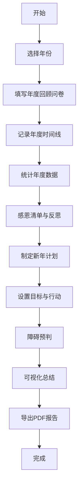

# 个人年度回顾与新年计划工具 - 产品需求文档 (PRD)

## 1. Product Overview

一款帮助用户进行年度回顾反思与新年计划制定的在线工具。通过结构化的引导，让用户能够系统地回顾过去一年的成长与收获，并制定切实可行的新年目标。

- **主要目的**：帮助用户系统性地进行年度复盘和新年规划
- **解决问题**：传统的年度回顾缺乏结构化引导，用户容易遗漏重要方面；计划制定缺乏可操作性和衡量标准
- **目标用户**：需要进行年度反思和规划的个人用户，包括职场人士、学生、自由职业者等
- **市场价值**：提供结构化、引导式的年度规划体验，帮助用户更好地认识自己、规划未来

## 2. Core Features

### 2.1 User Roles

| Role | Registration Method | Core Permissions |
|------|---------------------|------------------|
| 普通用户 | 本地存储 / 可选登录 | 创建、编辑、查看、导出年度回顾和计划 |

### 2.2 Feature Module

1. **首页仪表盘**：快速概览、年份选择、进度跟踪
2. **年度回顾引导模块**：
   - 年度复盘问卷（工作/健康/学习/人际/财务/个人成长六大领域）
   - 年度重要时刻时间线
   - 年度数据统计汇总
3. **感恩与反思模块**：
   - 感恩清单
   - 最大成就记录
   - 遗憾与教训梳理
4. **新年计划制定模块**：
   - 分领域目标设置
   - 目标可行性评估
   - 障碍预判与应对策略
5. **可视化总结模块**：
   - 年度亮点卡片生成
   - 历史年份对比
   - 十年愿景展望
6. **分享和存档模块**：
   - PDF报告导出
   - 年份回顾对比查看

### 2.3 Page Details

| Page Name | Module Name | Feature description |
|-----------|-------------|---------------------|
| 首页仪表盘 | 年份导航 | 选择当前年份、查看各年份完成状态 |
| 首页仪表盘 | 进度概览 | 以进度条展示各模块完成情况 |
| 年度回顾 | 复盘问卷 | 分六大领域的结构化问卷，引导用户深入思考 |
| 年度回顾 | 时间线 | 按时间顺序记录年度重要事件，支持添加描述和标签 |
| 年度回顾 | 数据统计 | 记录读书数量、运动次数、学习技能等数据 |
| 感恩反思 | 感恩清单 | 记录最值得感激的三件事及原因 |
| 感恩反思 | 成就记录 | 记录骄傲的成就和达成的突破 |
| 感恩反思 | 遗憾教训 | 记录没做好的事情和从中学习到的 |
| 新年计划 | 目标设置 | 分六大领域设定来年目标 |
| 新年计划 | 可行性评估 | 为每个目标添加行动计划和衡量标准 |
| 新年计划 | 障碍预判 | 预测可能的阻力和应对策略 |
| 可视化 | 亮点卡片 | 生成可分享的年度总结图片/卡片 |
| 可视化 | 历史对比 | 展示过去几年的目标和达成情况对比 |
| 可视化 | 十年愿景 | 设定更长远的人生方向和愿景 |
| 分享存档 | PDF导出 | 导出完整的年度回顾报告为PDF |
| 分享存档 | 年份对比 | 选择多个年份进行对比查看 |

## 3. Core Process

用户的主要使用流程：

```
开始 → 选择年份 → 填写年度回顾(问卷/时间线/数据) → 感恩与反思 →
制定新年计划 → 查看可视化总结 → 导出PDF存档 → 结束
```



## 4. User Interface Design

### 4.1 Design Style

- **设计风格**：温暖治愈、富有深度的现代简约风格
- **主色调**：暖橙色系 (#FF6B35) - 代表活力、热情、新的开始
- **辅助色**：深蓝色 (#1A365D) - 代表深度、思考、稳重
- **中性色**：米白色背景 (#FFF8F0)，深灰色文字 (#2D3748)
- **按钮样式**：圆角矩形 (8px)，悬停时有轻微上浮和阴影变化
- **字体**：
  - 标题：Playfair Display (优雅的衬线字体)
  - 正文：Source Sans Pro (清晰的无衬线字体)
- **布局风格**：卡片式布局，适当的留白，舒适的阅读体验
- **图标风格**：线性图标 + 柔和的配色
- **动效**：平滑的过渡动画，元素进入时的淡入效果

### 4.2 Page Design Overview

| Page Name | Module Name | UI Elements |
|-----------|-------------|-------------|
| 首页仪表盘 | 年份导航 | 年份选择器，卡片式年份列表，完成状态标签 |
| 首页仪表盘 | 进度概览 | 环形进度图，各模块完成百分比，快速开始按钮 |
| 年度回顾 | 复盘问卷 | 标签页切换六大领域，引导式问题，文本输入区，自动保存提示 |
| 年度回顾 | 时间线 | 垂直时间轴，事件卡片，日期选择，标签管理 |
| 年度回顾 | 数据统计 | 数字输入框，统计卡片，简单图表可视化 |
| 感恩反思 | 感恩清单 | 三大项布局，原因输入，温暖的装饰元素 |
| 感恩反思 | 成就记录 | 成就卡片，可展开详情，亮点标识 |
| 感恩反思 | 遗憾教训 | 分栏布局，教训提取区，成长提示 |
| 新年计划 | 目标设置 | 分领域卡片，目标输入，优先级选择 |
| 新年计划 | 可行性评估 | SMART原则引导，行动计划列表，衡量标准输入 |
| 新年计划 | 障碍预判 | 障碍-应对双栏布局，风险等级标识 |
| 可视化 | 亮点卡片 | 卡片预览，主题切换，下载按钮 |
| 可视化 | 历史对比 | 并排卡片，折线图对比，关键指标高亮 |
| 可视化 | 十年愿景 | 大输入区，梦想清单，时间轴展望 |
| 分享存档 | PDF导出 | 报告预览，导出选项，下载按钮 |
| 分享存档 | 年份对比 | 多选择器，对比表格，差异高亮 |

### 4.3 Responsiveness

- **设计优先**：Desktop-first
- **响应策略**：
  - 桌面端 (≥1024px)：双列/三列网格布局
  - 平板端 (768px-1023px)：单列堆叠，侧边导航改为底部
  - 移动端 (<768px)：单列布局，简化导航，触摸优化
- **触摸优化**：按钮最小 44x44px，适当的触摸间距

### 4.4 Accessibility

- 颜色对比度符合 WCAG 2.1 AA 标准
- 键盘导航支持
- 语义化 HTML 结构
- 表单标签关联正确
