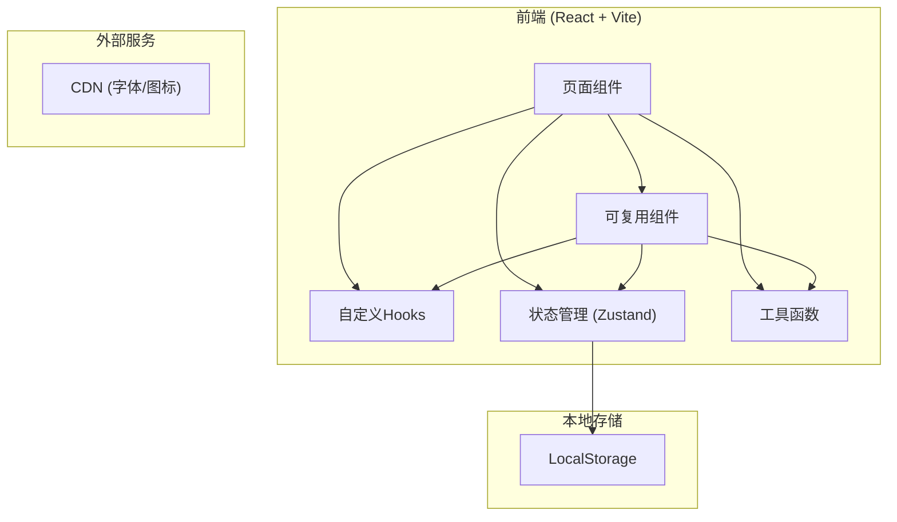

# 个人年度回顾与新年计划工具 - 技术架构文档

## 1. Architecture Design



## 2. Technology Description

- **前端框架**：React 18 + TypeScript
- **构建工具**：Vite 5
- **样式方案**：TailwindCSS 3
- **状态管理**：Zustand
- **路由管理**：React Router DOM 6
- **数据存储**：LocalStorage (本地持久化)
- **图表可视化**：Recharts
- **图标库**：Lucide React
- **PDF导出**：html2canvas + jspdf
- **日期处理**：dayjs
- **后端**：无 (纯前端应用)
- **数据库**：无 (使用LocalStorage)

## 3. Route Definitions

| Route | Purpose | Component |
|-------|---------|-----------|
| `/` | 首页仪表盘 | Dashboard |
| `/review/:year` | 年度回顾页面 | YearReview |
| `/gratitude/:year` | 感恩与反思页面 | Gratitude |
| `/plan/:year` | 新年计划页面 | NewYearPlan |
| `/visualize/:year` | 可视化总结页面 | Visualize |
| `/export/:year` | 导出与对比页面 | ExportCompare |

## 4. Data Model

### 4.1 Data Structure

```typescript
interface YearData {
  year: number;
  review: ReviewData;
  gratitude: GratitudeData;
  plan: PlanData;
  createdAt: string;
  updatedAt: string;
}

interface ReviewData {
  domains: DomainReview[];
  timeline: TimelineEvent[];
  statistics: StatisticsData;
}

interface DomainReview {
  category: 'work' | 'health' | 'learning' | 'relationship' | 'finance' | 'growth';
  questions: QuestionAnswer[];
}

interface QuestionAnswer {
  question: string;
  answer: string;
}

interface TimelineEvent {
  id: string;
  date: string;
  title: string;
  description: string;
  tags: string[];
}

interface StatisticsData {
  booksRead: number;
  exerciseCount: number;
  skillsLearned: number;
  travelPlaces: number;
  moviesWatched: number;
  habitsStarted: number;
  customStats: CustomStat[];
}

interface CustomStat {
  name: string;
  value: number;
}

interface GratitudeData {
  gratitudeItems: GratitudeItem[];
  achievements: Achievement[];
  regrets: Regret[];
}

interface GratitudeItem {
  id: string;
  title: string;
  reason: string;
}

interface Achievement {
  id: string;
  title: string;
  description: string;
  impact: string;
  isHighlight: boolean;
}

interface Regret {
  id: string;
  situation: string;
  lesson: string;
}

interface PlanData {
  goals: Goal[];
  tenYearVision: string;
}

interface Goal {
  id: string;
  category: 'work' | 'health' | 'learning' | 'relationship' | 'finance' | 'growth';
  title: string;
  priority: 'high' | 'medium' | 'low';
  actionPlan: string[];
  metrics: string;
  obstacles: Obstacle[];
}

interface Obstacle {
  id: string;
  description: string;
  strategy: string;
  riskLevel: 'low' | 'medium' | 'high';
}
```

### 4.2 Storage Key

- **Key**: `yearly_review_data`
- **Value**: `Record<number, YearData>` - 以年份为key的对象

## 5. Project Structure

```
src/
├── components/
│   ├── Layout/
│   │   ├── Header.tsx
│   │   ├── Sidebar.tsx
│   │   └── YearSelector.tsx
│   ├── Common/
│   │   ├── Card.tsx
│   │   ├── ProgressBar.tsx
│   │   ├── EmptyState.tsx
│   │   └── SectionTitle.tsx
│   ├── Review/
│   │   ├── DomainTabs.tsx
│   │   ├── QuestionCard.tsx
│   │   ├── Timeline.tsx
│   │   └── StatisticsForm.tsx
│   ├── Gratitude/
│   │   ├── GratitudeList.tsx
│   │   ├── AchievementCard.tsx
│   │   └── RegretCard.tsx
│   ├── Plan/
│   │   ├── GoalCard.tsx
│   │   ├── ActionPlanInput.tsx
│   │   └── ObstacleForm.tsx
│   └── Visualize/
│       ├── HighlightCard.tsx
│       ├── YearComparison.tsx
│       └── VisionBoard.tsx
├── pages/
│   ├── Dashboard.tsx
│   ├── YearReview.tsx
│   ├── Gratitude.tsx
│   ├── NewYearPlan.tsx
│   ├── Visualize.tsx
│   └── ExportCompare.tsx
├── hooks/
│   ├── useYearData.ts
│   ├── useLocalStorage.ts
│   └── useProgress.ts
├── store/
│   └── useYearlyReviewStore.ts
├── utils/
│   ├── storage.ts
│   ├── exportPdf.ts
│   └── constants.ts
├── types/
│   └── index.ts
├── App.tsx
├── main.tsx
└── index.css
```

## 6. Key Technical Decisions

### 6.1 状态管理方案

使用 Zustand 管理全局状态，同时配合 localStorage 进行持久化：
- 轻量级，无 Redux 的 boilerplate
- 优秀的 TypeScript 支持
- 支持 middleware 实现持久化

### 6.2 数据持久化

- 所有数据存储在 LocalStorage
- 自动保存（debounce 300ms）
- 数据结构简单，易于扩展

### 6.3 PDF导出方案

使用 `html2canvas` + `jspdf` 组合：
- html2canvas: 将页面DOM转为canvas图片
- jspdf: 将图片转为PDF
- 支持多页导出
- 可配置导出内容范围

### 6.4 图标方案

使用 Lucide React：
- 一致的设计风格
- 按需导入，体积小
- 优秀的 TypeScript 支持

### 6.5 图表方案

使用 Recharts：
- React原生组件
- 响应式设计
- 动画效果好
- 轻量级

## 7. Dependencies List

```json
{
  "react": "^18.2.0",
  "react-dom": "^18.2.0",
  "react-router-dom": "^6.20.0",
  "zustand": "^4.4.7",
  "lucide-react": "^0.294.0",
  "recharts": "^2.10.3",
  "dayjs": "^1.11.10",
  "html2canvas": "^1.4.1",
  "jspdf": "^2.5.1",
  "clsx": "^2.0.0",
  "tailwind-merge": "^2.1.0"
}
```

## 8. Development Scripts

| Command | Purpose |
|---------|---------|
| `npm run dev` | 启动开发服务器 |
| `npm run build` | 生产环境构建 |
| `npm run preview` | 预览生产构建 |
| `npm run lint` | 代码检查 |
