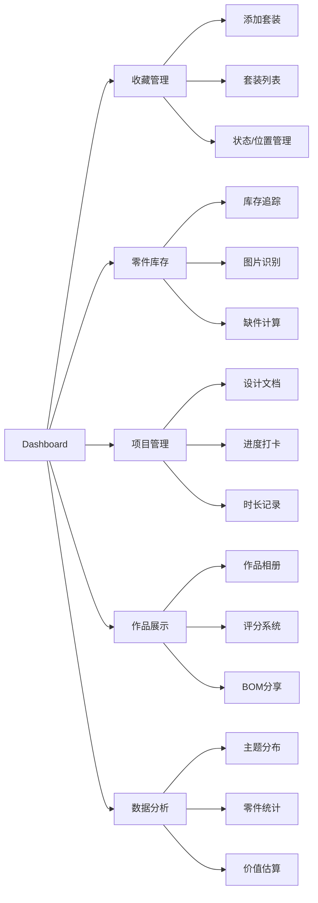

# 乐高收藏与搭建管理工具 - PRD

## 1. Product Overview

这是一个面向乐高爱好者的全功能收藏和搭建项目管理工具，帮助用户系统化地管理乐高套装收藏、追踪零件库存、规划MOC项目，并提供数据分析和作品展示分享功能。

- 解决问题：零散的收藏管理困难、零件库存混乱、MOC项目缺乏统一规划工具
- 目标用户：乐高收藏爱好者、MOC玩家、成人乐高玩家、乐高家庭收藏者
- 市场价值：填补乐高爱好者个性化管理工具的空白，提供从收藏到搭建的一体化解决方案

## 2. Core Features

### 2.1 User Roles

| Role | Registration Method | Core Permissions |
|------|---------------------|------------------|
| 用户 | 邮箱注册/Google OAuth | 所有功能的完整访问权限 |

### 2.2 Feature Module

1. **Dashboard仪表盘**: 概览收藏状态、今日提醒、最近活动
2. **收藏管理**: 套装档案录入、状态管理、位置标注
3. **零件库存**: 散装零件追踪、图片辅助识别、缺件清单
4. **项目管理**: MOC设计文档、进度打卡、时长记录
5. **作品展示**: 相册展示、评分系统、用料清单分享
6. **数据分析**: 主题分布、零件统计、价值估算

### 2.3 Page Details

| Page Name | Module Name | Feature description |
|-----------|-------------|---------------------|
| Dashboard | 概览卡片 | 收藏总数、零件总数、进行中项目、最近添加套装 |
| Dashboard | 快捷操作 | 快速添加套装、记录搭建时间、查看缺件清单 |
| 收藏管理 | 套装列表 | 网格/列表视图切换、筛选搜索、批量操作 |
| 收藏管理 | 套装详情 | 基础信息展示、状态切换、位置管理、关联项目 |
| 收藏管理 | 添加套装 | 套装编号输入、Rebrickable API自动抓取、手动补充 |
| 零件库存 | 库存列表 | 按颜色/类型筛选、库存数量查看、低库存预警 |
| 零件库存 | 图片识别 | 上传零件照片、对比数据库、自动识别推荐 |
| 零件库存 | 缺件清单 | MOC缺件计算、现有库存对比、采购建议 |
| 项目管理 | 项目列表 | 进行中/已完成项目、进度可视化 |
| 项目管理 | 项目详情 | 设计文档、BOM清单、步骤分解、时长统计 |
| 项目管理 | 进度打卡 | 步骤完成标记、照片上传、进度条更新 |
| 作品展示 | 作品画廊 | 网格布局、筛选排序、作品卡片悬停效果 |
| 作品展示 | 作品详情 | 多角度照片轮播、评分展示、BOM导出 |
| 数据分析 | 统计面板 | 主题分布饼图、零件数趋势、价值估算图表 |

## 3. Core Process

### 3.1 套装录入流程
1. 用户进入"添加套装"页面
2. 输入乐高套装编号（如10308）
3. 系统调用Rebrickable API自动获取：套装名称、主题、年份、零件数、封面图
4. 用户确认信息，选择收藏状态（已有/在建/已完成/已拆散/愿望清单）
5. 用户标注储存位置（盒子/货架编号）
6. 保存套装信息

### 3.2 零件库存维护流程
1. 用户进入"零件库存"页面
2. 选择添加零件：手动录入或图片识别
3. 手动录入：选择零件类型、颜色、输入数量
4. 图片识别：上传照片，系统返回匹配的零件选项
5. 确认零件类型和数量，保存到库存
6. 系统自动更新库存统计

### 3.3 MOC搭建流程
1. 用户创建新项目，输入项目名称和描述
2. 上传设计参考图、搭建说明PDF、定义BOM用料清单
3. 系统自动对比BOM与库存，生成缺件清单
4. 分解搭建步骤，设置每个步骤的预期时间
5. 用户按步骤打卡，上传进度照片，记录实际耗时
6. 项目完成后，自动汇总总耗时，可选择发布到作品展示

### 3.4 作品分享流程
1. 从已完成项目创建作品展示
2. 上传多角度成品照片
3. 为作品评分（难度1-5、满意度1-5）
4. 选择是否公开BOM用料清单
5. 生成分享链接或导出BOM为CSV/PDF

## 4. User Interface Design

### 4.1 Design Style

- **设计风格**: 现代工业风+乐高元素，块状拼接的视觉语言
- **主色调**: 乐高红 (#E3000B)、乐高黄 (#FFD500)、深蓝 (#0A2463)
- **辅助色**: 砖块灰 (#3E3E3C)、奶油白 (#F5F5F0)
- **按钮风格**: 圆角矩形，微妙立体效果，悬停微动画
- **字体**: 
  - 标题: Montserrat（现代几何感，呼应乐高的工业设计）
  - 正文: Roboto（清晰易读）
- **布局风格**: 卡片式布局，网格系统，积木堆叠的视觉隐喻
- **图标风格**: 线性图标，添加乐高砖块元素点缀

### 4.2 Page Design Overview

| Page Name | Module Name | UI Elements |
|-----------|-------------|-------------|
| Dashboard | 概览区 | 大标题、统计卡片网格、动态数据展示、微妙渐变背景 |
| 收藏管理 | 套装卡片 | 封面图+乐高砖边框、状态标签、位置标签、悬停缩放效果 |
| 零件库存 | 表格/卡片 | 色块区分颜色、数量指示器、低库存红色高亮 |
| 项目管理 | 进度条 | 分步骤时间线、照片缩略图、时间统计环形图 |
| 作品展示 | 画廊 | 瀑布流布局、作品卡片3D翻转效果、详情页照片轮播 |
| 数据分析 | 图表 | 交互式饼图/柱状图、数据钻取、颜色编码主题分类 |

### 4.3 Responsiveness

- **Desktop-first**: 优先设计1280px+桌面端体验
- **Tablet (768px)**: 两栏布局转为单栏，卡片网格自适应
- **Mobile (480px)**: 侧边导航转为底部Tab，卡片单列布局，优化触控区域

### 4.4 Animation & Interaction

- **页面加载**: 积木块从各处堆叠入场的动画效果
- **状态切换**: 平滑的颜色过渡和图标变换
- **图表交互**: 悬停数据点时的放大高亮
- **导航**: 活动状态的砖块高亮效果
