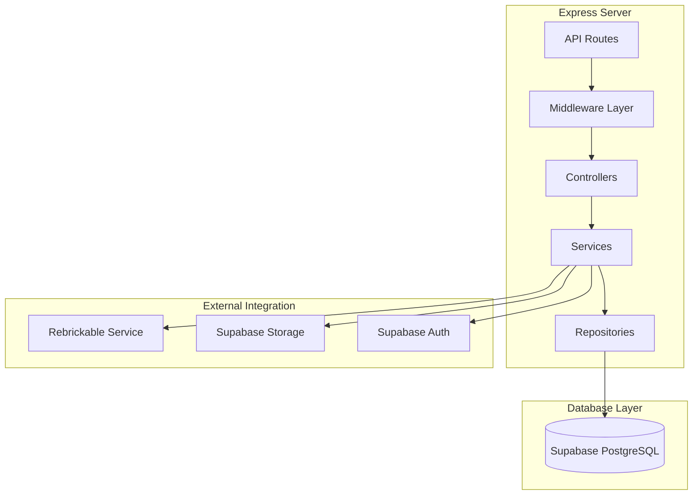
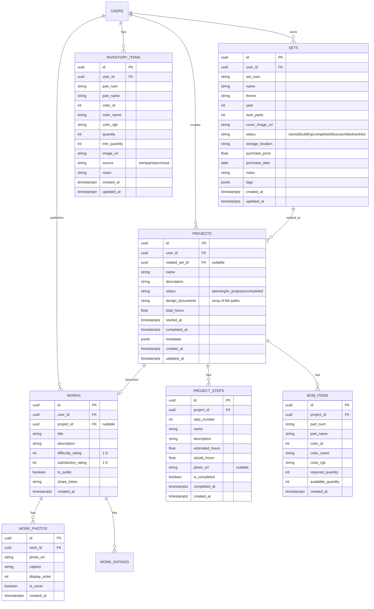

# 乐高收藏与搭建管理工具 - 技术架构文档

## 1. Architecture Design


## 2. Technology Description

### 2.1 Frontend Stack
- **Framework**: React@18 + TypeScript
- **Build Tool**: Vite@5
- **Styling**: Tailwind CSS@3 + CSS Modules
- **State Management**: Zustand
- **Routing**: React Router DOM@6
- **Charts**: Recharts (数据可视化)
- **Icons**: Lucide React
- **HTTP Client**: Axios

### 2.2 Backend Stack
- **Runtime**: Node.js@20
- **Framework**: Express@4
- **Language**: TypeScript
- **Supabase**: Supabase JS SDK (用于数据库和存储操作)

### 2.3 Database & Storage
- **Database**: Supabase (PostgreSQL)
- **File Storage**: Supabase Storage (图片、PDF文档)
- **Authentication**: Supabase Auth

### 2.4 External Services
- **Rebrickable API**: 乐高套装数据获取（名称、主题、零件数、图片）

## 3. Route Definitions

| Route | Purpose |
|-------|---------|
| / | Dashboard仪表盘 |
| /collection | 收藏管理列表 |
| /collection/add | 添加新套装 |
| /collection/:id | 套装详情 |
| /inventory | 零件库存管理 |
| /inventory/recognize | 零件图片识别 |
| /inventory/missing | 缺件清单 |
| /projects | MOC项目列表 |
| /projects/add | 创建新项目 |
| /projects/:id | 项目详情 |
| /gallery | 作品展示画廊 |
| /gallery/:id | 作品详情 |
| /analytics | 数据分析面板 |
| /login | 登录页面 |
| /register | 注册页面 |

## 4. API Definitions

### 4.1 Rebrickable API Integration

```typescript
// 套装信息接口
interface RebrickableSet {
  set_num: string;
  name: string;
  year: number;
  theme_id: number;
  num_parts: number;
  set_img_url: string;
  set_url: string;
  last_modified_dt: string;
}

// 零件信息接口
interface RebrickablePart {
  part_num: string;
  name: string;
  part_cat_id: number;
  part_url: string;
  part_img_url: string;
}

// 颜色信息接口
interface RebrickableColor {
  id: number;
  name: string;
  rgb: string;
  is_trans: boolean;
}
```

### 4.2 Backend API Endpoints

| Method | Path | Description |
|--------|------|-------------|
| GET | /api/sets/fetch/:setNum | 从Rebrickable获取套装信息 |
| GET | /api/parts/search | 搜索零件（支持图片base64） |
| GET | /api/parts/colors | 获取所有可用颜色 |
| POST | /api/projects/:id/calculate-missing | 计算项目缺件 |
| GET | /api/gallery/:id/export-bom | 导出BOM为CSV |

## 5. Server Architecture



## 6. Data Model

### 6.1 ER Diagram



### 6.2 Database Migration (DDL)

```sql
-- Enable UUID extension
CREATE EXTENSION IF NOT EXISTS "uuid-ossp";

-- 套装收藏表
CREATE TABLE IF NOT EXISTS sets (
    id UUID PRIMARY KEY DEFAULT uuid_generate_v4(),
    user_id UUID REFERENCES auth.users(id) NOT NULL,
    set_num VARCHAR(50) NOT NULL,
    name VARCHAR(255) NOT NULL,
    theme VARCHAR(100),
    year INT,
    num_parts INT DEFAULT 0,
    cover_image_url TEXT,
    status VARCHAR(20) DEFAULT 'owned' CHECK (status IN ('owned', 'building', 'completed', 'disassembled', 'wishlist')),
    storage_location VARCHAR(255),
    purchase_price DECIMAL(10, 2),
    purchase_date DATE,
    notes TEXT,
    tags JSONB DEFAULT '[]',
    created_at TIMESTAMPTZ DEFAULT NOW(),
    updated_at TIMESTAMPTZ DEFAULT NOW()
);

CREATE INDEX IF NOT EXISTS idx_sets_user_id ON sets(user_id);
CREATE INDEX IF NOT EXISTS idx_sets_status ON sets(status);
CREATE INDEX IF NOT EXISTS idx_sets_set_num ON sets(set_num);

-- 零件库存表
CREATE TABLE IF NOT EXISTS inventory_items (
    id UUID PRIMARY KEY DEFAULT uuid_generate_v4(),
    user_id UUID REFERENCES auth.users(id) NOT NULL,
    part_num VARCHAR(50) NOT NULL,
    part_name VARCHAR(255),
    color_id INT,
    color_name VARCHAR(100),
    color_rgb VARCHAR(7),
    quantity INT DEFAULT 0,
    min_quantity INT DEFAULT 0,
    image_url TEXT,
    source VARCHAR(20) DEFAULT 'set' CHECK (source IN ('set', 'spare', 'purchase', 'other')),
    notes TEXT,
    created_at TIMESTAMPTZ DEFAULT NOW(),
    updated_at TIMESTAMPTZ DEFAULT NOW()
);

CREATE INDEX IF NOT EXISTS idx_inventory_user_id ON inventory_items(user_id);
CREATE INDEX IF NOT EXISTS idx_inventory_part_num ON inventory_items(part_num);

-- 项目表
CREATE TABLE IF NOT EXISTS projects (
    id UUID PRIMARY KEY DEFAULT uuid_generate_v4(),
    user_id UUID REFERENCES auth.users(id) NOT NULL,
    related_set_id UUID REFERENCES sets(id),
    name VARCHAR(255) NOT NULL,
    description TEXT,
    status VARCHAR(20) DEFAULT 'planning' CHECK (status IN ('planning', 'in_progress', 'completed')),
    design_documents TEXT[] DEFAULT '{}',
    total_hours DECIMAL(8, 2) DEFAULT 0,
    started_at TIMESTAMPTZ,
    completed_at TIMESTAMPTZ,
    metadata JSONB DEFAULT '{}',
    created_at TIMESTAMPTZ DEFAULT NOW(),
    updated_at TIMESTAMPTZ DEFAULT NOW()
);

CREATE INDEX IF NOT EXISTS idx_projects_user_id ON projects(user_id);
CREATE INDEX IF NOT EXISTS idx_projects_status ON projects(status);

-- 项目步骤表
CREATE TABLE IF NOT EXISTS project_steps (
    id UUID PRIMARY KEY DEFAULT uuid_generate_v4(),
    project_id UUID REFERENCES projects(id) ON DELETE CASCADE NOT NULL,
    step_number INT NOT NULL,
    name VARCHAR(255) NOT NULL,
    description TEXT,
    estimated_hours DECIMAL(8, 2) DEFAULT 0,
    actual_hours DECIMAL(8, 2) DEFAULT 0,
    photo_url TEXT,
    is_completed BOOLEAN DEFAULT FALSE,
    completed_at TIMESTAMPTZ,
    created_at TIMESTAMPTZ DEFAULT NOW()
);

CREATE INDEX IF NOT EXISTS idx_project_steps_project_id ON project_steps(project_id);

-- BOM清单表
CREATE TABLE IF NOT EXISTS bom_items (
    id UUID PRIMARY KEY DEFAULT uuid_generate_v4(),
    project_id UUID REFERENCES projects(id) ON DELETE CASCADE NOT NULL,
    part_num VARCHAR(50) NOT NULL,
    part_name VARCHAR(255),
    color_id INT,
    color_name VARCHAR(100),
    color_rgb VARCHAR(7),
    required_quantity INT DEFAULT 0,
    available_quantity INT DEFAULT 0,
    created_at TIMESTAMPTZ DEFAULT NOW()
);

CREATE INDEX IF NOT EXISTS idx_bom_project_id ON bom_items(project_id);

-- 作品展示表
CREATE TABLE IF NOT EXISTS works (
    id UUID PRIMARY KEY DEFAULT uuid_generate_v4(),
    user_id UUID REFERENCES auth.users(id) NOT NULL,
    project_id UUID REFERENCES projects(id),
    title VARCHAR(255) NOT NULL,
    description TEXT,
    difficulty_rating INT DEFAULT 3 CHECK (difficulty_rating BETWEEN 1 AND 5),
    satisfaction_rating INT DEFAULT 4 CHECK (satisfaction_rating BETWEEN 1 AND 5),
    is_public BOOLEAN DEFAULT FALSE,
    share_token UUID DEFAULT uuid_generate_v4(),
    created_at TIMESTAMPTZ DEFAULT NOW()
);

CREATE INDEX IF NOT EXISTS idx_works_user_id ON works(user_id);
CREATE INDEX IF NOT EXISTS idx_works_is_public ON works(is_public);

-- 作品照片表
CREATE TABLE IF NOT EXISTS work_photos (
    id UUID PRIMARY KEY DEFAULT uuid_generate_v4(),
    work_id UUID REFERENCES works(id) ON DELETE CASCADE NOT NULL,
    photo_url TEXT NOT NULL,
    caption TEXT,
    display_order INT DEFAULT 0,
    is_cover BOOLEAN DEFAULT FALSE,
    created_at TIMESTAMPTZ DEFAULT NOW()
);

CREATE INDEX IF NOT EXISTS idx_work_photos_work_id ON work_photos(work_id);

-- Row Level Security Policies
ALTER TABLE sets ENABLE ROW LEVEL SECURITY;
ALTER TABLE inventory_items ENABLE ROW LEVEL SECURITY;
ALTER TABLE projects ENABLE ROW LEVEL SECURITY;
ALTER TABLE project_steps ENABLE ROW LEVEL SECURITY;
ALTER TABLE bom_items ENABLE ROW LEVEL SECURITY;
ALTER TABLE works ENABLE ROW LEVEL SECURITY;
ALTER TABLE work_photos ENABLE ROW LEVEL SECURITY;

-- Sets policies
CREATE POLICY "Users can view own sets" ON sets
    FOR SELECT USING (auth.uid() = user_id);

CREATE POLICY "Users can insert own sets" ON sets
    FOR INSERT WITH CHECK (auth.uid() = user_id);

CREATE POLICY "Users can update own sets" ON sets
    FOR UPDATE USING (auth.uid() = user_id) WITH CHECK (auth.uid() = user_id);

CREATE POLICY "Users can delete own sets" ON sets
    FOR DELETE USING (auth.uid() = user_id);

-- Inventory policies
CREATE POLICY "Users can view own inventory" ON inventory_items
    FOR SELECT USING (auth.uid() = user_id);

CREATE POLICY "Users can insert own inventory" ON inventory_items
    FOR INSERT WITH CHECK (auth.uid() = user_id);

CREATE POLICY "Users can update own inventory" ON inventory_items
    FOR UPDATE USING (auth.uid() = user_id) WITH CHECK (auth.uid() = user_id);

CREATE POLICY "Users can delete own inventory" ON inventory_items
    FOR DELETE USING (auth.uid() = user_id);

-- Projects policies
CREATE POLICY "Users can view own projects" ON projects
    FOR SELECT USING (auth.uid() = user_id);

CREATE POLICY "Users can insert own projects" ON projects
    FOR INSERT WITH CHECK (auth.uid() = user_id);

CREATE POLICY "Users can update own projects" ON projects
    FOR UPDATE USING (auth.uid() = user_id) WITH CHECK (auth.uid() = user_id);

CREATE POLICY "Users can delete own projects" ON projects
    FOR DELETE USING (auth.uid() = user_id);

-- Project Steps policies (via projects)
CREATE POLICY "Users can view steps of own projects" ON project_steps
    FOR SELECT USING (
        EXISTS (
            SELECT 1 FROM projects p 
            WHERE p.id = project_steps.project_id AND p.user_id = auth.uid()
        )
    );

CREATE POLICY "Users can insert steps for own projects" ON project_steps
    FOR INSERT WITH CHECK (
        EXISTS (
            SELECT 1 FROM projects p 
            WHERE p.id = project_steps.project_id AND p.user_id = auth.uid()
        )
    );

CREATE POLICY "Users can update steps of own projects" ON project_steps
    FOR UPDATE USING (
        EXISTS (
            SELECT 1 FROM projects p 
            WHERE p.id = project_steps.project_id AND p.user_id = auth.uid()
        )
    ) WITH CHECK (
        EXISTS (
            SELECT 1 FROM projects p 
            WHERE p.id = project_steps.project_id AND p.user_id = auth.uid()
        )
    );

CREATE POLICY "Users can delete steps of own projects" ON project_steps
    FOR DELETE USING (
        EXISTS (
            SELECT 1 FROM projects p 
            WHERE p.id = project_steps.project_id AND p.user_id = auth.uid()
        )
    );

-- BOM policies (via projects)
CREATE POLICY "Users can view BOM of own projects" ON bom_items
    FOR SELECT USING (
        EXISTS (
            SELECT 1 FROM projects p 
            WHERE p.id = bom_items.project_id AND p.user_id = auth.uid()
        )
    );

CREATE POLICY "Users can insert BOM for own projects" ON bom_items
    FOR INSERT WITH CHECK (
        EXISTS (
            SELECT 1 FROM projects p 
            WHERE p.id = bom_items.project_id AND p.user_id = auth.uid()
        )
    );

CREATE POLICY "Users can update BOM of own projects" ON bom_items
    FOR UPDATE USING (
        EXISTS (
            SELECT 1 FROM projects p 
            WHERE p.id = bom_items.project_id AND p.user_id = auth.uid()
        )
    ) WITH CHECK (
        EXISTS (
            SELECT 1 FROM projects p 
            WHERE p.id = bom_items.project_id AND p.user_id = auth.uid()
        )
    );

CREATE POLICY "Users can delete BOM of own projects" ON bom_items
    FOR DELETE USING (
        EXISTS (
            SELECT 1 FROM projects p 
            WHERE p.id = bom_items.project_id AND p.user_id = auth.uid()
        )
    );

-- Works policies (public can view public works)
CREATE POLICY "Users can view own works or public works" ON works
    FOR SELECT USING (auth.uid() = user_id OR is_public = TRUE);

CREATE POLICY "Users can insert own works" ON works
    FOR INSERT WITH CHECK (auth.uid() = user_id);

CREATE POLICY "Users can update own works" ON works
    FOR UPDATE USING (auth.uid() = user_id) WITH CHECK (auth.uid() = user_id);

CREATE POLICY "Users can delete own works" ON works
    FOR DELETE USING (auth.uid() = user_id);

-- Work Photos policies
CREATE POLICY "Users can view photos of accessible works" ON work_photos
    FOR SELECT USING (
        EXISTS (
            SELECT 1 FROM works w 
            WHERE w.id = work_photos.work_id 
            AND (w.user_id = auth.uid() OR w.is_public = TRUE)
        )
    );

CREATE POLICY "Users can insert photos for own works" ON work_photos
    FOR INSERT WITH CHECK (
        EXISTS (
            SELECT 1 FROM works w 
            WHERE w.id = work_photos.work_id AND w.user_id = auth.uid()
        )
    );

CREATE POLICY "Users can update photos of own works" ON work_photos
    FOR UPDATE USING (
        EXISTS (
            SELECT 1 FROM works w 
            WHERE w.id = work_photos.work_id AND w.user_id = auth.uid()
        )
    ) WITH CHECK (
        EXISTS (
            SELECT 1 FROM works w 
            WHERE w.id = work_photos.work_id AND w.user_id = auth.uid()
        )
    );

CREATE POLICY "Users can delete photos of own works" ON work_photos
    FOR DELETE USING (
        EXISTS (
            SELECT 1 FROM works w 
            WHERE w.id = work_photos.work_id AND w.user_id = auth.uid()
        )
    );
```

## 7. Project Structure

```
project105/
├── api/                          # Backend (Express)
│   ├── src/
│   │   ├── controllers/
│   │   │   ├── setsController.ts
│   │   │   ├── inventoryController.ts
│   │   │   ├── projectsController.ts
│   │   │   └── galleryController.ts
│   │   ├── services/
│   │   │   ├── rebrickableService.ts
│   │   │   ├── storageService.ts
│   │   │   └── authService.ts
│   │   ├── routes/
│   │   │   ├── sets.routes.ts
│   │   │   ├── inventory.routes.ts
│   │   │   ├── projects.routes.ts
│   │   │   └── gallery.routes.ts
│   │   ├── middleware/
│   │   │   ├── auth.ts
│   │   │   └── errorHandler.ts
│   │   ├── types/
│   │   │   └── index.ts
│   │   └── server.ts
│   └── package.json
│
├── src/                          # Frontend (React)
│   ├── components/
│   │   ├── layout/
│   │   │   ├── Sidebar.tsx
│   │   │   ├── TopBar.tsx
│   │   │   └── ProtectedRoute.tsx
│   │   ├── common/
│   │   │   ├── StatCard.tsx
│   │   │   ├── DataTable.tsx
│   │   │   ├── PhotoGallery.tsx
│   │   │   └── StatusBadge.tsx
│   │   ├── sets/
│   │   │   ├── SetCard.tsx
│   │   │   ├── SetForm.tsx
│   │   │   └── SetDetails.tsx
│   │   ├── inventory/
│   │   │   ├── InventoryItem.tsx
│   │   │   ├── PartRecognizer.tsx
│   │   │   └── MissingPartsList.tsx
│   │   ├── projects/
│   │   │   ├── ProjectCard.tsx
│   │   │   ├── ProjectForm.tsx
│   │   │   ├── StepTimeline.tsx
│   │   │   └── BOMEditor.tsx
│   │   ├── gallery/
│   │   │   ├── WorkCard.tsx
│   │   │   ├── StarRating.tsx
│   │   │   └── WorkDetail.tsx
│   │   └── analytics/
│   │       ├── ThemePieChart.tsx
│   │       ├── PartsBarChart.tsx
│   │       └── ValueCard.tsx
│   ├── pages/
│   │   ├── Dashboard.tsx
│   │   ├── Collection.tsx
│   │   ├── AddSet.tsx
│   │   ├── SetDetail.tsx
│   │   ├── Inventory.tsx
│   │   ├── PartRecognize.tsx
│   │   ├── MissingParts.tsx
│   │   ├── Projects.tsx
│   │   ├── AddProject.tsx
│   │   ├── ProjectDetail.tsx
│   │   ├── Gallery.tsx
│   │   ├── WorkDetail.tsx
│   │   ├── Analytics.tsx
│   │   ├── Login.tsx
│   │   └── Register.tsx
│   ├── hooks/
│   │   ├── useAuth.ts
│   │   ├── useSets.ts
│   │   ├── useInventory.ts
│   │   ├── useProjects.ts
│   │   └── useAnalytics.ts
│   ├── store/
│   │   ├── authStore.ts
│   │   └── appStore.ts
│   ├── utils/
│   │   ├── api.ts
│   │   ├── supabase.ts
│   │   ├── constants.ts
│   │   └── helpers.ts
│   ├── types/
│   │   └── index.ts
│   ├── App.tsx
│   ├── main.tsx
│   └── index.css
│
├── supabase/
│   └── config.json
│
├── shared/
│   └── types.ts
│
├── package.json
├── tsconfig.json
├── vite.config.ts
├── tailwind.config.js
└── vercel.json
```
