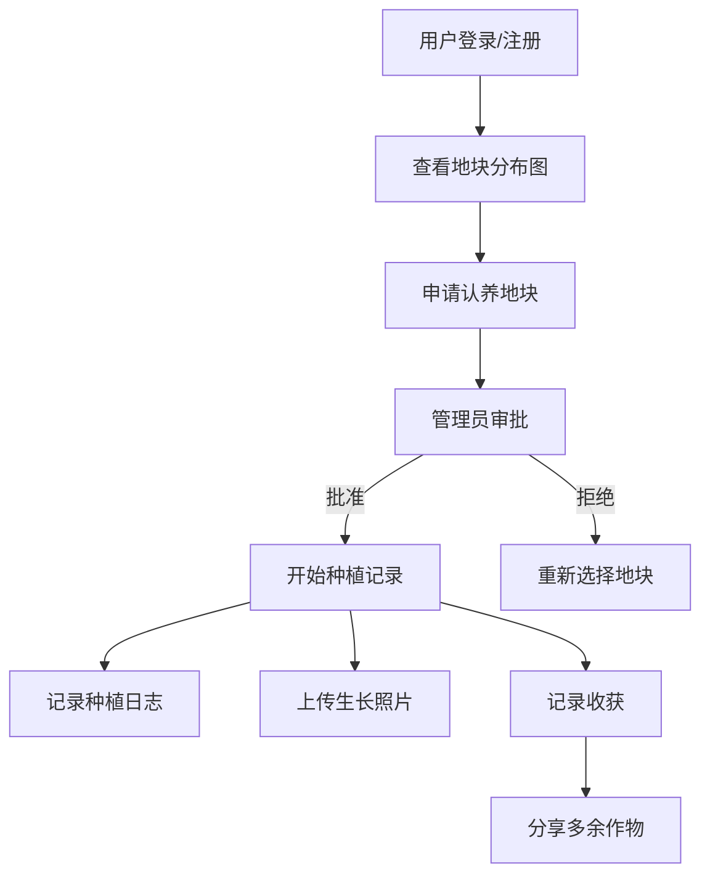

# 在线社区花园和共享绿地管理工具 PRD

## 1. Product Overview

在线社区花园和共享绿地管理工具是一个帮助社区居民共同管理公共绿地的Web应用，解决了地块分配、种植记录、志愿者协作和资源共享等问题。
- 主要用途：帮助社区成员协调花园地块认养、追踪植物生长、组织志愿活动、管理共享资源
- 目标用户：社区居民、花园管理员、志愿者团队

## 2. Core Features

### 2.1 User Roles

| Role | Registration Method | Core Permissions |
|------|---------------------|------------------|
| 普通成员 | 邮箱/用户名注册 | 查看地块、认养地块、记录种植日志、参与志愿活动、浏览共享公告 |
| 管理员 | 管理员账号 | 所有普通成员权限 + 管理所有地块、分配角色、管理资源库存、审批申请 |

### 2.2 Feature Module

1. **地块管理模块**: 平面图绘制、认养信息管理、轮作历史记录
2. **种植追踪模块**: 种植日志、生长照片时间线、收获记录
3. **社区协作模块**: 志愿排班、经验分享、作物共享公告
4. **资源管理模块**: 工具借还、肥料种子库存、水电分摊记录

### 2.3 Page Details

| Page Name | Module Name | Feature description |
|-----------|-------------|---------------------|
| 首页 | 仪表盘 | 显示地块概况、最近活动、待办任务、社区公告 |
| 地块管理 | 地块地图 | SVG绘制的花园平面图，点击查看详情，支持编辑认养信息 |
| 地块管理 | 认养详情 | 认养人信息、起止时间、当前作物、地块状态（空闲/已认养/待批准） |
| 地块管理 | 轮作历史 | 季度种植记录，显示历史种植作物和轮作建议 |
| 种植追踪 | 种植日志 | 播种日期、品种、密度、施肥浇水记录，支持添加/编辑/删除 |
| 种植追踪 | 生长相册 | 按时间线展示同一地块的照片对比，支持上传新照片 |
| 种植追踪 | 收获记录 | 收获日期、收获量、品质评价，自动关联地块和作物 |
| 社区协作 | 志愿排班 | 日历视图，显示任务类型、分配人员、时间地点 |
| 社区协作 | 经验分享 | 论坛式讨论区，支持发帖、评论、点赞 |
| 社区协作 | 共享公告 | 多余作物分享公告板，支持发布、领取标记、自动下架 |
| 资源管理 | 工具借用 | 工具列表、借还状态、借用记录、预约功能 |
| 资源管理 | 库存管理 | 肥料/种子库存、出入库记录、低库存预警 |
| 资源管理 | 水电分摊 | 费用记录、分摊计算、缴费状态追踪 |

## 3. Core Process

1. 成员注册/登录 → 浏览地块分布图 → 申请认养空闲地块 → 管理员审批 → 开始种植记录
2. 种植过程 → 记录日志 → 上传生长照片 → 记录收获 → 分享多余作物
3. 管理员发布志愿任务 → 成员报名 → 任务执行 → 记录完成状态
4. 公共资源管理 → 工具借还登记 → 库存更新 → 费用分摊计算

## 4. User Interface Design

### 4.1 Design Style

- 主色调：自然绿色系（#2D6A4F 主色，#40916C 辅色，#B7E4C7 浅色）
- 背景色：温暖米白（#FEFAE0）和浅绿渐变
- 按钮风格：圆角矩形（8-12px），悬停有阴影和颜色加深效果
- 字体：标题使用 Playfair Display（优雅衬线），正文使用 Inter（现代无衬线）
- 布局风格：卡片式布局，侧边栏导航，顶部工具栏
- 图标风格：使用 Lucide React 的线性图标，保持统一风格
- 动画：微交互动画（悬停、过渡、淡入），页面切换使用优雅的过渡效果

### 4.2 Page Design Overview

| Page Name | Module Name | UI Elements |
|-----------|-------------|-------------|
| 首页 | 仪表盘 | 统计卡片网格、地块状态分布饼图、最近活动列表、待办任务卡 |
| 地块管理 | 地块地图 | SVG交互地图、地块颜色编码（空闲=浅绿，已认养=深绿，待批准=黄色）、侧边信息面板 |
| 种植追踪 | 时间线 | 垂直时间线布局、照片画廊卡片、日志条目列表 |
| 社区协作 | 公告板 | 瀑布流布局、卡片式公告、标签筛选、搜索框 |
| 资源管理 | 工具列表 | 表格视图、状态标签（可用/已借出/维修中）、借用按钮 |

### 4.3 Responsiveness

- Desktop-first 设计，支持 1024px 及以上
- 平板设备 (768px-1024px)：侧边栏折叠为汉堡菜单
- 移动设备 (≤768px)：单列布局、底部导航、触摸优化的按钮尺寸
- 所有交互元素支持键盘操作

### 4.4 关键UI组件

- **地块地图**：交互式SVG，支持缩放、拖拽、悬停高亮
- **时间线组件**：左侧时间轴，右侧内容卡片，支持展开/折叠
- **日历视图**：月/周/日切换，支持拖拽创建事件
- **卡片组件**：统一的卡片样式，包含标题、操作按钮、状态标签
