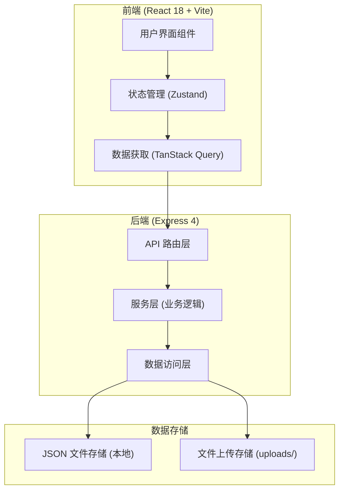
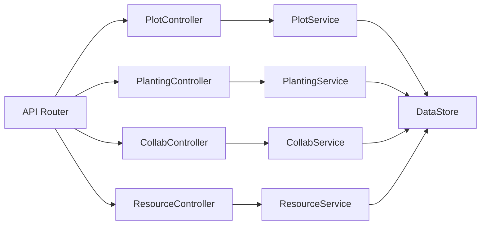
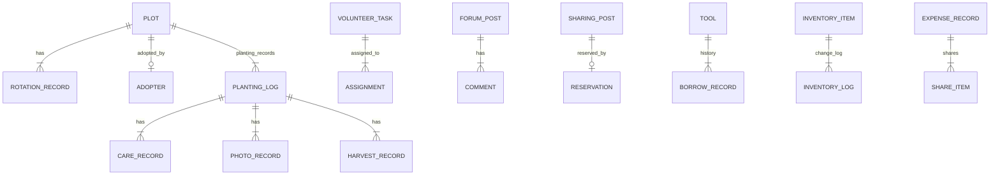

# 在线社区花园和共享绿地管理工具 技术架构文档

## 1. Architecture Design



## 2. Technology Description

- 前端: React@18 + TypeScript + TailwindCSS@3 + Vite@5
- 初始化工具: vite-init
- 后端: Express@4 + TypeScript
- 数据存储: JSON 文件系统（本地开发）
- 路由: React Router v6
- 状态管理: Zustand
- 图标: Lucide React
- 日期处理: date-fns
- 样式: TailwindCSS 3

## 3. Route Definitions

| Route | Purpose |
|-------|---------|
| / | 首页仪表盘 |
| /plots | 地块管理 - 地图视图 |
| /plots/:id | 地块详情 - 认养信息和轮作历史 |
| /planting | 种植追踪 - 日志列表 |
| /planting/:id | 种植记录详情 - 日志、照片、收获 |
| /collaboration | 社区协作 - 志愿排班 |
| /collaboration/sharing | 作物共享公告板 |
| /collaboration/forum | 经验分享论坛 |
| /resources | 资源管理 - 工具借用 |
| /resources/inventory | 库存管理 |
| /resources/expenses | 水电分摊记录 |

## 4. API Definitions

### 4.1 API 响应格式

```typescript
interface ApiResponse<T> {
  success: boolean;
  data?: T;
  error?: string;
}
```

### 4.2 地块管理 API

```typescript
// 地块数据类型
interface Plot {
  id: string;
  name: string;
  area: number;
  coordinates: { x: number; y: number; width: number; height: number };
  status: 'available' | 'adopted' | 'pending';
  adopter?: {
    name: string;
    userId: string;
    startDate: string;
    endDate: string;
  };
  currentCrop?: string;
  rotationHistory: RotationRecord[];
}

interface RotationRecord {
  id: string;
  season: string;
  year: number;
  crop: string;
  notes: string;
}

// API 路由
GET    /api/plots                    // 获取所有地块
GET    /api/plots/:id               // 获取单个地块
POST   /api/plots/:id/adopt         // 申请认养地块
PUT    /api/plots/:id               // 更新地块信息
POST   /api/plots/:id/rotation      // 添加轮作记录
```

### 4.3 种植追踪 API

```typescript
interface PlantingLog {
  id: string;
  plotId: string;
  seedDate: string;
  variety: string;
  density: number;
  cropType: string;
  careRecords: CareRecord[];
  photos: PhotoRecord[];
  harvests: HarvestRecord[];
}

interface CareRecord {
  id: string;
  date: string;
  type: 'water' | 'fertilize' | 'prune' | 'other';
  notes: string;
}

interface PhotoRecord {
  id: string;
  date: string;
  url: string;
  caption: string;
}

interface HarvestRecord {
  id: string;
  date: string;
  quantity: number;
  unit: string;
  quality: 'excellent' | 'good' | 'fair' | 'poor';
  notes: string;
}

// API 路由
GET    /api/planting                // 获取所有种植记录
GET    /api/planting/:id           // 获取单个种植记录
POST   /api/planting               // 创建种植记录
PUT    /api/planting/:id           // 更新种植记录
POST   /api/planting/:id/care      // 添加护理记录
POST   /api/planting/:id/photo     // 上传生长照片
POST   /api/planting/:id/harvest   // 添加收获记录
```

### 4.4 社区协作 API

```typescript
interface VolunteerTask {
  id: string;
  title: string;
  type: 'lawn_maint' | 'watering' | 'cleanup' | 'other';
  assignedTo: string[];
  date: string;
  time: string;
  location: string;
  status: 'pending' | 'in_progress' | 'completed';
  description: string;
}

interface ForumPost {
  id: string;
  title: string;
  content: string;
  author: string;
  category: 'fertilizer' | 'pest' | 'tips' | 'general';
  likes: number;
  comments: Comment[];
  createdAt: string;
}

interface Comment {
  id: string;
  author: string;
  content: string;
  createdAt: string;
}

interface SharingPost {
  id: string;
  crop: string;
  quantity: number;
  unit: string;
  author: string;
  pickupLocation: string;
  status: 'available' | 'pending_pickup' | 'taken';
  createdAt: string;
}

// API 路由
GET    /api/tasks                   // 获取所有志愿任务
POST   /api/tasks                   // 创建志愿任务
PUT    /api/tasks/:id               // 更新志愿任务
PUT    /api/tasks/:id/assign        // 分配任务
GET    /api/posts                   // 获取论坛帖子
POST   /api/posts                   // 创建帖子
POST   /api/posts/:id/comment       // 添加评论
POST   /api/posts/:id/like          // 点赞
GET    /api/sharing                 // 获取共享公告
POST   /api/sharing                 // 创建共享公告
PUT    /api/sharing/:id             // 更新共享状态
```

### 4.5 资源管理 API

```typescript
interface Tool {
  id: string;
  name: string;
  type: string;
  status: 'available' | 'borrowed' | 'maintenance';
  borrowHistory: BorrowRecord[];
}

interface BorrowRecord {
  id: string;
  userId: string;
  userName: string;
  borrowDate: string;
  returnDate: string;
  expectedReturn: string;
}

interface InventoryItem {
  id: string;
  name: string;
  type: 'fertilizer' | 'seed';
  quantity: number;
  unit: string;
  lowThreshold: number;
  lastUpdated: string;
}

interface ExpenseRecord {
  id: string;
  type: 'water' | 'electric';
  period: string;
  totalAmount: number;
  splitMethod: 'equal' | 'by_area';
  individualShares: ShareItem[];
  status: 'pending' | 'partial' | 'paid';
}

interface ShareItem {
  userId: string;
  userName: string;
  amount: number;
  paid: boolean;
}

// API 路由
GET    /api/tools                   // 获取所有工具
POST   /api/tools/:id/borrow        // 借用工具
POST   /api/tools/:id/return        // 归还工具
GET    /api/inventory               // 获取库存
PUT    /api/inventory/:id           // 更新库存
POST   /api/inventory               // 添加库存项
GET    /api/expenses                // 获取费用记录
POST   /api/expenses                // 创建费用记录
PUT    /api/expenses/:id/pay        // 记录缴费
```

## 5. Server Architecture



## 6. Data Model

### 6.1 Data Model Definition



### 6.2 初始数据结构

项目将使用 JSON 文件存储数据，目录结构：

```
api/data/
├── plots.json           # 地块数据
├── planting.json        # 种植记录
├── tasks.json           # 志愿任务
├── posts.json           # 论坛帖子
├── sharing.json         # 共享公告
├── tools.json           # 工具数据
├── inventory.json       # 库存数据
└── expenses.json        # 费用记录
```

### 6.3 项目目录结构

```
project106/
├── src/
│   ├── components/      # 可复用组件
│   │   ├── common/     # 通用组件 (Card, Button, Modal 等)
│   │   ├── plots/      # 地块相关组件
│   │   ├── planting/   # 种植相关组件
│   │   ├── collab/     # 协作相关组件
│   │   └── resources/  # 资源管理组件
│   ├── pages/          # 页面组件
│   ├── store/          # Zustand 状态管理
│   ├── hooks/          # 自定义 Hooks
│   ├── utils/          # 工具函数
│   ├── types/          # TypeScript 类型定义
│   ├── api/            # API 客户端
│   ├── App.tsx
│   ├── main.tsx
│   └── index.css
├── api/
│   ├── routes/         # Express 路由
│   ├── services/       # 业务逻辑
│   ├── data/           # JSON 数据文件
│   └── server.ts       # Express 服务器入口
├── uploads/            # 上传的照片文件
├── package.json
├── tsconfig.json
├── vite.config.ts
└── tailwind.config.js
```
