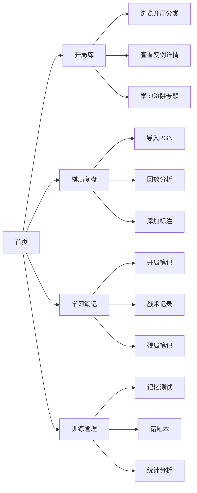

## 1. Product Overview
国际象棋学习与复盘工具，为棋手提供开局库管理、棋局分析、学习笔记和训练管理的一体化平台。
- 帮助棋手系统学习国际象棋开局、分析棋局、记录学习心得、提高棋力
- 面向从初学者到中级棋手的国际象棋爱好者

## 2. Core Features

### 2.1 User Roles
| Role | Registration Method | Core Permissions |
|------|---------------------|------------------|
| Normal User | 无需注册（本地存储） | 使用所有功能，数据存储在本地 |

### 2.2 Feature Module
1. **开局库管理页面**: 开局树形分类、变例详情、陷阱专题
2. **棋局复盘页面**: PGN导入、棋盘可视化、逐步回放、棋局标注
3. **学习笔记页面**: 开局笔记、战术记录、残局笔记
4. **训练管理页面**: 开局记忆测试、战术错题本、对局统计

### 2.3 Page Details
| Page Name | Module Name | Feature description |
|-----------|-------------|---------------------|
| 开局库管理 | 开局树形结构 | 按分类展示（西班牙开局/西西里防御/法兰西防御等），支持展开/收起 |
| 开局库管理 | 变例详情 | 显示变例棋谱、战略目标、主要思路说明 |
| 开局库管理 | 陷阱专题 | 收集经典陷阱和反陷阱方法，配有棋盘演示 |
| 棋局复盘 | PGN导入 | 支持粘贴PGN文本解析棋局 |
| 棋局复盘 | 棋盘可视化 | 标准8x8棋盘，棋子显示，走法高亮 |
| 棋局复盘 | 逐步回放 | 前进/后退/跳转到开始/结束/指定步数 |
| 棋局复盘 | 关键时刻标注 | 标注转折点、最佳走法、败招及原因分析 |
| 学习笔记 | 开局笔记 | 为每个变例添加个人学习笔记（为什么、目的、续着） |
| 学习笔记 | 战术记录 | 记录发现的强制杀棋、得子手段等战术组合 |
| 学习笔记 | 残局笔记 | 王兵残局、车类残局等基本理论学习笔记 |
| 训练管理 | 记忆测试 | 给出前几步，用户输入下一步，验证正确性 |
| 训练管理 | 战术错题本 | 记录做错的战术题，重点复习 |
| 训练管理 | 对局统计 | 胜率分析、常用开局统计、败局规律分析 |

## 3. Core Process
用户打开应用 → 选择功能模块（开局库/复盘/笔记/训练）→ 进行相应操作 → 数据自动保存到本地存储

## 4. User Interface Design

### 4.1 Design Style
- **主色调**: 深胡桃木色（#5D4037）+ 象牙白（#F5F5DC）- 模拟经典木质棋盘
- **辅助色**: 金色（#FFD700）用于高亮和重点标注，深灰色用于文字
- **按钮风格**: 圆角矩形，木纹质感，悬停时有轻微凹陷效果
- **字体**: 标题使用 'Playfair Display'（优雅衬线体），正文使用 'Noto Sans'（清晰易读）
- **布局风格**: 左侧导航栏 + 主内容区，卡片式设计
- **图标风格**: 使用 lucide-react 图标，风格简洁统一

### 4.2 Page Design Overview
| Page Name | Module Name | UI Elements |
|-----------|-------------|-------------|
| 开局库管理 | 树形结构 | 左侧可展开树，右侧内容区，木纹背景 |
| 开局库管理 | 变例详情 | 棋盘预览 + 文字说明，分栏布局 |
| 棋局复盘 | 主界面 | 中央大棋盘 + 右侧走法列表 + 标注面板 |
| 学习笔记 | 笔记列表 | 卡片式笔记，支持搜索和分类 |
| 训练管理 | 记忆测试 | 棋盘 + 输入框 + 结果反馈动画 |
| 训练管理 | 统计 | 图表展示，卡片式数据概览 |

### 4.3 Responsiveness
- Desktop-first 设计
- 平板端：侧边栏可收起
- 移动端：底部导航栏，棋盘自适应
- 触摸设备优化：大按钮，滑动手势支持

### 4.4 Animation & Interaction
- 页面加载时渐入动画
- 棋子移动时平滑过渡
- 侧边栏展开/收起时的滑入滑出
- 点击反馈：按钮按下时的微动画
- 标注保存时的成功提示动画
