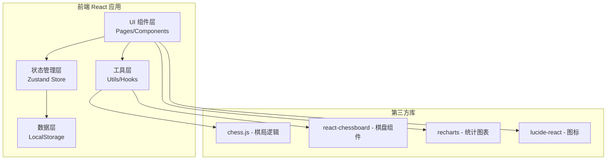
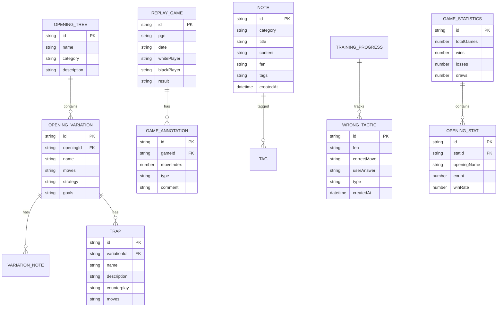

## 1. Architecture Design



## 2. Technology Description

- **Frontend**: React@18 + TypeScript + tailwindcss@3 + vite
- **初始化工具**: vite-init (react-ts 模板)
- **Backend**: None（纯前端应用，使用 LocalStorage 存储数据）
- **状态管理**: Zustand
- **路由**: react-router-dom
- **核心库**:
  - chess.js: 国际象棋规则引擎
  - react-chessboard: 棋盘可视化组件
  - recharts: 统计图表
  - lucide-react: 图标库

## 3. Route Definitions

| Route | Purpose |
|-------|---------|
| / | 首页/仪表盘，功能导航入口 |
| /openings | 开局库管理页面 |
| /replay | 棋局复盘页面 |
| /notes | 学习笔记页面 |
| /training | 训练管理页面 |

## 4. Data Model

### 4.1 数据模型定义



### 4.2 数据存储结构

**LocalStorage 键名**:
- `chess_openings`: 内置开局库数据（只读）
- `chess_replays`: 保存的复盘棋局
- `chess_notes`: 用户学习笔记
- `chess_wrong_tactics`: 战术错题本
- `chess_statistics`: 对局统计数据

## 5. 目录结构

```
src/
├── components/
│   ├── ChessBoard/          # 棋盘组件封装
│   ├── OpeningTree/         # 开局树形组件
│   ├── PGNImport/           # PGN导入组件
│   ├── MoveList/            # 走法列表组件
│   └── AnnotationPanel/     # 标注面板
├── pages/
│   ├── Home.tsx             # 首页
│   ├── Openings.tsx         # 开局库页面
│   ├── Replay.tsx           # 复盘页面
│   ├── Notes.tsx            # 笔记页面
│   └── Training.tsx         # 训练页面
├── store/
│   ├── useGameStore.ts      # 棋局状态
│   ├── useNoteStore.ts      # 笔记状态
│   └── useTrainingStore.ts  # 训练状态
├── utils/
│   ├── chess.ts             # 棋局逻辑工具
│   ├── pgn.ts               # PGN解析
│   └── storage.ts           # 本地存储
├── data/
│   └── openings.ts          # 内置开局库数据
├── types/
│   └── index.ts             # 类型定义
├── App.tsx
├── main.tsx
└── index.css
```

## 6. 核心模块说明

### 6.1 开局库模块
- 静态数据（内置主流开局）+ 用户可扩展
- 树形结构展示，支持搜索过滤
- 变例棋盘实时预览

### 6.2 复盘模块
- PGN 解析 → chess.js 验证
- 走法历史管理（时间轴模式）
- 标注支持富文本，关联特定步数

### 6.3 笔记模块
- 按分类组织（开局/战术/残局）
- 支持 FEN 位置关联
- 标签系统便于检索

### 6.4 训练模块
- 记忆测试：从开局库随机抽取变例
- 错题本：记录错误答案与正确答案
- 统计：Recharts 绘制胜率、开局分布图表
