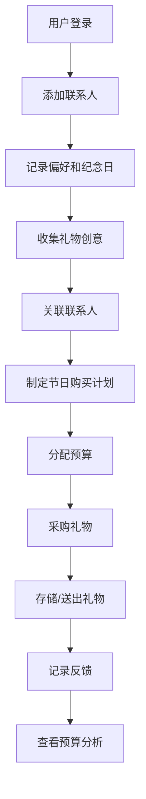

# 在线礼物清单和节日送礼管理工具 - 产品需求文档 (PRD)

## 1. Product Overview
这是一款全面的送礼管理工具，帮助用户系统化地管理联系人礼物偏好、创意收集、购买计划和预算分析，让送礼变得更加有心和高效。
- **主要目的**：解决用户在节日送礼时的记忆负担、创意枯竭、预算失控等问题
- **目标用户**：需要管理多个联系人礼物的都市白领、家庭管理者、社交活跃人士
- **核心价值**：通过系统化管理，让送礼成为一件轻松、贴心的事情，提升人际关系质量

## 2. Core Features

### 2.1 User Roles

| Role | Registration Method | Core Permissions |
|------|---------------------|------------------|
| 普通用户 | 邮箱/手机号注册 | 使用所有功能，管理个人数据 |

### 2.2 Feature Module

1. **联系人礼物档案模块**：管理联系人的礼物偏好、送礼历史和重要纪念日
2. **礼物创意库模块**：收集和管理礼物灵感，标注价格和购买渠道
3. **购买计划模块**：制定节日送礼预算和采购计划
4. **礼物跟踪模块**：追踪礼物购买、库存和送出状态
5. **预算分析模块**：统计和分析年度送礼支出

### 2.3 Page Details

| Page Name | Module Name | Feature description |
|-----------|-------------|---------------------|
| 仪表盘 (Dashboard) | 概览模块 | 即将到来的纪念日提醒、送礼统计概览、快速操作入口 |
| 联系人列表 (Contacts) | 联系人礼物档案模块 | 联系人卡片列表、搜索筛选、新增/编辑联系人 |
| 联系人详情 (Contact Detail) | 联系人礼物档案模块 | 联系人完整信息、偏好设置、送礼历史时间线、纪念日日历 |
| 创意库 (Gift Ideas) | 礼物创意库模块 | 创意卡片展示、标签筛选、价格区间过滤、新增/编辑礼物创意 |
| 采购计划 (Purchase Plans) | 购买计划模块 | 节日预算设置、礼物清单生成、采购任务跟踪 |
| 礼物跟踪 (Gift Tracking) | 礼物跟踪模块 | 库存管理、待购进度、送出记录反馈 |
| 预算分析 (Budget Analysis) | 预算分析模块 | 年度支出统计、节日花费对比、礼物类型偏好分析 |

## 3. Core Process

### 主用户流程
1. 用户注册/登录系统
2. 添加重要联系人及其基本信息
3. 记录联系人的礼物偏好和重要纪念日
4. 浏览或收集礼物创意，关联到适合的联系人
5. 在节日来临前制定购买计划和预算
6. 跟踪礼物的采购和送出过程
7. 记录对方反馈并查看年度预算分析



## 4. User Interface Design

### 4.1 Design Style
- **主色调**：温暖的珊瑚粉色 (#FF6B6B) 作为主色，传递节日的温馨感
- **辅助色**：柔和的天蓝色 (#4ECDC4) 用于信息展示，柠檬黄 (#FFE66D) 用于提醒
- **中性色**：深炭灰 (#1A1A2E) 用于文字，米白 (#FAF3E0) 作为背景
- **按钮样式**：圆角矩形，带柔和阴影，hover时有轻微放大效果
- **字体**：标题使用 Playfair Display（优雅衬线），正文使用 Lato（清晰无衬线）
- **布局风格**：卡片式布局，左右分栏（左侧导航 + 右侧内容区）
- **图标风格**：使用 Lucide 图标，统一为线性风格
- **动画效果**：平滑过渡、卡片悬浮效果、纪念日倒计时动画

### 4.2 Page Design Overview

| Page Name | Module Name | UI Elements |
|-----------|-------------|-------------|
| 仪表盘 | 概览模块 | 顶部统计卡片、即将到来的纪念日列表、最近送礼记录、快速操作按钮 |
| 联系人列表 | 联系人档案 | 搜索栏、筛选器、联系人卡片网格、分页、添加按钮 |
| 联系人详情 | 联系人档案 | 头像和基本信息侧边栏、偏好设置标签页、送礼历史时间线、纪念日日历 |
| 创意库 | 礼物创意 | 瀑布流卡片展示、侧边筛选栏、价格区间滑块、添加创意按钮 |
| 采购计划 | 购买计划 | 节日选择器、预算设置面板、礼物清单表格、进度条、批量操作 |
| 礼物跟踪 | 礼物跟踪 | 库存标签页（位置卡片）、待购标签页（进度列表）、已送出标签页（反馈卡片） |
| 预算分析 | 预算分析 | 年度支出柱状图、节日对比环形图、偏好分析词云、趋势折线图 |

### 4.3 Responsiveness
- **Desktop-first** 设计，响应式适配平板和手机
- 桌面端：左侧固定导航（240px），右侧内容区自适应
- 平板端：顶部导航栏，内容区单列布局
- 手机端：底部导航按钮，卡片单列堆叠，表单字段优化为单列

### 4.4 导航结构
```
├── 仪表盘
├── 联系人管理
│   ├── 联系人列表
│   └── 联系人详情
├── 礼物创意库
├── 购买计划
├── 礼物跟踪
└── 预算分析
```
