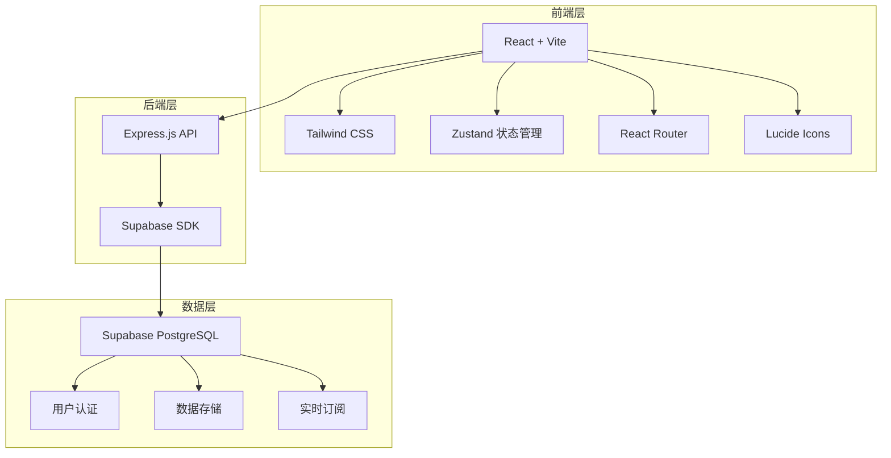
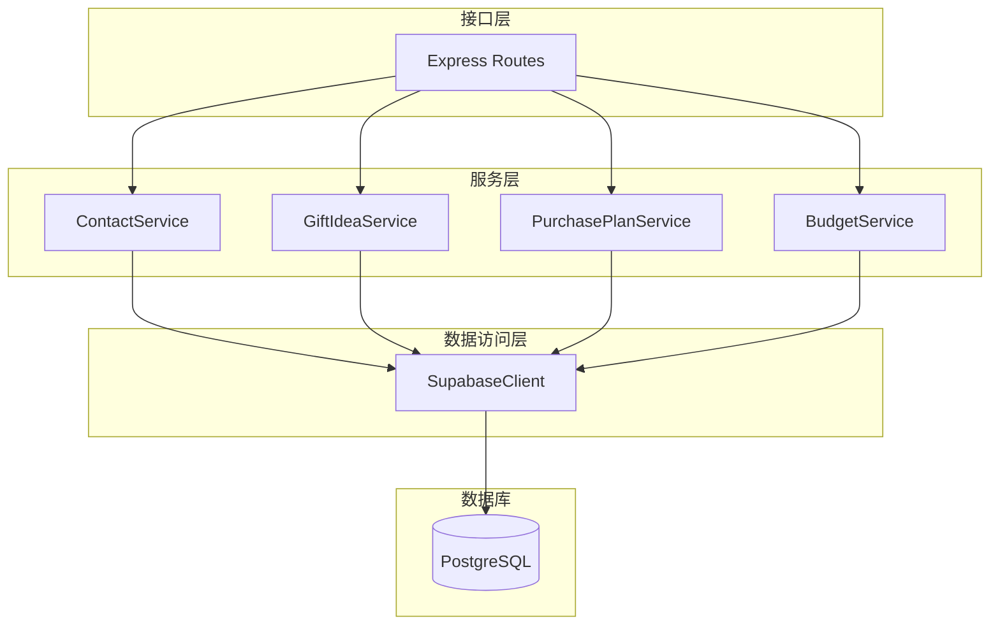
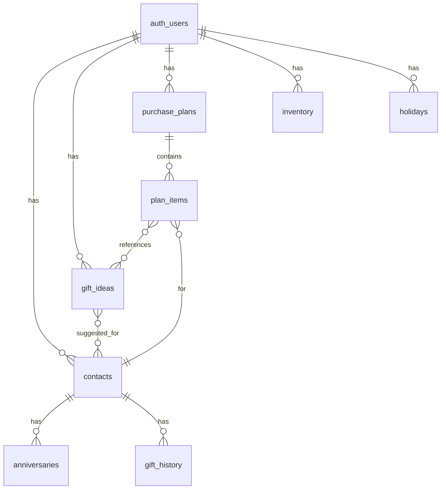

# 在线礼物清单和节日送礼管理工具 - 技术架构文档

## 1. Architecture Design



## 2. Technology Description

- **前端**: React@18 + TypeScript + Vite + Tailwind CSS@3 + Zustand + React Router v6 + Lucide React + Recharts
- **后端**: Express@4 + TypeScript + Supabase SDK
- **数据库**: Supabase (PostgreSQL)
- **认证**: Supabase Auth
- **初始化工具**: vite-init
- **图表库**: Recharts 用于预算分析可视化

## 3. Route Definitions

| Route | Purpose |
|-------|---------|
| / | 仪表盘首页 |
| /contacts | 联系人列表 |
| /contacts/:id | 联系人详情 |
| /gift-ideas | 礼物创意库 |
| /purchase-plans | 购买计划 |
| /gift-tracking | 礼物跟踪 |
| /budget-analysis | 预算分析 |
| /login | 登录页 |
| /register | 注册页 |

## 4. API Definitions

### 4.1 类型定义

```typescript
// 联系人
interface Contact {
  id: string;
  userId: string;
  name: string;
  avatar?: string;
  relation: string;
  email?: string;
  phone?: string;
  notes?: string;
  // 偏好
  likes: string[];
  dislikes: string[];
  allergies: string[];
  dietaryRestrictions: string[];
  sizes: { type: string; value: string }[];
  createdAt: string;
}

// 纪念日
interface Anniversary {
  id: string;
  contactId: string;
  type: 'birthday' | 'anniversary' | 'holiday' | 'custom';
  name: string;
  date: string;
  reminderDays: number;
  recurring: boolean;
}

// 送礼记录
interface GiftHistory {
  id: string;
  contactId: string;
  giftName: string;
  occasion: string;
  date: string;
  price: number;
  reaction: string;
  notes?: string;
}

// 礼物创意
interface GiftIdea {
  id: string;
  userId: string;
  name: string;
  description?: string;
  tags: string[];
  priceMin: number;
  priceMax: number;
  purchaseChannels: { name: string; url?: string }[];
  imageUrl?: string;
  suggestedFor: string[]; // contact IDs
  status: 'idea' | 'saved' | 'purchased';
  createdAt: string;
}

// 节日/事件
interface Holiday {
  id: string;
  userId: string;
  name: string;
  date: string;
  type: 'national' | 'family' | 'personal';
  reminderDays: number;
}

// 购买计划
interface PurchasePlan {
  id: string;
  userId: string;
  holidayId?: string;
  holidayName: string;
  totalBudget: number;
  deadline: string;
  status: 'planning' | 'active' | 'completed';
  createdAt: string;
}

// 计划项目
interface PlanItem {
  id: string;
  planId: string;
  contactId: string;
  giftIdeaId?: string;
  giftName: string;
  budget: number;
  deadline: string;
  status: 'pending' | 'purchased' | 'delivered' | 'given';
  storageLocation?: string;
  purchaseDate?: string;
  givenDate?: string;
  feedback?: string;
  price?: number;
}

// 库存记录
interface Inventory {
  id: string;
  userId: string;
  name: string;
  quantity: number;
  location: string;
  purchaseDate: string;
  price: number;
  notes?: string;
}
```

### 4.2 API 端点

| Method | Endpoint | Description |
|--------|----------|-------------|
| GET | /api/contacts | 获取联系人列表 |
| POST | /api/contacts | 创建联系人 |
| GET | /api/contacts/:id | 获取联系人详情 |
| PUT | /api/contacts/:id | 更新联系人 |
| DELETE | /api/contacts/:id | 删除联系人 |
| GET | /api/contacts/:id/history | 获取送礼历史 |
| POST | /api/gift-history | 添加送礼记录 |
| GET | /api/gift-ideas | 获取礼物创意列表 |
| POST | /api/gift-ideas | 创建礼物创意 |
| GET | /api/purchase-plans | 获取购买计划 |
| POST | /api/purchase-plans | 创建购买计划 |
| GET | /api/purchase-plans/:id/items | 获取计划项目 |
| PUT | /api/plan-items/:id | 更新计划项目状态 |
| GET | /api/inventory | 获取库存 |
| GET | /api/budget/summary | 获取预算汇总 |

## 5. Server Architecture Diagram



## 6. Data Model

### 6.1 Data Model Definition



### 6.2 Data Definition Language

```sql
-- 联系人表
CREATE TABLE IF NOT EXISTS contacts (
    id UUID PRIMARY KEY DEFAULT gen_random_uuid(),
    user_id UUID REFERENCES auth.users(id) ON DELETE CASCADE NOT NULL,
    name TEXT NOT NULL,
    avatar TEXT,
    relation TEXT,
    email TEXT,
    phone TEXT,
    notes TEXT,
    likes TEXT[] DEFAULT '{}',
    dislikes TEXT[] DEFAULT '{}',
    allergies TEXT[] DEFAULT '{}',
    dietary_restrictions TEXT[] DEFAULT '{}',
    sizes JSONB DEFAULT '[]',
    created_at TIMESTAMPTZ DEFAULT NOW(),
    updated_at TIMESTAMPTZ DEFAULT NOW()
);

-- 纪念日表
CREATE TABLE IF NOT EXISTS anniversaries (
    id UUID PRIMARY KEY DEFAULT gen_random_uuid(),
    contact_id UUID REFERENCES contacts(id) ON DELETE CASCADE NOT NULL,
    type TEXT NOT NULL CHECK (type IN ('birthday', 'anniversary', 'holiday', 'custom')),
    name TEXT NOT NULL,
    date DATE NOT NULL,
    reminder_days INTEGER DEFAULT 7,
    recurring BOOLEAN DEFAULT true,
    created_at TIMESTAMPTZ DEFAULT NOW()
);

-- 送礼历史表
CREATE TABLE IF NOT EXISTS gift_history (
    id UUID PRIMARY KEY DEFAULT gen_random_uuid(),
    contact_id UUID REFERENCES contacts(id) ON DELETE CASCADE NOT NULL,
    gift_name TEXT NOT NULL,
    occasion TEXT,
    date DATE NOT NULL,
    price NUMERIC(10,2) DEFAULT 0,
    reaction TEXT NOT NULL,
    notes TEXT,
    created_at TIMESTAMPTZ DEFAULT NOW()
);

-- 礼物创意表
CREATE TABLE IF NOT EXISTS gift_ideas (
    id UUID PRIMARY KEY DEFAULT gen_random_uuid(),
    user_id UUID REFERENCES auth.users(id) ON DELETE CASCADE NOT NULL,
    name TEXT NOT NULL,
    description TEXT,
    tags TEXT[] DEFAULT '{}',
    price_min NUMERIC(10,2) DEFAULT 0,
    price_max NUMERIC(10,2) DEFAULT 0,
    purchase_channels JSONB DEFAULT '[]',
    image_url TEXT,
    suggested_for UUID[] DEFAULT '{}',
    status TEXT DEFAULT 'idea' CHECK (status IN ('idea', 'saved', 'purchased')),
    created_at TIMESTAMPTZ DEFAULT NOW()
);

-- 节日表
CREATE TABLE IF NOT EXISTS holidays (
    id UUID PRIMARY KEY DEFAULT gen_random_uuid(),
    user_id UUID REFERENCES auth.users(id) ON DELETE CASCADE NOT NULL,
    name TEXT NOT NULL,
    date DATE NOT NULL,
    type TEXT NOT NULL CHECK (type IN ('national', 'family', 'personal')),
    reminder_days INTEGER DEFAULT 14,
    created_at TIMESTAMPTZ DEFAULT NOW()
);

-- 购买计划表
CREATE TABLE IF NOT EXISTS purchase_plans (
    id UUID PRIMARY KEY DEFAULT gen_random_uuid(),
    user_id UUID REFERENCES auth.users(id) ON DELETE CASCADE NOT NULL,
    holiday_id UUID REFERENCES holidays(id) ON DELETE SET NULL,
    holiday_name TEXT NOT NULL,
    total_budget NUMERIC(10,2) DEFAULT 0,
    deadline DATE NOT NULL,
    status TEXT DEFAULT 'planning' CHECK (status IN ('planning', 'active', 'completed')),
    created_at TIMESTAMPTZ DEFAULT NOW()
);

-- 计划项目表
CREATE TABLE IF NOT EXISTS plan_items (
    id UUID PRIMARY KEY DEFAULT gen_random_uuid(),
    plan_id UUID REFERENCES purchase_plans(id) ON DELETE CASCADE NOT NULL,
    contact_id UUID REFERENCES contacts(id) ON DELETE CASCADE NOT NULL,
    gift_idea_id UUID REFERENCES gift_ideas(id) ON DELETE SET NULL,
    gift_name TEXT NOT NULL,
    budget NUMERIC(10,2) DEFAULT 0,
    deadline DATE NOT NULL,
    status TEXT DEFAULT 'pending' CHECK (status IN ('pending', 'purchased', 'delivered', 'given')),
    storage_location TEXT,
    purchase_date DATE,
    given_date DATE,
    feedback TEXT,
    price NUMERIC(10,2) DEFAULT 0,
    created_at TIMESTAMPTZ DEFAULT NOW()
);

-- 库存表
CREATE TABLE IF NOT EXISTS inventory (
    id UUID PRIMARY KEY DEFAULT gen_random_uuid(),
    user_id UUID REFERENCES auth.users(id) ON DELETE CASCADE NOT NULL,
    name TEXT NOT NULL,
    quantity INTEGER DEFAULT 1,
    location TEXT NOT NULL,
    purchase_date DATE NOT NULL,
    price NUMERIC(10,2) DEFAULT 0,
    notes TEXT,
    created_at TIMESTAMPTZ DEFAULT NOW()
);

-- 索引
CREATE INDEX IF NOT EXISTS idx_contacts_user_id ON contacts(user_id);
CREATE INDEX IF NOT EXISTS idx_anniversaries_contact_id ON anniversaries(contact_id);
CREATE INDEX IF NOT EXISTS idx_gift_history_contact_id ON gift_history(contact_id);
CREATE INDEX IF NOT EXISTS idx_gift_ideas_user_id ON gift_ideas(user_id);
CREATE INDEX IF NOT EXISTS idx_holidays_user_id ON holidays(user_id);
CREATE INDEX IF NOT EXISTS idx_purchase_plans_user_id ON purchase_plans(user_id);
CREATE INDEX IF NOT EXISTS idx_plan_items_plan_id ON plan_items(plan_id);
CREATE INDEX IF NOT EXISTS idx_plan_items_contact_id ON plan_items(contact_id);
CREATE INDEX IF NOT EXISTS idx_inventory_user_id ON inventory(user_id);

-- RLS 策略
ALTER TABLE contacts ENABLE ROW LEVEL SECURITY;
ALTER TABLE anniversaries ENABLE ROW LEVEL SECURITY;
ALTER TABLE gift_history ENABLE ROW LEVEL SECURITY;
ALTER TABLE gift_ideas ENABLE ROW LEVEL SECURITY;
ALTER TABLE holidays ENABLE ROW LEVEL SECURITY;
ALTER TABLE purchase_plans ENABLE ROW LEVEL SECURITY;
ALTER TABLE plan_items ENABLE ROW LEVEL SECURITY;
ALTER TABLE inventory ENABLE ROW LEVEL SECURITY;

-- 策略
CREATE POLICY "Users can manage their own contacts" ON contacts
    FOR ALL USING (user_id = auth.uid()) WITH CHECK (user_id = auth.uid());

CREATE POLICY "Users can manage their own anniversaries" ON anniversaries
    FOR ALL USING (EXISTS (
        SELECT 1 FROM contacts c WHERE c.id = contact_id AND c.user_id = auth.uid()
    )) WITH CHECK (EXISTS (
        SELECT 1 FROM contacts c WHERE c.id = contact_id AND c.user_id = auth.uid()
    ));

CREATE POLICY "Users can manage their own gift history" ON gift_history
    FOR ALL USING (EXISTS (
        SELECT 1 FROM contacts c WHERE c.id = contact_id AND c.user_id = auth.uid()
    )) WITH CHECK (EXISTS (
        SELECT 1 FROM contacts c WHERE c.id = contact_id AND c.user_id = auth.uid()
    ));

CREATE POLICY "Users can manage their own gift ideas" ON gift_ideas
    FOR ALL USING (user_id = auth.uid()) WITH CHECK (user_id = auth.uid());

CREATE POLICY "Users can manage their own holidays" ON holidays
    FOR ALL USING (user_id = auth.uid()) WITH CHECK (user_id = auth.uid());

CREATE POLICY "Users can manage their own purchase plans" ON purchase_plans
    FOR ALL USING (user_id = auth.uid()) WITH CHECK (user_id = auth.uid());

CREATE POLICY "Users can manage their own plan items" ON plan_items
    FOR ALL USING (EXISTS (
        SELECT 1 FROM purchase_plans p WHERE p.id = plan_id AND p.user_id = auth.uid()
    )) WITH CHECK (EXISTS (
        SELECT 1 FROM purchase_plans p WHERE p.id = plan_id AND p.user_id = auth.uid()
    ));

CREATE POLICY "Users can manage their own inventory" ON inventory
    FOR ALL USING (user_id = auth.uid()) WITH CHECK (user_id = auth.uid());

-- 权限授予
GRANT SELECT, INSERT, UPDATE, DELETE ON contacts, anniversaries, gift_history, gift_ideas, holidays, purchase_plans, plan_items, inventory TO authenticated;
GRANT USAGE, SELECT ON ALL SEQUENCES IN SCHEMA public TO authenticated;
```

## 7. Project Structure

```
project108/
├── .trae/
│   └── documents/
│       ├── PRD.md
│       └── technical-architecture.md
├── src/
│   ├── components/
│   │   ├── layout/
│   │   │   ├── Sidebar.tsx
│   │   │   ├── Header.tsx
│   │   │   └── Card.tsx
│   │   ├── contacts/
│   │   │   ├── ContactCard.tsx
│   │   │   ├── ContactForm.tsx
│   │   │   ├── PreferenceSection.tsx
│   │   │   └── GiftHistoryTimeline.tsx
│   │   ├── gift-ideas/
│   │   │   ├── IdeaCard.tsx
│   │   │   ├── IdeaForm.tsx
│   │   │   └── FilterSidebar.tsx
│   │   ├── purchase-plans/
│   │   │   ├── PlanSummary.tsx
│   │   │   ├── PlanItemList.tsx
│   │   │   └── BudgetForm.tsx
│   │   ├── gift-tracking/
│   │   │   ├── InventoryCard.tsx
│   │   │   └── ProgressItem.tsx
│   │   ├── budget/
│   │   │   ├── YearlyChart.tsx
│   │   │   ├── HolidayChart.tsx
│   │   │   └── PreferenceChart.tsx
│   │   └── common/
│   │       ├── Modal.tsx
│   │       ├── Button.tsx
│   │       ├── Input.tsx
│   │       └── Select.tsx
│   ├── pages/
│   │   ├── Dashboard.tsx
│   │   ├── ContactList.tsx
│   │   ├── ContactDetail.tsx
│   │   ├── GiftIdeas.tsx
│   │   ├── PurchasePlans.tsx
│   │   ├── GiftTracking.tsx
│   │   └── BudgetAnalysis.tsx
│   ├── hooks/
│   │   ├── useContacts.ts
│   │   ├── useGiftIdeas.ts
│   │   ├── usePurchasePlans.ts
│   │   └── useBudget.ts
│   ├── store/
│   │   ├── useContactStore.ts
│   │   ├── useGiftStore.ts
│   │   └── usePlanStore.ts
│   ├── types/
│   │   └── index.ts
│   ├── utils/
│   │   ├── date.ts
│   │   ├── format.ts
│   │   └── supabase.ts
│   ├── App.tsx
│   ├── main.tsx
│   └── index.css
├── api/
│   ├── src/
│   │   ├── routes/
│   │   │   ├── contacts.ts
│   │   │   ├── gift-ideas.ts
│   │   │   ├── purchase-plans.ts
│   │   │   └── budget.ts
│   │   ├── services/
│   │   │   ├── ContactService.ts
│   │   │   ├── GiftIdeaService.ts
│   │   │   ├── PurchasePlanService.ts
│   │   │   └── BudgetService.ts
│   │   ├── middleware/
│   │   │   └── auth.ts
│   │   ├── utils/
│   │   │   └── supabase.ts
│   │   └── index.ts
│   ├── package.json
│   └── tsconfig.json
├── supabase/
│   └── migrations/
│       └── 0001_initial.sql
├── package.json
├── tsconfig.json
├── vite.config.ts
├── tailwind.config.js
└── postcss.config.js
```

## 8. 初始化数据

```sql
-- 默认节日
INSERT INTO holidays (user_id, name, date, type, reminder_days) VALUES
(gen_random_uuid(), '春节', '2026-02-17', 'national', 30),
(gen_random_uuid(), '情人节', '2026-02-14', 'national', 7),
(gen_random_uuid(), '母亲节', '2026-05-10', 'national', 14),
(gen_random_uuid(), '父亲节', '2026-06-21', 'national', 14),
(gen_random_uuid(), '中秋节', '2026-10-06', 'national', 14),
(gen_random_uuid(), '圣诞节', '2026-12-25', 'national', 21),
(gen_random_uuid(), '元旦', '2026-01-01', 'national', 14);
```
