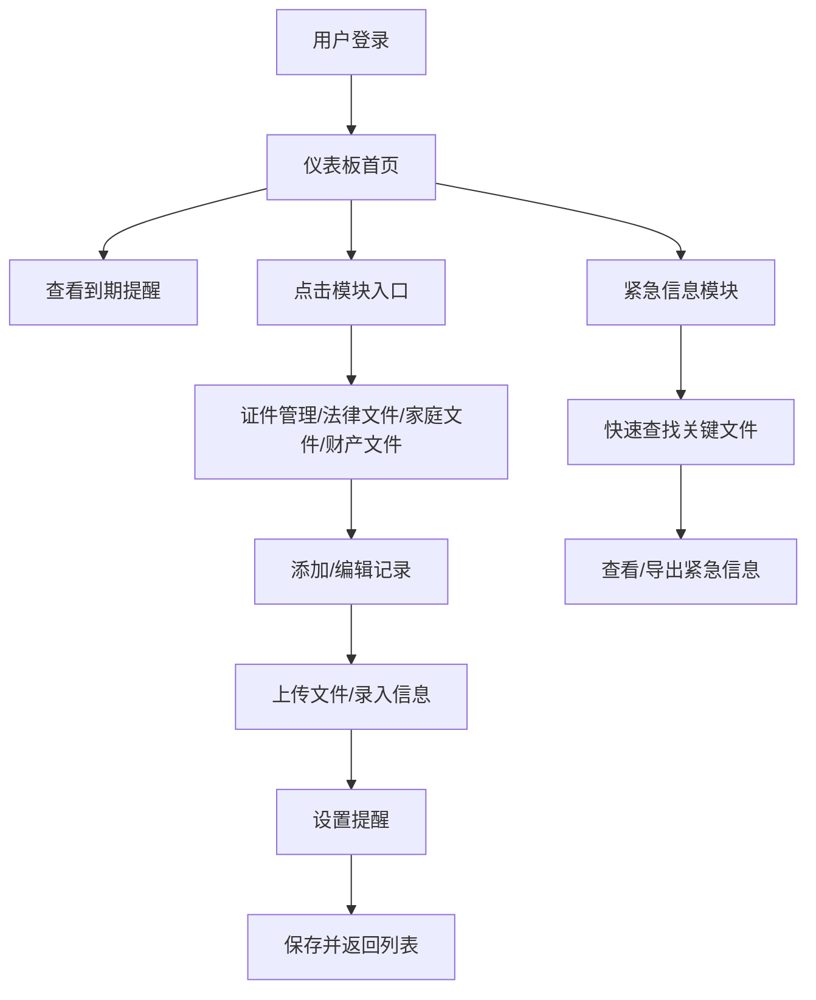

# 在线个人法律文件和重要证件管理工具 PRD

## 1. Product Overview
一个完整的在线个人和家庭法律文件、重要证件、财产信息的综合管理平台。
- 帮助用户数字化管理重要证件、法律文件、家庭档案和财产信息，确保信息安全、可访问、可追踪
- 解决纸质文件易丢失、证件有效期遗忘、家庭信息分散等痛点，提供紧急情况下的快速信息获取

## 2. Core Features

### 2.1 User Roles
| Role | Registration Method | Core Permissions |
|------|---------------------|------------------|
| Normal User | Email注册登录 | 管理所有模块数据，上传文件，设置提醒，查看紧急信息 |

### 2.2 Feature Module
1. **仪表板首页**: 即将到期提醒汇总，快速入口，数据统计
2. **证件管理模块**: 证件数字化存档，有效期追踪，信息结构化
3. **法律文件管理模块**: 合同归档，关键条款摘要，到期提醒
4. **家庭文件管理模块**: 家庭成员证件管理，家庭重要记录，遗嘱授权书
5. **财产文件模块**: 银行账户记录，投资档案，保险单整理
6. **紧急信息模块**: 紧急证件和文件快速查找

### 2.3 Page Details
| Page Name | Module Name | Feature description |
|-----------|-------------|---------------------|
| 仪表板首页 | 提醒汇总卡片 | 显示即将到期的证件和合同（7天内、30天内、90天内） |
| 仪表板首页 | 模块快速入口 | 6个功能模块的图标入口，显示各模块数据数量 |
| 仪表板首页 | 数据统计面板 | 证件总数、合同数量、家庭成员数等统计信息 |
| 证件管理 | 证件列表 | 按类型筛选（身份证/护照/驾照/社保卡/银行卡），搜索功能 |
| 证件管理 | 证件详情 | 照片展示（加密存储），结构化信息，有效期倒计时 |
| 证件管理 | 添加/编辑证件 | 上传照片，手动录入或OCR提取（可选）证件信息 |
| 证件管理 | 提醒设置 | 自定义提前提醒时间（默认护照半年，驾照年审） |
| 法律文件 | 文件列表 | 按类型筛选（房产/劳动/保险合同），状态筛选 |
| 法律文件 | 文件详情 | 扫描件预览，关键条款摘要，重点标注区域 |
| 法律文件 | 条款管理 | 合同期限、付款条件、违约条款的结构化记录 |
| 法律文件 | 提醒设置 | 续签提醒、保险到期提醒、关键节点提醒 |
| 家庭文件 | 家庭成员列表 | 每位成员的卡片视图，显示证件数量 |
| 家庭文件 | 成员详情 | 该成员的所有证件和相关文件 |
| 家庭文件 | 家庭记录 | 房产证、车辆登记证、学历证书管理 |
| 家庭文件 | 遗嘱授权书 | 专门的存档管理，支持版本记录 |
| 财产文件 | 银行账户 | 加密记录银行、账号、开户行（不存密码） |
| 财产文件 | 投资档案 | 股票、基金、理财产品信息管理 |
| 财产文件 | 保险单 | 保额、受益人、报案电话等关键信息 |
| 紧急信息 | 紧急包 | 预设紧急情况下需要的证件和文件列表 |
| 紧急信息 | 快速查找 | 一键搜索，按紧急程度分类展示 |
| 紧急信息 | 联系人 | 紧急联系人信息，一键拨打（可选） |
| 设置页面 | 账户设置 | 密码修改，安全设置 |
| 设置页面 | 提醒偏好 | 全局提醒设置，通知方式选择 |
| 设置页面 | 数据管理 | 数据导出，备份恢复（可选） |

## 3. Core Process
用户登录系统后，在仪表板查看即将到期的提醒，点击进入各模块管理详情，可添加、编辑、删除记录，设置自定义提醒。紧急情况下可在紧急信息模块快速查找关键文件。

## 4. User Interface Design

### 4.1 Design Style
- **主色调**: 深蓝系 (#1E3A5F) - 传达专业、可信赖的感觉
- **辅助色**: 金色 (#D4AF37) - 强调重要信息和提醒
- **成功色**: 翠绿 (#22C55E) - 表示有效期正常
- **警告色**: 橙色 (#F59E0B) - 即将到期
- **危险色**: 红色 (#EF4444) - 已过期
- **背景色**: 浅灰渐变 (#F8FAFC → #F1F5F9)
- **按钮风格**: 圆角矩形 (8px)，轻微阴影，hover状态轻微上浮
- **字体**: Playfair Display (标题) + Source Sans Pro (正文) - 专业优雅
- **布局风格**: 卡片式布局，顶部导航 + 侧边栏
- **图标**: Lucide图标库，线性风格，保持一致

### 4.2 Page Design Overview
| Page Name | Module Name | UI Elements |
|-----------|-------------|-------------|
| 仪表板首页 | 提醒汇总卡片 | 渐变背景卡片，倒计时数字，状态徽章，滑入动画 |
| 仪表板首页 | 模块快速入口 | 图标网格，悬停放大效果，数量徽章 |
| 证件管理 | 证件列表 | 过滤栏，卡片列表，搜索框，状态标签 |
| 证件管理 | 证件详情 | 左右分栏，左侧图片预览，右侧信息详情，到期进度条 |
| 法律文件 | 条款摘要 | 可折叠面板，高亮标签，重点内容背景色标注 |
| 家庭文件 | 成员列表 | 头像卡片，折叠展开动画，成员切换标签 |
| 财产文件 | 保险单详情 | 保险卡风格设计，保额大字展示，受益人信息卡片 |
| 紧急信息 | 紧急包 | 红色边框强调，一键导出按钮，紧急程度星级 |

### 4.3 Responsiveness
- Desktop-first设计
- 侧边栏在移动端折叠为汉堡菜单
- 卡片在平板端两列，移动端单列
- 图片预览在移动端改为全屏模式
- 触摸优化：按钮最小44x44px，增加点击区域

### 4.4 交互细节
- 页面加载：骨架屏 + 渐入动画
- 卡片悬停：轻微上浮 + 阴影加深
- 状态标签：脉冲动画（警告/危险状态）
- 表单提交：加载状态按钮 + 成功提示
- 删除操作：二次确认弹窗 + 撤销选项
