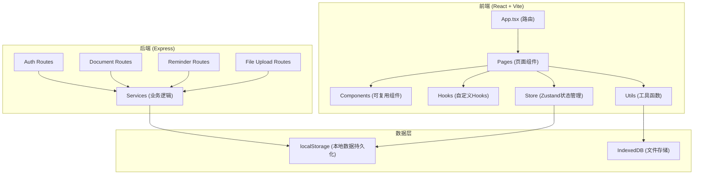

# 在线个人法律文件和重要证件管理工具 技术架构

## 1. Architecture Design



## 2. Technology Description

- **Frontend**: React@18 + TypeScript + tailwindcss@3 + vite
- **Initialization Tool**: vite-init
- **Backend**: Express@4 (可选，用于API演示)
- **Database**: localStorage + IndexedDB (本地存储，无需数据库服务器)
- **State Management**: zustand
- **Icons**: lucide-react
- **Router**: react-router-dom

## 3. Route Definitions

| Route | Purpose |
|-------|---------|
| / | 仪表板首页 |
| /documents | 证件管理列表 |
| /documents/add | 添加证件 |
| /documents/:id | 证件详情 |
| /legal | 法律文件列表 |
| /legal/add | 添加法律文件 |
| /legal/:id | 法律文件详情 |
| /family | 家庭文件列表 |
| /family/add | 添加家庭成员 |
| /family/:memberId | 家庭成员详情 |
| /property | 财产文件列表 |
| /property/bank/add | 添加银行账户 |
| /property/insurance/add | 添加保险单 |
| /emergency | 紧急信息页面 |
| /settings | 设置页面 |
| /login | 登录页面 |

## 4. API Definitions

### 4.1 TypeScript Types

```typescript
// 通用基础类型
interface BaseRecord {
  id: string;
  userId: string;
  createdAt: string;
  updatedAt: string;
}

// 证件类型
type DocumentType = 'id_card' | 'passport' | 'driver_license' | 'social_security' | 'bank_card' | 'other';

interface Document extends BaseRecord {
  type: DocumentType;
  number: string;
  name: string;
  issueDate: string;
  expiryDate: string;
  issuingAuthority: string;
  photoUrl?: string;
  notes?: string;
  reminderDays: number;
  memberId?: string;
}

// 法律文件类型
type LegalType = 'property_contract' | 'labor_contract' | 'insurance_contract' | 'other';

interface LegalDocument extends BaseRecord {
  type: LegalType;
  title: string;
  partyA: string;
  partyB: string;
  signDate: string;
  effectiveDate: string;
  expiryDate: string;
  contractAmount: string;
  keyClauses: KeyClause[];
  reminderDays: number;
  scanFileUrl?: string;
  notes?: string;
}

interface KeyClause {
  id: string;
  title: string;
  content: string;
  highlighted: boolean;
}

// 家庭成员类型
interface FamilyMember extends BaseRecord {
  name: string;
  relationship: string;
  birthDate: string;
  avatar?: string;
}

// 家庭记录类型
type FamilyRecordType = 'property_certificate' | 'vehicle_registration' | 'education_certificate' | 'will' | 'power_of_attorney' | 'other';

interface FamilyRecord extends BaseRecord {
  type: FamilyRecordType;
  title: string;
  memberId?: string;
  issueDate: string;
  expiryDate?: string;
  issuingAuthority: string;
  fileUrl?: string;
  notes?: string;
  reminderDays: number;
}

// 银行账户类型
interface BankAccount extends BaseRecord {
  bankName: string;
  accountNumber: string;
  branch: string;
  accountType: string;
  memberId?: string;
  notes?: string;
}

// 保险单类型
interface InsurancePolicy extends BaseRecord {
  insuranceCompany: string;
  policyNumber: string;
  policyType: string;
  coverageAmount: string;
  startDate: string;
  expiryDate: string;
  beneficiary: string;
  emergencyPhone: string;
  memberId?: string;
  notes?: string;
  reminderDays: number;
}

// 投资账户类型
interface InvestmentAccount extends BaseRecord {
  institution: string;
  accountNumber: string;
  accountType: string;
  memberId?: string;
  notes?: string;
}

// 紧急联系人类型
interface EmergencyContact extends BaseRecord {
  name: string;
  relationship: string;
  phone: string;
  address?: string;
  priority: number;
}

// 提醒类型
interface Reminder {
  id: string;
  relatedId: string;
  relatedType: 'document' | 'legal' | 'family_record' | 'insurance';
  title: string;
  expiryDate: string;
  daysRemaining: number;
  status: 'normal' | 'warning' | 'danger' | 'expired';
}

// 用户设置类型
interface UserSettings {
  defaultReminderDays: number;
  notifyOnWarning: boolean;
  notifyOnDanger: boolean;
}
```

### 4.2 Local Storage Keys

| Key | Description |
|-----|-------------|
| `legaldoc_user` | 当前登录用户 |
| `legaldoc_documents` | 证件列表 |
| `legaldoc_legal` | 法律文件列表 |
| `legaldoc_family_members` | 家庭成员列表 |
| `legaldoc_family_records` | 家庭记录列表 |
| `legaldoc_bank_accounts` | 银行账户列表 |
| `legaldoc_insurance` | 保险单列表 |
| `legaldoc_investments` | 投资账户列表 |
| `legaldoc_contacts` | 紧急联系人列表 |
| `legaldoc_settings` | 用户设置 |

## 5. Project Structure

```
project109/
├── src/
│   ├── components/          # 可复用组件
│   │   ├── Layout/         # 布局组件
│   │   ├── Card/           # 卡片组件
│   │   ├── Form/           # 表单组件
│   │   ├── Modal/          # 弹窗组件
│   │   └── common/         # 通用组件
│   ├── pages/              # 页面组件
│   │   ├── Dashboard/
│   │   ├── Documents/
│   │   ├── Legal/
│   │   ├── Family/
│   │   ├── Property/
│   │   ├── Emergency/
│   │   ├── Settings/
│   │   └── Login/
│   ├── hooks/              # 自定义Hooks
│   │   ├── useReminders.ts
│   │   ├── useStorage.ts
│   │   └── useLocalStorage.ts
│   ├── store/              # Zustand状态管理
│   │   ├── index.ts
│   │   ├── documentStore.ts
│   │   ├── legalStore.ts
│   │   └── settingsStore.ts
│   ├── utils/              # 工具函数
│   │   ├── dateUtils.ts
│   │   ├── cryptoUtils.ts
│   │   ├── reminderUtils.ts
│   │   └── storageUtils.ts
│   ├── types/              # TypeScript类型定义
│   │   └── index.ts
│   ├── App.tsx
│   ├── main.tsx
│   └── index.css
├── package.json
├── tsconfig.json
├── vite.config.ts
├── tailwind.config.js
└── postcss.config.js
```

## 6. 核心功能实现

### 6.1 加密存储
- 使用 Web Crypto API 对敏感字段进行加密存储
- 使用 AES-GCM 加密算法
- 主密钥由用户密码派生

### 6.2 提醒系统
- 计算到期剩余天数
- 根据剩余天数分类状态：
  - `normal`: > 90天
  - `warning`: 30-90天
  - `danger`: 0-30天
  - `expired`: < 0天

### 6.3 数据初始化
- 首次使用时自动创建示例数据
- 便于用户快速体验功能

## 7. 安全考虑

- 所有敏感数据在localStorage中加密存储
- 不存储密码明文
- 文件使用IndexedDB存储并加密
- 提供数据导出功能（加密格式）
