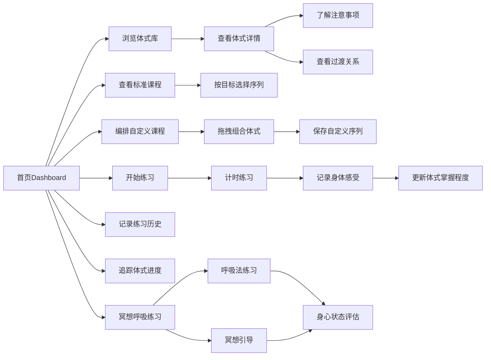

## 1. Product Overview

在线瑜伽课程和姿势学习追踪工具，为瑜伽爱好者提供系统化的体式学习、课程规划、练习追踪以及冥想呼吸指导。帮助用户建立规律的练习习惯，追踪进步，并根据个人目标推荐合适的瑜伽序列。

- **核心价值**：整合瑜伽体式库、课程编排、练习追踪、冥想引导于一体的综合瑜伽学习平台
- **目标用户**：瑜伽初学者到进阶练习者，希望系统化学习和追踪瑜伽练习的人群
- **主要功能**：体式库管理、课程规划与编排、练习进度追踪、冥想与呼吸练习

## 2. Core Features

### 2.1 User Roles

| Role | Registration Method | Core Permissions |
|------|---------------------|------------------|
| Normal User | 本地存储，无需注册 | 浏览体式库、创建/保存课程序列、记录练习、使用冥想呼吸功能 |

### 2.2 Feature Module

1. **体式库管理**：体式分类浏览、详情查看、搜索筛选
2. **课程规划**：标准序列查看、自定义序列编排、目标推荐
3. **练习追踪**：练习记录管理、体式进度跟踪、柔韧性自测
4. **冥想呼吸**：呼吸法练习、冥想引导、身心状态评估

### 2.3 Page Details

| Page Name | Module Name | Feature description |
|-----------|-------------|---------------------|
| 首页Dashboard | 概览模块 | 今日推荐、练习统计、快速开始按钮、进度概览 |
| 体式库页面 | 体式列表模块 | 分类筛选、搜索、体式卡片展示 |
| 体式详情页 | 体式详情模块 | 多维度信息展示、图片轮播、过渡关系 |
| 课程规划页 | 标准序列模块 | 内置序列列表、预览和启动练习 |
| 课程规划页 | 自定义序列模块 | 拖拽编排、保存/编辑/删除、时长计算 |
| 练习追踪页 | 练习历史模块 | 记录列表、数据统计、趋势图表 |
| 体式进度页 | 进度追踪模块 | 体式掌握程度自评、进度可视化 |
| 柔韧性自测页 | 自测记录模块 | 定期自测、历史对比、改善趋势 |
| 冥想呼吸页 | 呼吸法模块 | 多种呼吸法说明、计时器、步骤引导 |
| 冥想呼吸页 | 冥想模块 | 脚本收藏、计时播放、收藏管理 |
| 状态评估页 | 评估模块 | 练习后身心状态评估、历史趋势 |

## 3. Core Process

## 4. User Interface Design

### 4.1 Design Style

**设计风格：** 自然、宁静、有机的现代极简风
- 强调瑜伽的平静感和自然氛围
- 柔和的渐变背景，搭配自然元素

**配色方案：**
- **主色**：柔和的鼠尾草绿 `#7C9A8B`（代表自然和平静）
- **次色**：暖米色 `#F5EFE7`（温暖舒适的背景）
- **强调色**：柔和的陶土橙 `#E8A598`（温暖的点缀）
- **中性色**：深橄榄绿 `#3D4F47`、米白色 `#FAF7F3`

**字体选择：**
- 标题字体：`Cormorant Garamond` 或 `Playfair Display`（优雅、有艺术感的衬线字体）
- 正文字体：`Noto Sans SC` 或 `Inter`（清晰易读的无衬线字体）

**视觉元素：**
- 圆角卡片，柔和阴影
- 流畅的过渡动画
- 有机波浪形分割线
- 自然纹理背景（轻微噪点或渐变）

### 4.2 Page Design Overview

| Page Name | Module Name | UI Elements |
|-----------|-------------|-------------|
| Dashboard | 概览卡片 | 柔和渐变卡片、练习数据可视化、圆形进度条、平滑动画 |
| 体式库 | 列表/网格 | 双栏布局、分类侧边栏、搜索框、卡片悬停效果 |
| 体式详情 | 信息展示 | 图片轮播、标签展示、详情折叠面板、过渡关系网络图 |
| 课程规划 | 编排器 | 拖拽区域、体式列表、序列预览、时间轴展示 |
| 练习追踪 | 记录列表 | 时间轴布局、数据统计卡片、趋势图表、颜色编码的状态标签 |
| 冥想呼吸 | 计时器 | 圆形呼吸动画、进度环、柔和的呼吸视觉引导 |

### 4.3 Responsiveness

- **桌面端**：1200px+，完整的侧边栏和双栏布局
- **平板端**：768px-1199px，折叠式侧边栏，自适应卡片网格
- **移动端**：<768px，底部导航栏，单列布局，触摸友好的大按钮

### 4.4 3D Scene Guidance

该项目不包含3D场景，使用2D界面即可满足需求。
