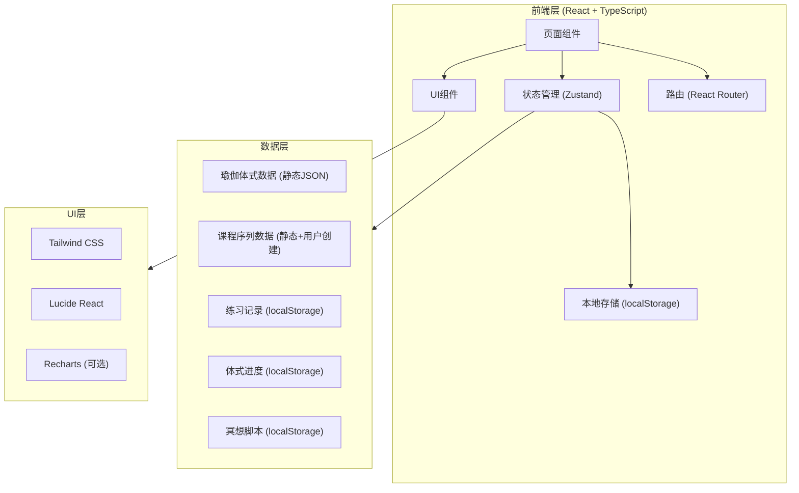

## 1. Architecture Design



## 2. Technology Description

- **前端框架**: React@18 + TypeScript
- **构建工具**: Vite
- **状态管理**: Zustand
- **路由**: React Router DOM@6
- **样式**: Tailwind CSS@3
- **图标**: Lucide React
- **拖拽**: @dnd-kit/core (或 react-beautiful-dnd)
- **数据可视化**: Recharts (可选，用于趋势图表)
- **后端**: 无，纯前端应用
- **数据库**: localStorage (本地存储)
- **初始化工具**: vite-init (react-ts模板)

## 3. Route Definitions

| Route | Page | Purpose |
|-------|------|---------|
| `/` | Dashboard | 首页概览，今日推荐，快速入口 |
| `/poses` | PosesLibrary | 体式库，浏览和筛选体式 |
| `/poses/:id` | PoseDetail | 体式详情页，查看具体体式信息 |
| `/sequences` | Sequences | 课程规划页，标准序列和自定义序列 |
| `/sequences/create` | SequenceEditor | 创建/编辑自定义序列 |
| `/sequences/:id` | SequencePlay | 序列练习播放页 |
| `/practice` | PracticeHistory | 练习历史记录 |
| `/practice/progress` | PoseProgress | 体式掌握进度追踪 |
| `/practice/flexibility` | FlexibilityTest | 柔韧性自测记录 |
| `/meditation` | Meditation | 冥想和呼吸练习主页 |
| `/meditation/breathing` | BreathingExercise | 呼吸法练习 |
| `/meditation/meditate` | Meditate | 冥想引导 |
| `/assessment` | Assessment | 练习后状态评估 |

## 4. Data Model

### 4.1 Data Model Definition

```mermaid
erDiagram
    YOGA_POSE {
        string id PK
        string nameSanskrit
        string nameChinese
        string category
        string difficulty
        string benefits
        string contraindications
        string[] images
        string[] precautions
        string[] transitionsFrom
        string[] transitionsTo
        number defaultDuration
    }
    
    YOGA_SEQUENCE {
        string id PK
        string name
        string description
        string type "standard/custom"
        string targetGoal
        number totalDuration
        array poses "PoseSequenceItem[]"
        boolean isBuiltIn
    }
    
    POSE_SEQUENCE_ITEM {
        string poseId FK
        string poseName
        number duration
        string notes
    }
    
    PRACTICE_RECORD {
        string id PK
        string date
        number duration
        string sequenceId FK
        string sequenceName
        string bodyFeelings
        string energyLevel
        array completedPoses
        string notes
    }
    
    POSE_PROGRESS {
        string poseId PK
        string masteryLevel
        number practiceCount
        string lastPracticed
        string notes
    }
    
    FLEXIBILITY_TEST {
        string id PK
        string date
        object measurements
        string overallRating
        string notes
    }
    
    BREATHING_TECHNIQUE {
        string id PK
        string name
        string sanskritName
        string description
        string steps
        number cyclesPerMinute
        string benefits
        string contraindications
    }
    
    MEDITATION_SCRIPT {
        string id PK
        string title
        string content
        number defaultDuration
        string category
        boolean isFavorite
    }
    
    WELLNESS_ASSESSMENT {
        string id PK
        string date
        string type "post-practice/daily"
        object ratings
        string notes
    }
```



### 4.2 Type Definitions

```typescript
// 瑜伽体式类型
type YogaPose = {
  id: string;
  nameSanskrit: string;
  nameChinese: string;
  category: 'standing' | 'seated' | 'supine' | 'prone' | 'inversion' | 'arm-balance' | 'backbend';
  difficulty: 'beginner' | 'intermediate' | 'advanced';
  benefits: string;
  contraindications: string;
  images: string[];
  precautions: string[];
  transitionsFrom: string[];
  transitionsTo: string[];
  defaultDuration: number;
};

// 课程序列类型
type YogaSequence = {
  id: string;
  name: string;
  description: string;
  type: 'standard' | 'custom';
  targetGoal: 'stress-relief' | 'strength' | 'flexibility' | 'relaxation' | 'energy';
  totalDuration: number;
  poses: PoseSequenceItem[];
  isBuiltIn: boolean;
  createdAt?: string;
  updatedAt?: string;
};

type PoseSequenceItem = {
  poseId: string;
  poseName: string;
  duration: number;
  notes?: string;
};

// 练习记录类型
type PracticeRecord = {
  id: string;
  date: string;
  duration: number;
  sequenceId?: string;
  sequenceName: string;
  bodyFeelings: string;
  energyLevel: 'low' | 'medium' | 'high';
  completedPoses: string[];
  notes?: string;
  createdAt: string;
};

// 体式进度类型
type MasteryLevel = 'first-contact' | 'learning' | 'practicing' | 'improving' | 'stable';

type PoseProgress = {
  poseId: string;
  masteryLevel: MasteryLevel;
  practiceCount: number;
  lastPracticed?: string;
  notes?: string;
};

// 柔韧性自测类型
type FlexibilityMeasurement = {
  hamstrings: number;
  shoulders: number;
  hips: number;
  spine: number;
  [key: string]: number;
};

type FlexibilityTest = {
  id: string;
  date: string;
  measurements: FlexibilityMeasurement;
  overallRating: 'poor' | 'fair' | 'good' | 'excellent';
  notes?: string;
};

// 呼吸法类型
type BreathingTechnique = {
  id: string;
  name: string;
  sanskritName: string;
  description: string;
  steps: string[];
  cyclesPerMinute: number;
  benefits: string;
  contraindications: string;
};

// 冥想脚本类型
type MeditationScript = {
  id: string;
  title: string;
  content: string;
  defaultDuration: number;
  category: 'breath-awareness' | 'body-scan' | 'loving-kindness' | 'mindfulness';
  isFavorite: boolean;
  isBuiltIn: boolean;
};

// 状态评估类型
type WellnessAssessment = {
  id: string;
  date: string;
  type: 'post-practice' | 'daily';
  ratings: {
    physical: number;
    mental: number;
    emotional: number;
    overall: number;
  };
  notes?: string;
};
```

## 5. Project Structure

```
project/
├── src/
│   ├── components/           # 可复用组件
│   │   ├── ui/              # 基础UI组件 (Card, Button, Modal等)
│   │   ├── PoseCard.tsx
│   │   ├── SequenceCard.tsx
│   │   ├── Timer.tsx
│   │   ├── ProgressCircle.tsx
│   │   └── Chart.tsx
│   ├── pages/               # 页面组件
│   │   ├── Dashboard.tsx
│   │   ├── PosesLibrary.tsx
│   │   ├── PoseDetail.tsx
│   │   ├── Sequences.tsx
│   │   ├── SequenceEditor.tsx
│   │   ├── SequencePlay.tsx
│   │   ├── PracticeHistory.tsx
│   │   ├── PoseProgress.tsx
│   │   ├── FlexibilityTest.tsx
│   │   ├── Meditation.tsx
│   │   ├── BreathingExercise.tsx
│   │   ├── Meditate.tsx
│   │   └── Assessment.tsx
│   ├── hooks/               # 自定义Hooks
│   │   ├── useTimer.ts
│   │   ├── useLocalStorage.ts
│   │   └── useStatistics.ts
│   ├── stores/              # Zustand状态管理
│   │   ├── poseStore.ts
│   │   ├── sequenceStore.ts
│   │   ├── practiceStore.ts
│   │   └── meditationStore.ts
│   ├── data/                # 静态数据
│   │   ├── poses.json      # 预设体式数据
│   │   ├── sequences.json  # 预设序列
│   │   ├── breathingTechniques.json
│   │   └── meditationScripts.json
│   ├── utils/               # 工具函数
│   │   ├── time.ts
│   │   ├── storage.ts
│   │   └── statistics.ts
│   ├── types/               # TypeScript类型定义
│   │   └── index.ts
│   ├── App.tsx
│   ├── main.tsx
│   └── index.css
├── public/
├── package.json
├── tsconfig.json
├── vite.config.ts
├── tailwind.config.js
└── postcss.config.js
```

## 6. Core State Management

### 6.1 Pose Store (体式库状态)

```typescript
interface PoseState {
  poses: YogaPose[];
  selectedCategory: string | null;
  selectedDifficulty: string | null;
  searchQuery: string;
  
  // actions
  filterByCategory: (category: string | null) => void;
  filterByDifficulty: (difficulty: string | null) => void;
  searchPoses: (query: string) => void;
  getPoseById: (id: string) => YogaPose | undefined;
}
```

### 6.2 Sequence Store (序列状态)

```typescript
interface SequenceState {
  sequences: YogaSequence[];
  currentSequence: YogaSequence | null;
  isEditing: boolean;
  
  // actions
  loadSequences: () => void;
  saveSequence: (sequence: YogaSequence) => void;
  deleteSequence: (id: string) => void;
  updateSequence: (sequence: YogaSequence) => void;
  getBuiltInSequences: () => YogaSequence[];
  getCustomSequences: () => YogaSequence[];
}
```

### 6.3 Practice Store (练习状态)

```typescript
interface PracticeState {
  records: PracticeRecord[];
  poseProgress: Record<string, PoseProgress>;
  flexibilityTests: FlexibilityTest[];
  assessments: WellnessAssessment[];
  
  // actions
  addRecord: (record: PracticeRecord) => void;
  updatePoseProgress: (poseId: string, progress: Partial<PoseProgress>) => void;
  addFlexibilityTest: (test: FlexibilityTest) => void;
  addAssessment: (assessment: WellnessAssessment) => void;
  getStatistics: () => PracticeStatistics;
}
```

### 6.4 Meditation Store (冥想状态)

```typescript
interface MeditationState {
  breathingTechniques: BreathingTechnique[];
  meditationScripts: MeditationScript[];
  
  // actions
  toggleFavorite: (scriptId: string) => void;
  addCustomScript: (script: Omit<MeditationScript, 'id' | 'isBuiltIn'>) => void;
  deleteCustomScript: (id: string) => void;
}
```

## 7. Storage Strategy

使用 localStorage 进行本地数据持久化：

- **key: yoga_poses** - 体式数据（只读，预设数据）
- **key: yoga_sequences** - 序列数据（内置+用户创建）
- **key: practice_records** - 练习历史记录
- **key: pose_progress** - 体式掌握进度
- **key: flexibility_tests** - 柔韧性测试记录
- **key: meditation_scripts** - 冥想脚本（包含收藏状态）
- **key: wellness_assessments** - 身心健康评估记录
- **key: app_settings** - 用户设置

数据初始化策略：
1. 应用启动时检查 localStorage 是否有数据
2. 如果没有，加载预设的静态数据
3. 用户操作后自动同步到 localStorage
