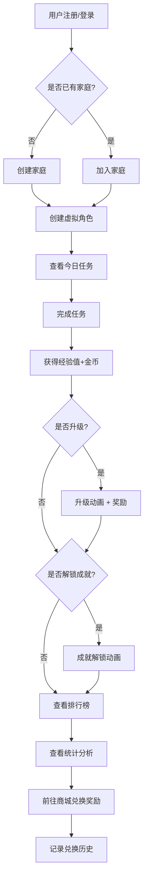

# 游戏化家务分配和奖励系统 PRD

## 1. Product Overview

游戏化家务管理系统，将家庭日常家务转化为有趣的游戏任务，通过经验值、金币、成就徽章等游戏化机制激励家庭成员参与家务劳动，提升家庭协作效率。

- 解决家庭家务分配不均、家庭成员积极性低的问题
- 目标用户：家庭主妇/主夫、有孩子的家庭、合租室友
- 产品价值：让家务变得有趣，培养责任意识，增强家庭凝聚力

## 2. Core Features

### 2.1 User Roles

| Role | Registration Method | Core Permissions |
|------|---------------------|------------------|
| 家庭管理员 | 邮箱注册 | 创建家庭、邀请成员、管理任务、查看统计 |
| 普通家庭成员 | 邀请链接加入 | 完成任务、兑换奖励、查看排行榜和成就 |

### 2.2 Feature Module

1. **仪表盘 (Dashboard)**：家庭总览、今日任务、快速完成、统计卡片
2. **任务中心 (Tasks)**：日常/周常/月常任务、限时任务、任务详情、完成提交
3. **角色中心 (Characters)**：虚拟角色创建、头像选择、等级进度、升级动画
4. **商城 (Shop)**：积分商品、兑换记录、奖励余额
5. **排行榜 (Leaderboard)**：周/月贡献排行、家庭成员对比
6. **成就系统 (Achievements)**：成就徽章、解锁进度、团队挑战
7. **统计分析 (Statistics)**：贡献对比图、消费记录、趋势分析

### 2.3 Page Details

| Page Name | Module Name | Feature description |
|-----------|-------------|---------------------|
| 仪表盘 | 家庭总览卡片 | 显示家庭总积分、本周完成任务数、家庭等级进度 |
| 仪表盘 | 今日任务区 | 快速查看和标记完成今日待办家务 |
| 仪表盘 | 快捷操作区 | 快速添加任务、创建成员、发起挑战 |
| 任务中心 | 任务筛选标签 | 按类型（日常/周常/月常/限时）筛选任务 |
| 任务中心 | 任务卡片列表 | 显示任务名称、难度、奖励、截止时间、完成状态 |
| 任务中心 | 任务详情模态框 | 任务说明、奖励详情、完成按钮、跳过/转交按钮 |
| 角色中心 | 角色创建向导 | 选择头像、输入角色名、选择初始职业/称号 |
| 角色中心 | 等级进度条 | 显示当前等级、经验值进度、下一等级奖励预览 |
| 角色中心 | 角色展示区 | 3D/2D角色展示、装备展示、属性面板 |
| 商城 | 商品展示 | 屏幕时间、零花钱、特权等商品，显示兑换价格 |
| 商城 | 兑换确认 | 显示扣除积分、获得奖励、确认弹窗 |
| 商城 | 历史记录 | 按时间排序的兑换历史，可筛选 |
| 排行榜 | 周/月切换 | 切换查看周榜和月榜排名 |
| 排行榜 | 排行列表 | 显示头像、角色名、积分、完成任务数、排名变化 |
| 排行榜 | 我的排名卡片 | 突出显示当前用户的排名和数据 |
| 成就系统 | 成就徽章墙 | 已解锁/未解锁成就展示，hover显示详情 |
| 成就系统 | 解锁动画 | 新成就解锁时的庆祝动画 |
| 成就系统 | 团队挑战进度 | 家庭总目标进度条、达成奖励预览 |
| 统计分析 | 贡献对比图 | 柱状图/饼图展示各成员家务贡献占比 |
| 统计分析 | 消费记录折线图 | 展示奖励消费趋势和余额变化 |
| 统计分析 | 任务完成趋势 | 周/月任务完成趋势图 |

## 3. Core Process

### 3.1 用户注册与家庭创建流程
1. 管理员注册并创建家庭
2. 管理员邀请家庭成员
3. 家庭成员通过链接加入家庭
4. 每个成员创建自己的虚拟角色

### 3.2 任务完成流程
1. 系统分配日常/周常/月常任务
2. 成员领取或被分配任务
3. 完成任务后提交确认
4. 管理员或系统自动审核
5. 获得经验值和金币奖励
6. 触发升级或成就解锁

### 3.3 奖励兑换流程
1. 成员查看商城商品
2. 选择要兑换的奖励
3. 确认兑换（扣除积分）
4. 管理员发放实际奖励
5. 记录兑换历史

### 3.4 Mermaid Flowchart

## 4. User Interface Design

### 4.1 Design Style

#### 色彩系统
- **主色调**：温暖的橙黄色系 (#FF9F1C) - 代表活力、温暖、家庭
- **次要色**：清新的蓝绿色系 (#2EC4B6) - 代表平衡、平静、奖励
- **背景色**：温暖的奶油白 (#FFF9F0) - 营造温馨的家庭氛围
- **中性色**：深灰蓝 (#1A535C) - 用于文字和边框
- **强调色**：柔和的珊瑚粉 (#FF6B6B) - 用于警告和重要提醒

#### 字体选择
- **标题字体**：Fredoka One - 圆润可爱，适合游戏化界面
- **正文字体**：Quicksand - 清晰易读，现代感强

#### 视觉风格
- **整体风格**：温馨可爱的游戏化风格，带有轻微的3D卡通感
- **按钮**：圆角大按钮，带有阴影和hover微动画效果
- **卡片**：白色背景，圆角16px，柔和阴影，悬停时有轻微上浮效果
- **图标**：使用 Lucide icons，统一大小和颜色
- **动画**：流畅的过渡动画，升级和成就解锁有庆祝效果（彩带、闪烁）

### 4.2 Page Design Overview

| Page Name | Module Name | UI Elements |
|-----------|-------------|-------------|
| 仪表盘 | 顶部导航栏 | 品牌logo、家庭名称、当前角色头像和金币、设置 |
| 仪表盘 | 统计卡片区域 | 四张卡片：本周完成数、总积分、今日待办、团队挑战进度 |
| 仪表盘 | 快速操作栏 | 四个圆形按钮：添加任务、创建成员、发起挑战、兑换奖励 |
| 仪表盘 | 今日任务列表 | 卡片式列表，可快速勾选完成，显示任务名称和奖励 |
| 仪表盘 | 团队进度条 | 家庭总目标进度条，显示当前进度和里程碑 |
| 任务中心 | 筛选标签栏 | 四个标签：日常任务、周常任务、月常任务、限时任务 |
| 任务中心 | 难度筛选器 | 下拉选择：全部、简单、中等、困难 |
| 任务中心 | 任务卡片网格 | 每个卡片包含：图标、名称、难度徽章、经验值、金币、截止时间 |
| 任务中心 | 任务状态指示器 | 未开始/进行中/已完成的不同视觉状态 |
| 角色中心 | 角色创建向导 | 三步式：选择头像、输入角色名、选择初始称号 |
| 角色中心 | 角色展示区 | 大尺寸头像/角色图，角色名+等级徽章 |
| 角色中心 | 经验进度条 | 动画进度条，显示当前经验/下一等级所需经验 |
| 角色中心 | 属性面板 | 力量(难度任务)、敏捷(限时任务)、耐力(连续任务)、智慧(团队任务) |
| 角色中心 | 装备/称号区 | 当前装备的称号和装饰，可选替换 |
| 商城 | 分类标签 | 屏幕时间、零花钱、特权、其他 |
| 商城 | 商品卡片 | 商品图标、名称、价格金币、兑换按钮 |
| 商城 | 余额显示 | 顶部右侧醒目显示当前金币余额 |
| 商城 | 兑换记录 | 折叠面板，显示历史兑换记录 |
| 排行榜 | 周期切换 | 周榜/月榜切换按钮 |
| 排行榜 | 前三名展示区 | 大号卡片，带有金/银/铜色装饰和王冠图标 |
| 排行榜 | 排行榜列表 | 带有排名数字、头像、角色名、积分、完成任务数、排名变化箭头 |
| 排行榜 | 我的排名卡片 | 高亮背景，显示在列表顶部或底部 |
| 成就系统 | 分类标签 | 个人成就、团队成就、隐藏成就 |
| 成就系统 | 成就徽章墙 | 网格布局，已解锁(彩色)/未解锁(灰色)，hover显示详情 |
| 成就系统 | 成就详情弹窗 | 成就名称、描述、解锁条件、奖励、解锁时间 |
| 成就系统 | 团队挑战进度 | 大进度条，分阶段显示里程碑和对应奖励 |
| 统计分析 | 时间范围选择器 | 本周/本月/自定义范围 |
| 统计分析 | 贡献对比饼图 | 各成员家务贡献占比，可点击查看详情 |
| 统计分析 | 任务完成趋势图 | 折线图，展示最近几周任务完成趋势 |
| 统计分析 | 消费记录表格 | 时间、成员、商品名称、花费金币、状态 |

### 4.3 Responsiveness

- **设计策略**：桌面端优先，移动端自适应
- **断点设置**：
  - 大屏 (≥1200px)：四列布局
  - 中屏 (768-1199px)：两列布局
  - 小屏 (<768px)：单列布局，底部导航栏
- **移动端优化**：
  - 任务卡片适配垂直滚动
  - 图表使用可滑动的迷你版本
  - 底部导航替换顶部导航
  - 大按钮便于触摸操作

### 4.4 Micro-interactions

- **任务完成**：卡片收缩+勾号动画+金币飞出效果
- **升级**：全屏彩带+角色闪光+数字跳动+庆祝音效（视觉）
- **成就解锁**：徽章从中心放大+光晕效果+慢动作展示
- **排名上升**：向上滑动动画+绿色箭头闪烁
- **兑换确认**：金币从余额飞出到商品+成功消息弹窗
- **导航切换**：当前页面标签下划线滑动过渡
