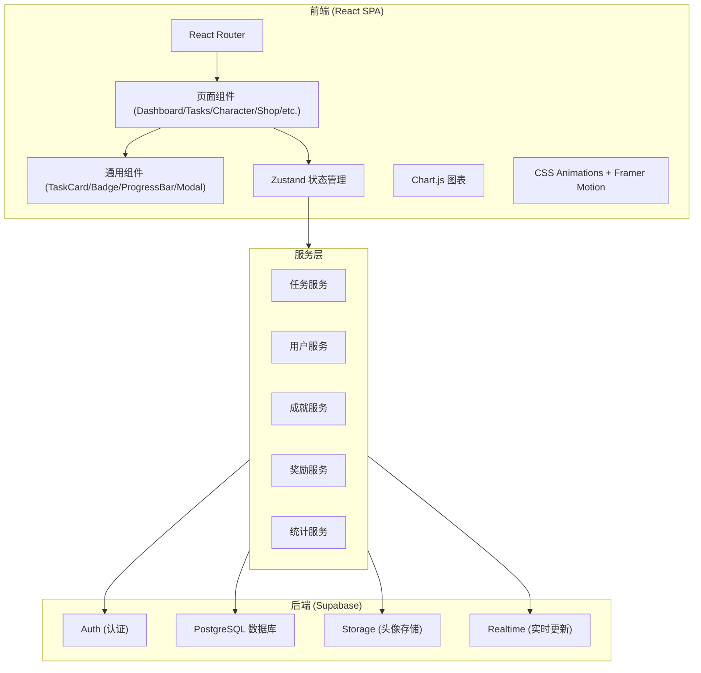

# 游戏化家务分配和奖励系统 技术架构文档

## 1. Architecture Design



## 2. Technology Description

- **前端框架**: React@18 + TypeScript
- **构建工具**: Vite
- **样式方案**: Tailwind CSS@3
- **状态管理**: Zustand
- **路由管理**: React Router DOM
- **图表库**: Chart.js + react-chartjs-2
- **图标库**: Lucide React
- **动画库**: CSS Animations (轻量级)
- **后端服务**: Supabase (Auth + PostgreSQL + Storage + Realtime)
- **项目初始化**: vite-init

## 3. Route Definitions

| Route | Purpose |
|-------|---------|
| `/` | 登录/注册页 |
| `/dashboard` | 仪表盘首页 |
| `/tasks` | 任务中心页 |
| `/character` | 角色中心页 |
| `/shop` | 积分商城页 |
| `/leaderboard` | 排行榜页 |
| `/achievements` | 成就系统页 |
| `/statistics` | 统计分析页 |

## 4. Data Model

### 4.1 Data Model Definition

```mermaid
erDiagram
    users {
        uuid id PK
        varchar email
        varchar role_name
        varchar avatar_url
        int level
        int exp_points
        int coins
        boolean is_admin
        uuid family_id FK
        timestamp created_at
    }
    
    families {
        uuid id PK
        varchar name
        int total_coins
        int level
        timestamp created_at
    }
    
    tasks {
        uuid id PK
        varchar name
        text description
        varchar type "daily/weekly/monthly/timed"
        varchar difficulty "easy/medium/hard"
        int exp_reward
        int coin_reward
        timestamp deadline
        uuid assigned_to FK
        uuid family_id FK
        varchar status "pending/in_progress/completed"
        timestamp created_at
        timestamp completed_at
    }
    
    shop_items {
        uuid id PK
        varchar name
        text description
        varchar category "screen_time/pocket_money/privilege/other"
        int price_coins
        varchar icon
        boolean is_active
        uuid family_id FK
    }
    
    rewards_history {
        uuid id PK
        uuid user_id FK
        uuid item_id FK
        int coins_spent
        varchar status "pending/completed"
        timestamp redeemed_at
    }
    
    achievements {
        uuid id PK
        varchar name
        text description
        varchar icon
        varchar category "individual/team/hidden"
        text condition
        int coin_reward
        int exp_reward
    }
    
    user_achievements {
        uuid id PK
        uuid user_id FK
        uuid achievement_id FK
        timestamp unlocked_at
    }
    
    team_challenges {
        uuid id PK
        varchar name
        text description
        int target_coins
        int current_coins
        varchar reward
        timestamp deadline
        uuid family_id FK
        boolean is_active
    }
```



### 4.2 Data Definition Language

```sql
-- Families table
CREATE TABLE families (
    id UUID PRIMARY KEY DEFAULT gen_random_uuid(),
    name VARCHAR(100) NOT NULL,
    total_coins INT DEFAULT 0,
    level INT DEFAULT 1,
    created_at TIMESTAMP DEFAULT NOW()
);

-- Users table (uses Supabase auth)
CREATE TABLE users (
    id UUID PRIMARY KEY REFERENCES auth.users(id),
    email VARCHAR(255),
    role_name VARCHAR(50) NOT NULL,
    avatar_url VARCHAR(500),
    level INT DEFAULT 1,
    exp_points INT DEFAULT 0,
    coins INT DEFAULT 0,
    is_admin BOOLEAN DEFAULT FALSE,
    family_id UUID REFERENCES families(id),
    created_at TIMESTAMP DEFAULT NOW()
);

-- Tasks table
CREATE TABLE tasks (
    id UUID PRIMARY KEY DEFAULT gen_random_uuid(),
    name VARCHAR(100) NOT NULL,
    description TEXT,
    type VARCHAR(20) NOT NULL CHECK (type IN ('daily', 'weekly', 'monthly', 'timed')),
    difficulty VARCHAR(20) NOT NULL CHECK (difficulty IN ('easy', 'medium', 'hard')),
    exp_reward INT NOT NULL DEFAULT 10,
    coin_reward INT NOT NULL DEFAULT 5,
    deadline TIMESTAMP,
    assigned_to UUID REFERENCES users(id),
    family_id UUID REFERENCES families(id),
    status VARCHAR(20) NOT NULL DEFAULT 'pending' CHECK (status IN ('pending', 'in_progress', 'completed')),
    created_at TIMESTAMP DEFAULT NOW(),
    completed_at TIMESTAMP
);

-- Shop items table
CREATE TABLE shop_items (
    id UUID PRIMARY KEY DEFAULT gen_random_uuid(),
    name VARCHAR(100) NOT NULL,
    description TEXT,
    category VARCHAR(50) NOT NULL CHECK (category IN ('screen_time', 'pocket_money', 'privilege', 'other')),
    price_coins INT NOT NULL,
    icon VARCHAR(50),
    is_active BOOLEAN DEFAULT TRUE,
    family_id UUID REFERENCES families(id)
);

-- Rewards history table
CREATE TABLE rewards_history (
    id UUID PRIMARY KEY DEFAULT gen_random_uuid(),
    user_id UUID REFERENCES users(id),
    item_id UUID REFERENCES shop_items(id),
    coins_spent INT NOT NULL,
    status VARCHAR(20) DEFAULT 'pending' CHECK (status IN ('pending', 'completed')),
    redeemed_at TIMESTAMP DEFAULT NOW()
);

-- Achievements table
CREATE TABLE achievements (
    id UUID PRIMARY KEY DEFAULT gen_random_uuid(),
    name VARCHAR(100) NOT NULL,
    description TEXT,
    icon VARCHAR(50),
    category VARCHAR(20) NOT NULL CHECK (category IN ('individual', 'team', 'hidden')),
    condition TEXT NOT NULL,
    coin_reward INT DEFAULT 0,
    exp_reward INT DEFAULT 0
);

-- User achievements junction table
CREATE TABLE user_achievements (
    id UUID PRIMARY KEY DEFAULT gen_random_uuid(),
    user_id UUID REFERENCES users(id),
    achievement_id UUID REFERENCES achievements(id),
    unlocked_at TIMESTAMP DEFAULT NOW(),
    UNIQUE(user_id, achievement_id)
);

-- Team challenges table
CREATE TABLE team_challenges (
    id UUID PRIMARY KEY DEFAULT gen_random_uuid(),
    name VARCHAR(100) NOT NULL,
    description TEXT,
    target_coins INT NOT NULL,
    current_coins INT DEFAULT 0,
    reward TEXT,
    deadline TIMESTAMP,
    family_id UUID REFERENCES families(id),
    is_active BOOLEAN DEFAULT TRUE
);

-- Create indexes for performance
CREATE INDEX idx_tasks_family_id ON tasks(family_id);
CREATE INDEX idx_tasks_assigned_to ON tasks(assigned_to);
CREATE INDEX idx_tasks_status ON tasks(status);
CREATE INDEX idx_users_family_id ON users(family_id);
CREATE INDEX idx_rewards_user_id ON rewards_history(user_id);
CREATE INDEX idx_shop_items_family_id ON shop_items(family_id);

-- Enable Row Level Security
ALTER TABLE families ENABLE ROW LEVEL SECURITY;
ALTER TABLE users ENABLE ROW LEVEL SECURITY;
ALTER TABLE tasks ENABLE ROW LEVEL SECURITY;
ALTER TABLE shop_items ENABLE ROW LEVEL SECURITY;
ALTER TABLE rewards_history ENABLE ROW LEVEL SECURITY;
ALTER TABLE achievements ENABLE ROW LEVEL SECURITY;
ALTER TABLE user_achievements ENABLE ROW LEVEL SECURITY;
ALTER TABLE team_challenges ENABLE ROW LEVEL SECURITY;

-- Policies
CREATE POLICY "Family members can view their family" ON families
    FOR SELECT USING (true);

CREATE POLICY "Users can view family members" ON users
    FOR SELECT USING (true);

CREATE POLICY "Users can update their own profile" ON users
    FOR UPDATE USING (auth.uid() = id);

CREATE POLICY "Users can view family tasks" ON tasks
    FOR SELECT USING (true);

CREATE POLICY "Users can insert tasks" ON tasks
    FOR INSERT WITH CHECK (true);

CREATE POLICY "Users can update their assigned tasks" ON tasks
    FOR UPDATE USING (assigned_to = auth.uid() OR EXISTS (
        SELECT 1 FROM users WHERE users.id = auth.uid() AND users.is_admin = true
    ));

CREATE POLICY "Users can view shop items" ON shop_items
    FOR SELECT USING (true);

CREATE POLICY "Users can view their reward history" ON rewards_history
    FOR SELECT USING (user_id = auth.uid() OR EXISTS (
        SELECT 1 FROM users WHERE users.id = auth.uid() AND users.is_admin = true
    ));

CREATE POLICY "Users can insert reward history" ON rewards_history
    FOR INSERT WITH CHECK (user_id = auth.uid());

CREATE POLICY "Everyone can view achievements" ON achievements
    FOR SELECT USING (true);

CREATE POLICY "Users can view their unlocked achievements" ON user_achievements
    FOR SELECT USING (user_id = auth.uid());

CREATE POLICY "Users can view team challenges" ON team_challenges
    FOR SELECT USING (true);

-- Grant permissions
GRANT SELECT ON families TO authenticated;
GRANT SELECT, INSERT, UPDATE ON users TO authenticated;
GRANT SELECT, INSERT, UPDATE ON tasks TO authenticated;
GRANT SELECT ON shop_items TO authenticated;
GRANT SELECT, INSERT ON rewards_history TO authenticated;
GRANT SELECT ON achievements TO authenticated;
GRANT SELECT, INSERT ON user_achievements TO authenticated;
GRANT SELECT ON team_challenges TO authenticated;
```

### 4.3 Initial Data

```sql
-- Default achievements
INSERT INTO achievements (name, description, icon, category, condition, coin_reward, exp_reward) VALUES
('第一次洗碗', '完成第一次洗碗任务', 'Sparkles', 'individual', '{"taskType":"dishes","count":1}', 50, 100),
('连续7天洗碗', '连续7天完成洗碗任务', 'Flame', 'individual', '{"taskType":"dishes","consecutiveDays":7}', 200, 500),
('第一次做饭', '完成第一次做饭任务', 'ChefHat', 'individual', '{"taskType":"cooking","count":1}', 50, 100),
('家务达人', '累计完成50个任务', 'Trophy', 'individual', '{"totalTasks":50}', 500, 1000),
('早起鸟', '在早上8点前完成任务', 'Sunrise', 'individual', '{"timeBefore":"08:00"}', 30, 50),
('完美周', '一周内完成所有分配的任务', 'CheckCircle2', 'individual', '{"weeklyCompletion":100}', 300, 600),
('家庭和睦', '家庭总积分达到10000', 'Heart', 'team', '{"familyTotal":10000}', 0, 0),
('勤俭持家', '家庭月消费低于500金币', 'PiggyBank', 'team', '{"monthlySpend":500}', 0, 0);

-- Default shop items templates
INSERT INTO shop_items (name, description, category, price_coins, icon, is_active) VALUES
('30分钟屏幕时间', '获得30分钟的电子产品使用时间', 'screen_time', 50, 'Monitor', true),
('1小时屏幕时间', '获得1小时的电子产品使用时间', 'screen_time', 90, 'MonitorPlay', true),
('10元零花钱', '获得10元现金奖励', 'pocket_money', 100, 'Coins', true),
('50元零花钱', '获得50元现金奖励', 'pocket_money', 450, 'Wallet', true),
('免做一次家务', '可以免做一次分配的家务', 'privilege', 200, 'Shield', true),
('选择晚餐菜单', '可以决定今天晚餐吃什么', 'privilege', 80, 'UtensilsCrossed', true),
('周末电影夜', '全家一起看电影，由你来选', 'privilege', 300, 'Film', true);

-- Default task templates
INSERT INTO tasks (name, description, type, difficulty, exp_reward, coin_reward) VALUES
('洗碗', '清洗晚餐后的所有餐具', 'daily', 'easy', 10, 5),
('扫地', '清扫客厅和卧室的地面', 'daily', 'easy', 15, 8),
('拖地', '用拖把清洁地面', 'daily', 'medium', 25, 15),
('倒垃圾', '将垃圾桶中的垃圾倒出并换上新袋子', 'daily', 'easy', 5, 3),
('整理房间', '整理自己的房间，保持整洁', 'daily', 'easy', 20, 10),
('做饭', '准备一顿饭（午餐或晚餐）', 'daily', 'hard', 50, 30),
('洗衣服', '将脏衣服放入洗衣机并晾晒', 'weekly', 'medium', 30, 20),
('擦窗户', '清洁家里的窗户', 'weekly', 'hard', 60, 40),
('大扫除', '进行一次全面的家庭清洁', 'monthly', 'hard', 150, 100),
('整理衣柜', '整理并分类衣柜中的衣物', 'monthly', 'medium', 80, 50);
```

## 5. Project Structure

```
project111/
├── src/
│   ├── components/          # 通用组件
│   │   ├── Layout/
│   │   │   ├── Header.tsx
│   │   │   ├── Sidebar.tsx
│   │   │   └── MobileNav.tsx
│   │   ├── TaskCard.tsx
│   │   ├── ProgressBar.tsx
│   │   ├── Badge.tsx
│   │   ├── Modal.tsx
│   │   ├── StatCard.tsx
│   │   ├── Avatar.tsx
│   │   ├── AchievementBadge.tsx
│   │   └── ShopItemCard.tsx
│   ├── pages/               # 页面组件
│   │   ├── Login.tsx
│   │   ├── Dashboard.tsx
│   │   ├── Tasks.tsx
│   │   ├── Character.tsx
│   │   ├── Shop.tsx
│   │   ├── Leaderboard.tsx
│   │   ├── Achievements.tsx
│   │   └── Statistics.tsx
│   ├── stores/              # Zustand stores
│   │   ├── useUserStore.ts
│   │   ├── useTaskStore.ts
│   │   ├── useShopStore.ts
│   │   └── useAchievementStore.ts
│   ├── hooks/               # Custom hooks
│   │   ├── useSupabase.ts
│   │   ├── useTasks.ts
│   │   └── useAchievements.ts
│   ├── utils/               # 工具函数
│   │   ├── expCalculator.ts
│   │   ├── dateUtils.ts
│   │   └── achievementChecker.ts
│   ├── types/               # TypeScript types
│   │   └── index.ts
│   ├── App.tsx
│   ├── main.tsx
│   └── index.css
├── supabase/                # Supabase 配置
│   └── config.ts
├── package.json
├── vite.config.ts
├── tailwind.config.js
├── tsconfig.json
└── postcss.config.js
```

## 6. Key Technical Decisions

### 6.1 升级经验值计算
```typescript
// 等级所需经验值计算公式
export const getExpForLevel = (level: number): number => {
    return Math.floor(100 * Math.pow(1.5, level - 1));
};

// 计算当前等级
export const calculateLevel = (totalExp: number): { level: number; currentExp: number; nextLevelExp: number } => {
    let level = 1;
    let remaining = totalExp;
    
    while (remaining >= getExpForLevel(level)) {
        remaining -= getExpForLevel(level);
        level++;
    }
    
    return {
        level,
        currentExp: remaining,
        nextLevelExp: getExpForLevel(level)
    };
};
```

### 6.2 任务奖励计算
```typescript
// 根据难度计算奖励倍数
export const getDifficultyMultiplier = (difficulty: 'easy' | 'medium' | 'hard'): number => {
    const multipliers = {
        easy: 1,
        medium: 2,
        hard: 3
    };
    return multipliers[difficulty];
};

// 基础奖励配置
export const BASE_REWARDS = {
    daily: { exp: 10, coins: 5 },
    weekly: { exp: 30, coins: 20 },
    monthly: { exp: 100, coins: 70 },
    timed: { exp: 20, coins: 12 }
};
```

### 6.3 成就检查机制
- 任务完成后触发成就检查
- 使用条件配置系统，灵活定义成就解锁条件
- 支持个人成就和团队成就两种类型

### 6.4 实时更新
- 使用 Supabase Realtime 订阅任务和用户数据变化
- 排行榜和统计数据实时刷新
- 成就解锁即时通知

## 7. State Management (Zustand)

```typescript
// useUserStore - 用户状态
interface UserState {
    user: User | null;
    family: Family | null;
    familyMembers: User[];
    setUser: (user: User) => void;
    updateCoins: (amount: number) => void;
    updateExp: (amount: number) => void;
    checkLevelUp: () => boolean;
}

// useTaskStore - 任务状态
interface TaskState {
    tasks: Task[];
    loading: boolean;
    fetchTasks: (filters?: TaskFilters) => Promise<void>;
    completeTask: (taskId: string) => Promise<void>;
    assignTask: (taskId: string, userId: string) => Promise<void>;
}

// useShopStore - 商城状态
interface ShopState {
    items: ShopItem[];
    history: RewardHistory[];
    fetchItems: () => Promise<void>;
    fetchHistory: () => Promise<void>;
    redeemItem: (itemId: string) => Promise<boolean>;
}

// useAchievementStore - 成就状态
interface AchievementState {
    allAchievements: Achievement[];
    unlockedAchievements: UserAchievement[];
    teamChallenge: TeamChallenge | null;
    fetchAchievements: () => Promise<void>;
    checkAndUnlock: (trigger: AchievementTrigger) => Promise<void>;
}
```
