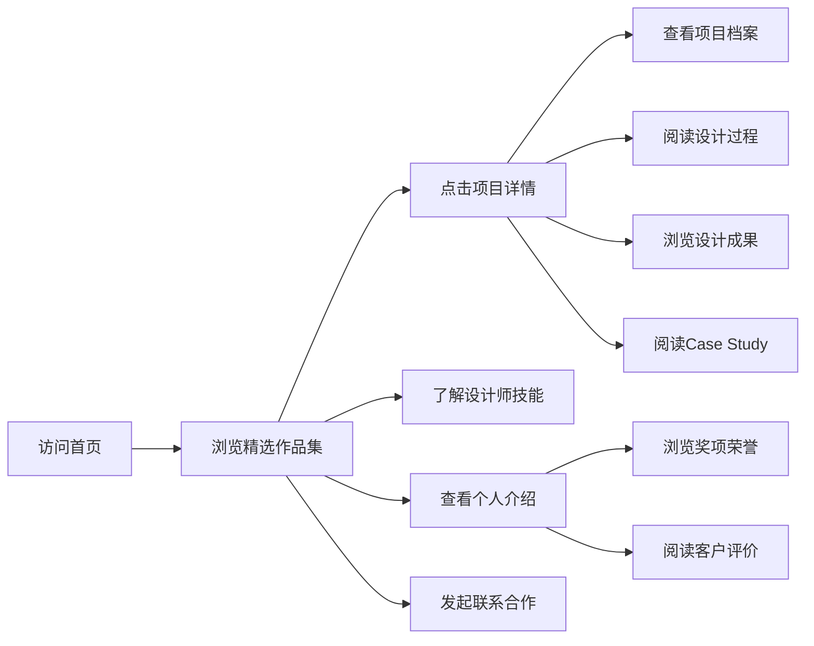

# 在线设计师作品集和创意项目展示平台 - PRD

## 1. Product Overview

本项目是一个完整的在线设计师作品集展示平台，为创意设计师提供专业的个人作品展示空间。平台整合作品集管理、项目故事叙述、技能展示和个人品牌四大核心模块，帮助设计师打造具有说服力的个人品牌形象。

- 面向专业设计师（UI/UX、品牌、动效等）展示个人作品和职业形象
- 通过结构化的内容呈现，提升设计师作品的叙事能力和专业可信度

## 2. Core Features

### 2.1 Feature Module

1. **作品集管理模块**: 项目档案管理、设计过程文档、成果多格式展示
2. **项目故事叙述模块**: Case Study 结构化写作、数据可视化、设计决策解释
3. **技能展示模块**: 技能雷达图、工具分类列举、设计风格说明
4. **个人品牌模块**: 个人介绍、奖项荣誉、客户评价管理

### 2.3 Page Details

| Page Name | Module Name | Feature description |
|-----------|-------------|---------------------|
| 首页 | Hero 区域 | 设计师头像、标语、CTA 按钮、背景动效 |
| 首页 | 精选作品集 | 网格布局展示精选项目，悬停交互效果 |
| 作品集页面 | 项目列表 | 筛选器（行业/工具/时间）、卡片展示 |
| 项目详情页 | 项目档案 | 项目元数据（客户/行业/时间/工具） |
| 项目详情页 | 设计过程 | 调研/草图/迭代/最终稿的时间线展示 |
| 项目详情页 | 成果展示 | 图片轮播/GIF/原型预览 |
| 项目详情页 | Case Study | 问题定义/设计目标/解决方案/执行过程/最终成果 |
| 项目详情页 | 数据可视化 | 柱状图/折线图展示关键指标改进 |
| 项目详情页 | 设计决策 | 方案对比、选择理由说明 |
| 关于页面 | 个人介绍 | 简历时间线、设计理念阐述 |
| 关于页面 | 技能展示 | 能力雷达图、技能标签、熟练度展示 |
| 关于页面 | 工具列举 | 按类别分组的工具列表及项目用例 |
| 关于页面 | 奖项荣誉 | 时间线展示获奖经历 |
| 关于页面 | 客户评价 | 轮播展示推荐信和客户反馈 |
| 联系页面 | 联系表单 | 姓名/邮箱/消息输入、发送功能 |

## 3. Core Process

用户访问首页 → 浏览精选作品集 → 点击项目查看详情 → 阅读 Case Study → 了解设计技能 → 查看个人介绍 → 通过联系表单发起合作

## 4. User Interface Design

### 4.1 Design Style

- **主色调**: 深炭灰 (#1a1a1a) 作为背景，营造专业沉稳的氛围
- **强调色**: 珊瑚粉 (#FF6B6B) 作为主强调色，用于 CTA 和重点元素
- **辅助色**: 淡金色 (#FFD93D) 用于装饰和高光，增强高级感
- **字体**: 
  - 标题: Playfair Display（优雅衬线，体现艺术气质）
  - 正文: DM Sans（现代无衬线，保证可读性）
- **布局风格**: 杂志风排版，大留白，不对称网格
- **动效风格**: 微妙的悬浮效果、渐入动画、平滑滚动

### 4.2 Page Design Overview

| Page Name | Module Name | UI Elements |
|-----------|-------------|-------------|
| 首页 | Hero 区域 | 大标题、动效背景、设计师头像、社交链接、向下滚动指示 |
| 首页 | 精选作品 | 大卡片网格、悬停放大效果、项目标签、过渡动画 |
| 项目详情页 | 设计过程 | 垂直时间线、阶段指示器、图片对比滑块 |
| 项目详情页 | 成果展示 | 图片轮播器、Lightbox 预览、缩略图导航 |
| 项目详情页 | 数据可视化 | 动态图表、数字计数器、进度条动画 |
| 关于页面 | 技能雷达图 | 六维雷达图、可交互悬停、数据标签 |
| 关于页面 | 奖项时间线 | 横向时间轴、年份标记、获奖图标 |
| 关于页面 | 客户评价 | 卡片轮播、用户头像、引用样式 |
| 联系页面 | 联系表单 | 极简输入框、动画按钮、提交反馈 |

### 4.3 Responsiveness

- 桌面端优先设计，1200px 为基准断点
- 平板端 (768px - 1024px): 两列布局、调整字体大小
- 移动端 (< 768px): 单列布局、汉堡菜单、简化交互
- 图片懒加载优化性能
