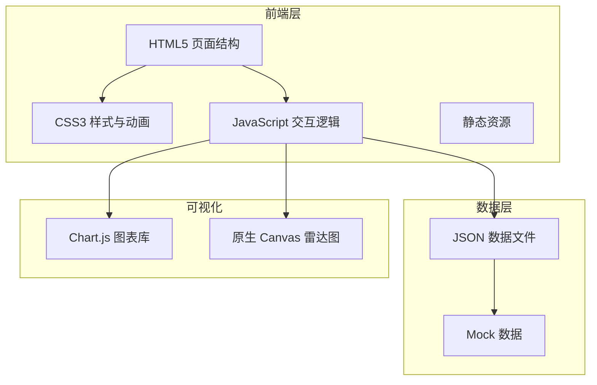

# 在线设计师作品集和创意项目展示平台 - 技术架构

## 1. Architecture Design



## 2. Technology Description

- **前端**: 纯 HTML5 + CSS3 + JavaScript (ES6+)
- **样式方案**: 原生 CSS，采用 CSS 变量和 Flexbox/Grid 布局
- **图表库**: Chart.js（CDN 引入）用于数据可视化
- **图片资源**: 使用 text_to_image API 生成设计作品预览图
- **图标**: Font Awesome（CDN 引入）

## 3. File Structure

```
project112/
├── index.html              # 首页
├── portfolio.html          # 作品集列表页
├── project-detail.html     # 项目详情页
├── about.html              # 关于页面（技能+个人介绍）
├── contact.html            # 联系页面
├── css/
│   ├── main.css            # 全局样式
│   ├── components.css      # 组件样式
│   └── responsive.css      # 响应式样式
├── js/
│   ├── main.js             # 主脚本
│   ├── data.js             # Mock 数据
│   ├── radar-chart.js      # 雷达图组件
│   └── carousels.js        # 轮播组件
└── images/                 # 图片资源目录（动态生成）
```

## 4. Data Model

### 4.1 项目数据结构

```javascript
// Project Schema
{
  id: string,
  name: string,
  client: string,
  industry: string,
  completionDate: string,
  tools: string[],
  background: string,
  tags: string[],
  featured: boolean,
  coverImage: string,
  gallery: [
    { type: 'image' | 'gif' | 'prototype', url: string, caption: string }
  ],
  process: [
    { stage: string, title: string, description: string, images: string[] }
  ],
  caseStudy: {
    problemDefinition: string,
    designGoals: string[],
    solution: string,
    execution: string,
    results: string
  },
  metrics: [
    { label: string, before: number, after: number, unit: string }
  ],
  designDecisions: [
    { option: string, description: string, chosen: boolean, reason: string }
  ]
}
```

### 4.2 设计师数据结构

```javascript
// Designer Schema
{
  name: string,
  title: string,
  bio: string,
  philosophy: string,
  avatar: string,
  contact: {
    email: string,
    phone: string,
    location: string
  },
  social: {
    dribbble: string,
    behance: string,
    linkedin: string,
    instagram: string
  },
  skills: [
    { name: string, level: number, category: string }
  ],
  tools: [
    { name: string, category: string, projects: string[], icon: string }
  ],
  awards: [
    { title: string, organization: string, year: string, description: string }
  ],
  testimonials: [
    { name: string, role: string, company: string, quote: string, avatar: string }
  ],
  experience: [
    { role: string, company: string, period: string, description: string }
  ]
}
```

## 5. 核心功能实现

| 功能模块 | 实现方式 | 技术要点 |
|----------|----------|----------|
| 图片轮播 | 原生 JS + CSS | 平滑过渡、键盘导航、缩略图 |
| 雷达图 | Canvas API | 六维雷达、数据绑定、交互 |
| 数据可视化 | Chart.js | 柱状图、折线图、动画效果 |
| 平滑滚动 | 原生 JS | requestAnimationFrame |
| 筛选功能 | 数组过滤 | 多条件组合筛选 |
| 响应式布局 | CSS Grid + Flexbox | 移动优先、断点管理 |
