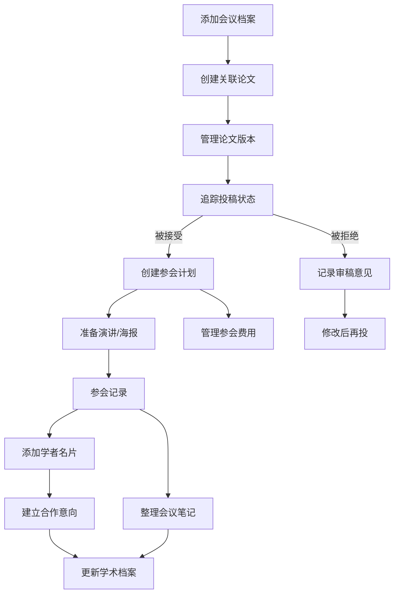

# 在线学术会议投稿和参会管理工具 PRD

## 1. Product Overview

这是一个面向学术研究者的全功能会议投稿和参会管理工具，帮助研究者系统化管理整个学术生命周期——从会议筛选、论文准备、投稿追踪，到参会计划和学术网络建立。核心用户为研究生、博士后、教授等需要频繁参与学术会议的研究人员。该工具解决了研究者在多个会议之间切换时信息分散、时间节点混乱、文件版本难以追踪的痛点，提供一站式的学术会议管理解决方案。

## 2. Core Features

### 2.1 User Roles

| Role | Registration Method | Core Permissions |
|------|---------------------|------------------|
| 研究者 | 默认单用户模式，无需注册 | 管理所有会议、论文、参会信息 |

### 2.2 Feature Module

1. **投稿管理模块**：会议档案管理、投稿状态追踪、审稿意见记录
2. **论文准备模块**：版本管理、合作者分工、格式检查清单
3. **参会准备模块**：参会计划、演讲稿/海报进度、费用管理
4. **网络建立模块**：学者名片、合作意向追踪、会议笔记
5. **学术档案模块**：已发表论文清单、引用追踪

### 2.3 Page Details

| Page Name | Module Name | Feature description |
|-----------|-------------|---------------------|
| 仪表盘 | 总览模块 | 关键指标展示、近期截止日期提醒、快速操作入口 |
| 会议投稿 | 投稿管理模块 | 会议档案列表、状态筛选、添加/编辑会议、投稿进度追踪 |
| 论文管理 | 论文准备模块 | 论文版本历史、合作者分工、格式检查清单 |
| 参会准备 | 参会准备模块 | 参会计划安排、演讲稿/海报进度、费用预算与报销 |
| 学术网络 | 网络建立模块 | 学者名片管理、合作意向跟进、会议笔记整理 |
| 学术档案 | 学术档案模块 | 已发表论文清单、引用数追踪、统计图表 |
| 会议详情 | 投稿管理模块 | 单个会议的完整信息、审稿意见、关联论文 |
| 论文详情 | 论文准备模块 | 单篇论文的详细信息、版本对比、合作者管理 |

## 3. Core Process

用户流程：
1. 用户添加目标会议（会议名称、举办机构、重要日期、费用等）
2. 创建关联论文，设置合作者分工，管理版本历史
3. 追踪投稿状态（准备中→已投稿→在审→接受/拒绝→修改后再投）
4. 若被接受，创建参会计划（机票、住宿、签证、报告时间）
5. 记录审稿意见，准备演讲稿和海报，管理参会费用
6. 参会后记录学者名片，建立合作意向，整理会议笔记
7. 将已发表论文添加到学术档案，追踪引用数

## 4. User Interface Design

### 4.1 Design Style

- **主色调**：深蓝色 (#1e3a8a) 作为主色，代表学术严谨性
- **辅色调**：青色 (#0ea5e9) 作为强调色，用于状态指示和交互元素
- **中性色**：深灰 (#1f2937) 到浅灰 (#f9fafb) 的渐变，确保良好的可读性
- **按钮风格**：圆角中等 (radius-lg)，悬停时有轻微上浮效果和阴影变化
- **字体**：标题使用 Playfair Display（衬线字体，学术感），正文使用 Source Sans Pro（无衬线，易读）
- **布局风格**：卡片式布局，清晰的视觉层次，左右分栏（侧边导航 + 主内容区）
- **图标风格**：使用 Lucide 图标库，线性风格，统一 24px 大小
- **数据可视化**：使用 Recharts 绘制简洁的柱状图、饼图和折线图

### 4.2 Page Design Overview

| Page Name | Module Name | UI Elements |
|-----------|-------------|-------------|
| 仪表盘 | 总览模块 | 统计卡片网格、时间线组件、进度环形图、快捷操作按钮 |
| 会议投稿 | 投稿管理模块 | 表格视图 + 卡片视图切换、状态徽章、搜索筛选栏、日期倒计时 |
| 论文管理 | 论文准备模块 | 版本时间线、任务清单、合作者头像、进度条 |
| 参会准备 | 参会准备模块 | 时间线安排、进度管理、费用表格、预算图表 |
| 学术网络 | 网络建立模块 | 名片卡片网格、合作状态指示器、笔记编辑器 |
| 学术档案 | 学术档案模块 | 论文列表、引用趋势图、发表统计饼图 |
| 会议详情 | 投稿管理模块 | 分栏布局（左：基本信息，右：审稿意见 + 关联论文） |
| 论文详情 | 论文准备模块 | 版本对比视图、任务面板、文件上传区域 |

### 4.3 Responsiveness

- Desktop-first 设计，主内容区最小宽度 1024px
- 平板设备：侧边栏折叠为图标，主内容区自适应
- 移动设备：底部导航栏，卡片堆叠布局，优先展示关键信息
- 表格在小屏幕上转为水平滚动或卡片化展示

### 4.4 交互细节

- 页面加载时的渐入动画
- 卡片悬停时的微妙上浮和阴影加深
- 状态变化时的平滑过渡动画
- 表单验证的即时反馈
- 模态框和侧边抽屉的弹性动画
- 滚动时的头部导航渐变效果
