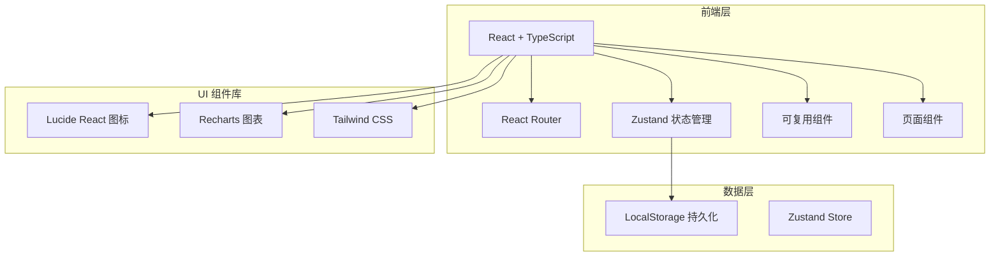
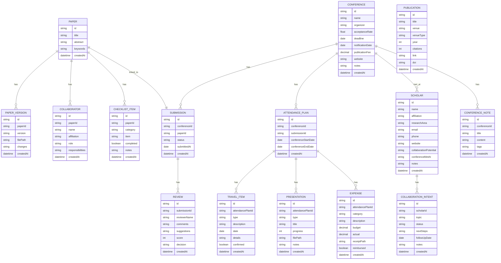

# 在线学术会议投稿和参会管理工具 - 技术架构

## 1. Architecture Design



## 2. Technology Description

- **Frontend**: React@18 + TypeScript + Vite
- **CSS Framework**: Tailwind CSS@3
- **State Management**: Zustand
- **Routing**: React Router DOM@6
- **Icons**: Lucide React
- **Charts**: Recharts
- **Data Persistence**: LocalStorage (纯前端本地存储)
- **Project Template**: react-ts (React + TypeScript + Tailwind + Zustand)

## 3. Route Definitions

| Route | Purpose |
|-------|---------|
| / | 仪表盘 - 总览视图 |
| /submissions | 会议投稿列表 |
| /submissions/:id | 会议详情 |
| /papers | 论文管理列表 |
| /papers/:id | 论文详情 |
| /attendance | 参会准备 |
| /network | 学术网络 |
| /archive | 学术档案 |

## 4. Data Model

### 4.1 Data Model Definition



### 4.2 Type Definitions

```typescript
export interface Conference {
  id: string;
  name: string;
  organizer: string;
  acceptanceRate: number;
  deadline: string;
  notificationDate: string;
  publicationFee: number;
  website: string;
  notes: string;
  createdAt: string;
}

export type SubmissionStatus = 'preparing' | 'submitted' | 'under_review' | 'accepted' | 'rejected' | 'revision_requested';

export interface Submission {
  id: string;
  conferenceId: string;
  paperId: string;
  status: SubmissionStatus;
  submittedAt: string;
  createdAt: string;
}

export interface Review {
  id: string;
  submissionId: string;
  reviewerName: string;
  comments: string;
  suggestions: string;
  score: number;
  decision: 'accept' | 'reject' | 'revision';
  createdAt: string;
}

export interface Paper {
  id: string;
  title: string;
  abstract: string;
  keywords: string[];
  createdAt: string;
}

export interface PaperVersion {
  id: string;
  paperId: string;
  version: string;
  filePath: string;
  changes: string;
  createdAt: string;
}

export interface Collaborator {
  id: string;
  paperId: string;
  name: string;
  affiliation: string;
  role: 'author' | 'corresponding' | 'advisor';
  responsibilities: string[];
  createdAt: string;
}

export interface ChecklistItem {
  id: string;
  paperId: string;
  category: 'page_limit' | 'citation_format' | 'figure_requirements' | 'other';
  item: string;
  completed: boolean;
  notes: string;
  createdAt: string;
}

export interface AttendancePlan {
  id: string;
  conferenceId: string;
  submissionId: string;
  conferenceStartDate: string;
  conferenceEndDate: string;
  createdAt: string;
}

export type TravelType = 'flight' | 'hotel' | 'visa' | 'presentation_time' | 'other';

export interface TravelItem {
  id: string;
  attendancePlanId: string;
  type: TravelType;
  description: string;
  date: string;
  details: string;
  confirmed: boolean;
  createdAt: string;
}

export type PresentationType = 'slides' | 'poster';

export interface Presentation {
  id: string;
  attendancePlanId: string;
  type: PresentationType;
  title: string;
  progress: number;
  filePath: string;
  notes: string;
  createdAt: string;
}

export type ExpenseCategory = 'registration' | 'travel' | 'accommodation' | 'food' | 'other';

export interface Expense {
  id: string;
  attendancePlanId: string;
  category: ExpenseCategory;
  description: string;
  budget: number;
  actual: number;
  receiptPath: string;
  reimbursed: boolean;
  createdAt: string;
}

export interface Scholar {
  id: string;
  name: string;
  affiliation: string;
  researchArea: string;
  email: string;
  phone: string;
  website: string;
  collaborationPotential: 'high' | 'medium' | 'low';
  conferenceMetAt: string;
  notes: string;
  createdAt: string;
}

export type CollaborationStatus = 'initial_contact' | 'discussion' | 'proposal' | 'active' | 'completed' | 'dormant';

export interface CollaborationIntent {
  id: string;
  scholarId: string;
  topic: string;
  status: CollaborationStatus;
  nextSteps: string;
  followUpDate: string;
  notes: string;
  createdAt: string;
}

export interface ConferenceNote {
  id: string;
  conferenceId: string;
  title: string;
  content: string;
  tags: string[];
  createdAt: string;
}

export type VenueType = 'journal' | 'conference';

export interface Publication {
  id: string;
  title: string;
  venue: string;
  venueType: VenueType;
  year: number;
  citations: number;
  link: string;
  doi: string;
  createdAt: string;
}
```

## 5. Project Structure

```
project113/
├── src/
│   ├── components/          # 可复用组件
│   │   ├── Layout/
│   │   │   ├── Sidebar.tsx
│   │   │   ├── Header.tsx
│   │   │   └── Layout.tsx
│   │   ├── Common/
│   │   │   ├── Card.tsx
│   │   │   ├── Button.tsx
│   │   │   ├── Badge.tsx
│   │   │   ├── Modal.tsx
│   │   │   ├── Timeline.tsx
│   │   │   ├── ProgressBar.tsx
│   │   │   └── EmptyState.tsx
│   │   └── Forms/
│   │       ├── ConferenceForm.tsx
│   │       ├── PaperForm.tsx
│   │       └── ScholarForm.tsx
│   ├── pages/               # 页面组件
│   │   ├── Dashboard.tsx
│   │   ├── Submissions.tsx
│   │   ├── SubmissionDetail.tsx
│   │   ├── Papers.tsx
│   │   ├── PaperDetail.tsx
│   │   ├── Attendance.tsx
│   │   ├── Network.tsx
│   │   └── Archive.tsx
│   ├── store/               # Zustand 状态管理
│   │   └── useStore.ts
│   ├── types/               # TypeScript 类型定义
│   │   └── index.ts
│   ├── utils/               # 工具函数
│   │   ├── storage.ts
│   │   ├── dateUtils.ts
│   │   └── mockData.ts
│   ├── App.tsx
│   ├── main.tsx
│   └── index.css
├── public/
├── package.json
├── tsconfig.json
├── vite.config.ts
├── tailwind.config.js
└── postcss.config.js
```

## 6. Key Implementation Notes

1. **数据持久化**: 使用 LocalStorage 存储所有数据，封装在 `src/utils/storage.ts` 中
2. **状态管理**: 使用 Zustand 创建单一 store，包含所有数据模块的 CRUD 操作
3. **模拟数据**: 预设丰富的模拟数据，便于演示和测试
4. **组件拆分**: 每个页面拆分为独立组件，公共组件放在 `components/Common` 目录
5. **表单处理**: 使用受控组件处理表单，添加基本的表单验证
6. **响应式设计**: 使用 Tailwind 的响应式类实现移动端适配
7. **动画效果**: 使用 CSS transitions 和 Tailwind 的过渡类实现平滑动画
