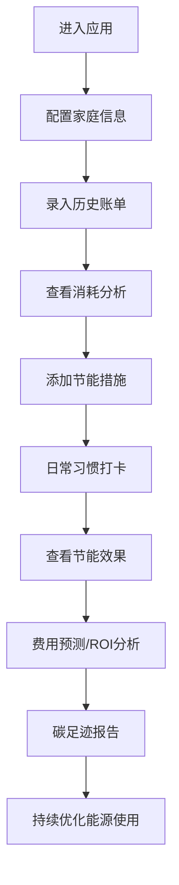

# 家庭能源管理和节能追踪工具 - PRD

## 1. Product Overview

一款综合性的在线家庭能源管理平台，帮助用户追踪水电燃气消耗、分析能源使用效率、规划节能行为，并估算碳减排贡献。面向关注家庭开支和环保的普通家庭用户。

- 核心价值：帮助用户直观了解能源使用情况，发现节能机会，追踪节能措施效果
- 目标用户：家庭主妇、环保意识强的用户、预算敏感的家庭

## 2. Core Features

### 2.1 User Roles

| Role | Registration Method | Core Permissions |
|------|---------------------|------------------|
| Normal User | 直接使用（本地存储） | 录入账单、查看分析、设置目标、追踪习惯 |

### 2.2 Feature Module

1. **Dashboard仪表盘**：能源概览、关键指标、快捷入口
2. **账单管理**：水电燃气账单录入、OCR识别、异常检测告警
3. **消耗分析**：月度趋势图、能源结构占比、人均消耗对比
4. **节能追踪**：措施记录、习惯打卡、目标进度
5. **费用预测**：下月账单估算、年度预算、ROI计算
6. **碳足迹**：减排计算、年度报告

### 2.3 Page Details

| Page Name | Module Name | Feature description |
|-----------|-------------|---------------------|
| Dashboard | 概览卡片 | 展示本月消耗金额、同比环比变化、节能目标进度、碳减排总量 |
| Dashboard | 快捷操作 | 快速录入账单、添加节能措施、打卡节能习惯 |
| 账单管理 | 账单列表 | 按月份和能源类型展示账单列表，支持筛选和搜索 |
| 账单管理 | 手动录入 | 表单录入用量、金额、账期，支持水电燃气三种类型 |
| 账单管理 | OCR识别 | 上传账单图片，模拟解析提取数据到表单 |
| 账单管理 | 异常检测 | 自动检测同比环比异常增长，高亮标记和告警提示 |
| 消耗分析 | 月度趋势 | 折线图展示近12个月各能源类型用量变化 |
| 消耗分析 | 能源结构 | 环形图展示电力/燃气/水的消耗金额占比 |
| 消耗分析 | 人均对比 | 柱状图展示家庭人均消耗与城市平均水平对比 |
| 节能追踪 | 措施管理 | 添加节能措施（如换LED灯），记录成本，追踪后续用量变化 |
| 节能追踪 | 习惯打卡 | 每日打卡节能习惯（出门关灯、低温洗衣等），连续打卡统计 |
| 节能追踪 | 目标设置 | 设置月度/年度节能目标，展示完成进度条 |
| 费用预测 | 下月预估 | 基于季节规律和历史数据预测下月账单 |
| 费用预测 | 年度预算 | 规划年度能源支出，展示实际与预算对比 |
| 费用预测 | ROI计算 | 输入节能设备成本，估算回本时间和长期收益 |
| 碳足迹 | 减排估算 | 节电量对应减少碳排放的计算和展示 |
| 碳足迹 | 年度报告 | 年度碳足迹统计、减排成果、环保贡献可视化 |

## 3. Core Process

用户首次进入 → 配置家庭信息（人数、城市）→ 录入历史账单数据 → 查看分析报告 → 添加节能措施 → 日常习惯打卡 → 查看节能效果和ROI → 持续优化

## 4. User Interface Design

### 4.1 Design Style

**设计理念：绿色环保 + 数据可视化 + 现代简约**

- **主色调**：绿色系（#10B981 环保绿）象征节能和环保
- **辅助色**：蓝色（#3B82F6 电力）、橙色（#F59E0B 燃气）、青色（#06B6D4 水资源）
- **中性色**：深灰（#1F2937）、中灰（#4B5563）、浅灰（#F3F4F6）
- **背景**：渐变绿色纹理背景，营造自然环保氛围
- **卡片**：白色圆角卡片（16px），带柔和阴影
- **按钮**：圆角（12px），悬停有轻微上浮和阴影增强
- **字体**：
  - 标题：DM Serif Display（优雅衬线）
  - 正文：Inter（现代无衬线）
- **图标**：lucide-react 图标库，线性风格
- **动画**：图表入场动画、数字滚动动画、卡片悬浮效果

### 4.2 Page Design Overview

| Page Name | Module Name | UI Elements |
|-----------|-------------|-------------|
| Dashboard | 概览卡片 | 4列网格，渐变底色，大数字带趋势箭头 |
| Dashboard | 图表区 | 混合布局：折线图 + 环形图 |
| 账单管理 | 列表 | 表格布局，异常行红框高亮 |
| 账单管理 | 录入表单 | 两列布局，图标装饰输入框 |
| 消耗分析 | 趋势图 | 全宽大图表，多条折线带图例 |
| 消耗分析 | 结构分析 | 环形图 + 数据卡片并排 |
| 节能追踪 | 打卡区 | 7天日历视图，打卡状态可视化 |
| 节能追踪 | 目标进度 | 彩色进度条，带动画效果 |
| 费用预测 | 预算规划 | 瀑布图风格展示 |
| 碳足迹 | 年度报告 | 时间轴+里程碑设计 |

### 4.3 Responsiveness

- **Desktop-first** 设计
- **断点**：1024px（平板）、640px（手机）
- **手机端**：单栏布局，侧边栏收起为汉堡菜单，图表自适应宽度
- **触摸优化**：按钮最小44x44px，卡片点击区域增大

### 4.4 Visual Details

- **渐变效果**：使用 CSS 渐变在卡片背景、图表区域
- **纹理叠加**：轻微的噪点纹理增加质感
- **玻璃拟态**：部分区域使用 backdrop-blur 效果
- **数字动画**：关键数据加载时有数字滚动效果
- **微交互**：hover 时图标颜色渐变、按钮轻微放大
