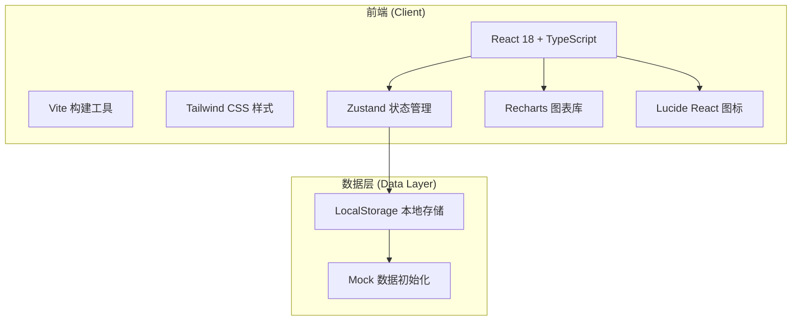
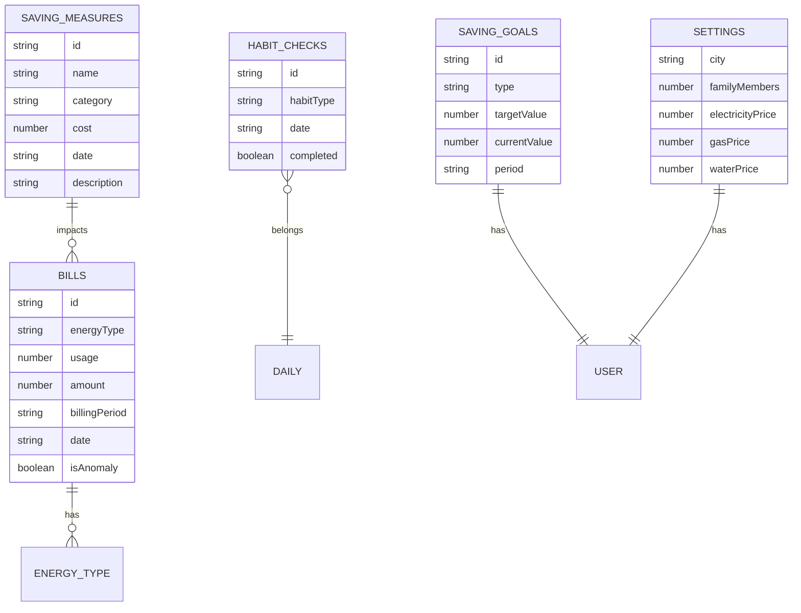

# 家庭能源管理和节能追踪工具 - 技术架构

## 1. Architecture Design



## 2. Technology Description

- **前端框架**: React@18 + TypeScript@5
- **构建工具**: Vite@5
- **样式方案**: Tailwind CSS@3
- **状态管理**: Zustand@4
- **图表库**: Recharts@2
- **图标库**: lucide-react@0.4
- **数据持久化**: LocalStorage
- **无需后端**: 纯前端应用，数据存储在本地浏览器

## 3. Route Definitions

| Route | Purpose |
|-------|---------|
| / | Dashboard 仪表盘 |
| /bills | 账单管理 |
| /analysis | 消耗分析 |
| /saving | 节能追踪 |
| /forecast | 费用预测 |
| /carbon | 碳足迹 |

## 4. Data Model

### 4.1 Data Model Definition



### 4.2 Core Data Types

```typescript
// 能源类型
type EnergyType = 'electricity' | 'gas' | 'water';

// 账单数据
interface Bill {
  id: string;
  energyType: EnergyType;
  usage: number;
  amount: number;
  billingPeriod: string;
  date: string;
  isAnomaly?: boolean;
  anomalyReason?: string;
}

// 节能措施
interface SavingMeasure {
  id: string;
  name: string;
  category: string;
  cost: number;
  date: string;
  description: string;
  estimatedSavings?: number;
}

// 节能习惯
type HabitType = 'turn_off_lights' | 'cold_wash' | 'shorter_shower' | 'unplug_devices';

interface HabitCheck {
  id: string;
  habitType: HabitType;
  date: string;
  completed: boolean;
}

// 节能目标
interface SavingGoal {
  id: string;
  type: 'usage_reduction' | 'cost_saving' | 'carbon_reduction';
  targetValue: number;
  currentValue: number;
  period: 'monthly' | 'yearly';
  startDate: string;
}

// 用户设置
interface UserSettings {
  city: string;
  familyMembers: number;
  electricityPrice: number;
  gasPrice: number;
  waterPrice: number;
}

// 碳排放因子 (kg CO2 per unit)
const CARBON_FACTORS = {
  electricity: 0.785, // kg CO2/kWh
  gas: 2.16, // kg CO2/m³
  water: 0.91, // kg CO2/m³
};
```

## 5. Project Structure

```
src/
├── components/           # 可复用组件
│   ├── layout/           # 布局组件
│   │   ├── Sidebar.tsx
│   │   └── Header.tsx
│   ├── charts/           # 图表组件
│   │   ├── LineChart.tsx
│   │   ├── PieChart.tsx
│   │   └── BarChart.tsx
│   └── ui/               # UI组件
│       ├── Card.tsx
│       ├── Button.tsx
│       ├── Modal.tsx
│       └── ProgressBar.tsx
├── pages/                # 页面组件
│   ├── Dashboard.tsx
│   ├── Bills.tsx
│   ├── Analysis.tsx
│   ├── Saving.tsx
│   ├── Forecast.tsx
│   └── Carbon.tsx
├── store/                # Zustand状态管理
│   ├── billStore.ts
│   ├── savingStore.ts
│   └── settingsStore.ts
├── utils/                # 工具函数
│   ├── calculator.ts     # 计算逻辑
│   ├── formatter.ts      # 格式化函数
│   └── mockData.ts       # 模拟数据
├── types/                # TypeScript类型定义
│   └── index.ts
├── App.tsx               # 主应用组件
├── main.tsx              # 入口文件
└── index.css             # 全局样式
```

## 6. Key Algorithms

### 6.1 异常检测算法

```typescript
function detectAnomaly(
  currentUsage: number,
  previousUsage: number,
  samePeriodLastYear: number,
  threshold: number = 0.3
): { isAnomaly: boolean; reason?: string } {
  const momChange = (currentUsage - previousUsage) / previousUsage;
  const yoyChange = samePeriodLastYear 
    ? (currentUsage - samePeriodLastYear) / samePeriodLastYear 
    : 0;

  if (momChange > threshold) {
    return { isAnomaly: true, reason: `环比增长 ${(momChange * 100).toFixed(1)}%` };
  }
  if (yoyChange > threshold) {
    return { isAnomaly: true, reason: `同比增长 ${(yoyChange * 100).toFixed(1)}%` };
  }
  return { isAnomaly: false };
}
```

### 6.2 费用预测算法

```typescript
function predictNextMonthBill(
  historicalData: Bill[],
  energyType: EnergyType,
  seasonFactors: Record<string, number>
): number {
  const typeBills = historicalData.filter(b => b.energyType === energyType);
  const avgAmount = typeBills.reduce((sum, b) => sum + b.amount, 0) / typeBills.length;
  
  const nextMonth = new Date().getMonth() + 1;
  const seasonFactor = seasonFactors[nextMonth.toString()] || 1;
  
  return avgAmount * seasonFactor;
}
```

### 6.3 ROI计算

```typescript
function calculateROI(
  initialCost: number,
  monthlySavings: number
): { paybackMonths: number; yearlyROI: number; fiveYearSavings: number } {
  const paybackMonths = Math.ceil(initialCost / monthlySavings);
  const yearlyROI = (monthlySavings * 12 / initialCost) * 100;
  const fiveYearSavings = monthlySavings * 60 - initialCost;
  
  return { paybackMonths, yearlyROI, fiveYearSavings };
}
```

### 6.4 碳减排计算

```typescript
function calculateCarbonSaved(
  electricitySaved: number,
  gasSaved: number,
  waterSaved: number
): number {
  return (
    electricitySaved * CARBON_FACTORS.electricity +
    gasSaved * CARBON_FACTORS.gas +
    waterSaved * CARBON_FACTORS.water
  );
}
```

## 7. Mock Data Structure

应用启动时将生成12个月的模拟数据，包含：
- 水电燃气各类型账单（带季节性波动）
- 若干节能措施记录
- 节能习惯打卡记录
- 默认用户设置

## 8. Dependencies

```json
{
  "dependencies": {
    "react": "^18.2.0",
    "react-dom": "^18.2.0",
    "react-router-dom": "^6.20.0",
    "zustand": "^4.4.0",
    "recharts": "^2.10.0",
    "lucide-react": "^0.290.0"
  },
  "devDependencies": {
    "typescript": "^5.2.0",
    "vite": "^5.0.0",
    "tailwindcss": "^3.3.0",
    "postcss": "^8.4.0",
    "autoprefixer": "^10.4.0"
  }
}
```
