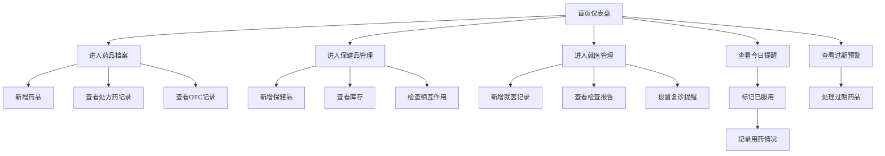

# 在线药物和保健品管理工具 - 产品需求文档 (PRD)

## 1. Product Overview

一个完整的家庭健康管理平台，帮助用户系统化管理家庭药品、保健品、用药提醒和就医记录，确保用药安全和健康管理效率。

- 解决问题：家庭药品杂乱无章、过期药物未及时处理、用药时间遗忘、保健品与药物相互作用风险、就医记录分散
- 目标用户：家庭主妇、慢性病患者、老年人、有儿童的家庭
- 市场价值：提升家庭健康管理效率，减少用药风险，节省医疗开支

## 2. Core Features

### 2.1 User Roles

| Role | Registration Method | Core Permissions |
|------|---------------------|------------------|
| 普通用户 | 本地存储 | 管理家庭药品、设置用药提醒、记录就医信息 |

### 2.2 Feature Module

1. **首页仪表盘**: 今日用药提醒、过期预警、快速统计
2. **药品档案**: 药品录入、处方药记录、OTC记录
3. **用药提醒**: 用药时间提醒、慢性病连续提醒、漏服记录
4. **保健品管理**: 保健品档案、库存管理、相互作用提示
5. **药品安全**: 有效期预警、盘点提醒、禁忌标注
6. **就医管理**: 就医记录、检查报告、复诊提醒

### 2.3 Page Details

| Page Name | Module Name | Feature description |
|-----------|-------------|---------------------|
| 首页仪表盘 | 统计概览 | 今日需服用药物数量、本月过期药品、药品总数、保健品总数 |
| 首页仪表盘 | 今日提醒 | 显示今日用药计划，标记已服用/未服用状态 |
| 首页仪表盘 | 预警区域 | 显示即将过期药品、即将复诊提醒 |
| 药品档案 | 药品列表 | 按类型/存放位置分类展示所有药品 |
| 药品档案 | 药品录入 | 药品名称、规格、适应症、用法用量、存放位置、有效期、处方药/OTC标识 |
| 药品档案 | 处方药记录 | 遵医嘱用药方案、实际执行情况追踪 |
| 药品档案 | OTC记录 | 自行服药时间、剂量记录 |
| 用药提醒 | 提醒设置 | 多种药品早晚饭前后精确提醒时间配置 |
| 用药提醒 | 慢性病管理 | 长期用药连续提醒设置，确保不间断 |
| 用药提醒 | 漏服管理 | 漏服记录、补服建议提示 |
| 保健品管理 | 档案追踪 | 保健品档案建立、主观效果记录 |
| 保健品管理 | 库存管理 | 剩余量追踪、补货时间提醒 |
| 保健品管理 | 相互作用 | 与当前服用药物的相互作用风险提示 |
| 药品安全 | 有效期预警 | 本月和下月到期药品清单 |
| 药品安全 | 盘点提醒 | 家庭药箱定期盘点周期设置和提醒 |
| 药品安全 | 禁忌标注 | 儿童和老人用药禁忌标注和提醒 |
| 就医管理 | 就医记录 | 时间、医院、医生、诊断、处方信息记录 |
| 就医管理 | 检查报告 | 检查报告关联存档、关键指标记录 |
| 就医管理 | 复诊提醒 | 复诊日期设置、到期提醒 |

## 3. Core Process

1. **药品录入流程**: 用户进入药品档案 → 点击新增药品 → 填写药品信息 → 保存到本地存储 → 显示在药品列表

2. **用药提醒流程**: 用户设置用药时间 → 系统生成提醒计划 → 到达时间显示提醒 → 用户标记已服用 → 记录用药情况

3. **漏服处理流程**: 系统检测到未按时服用 → 标记为漏服 → 显示补服建议 → 用户根据建议处理 → 记录补服情况

4. **有效期预警流程**: 系统每日检查药品有效期 → 筛选本月/下月到期药品 → 在首页和安全模块显示预警 → 用户处理（丢弃/使用）

5. **就医记录流程**: 用户完成就医 → 录入就医信息 → 关联检查报告 → 设置复诊提醒 → 到期提醒复诊

## 4. User Interface Design

### 4.1 Design Style

- **主色调**: 医疗蓝 (#2563EB) - 传达专业、信任、安全的感觉
- **辅助色**: 健康绿 (#10B981) - 用于确认、完成状态；警告橙 (#F59E0B) - 用于即将到期；危险红 (#EF4444) - 用于过期/禁忌
- **中性色**: 浅灰背景 (#F8FAFC)，深灰文字 (#1E293B)
- **按钮风格**: 圆角矩形，柔和阴影，悬停时微浮起效果
- **字体**: 使用现代无衬线字体，清晰易读
  - 标题: Bold, 18-24px
  - 正文: Regular, 14-16px
  - 辅助文字: Light, 12px
- **布局风格**: 卡片式布局，左侧导航栏 + 右侧内容区域
- **图标**: 使用线条风格图标，简洁现代
- **动画**: 页面切换平滑过渡，按钮点击微反馈，状态变化有视觉提示

### 4.2 Page Design Overview

| Page Name | Module Name | UI Elements |
|-----------|-------------|-------------|
| 首页仪表盘 | 统计卡片 | 四个圆角卡片，图标+数字+描述，渐变色背景 |
| 首页仪表盘 | 今日提醒列表 | 时间线样式，显示药品名、剂量、服用状态按钮 |
| 首页仪表盘 | 预警区域 | 带警告图标的卡片，红色/橙色背景，显示过期药品列表 |
| 药品档案 | 药品列表 | 搜索+筛选栏，卡片式药品展示，支持分类标签 |
| 药品档案 | 药品表单 | 表单弹窗，分组字段，下拉选择，日期选择器 |
| 用药提醒 | 提醒设置 | 时钟图标，时间选择器，重复周期设置，开关切换 |
| 用药提醒 | 漏服记录 | 红色标记的历史记录卡片，附补服建议说明 |
| 保健品管理 | 库存追踪 | 进度条显示剩余量，补货提醒按钮 |
| 药品安全 | 有效期列表 | 按过期时间排序，颜色编码（红=本月过期，橙=下月过期） |
| 就医管理 | 就医时间线 | 时间线布局，医院名称+日期，点击展开详情 |

### 4.3 Responsiveness

- **响应式设计**: 桌面端优先，支持平板和移动端自适应
- **断点设计**: 
  - ≥1024px: 完整三栏布局（左侧导航 + 主内容 + 侧边栏）
  - 768-1024px: 折叠导航 + 主内容
  - <768px: 移动端底部导航，卡片垂直堆叠
- **触摸优化**: 按钮尺寸 ≥44x44px，列表项有足够点击区域
- **本地存储**: 所有数据使用 localStorage 持久化存储

### 4.4 交互细节

- **导航切换**: 平滑淡入淡出，当前项高亮
- **表单交互**: 输入框获焦时边框高亮，必填项红色星标
- **状态变化**: 用药标记完成时绿色勾选动画
- **警告提示**: 过期药品有闪烁提示，点击可查看详情
