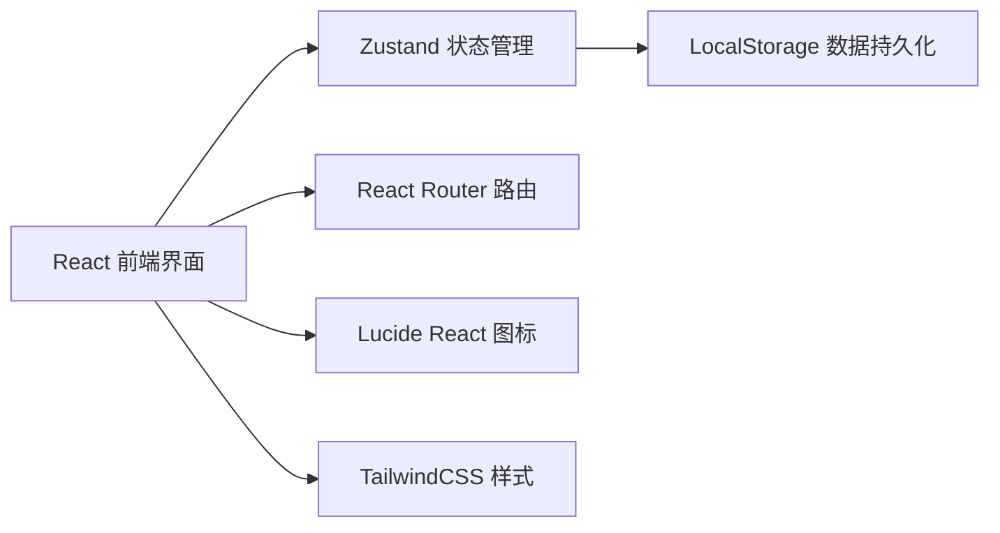
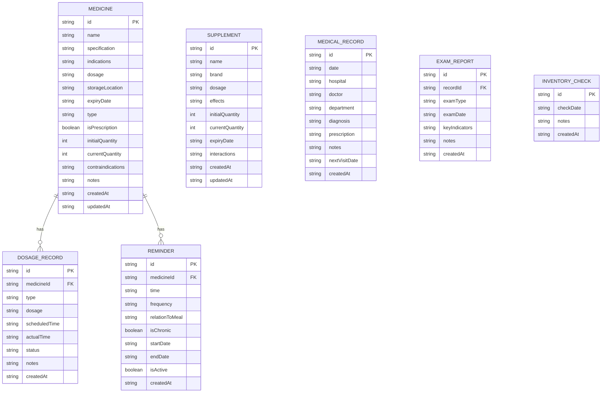

# 在线药物和保健品管理工具 - 技术架构文档

## 1. Architecture Design



## 2. Technology Description

- **前端**: React@18 + TypeScript + Vite
- **路由**: React Router DOM@6
- **状态管理**: Zustand
- **样式**: TailwindCSS@3
- **图标**: Lucide React
- **数据存储**: LocalStorage（浏览器本地存储）
- **初始化工具**: vite-init

**技术选择理由**:
- React 18: 现代前端框架，组件化开发，生态丰富
- TypeScript: 类型安全，减少运行时错误
- Zustand: 轻量级状态管理，简单易用
- TailwindCSS: 快速开发，一致的设计系统
- LocalStorage: 无需后端，数据本地持久化，保护隐私

## 3. Route Definitions

| Route | Purpose |
|-------|---------|
| / | 首页仪表盘 |
| /medicines | 药品档案列表 |
| /medicines/new | 新增药品 |
| /medicines/:id/edit | 编辑药品 |
| /prescriptions | 处方药用药记录 |
| /otc-records | OTC药品使用记录 |
| /reminders | 用药提醒设置 |
| /missed-doses | 漏服记录 |
| /supplements | 保健品管理 |
| /supplements/new | 新增保健品 |
| /safety | 药品安全中心 |
| /medical-records | 就医记录 |
| /medical-records/new | 新增就医记录 |

## 4. Data Model

### 4.1 Data Model Definition



### 4.2 Data Types (TypeScript)

```typescript
// 药品类型
type MedicineType = 'prescription' | 'otc';

// 用药记录类型
type DosageStatus = 'scheduled' | 'taken' | 'missed' | 'makeup';
type DosageType = 'prescription' | 'otc';

// 用餐关系
type MealRelation = 'before' | 'after' | 'any';

// 频率类型
type FrequencyType = 'daily' | 'weekdays' | 'weekends' | 'custom';

// 药品
interface Medicine {
  id: string;
  name: string;
  specification: string;
  indications: string;
  dosage: string;
  storageLocation: string;
  expiryDate: string;
  type: MedicineType;
  isPrescription: boolean;
  initialQuantity: number;
  currentQuantity: number;
  contraindications: {
    children: boolean;
    elderly: boolean;
    pregnancy: boolean;
    custom: string;
  };
  notes: string;
  createdAt: string;
  updatedAt: string;
}

// 用药记录
interface DosageRecord {
  id: string;
  medicineId: string;
  medicineName: string;
  type: DosageType;
  dosage: string;
  scheduledTime: string;
  actualTime?: string;
  status: DosageStatus;
  makeupAdvice?: string;
  notes?: string;
  createdAt: string;
}

// 提醒设置
interface Reminder {
  id: string;
  medicineId: string;
  medicineName: string;
  time: string;
  frequency: FrequencyType;
  relationToMeal: MealRelation;
  isChronic: boolean;
  startDate: string;
  endDate?: string;
  isActive: boolean;
  createdAt: string;
}

// 保健品
interface Supplement {
  id: string;
  name: string;
  brand: string;
  dosage: string;
  effects: string[];
  subjectiveFeedback: string;
  initialQuantity: number;
  currentQuantity: number;
  expiryDate: string;
  interactions: string[];
  createdAt: string;
  updatedAt: string;
}

// 就医记录
interface MedicalRecord {
  id: string;
  date: string;
  hospital: string;
  doctor: string;
  department: string;
  diagnosis: string;
  prescription: string;
  notes: string;
  nextVisitDate?: string;
  createdAt: string;
  updatedAt: string;
}

// 检查报告
interface ExamReport {
  id: string;
  recordId: string;
  examType: string;
  examDate: string;
  keyIndicators: string;
  notes: string;
  fileUrl?: string;
  createdAt: string;
}

// 库存盘点
interface InventoryCheck {
  id: string;
  checkDate: string;
  medicineCount: number;
  expiredCount: number;
  notes: string;
  createdAt: string;
}

// 应用状态
interface AppState {
  medicines: Medicine[];
  dosageRecords: DosageRecord[];
  reminders: Reminder[];
  supplements: Supplement[];
  medicalRecords: MedicalRecord[];
  examReports: ExamReport[];
  inventoryChecks: InventoryCheck[];
  lastInventoryCheckDate?: string;
  inventoryCheckInterval: number;
}
```

## 5. Project Structure

```
project115/
├── src/
│   ├── components/           # 通用组件
│   │   ├── Layout/           # 布局组件
│   │   │   ├── Sidebar.tsx
│   │   │   ├── Header.tsx
│   │   │   └── MobileNav.tsx
│   │   ├── ui/               # UI组件
│   │   │   ├── Card.tsx
│   │   │   ├── Button.tsx
│   │   │   ├── Input.tsx
│   │   │   ├── Modal.tsx
│   │   │   ├── Select.tsx
│   │   │   ├── DatePicker.tsx
│   │   │   └── TimePicker.tsx
│   │   └── common/           # 业务组件
│   │       ├── StatCard.tsx
│   │       ├── MedicineCard.tsx
│   │       ├── ReminderItem.tsx
│   │       └── Timeline.tsx
│   ├── pages/               # 页面组件
│   │   ├── Dashboard.tsx
│   │   ├── Medicines/
│   │   │   ├── MedicineList.tsx
│   │   │   ├── MedicineForm.tsx
│   │   │   └── MedicineDetail.tsx
│   │   ├── Reminders/
│   │   │   ├── ReminderList.tsx
│   │   │   ├── ReminderForm.tsx
│   │   │   └── MissedDoses.tsx
│   │   ├── Supplements/
│   │   │   ├── SupplementList.tsx
│   │   │   └── SupplementForm.tsx
│   │   ├── Safety/
│   │   │   ├── SafetyCenter.tsx
│   │   │   ├── ExpiryList.tsx
│   │   │   └── Inventory.tsx
│   │   └── Medical/
│   │       ├── MedicalList.tsx
│   │       ├── MedicalForm.tsx
│   │       └── ExamReports.tsx
│   ├── store/               # 状态管理
│   │   ├── useAppStore.ts
│   │   └── useLocalStorage.ts
│   ├── utils/               # 工具函数
│   │   ├── dateUtils.ts
│   │   ├── storage.ts
│   │   ├── dosageAdvice.ts
│   │   └── interactions.ts
│   ├── types/               # 类型定义
│   │   └── index.ts
│   ├── hooks/               # 自定义hooks
│   │   ├── useReminders.ts
│   │   └── useExpiryCheck.ts
│   ├── data/                # 初始数据
│   │   └── seedData.ts
│   ├── App.tsx
│   ├── main.tsx
│   └── index.css
├── api/                     # 后端（如需要）
├── .trae/
│   └── documents/
├── package.json
├── tsconfig.json
├── vite.config.ts
├── tailwind.config.js
└── postcss.config.js
```

## 6. State Management (Zustand)

```typescript
// src/store/useAppStore.ts
import { create } from 'zustand';
import { persist } from 'zustand/middleware';
import { AppState, Medicine, Supplement, MedicalRecord, DosageRecord, Reminder } from '../types';

interface AppActions {
  // Medicines
  addMedicine: (medicine: Omit<Medicine, 'id' | 'createdAt' | 'updatedAt'>) => void;
  updateMedicine: (id: string, updates: Partial<Medicine>) => void;
  deleteMedicine: (id: string) => void;
  
  // Dosage Records
  addDosageRecord: (record: Omit<DosageRecord, 'id' | 'createdAt'>) => void;
  updateDosageRecord: (id: string, updates: Partial<DosageRecord>) => void;
  
  // Reminders
  addReminder: (reminder: Omit<Reminder, 'id' | 'createdAt'>) => void;
  updateReminder: (id: string, updates: Partial<Reminder>) => void;
  deleteReminder: (id: string) => void;
  
  // Supplements
  addSupplement: (supplement: Omit<Supplement, 'id' | 'createdAt' | 'updatedAt'>) => void;
  updateSupplement: (id: string, updates: Partial<Supplement>) => void;
  deleteSupplement: (id: string) => void;
  
  // Medical Records
  addMedicalRecord: (record: Omit<MedicalRecord, 'id' | 'createdAt' | 'updatedAt'>) => void;
  updateMedicalRecord: (id: string, updates: Partial<MedicalRecord>) => void;
  deleteMedicalRecord: (id: string) => void;
  
  // Inventory
  setInventoryCheckInterval: (days: number) => void;
  updateLastInventoryCheck: (date: string) => void;
}

export const useAppStore = create<AppState & AppActions>()(
  persist(
    (set) => ({
      // initial state
      medicines: [],
      dosageRecords: [],
      reminders: [],
      supplements: [],
      medicalRecords: [],
      examReports: [],
      inventoryChecks: [],
      inventoryCheckInterval: 30,
      
      // actions
      addMedicine: (medicine) => set((state) => ({
        medicines: [...state.medicines, {
          ...medicine,
          id: Date.now().toString(),
          createdAt: new Date().toISOString(),
          updatedAt: new Date().toISOString()
        }]
      })),
      
      updateMedicine: (id, updates) => set((state) => ({
        medicines: state.medicines.map(m => 
          m.id === id ? { ...m, ...updates, updatedAt: new Date().toISOString() } : m
        )
      })),
      
      deleteMedicine: (id) => set((state) => ({
        medicines: state.medicines.filter(m => m.id !== id)
      })),
      
      addDosageRecord: (record) => set((state) => ({
        dosageRecords: [...state.dosageRecords, {
          ...record,
          id: Date.now().toString(),
          createdAt: new Date().toISOString()
        }]
      })),
      
      updateDosageRecord: (id, updates) => set((state) => ({
        dosageRecords: state.dosageRecords.map(r =>
          r.id === id ? { ...r, ...updates } : r
        )
      })),
      
      addReminder: (reminder) => set((state) => ({
        reminders: [...state.reminders, {
          ...reminder,
          id: Date.now().toString(),
          createdAt: new Date().toISOString()
        }]
      })),
      
      updateReminder: (id, updates) => set((state) => ({
        reminders: state.reminders.map(r =>
          r.id === id ? { ...r, ...updates } : r
        )
      })),
      
      deleteReminder: (id) => set((state) => ({
        reminders: state.reminders.filter(r => r.id !== id)
      })),
      
      addSupplement: (supplement) => set((state) => ({
        supplements: [...state.supplements, {
          ...supplement,
          id: Date.now().toString(),
          createdAt: new Date().toISOString(),
          updatedAt: new Date().toISOString()
        }]
      })),
      
      updateSupplement: (id, updates) => set((state) => ({
        supplements: state.supplements.map(s =>
          s.id === id ? { ...s, ...updates, updatedAt: new Date().toISOString() } : s
        )
      })),
      
      deleteSupplement: (id) => set((state) => ({
        supplements: state.supplements.filter(s => s.id !== id)
      })),
      
      addMedicalRecord: (record) => set((state) => ({
        medicalRecords: [...state.medicalRecords, {
          ...record,
          id: Date.now().toString(),
          createdAt: new Date().toISOString(),
          updatedAt: new Date().toISOString()
        }]
      })),
      
      updateMedicalRecord: (id, updates) => set((state) => ({
        medicalRecords: state.medicalRecords.map(r =>
          r.id === id ? { ...r, ...updates, updatedAt: new Date().toISOString() } : r
        )
      })),
      
      deleteMedicalRecord: (id) => set((state) => ({
        medicalRecords: state.medicalRecords.filter(r => r.id !== id)
      })),
      
      setInventoryCheckInterval: (days) => set(() => ({
        inventoryCheckInterval: days
      })),
      
      updateLastInventoryCheck: (date) => set(() => ({
        lastInventoryCheckDate: date
      }))
    }),
    {
      name: 'health-manager-storage'
    }
  )
);
```

## 7. Key Utility Functions

```typescript
// src/utils/dateUtils.ts
export const formatDate = (date: string): string => {
  return new Date(date).toLocaleDateString('zh-CN');
};

export const formatTime = (time: string): string => {
  const [hours, minutes] = time.split(':');
  return `${hours}:${minutes}`;
};

export const isExpiringThisMonth = (expiryDate: string): boolean => {
  const now = new Date();
  const expiry = new Date(expiryDate);
  const sameMonth = now.getMonth() === expiry.getMonth();
  const sameYear = now.getFullYear() === expiry.getFullYear();
  return sameYear && sameMonth && expiry >= now;
};

export const isExpiringNextMonth = (expiryDate: string): boolean => {
  const now = new Date();
  const nextMonth = new Date(now.getFullYear(), now.getMonth() + 1, 1);
  const endOfNextMonth = new Date(now.getFullYear(), now.getMonth() + 2, 0);
  const expiry = new Date(expiryDate);
  return expiry >= nextMonth && expiry <= endOfNextMonth;
};

export const isExpired = (expiryDate: string): boolean => {
  return new Date(expiryDate) < new Date();
};

export const getDaysUntilExpiry = (expiryDate: string): number => {
  const now = new Date();
  const expiry = new Date(expiryDate);
  const diffTime = expiry.getTime() - now.getTime();
  return Math.ceil(diffTime / (1000 * 60 * 60 * 24));
};
```

```typescript
// src/utils/dosageAdvice.ts
export const getMakeupAdvice = (missedTime: string, currentTime: string, dosage: string): string => {
  const advice = [
    '如果距离下一次服药时间超过4小时，可以补服。',
    '如果距离下一次服药时间少于4小时，跳过本次，下次正常服用。',
    '切勿加倍服用以弥补漏服。',
    '如有疑问，请咨询医生或药师。'
  ];
  return advice.join('\n');
};
```

## 8. LocalStorage Key Structure

```typescript
const STORAGE_KEY = 'health-manager-storage';

// 存储结构（Zustand persist middleware 自动处理）
{
  "version": 1,
  "state": {
    "medicines": [...],
    "dosageRecords": [...],
    "reminders": [...],
    "supplements": [...],
    "medicalRecords": [...],
    "examReports": [...],
    "inventoryChecks": [...],
    "inventoryCheckInterval": 30,
    "lastInventoryCheckDate": "2024-01-15T08:00:00.000Z"
  }
}
```
