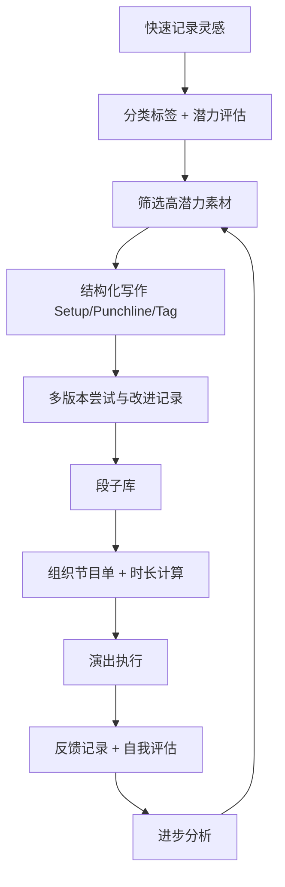

## 1. 产品概述

单口相声和喜剧写作素材管理工具，为喜剧演员和脱口秀表演者提供一站式创作管理平台。从日常观察记录到演出分析，帮助创作者高效管理素材库、打磨段子、组织节目和复盘表演。

- **目标用户**: 单口相声演员、脱口秀表演者、喜剧写作者
- **核心价值**: 系统化管理创作流程，追踪成长轨迹，提升表演质量

## 2. 核心功能

### 2.1 用户角色
| 角色 | 注册方式 | 核心权限 |
|------|----------|----------|
| 创作者 | 本地存储（无需注册） | 使用所有功能，数据本地持久化 |

### 2.2 功能模块
1. **素材收集页面**: 快速记录、分类标签、潜力评估
2. **段子创作页面**: 结构化写作、多版本对比、改进记录
3. **演出管理页面**: 节目单组织、时长计算、版本管理
4. **表演记录页面**: 反馈记录、自我评估、录像笔记
5. **进步分析页面**: 命中率统计、特征分析

### 2.3 页面详情

| 页面名称 | 模块名称 | 功能描述 |
|----------|----------|----------|
| 素材收集 | 快速记录卡片 | 输入灵感内容、选择分类、评估潜力（1-10分） |
| 素材收集 | 素材列表 | 按分类筛选、搜索、编辑、删除素材 |
| 素材收集 | 潜力评估 | 可视化潜力星级，高潜力素材优先展示 |
| 段子创作 | 结构化编辑器 | Setup/Punchline/Tag三段式写作框架 |
| 段子创作 | 版本对比 | 并排显示同一素材的多个版本，高亮差异 |
| 段子创作 | 修改历史 | 记录每次修改的时间、改动点和原因 |
| 演出管理 | 节目单编辑器 | 拖拽排序段子，添加过渡语，设置开场/结尾 |
| 演出管理 | 时长计算器 | 实时计算每个段子和总时长，可视化展示 |
| 演出管理 | 场合版本 | 创建商务/俱乐部/开放麦等不同场合的节目版本 |
| 表演记录 | 反馈记录 | 记录观众笑声点、冷场点、观众类型和规模 |
| 表演记录 | 自我评估 | 节奏把控、肢体语言、与观众互动评分 |
| 表演记录 | 录像笔记 | 时间线标注，关键点笔记，回看建议 |
| 进步分析 | 命中率统计 | 多场演出对比图表，包袱命中率趋势 |
| 进步分析 | 特征分析 | 最受欢迎段子的时长、结构、类型分析 |

## 3. 核心流程

### 3.1 素材到段子创作流程
1. 创作者在日常生活中使用快速记录功能捕捉灵感
2. 为素材添加分类标签并评估潜力
3. 选择高潜力素材进入段子创作
4. 使用Setup/Punchline/Tag框架写作
5. 尝试多个角度和版本，记录每次修改原因
6. 完成段子创作后可添加到节目单

### 3.2 演出准备到复盘流程
1. 创建演出节目单，拖拽排序段子
2. 设计过渡语言，计算总时长
3. 根据场合选择或定制节目版本
4. 演出后记录反馈、完成自我评估
5. 回看录像并做标注笔记
6. 查看进步分析，优化下次表演

## 4. 用户界面设计

### 4.1 设计风格

**主题色彩（喜剧舞台灵感）：**
- 主色调：深红色 #C41E3A（幕布红，代表舞台和热情）
- 辅助色：金色 #D4AF37（聚光灯金，代表高光时刻）
- 背景色：深海军蓝 #0A1628（剧场感，专业沉稳）
- 文字色：象牙白 #F5F5DC（温暖舒适）
- 强调色：珊瑚橙 #FF6B35（灵感火花，活力）

**设计理念：**
- 深色剧场模式，营造专注创作的氛围
- 金色高光元素，突出重要内容（如高潜力素材、响了的包袱）
- 卡片式布局，信息层次清晰
- 微动画：悬停浮起、添加成功的轻微弹跳、创作过程中的流畅过渡

**字体选择：**
- 标题：Playfair Display（优雅衬线，舞台感）
- 正文：Source Sans Pro（清晰易读的无衬线）
- 代码/编辑区：JetBrains Mono（等宽字体，适合写作）

**按钮风格：**
- 圆角：12px
- 悬停：轻微上浮 + 金色边框光效
- 按下：轻微下沉
- 主按钮：深红色填充 + 金色渐变边框

**图标风格：**
- 线性图标为主，搭配金色点缀
- 灵感：灯泡/火花
- 段子：麦克风/舞台
- 演出：聚光灯/掌声
- 分析：图表/奖杯

### 4.2 页面设计概述

| 页面名称 | 模块名称 | UI 元素 |
|----------|----------|---------|
| 素材收集 | 快速记录区 | 浮动快速记录按钮，展开后为简洁卡片式输入框，分类标签胶囊选择器，潜力星级滑块 |
| 素材收集 | 素材墙 | 瀑布流/网格布局的素材卡片，分类筛选侧边栏，潜力星级高亮显示 |
| 段子创作 | 编辑器 | 三段式布局：Setup（蓝色边框）/ Punchline（金色边框）/ Tag（灰色边框），实时字数统计，预计时长估算 |
| 段子创作 | 版本对比 | 左右分栏对比视图，差异文字高亮，版本切换下拉框 |
| 演出管理 | 节目单 | 可拖拽的段子卡片列表，每个卡片显示段子标题、预计时长、顺序编号，总时长进度条 |
| 演出管理 | 时长可视化 | 环形进度条显示总时长与目标时长对比，每个段子的时间条堆叠展示 |
| 表演记录 | 反馈记录 | 时间线形式记录，响了的包袱用金色星星标记，冷场点用灰色，观众类型标签 |
| 表演记录 | 自我评估 | 评分滑块（1-10分），评语输入框，结构化问题引导 |
| 进步分析 | 统计图表 | 折线图展示命中率趋势，饼图展示包袱类型分布，柱状图对比各场演出 |
| 进步分析 | 特征分析 | 词云展示高频有效元素，标签云展示成功段子特征 |

### 4.3 响应式
- 桌面端（1200px+）：完整侧边导航 + 主内容区双栏布局
- 平板端（768-1199px）：顶部导航 + 主内容区，卡片可缩小
- 移动端（<768px）：底部导航 + 单列布局，快速记录优先
