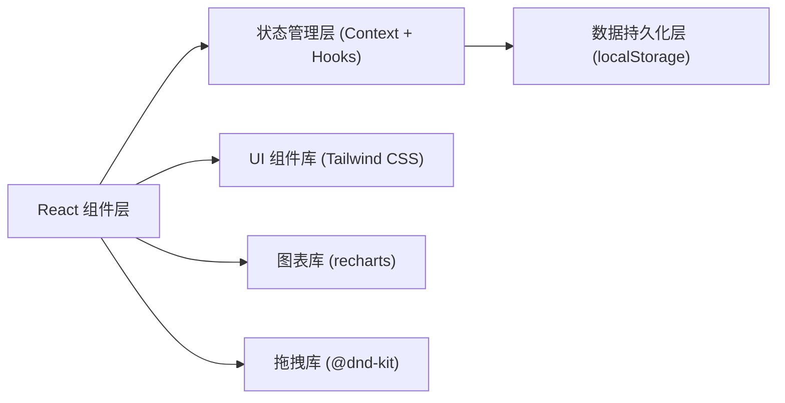

## 1. 架构设计

采用纯前端单页应用架构，数据使用 localStorage 本地持久化，无需后端服务。



## 2. 技术描述

- **前端框架**: React@18 + TypeScript
- **构建工具**: Vite@5
- **样式方案**: Tailwind CSS@3 + PostCSS
- **路由管理**: React Router DOM@6
- **状态管理**: React Context + useReducer + localStorage 持久化
- **图标库**: Lucide React
- **图表库**: recharts@2
- **拖拽功能**: @dnd-kit/core + @dnd-kit/sortable
- **包管理器**: pnpm

## 3. 目录结构

```
src/
├── components/           # 通用组件
│   ├── Layout/          # 布局组件
│   ├── UI/              # 基础UI组件（按钮、卡片、模态框等）
│   └── common/          # 通用业务组件
├── pages/               # 页面组件
│   ├── Materials/       # 素材收集页面
│   ├── Jokes/           # 段子创作页面
│   ├── Performances/    # 演出管理页面
│   ├── Records/         # 表演记录页面
│   └── Analytics/       # 进步分析页面
├── context/             # React Context
│   ├── MaterialContext.tsx
│   ├── JokeContext.tsx
│   ├── PerformanceContext.tsx
│   └── RecordContext.tsx
├── hooks/               # 自定义 Hooks
│   ├── useLocalStorage.ts
│   └── useToast.ts
├── types/               # TypeScript 类型定义
│   └── index.ts
├── utils/               # 工具函数
│   ├── duration.ts      # 时长计算
│   ├── analysis.ts      # 数据分析
│   └── storage.ts       # 存储工具
├── data/                # 示例数据
│   └── seedData.ts
├── App.tsx
├── main.tsx
└── index.css
```

## 4. 路由定义

| 路由 | 页面名称 | 组件 |
|------|----------|------|
| / | 素材收集 | MaterialsPage |
| /jokes | 段子创作 | JokesPage |
| /jokes/:id | 段子详情/编辑 | JokeEditorPage |
| /performances | 演出管理 | PerformancesPage |
| /performances/:id | 节目单编辑 | PerformanceEditorPage |
| /records | 表演记录 | RecordsPage |
| /records/:id | 记录详情 | RecordDetailPage |
| /analytics | 进步分析 | AnalyticsPage |

## 5. 数据模型

### 5.1 数据模型定义

```mermaid
erDiagram
    MATERIAL {
        string id PK
        string content
        string category
        string[] tags
        number potential
        Date createdAt
        Date updatedAt
        string note
    }
    
    JOKE {
        string id PK
        string materialId FK
        string title
        string setup
        string punchline
        string tag
        number estimatedDuration
        string category
        string[] tags
        Date createdAt
        Date updatedAt
    }
    
    JOKE_VERSION {
        string id PK
        string jokeId FK
        number versionNumber
        string setup
        string punchline
        string tag
        string changeReason
        Date createdAt
    }
    
    PERFORMANCE {
        string id PK
        string name
        string occasion
        number targetDuration
        Date date
        string venue
        JokeSlot[] jokeSlots
        Date createdAt
        Date updatedAt
    }
    
    JOKE_SLOT {
        string id PK
        string jokeId FK
        number order
        string transition
        number actualDuration
    }
    
    SHOW_RECORD {
        string id PK
        string performanceId FK
        Date date
        string venue
        string audienceType
        number audienceSize
        string overallFeedback
        number overallRating
        JokeFeedback[] jokeFeedbacks
        SelfEvaluation selfEvaluation
        VideoNote[] videoNotes
        Date createdAt
    }
    
    JOKE_FEEDBACK {
        string jokeId FK
        boolean landed
        string feedback
        number laughterDuration
        string[] bestLines
        string[] weakPoints
    }
    
    SELF_EVALUATION {
        number rhythmRating
        number bodyLanguageRating
        number interactionRating
        string comment
    }
    
    VIDEO_NOTE {
        string id PK
        number timestamp
        string note
        string type
    }
```



### 5.2 TypeScript 类型定义

```typescript
// 素材类型
export type MaterialCategory = 'family' | 'workplace' | 'society' | 'personal' | 'other';

export interface Material {
  id: string;
  content: string;
  category: MaterialCategory;
  tags: string[];
  potential: number; // 1-10
  createdAt: string;
  updatedAt: string;
  note?: string;
}

// 段子类型
export interface Joke {
  id: string;
  materialId?: string;
  title: string;
  setup: string;
  punchline: string;
  tag: string;
  estimatedDuration: number; // 秒
  category: MaterialCategory;
  tags: string[];
  createdAt: string;
  updatedAt: string;
}

export interface JokeVersion {
  id: string;
  jokeId: string;
  versionNumber: number;
  setup: string;
  punchline: string;
  tag: string;
  changeReason: string;
  createdAt: string;
}

// 演出节目单
export type OccasionType = 'club' | 'corporate' | 'open_mic' | 'special' | 'other';

export interface JokeSlot {
  id: string;
  jokeId: string;
  order: number;
  transition?: string;
  actualDuration?: number;
}

export interface Performance {
  id: string;
  name: string;
  occasion: OccasionType;
  targetDuration: number; // 分钟
  date?: string;
  venue?: string;
  jokeSlots: JokeSlot[];
  createdAt: string;
  updatedAt: string;
}

// 表演记录
export type AudienceType = 'general' | 'professional' | 'student' | 'family' | 'international' | 'other';

export interface JokeFeedback {
  jokeId: string;
  landed: boolean;
  feedback?: string;
  laughterDuration?: number; // 秒
  bestLines: string[];
  weakPoints: string[];
}

export interface SelfEvaluation {
  rhythmRating: number; // 1-10
  bodyLanguageRating: number; // 1-10
  interactionRating: number; // 1-10
  comment?: string;
}

export interface VideoNote {
  id: string;
  timestamp: number; // 秒
  note: string;
  type: 'good' | 'bad' | 'improvement' | 'note';
}

export interface ShowRecord {
  id: string;
  performanceId?: string;
  date: string;
  venue?: string;
  audienceType: AudienceType;
  audienceSize: number;
  overallFeedback?: string;
  overallRating: number; // 1-10
  jokeFeedbacks: JokeFeedback[];
  selfEvaluation?: SelfEvaluation;
  videoNotes: VideoNote[];
  createdAt: string;
}

// 分析数据
export interface HitRateAnalysis {
  totalJokes: number;
  landedJokes: number;
  hitRate: number;
  byCategory: Record<MaterialCategory, { total: number; landed: number; rate: number }>;
}
```

### 5.3 localStorage 存储键

| 键名 | 数据类型 | 说明 |
|------|----------|------|
| comedy_materials | Material[] | 素材库 |
| comedy_jokes | Joke[] | 段子库 |
| comedy_joke_versions | JokeVersion[] | 段子版本历史 |
| comedy_performances | Performance[] | 演出节目单 |
| comedy_records | ShowRecord[] | 表演记录 |

## 6. 核心功能实现方案

### 6.1 素材收集模块
- 快速记录：浮动按钮 + 模态框表单
- 分类标签：预设分类胶囊按钮 + 自定义标签输入
- 潜力评估：1-10 滑块 + 星级可视化
- 列表筛选：按分类、潜力、时间筛选

### 6.2 段子创作模块
- 结构化编辑器：三栏布局，Setup/Punchline/Tag 分区编辑
- 多版本管理：保存时创建版本快照，支持版本对比
- 改进记录：版本变更日志 + 改动原因记录

### 6.3 演出管理模块
- 拖拽排序：@dnd-kit 实现段子卡片拖拽排序
- 时长计算：每个段子 estimatedDuration 累加，实时更新
- 版本管理：按场合标签分组，支持复制节目单快速创建新版本

### 6.4 表演记录模块
- 反馈记录：每个段子独立反馈表单
- 自我评估：多维度评分滑块
- 录像笔记：时间轴 + 时间戳标记

### 6.5 进步分析模块
- 命中率统计：recharts 折线图 + 柱状图
- 特征分析：标签频率统计 + 成功段子共性提取
