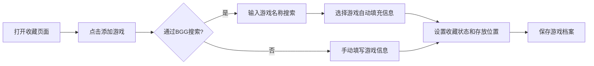

## 1. Product Overview

在线棋盘游戏收藏和规则速查工具，帮助桌游爱好者管理游戏收藏、记录游玩历史、整理规则要点，并根据场景推荐合适的游戏。

- **主要目的**：一站式管理桌游收藏，提供游戏档案、游玩记录、规则速查、智能推荐等功能
- **目标用户**：桌游爱好者、桌游收藏者、桌游社团组织者
- **市场价值**：解决桌游玩家在管理收藏、查找规则、记录游戏数据方面的痛点

## 2. Core Features

### 2.1 User Roles
| Role | Registration Method | Core Permissions |
|------|---------------------|------------------|
| Normal User | 本地存储（无注册） | 管理个人游戏收藏、记录游玩历史、整理规则笔记、使用推荐功能 |

### 2.2 Feature Module
1. **游戏收藏模块**：游戏档案管理、收藏状态管理、存放位置标注
2. **游戏记录模块**：游玩记录、统计数据、游戏搭子记录
3. **规则速查模块**：规则要点整理、Q&A记录、教学引导笔记
4. **游戏推荐辅助模块**：条件筛选、复杂度和场合标注、评测记录
5. **扩展内容管理模块**：扩展包管理、自定义游戏内容

### 2.3 Page Details
| Page Name | Module Name | Feature description |
|-----------|-------------|---------------------|
| 首页Dashboard | 仪表盘 | 展示收藏概览、最近游玩、快捷操作入口 |
| 游戏收藏 | 收藏管理 | 游戏列表、添加/编辑游戏、BoardGameGeek API导入、收藏状态筛选、位置管理 |
| 游玩记录 | 记录管理 | 游玩历史列表、添加/编辑记录、游戏统计、玩家统计 |
| 规则速查 | 规则管理 | 规则要点列表、Q&A问答、教学笔记、游戏关联 |
| 游戏推荐 | 推荐系统 | 条件筛选器、游戏匹配、复杂度和场合标签 |
| 扩展内容 | 扩展管理 | 扩展包列表、自定义内容管理 |
| 游戏详情 | 详情页面 | 游戏完整信息、关联记录、规则笔记、评测记录 |

## 3. Core Process

### 3.1 添加新游戏流程

### 3.2 记录游玩流程

### 3.3 游戏推荐流程

## 4. User Interface Design

### 4.1 Design Style
- **主色调**：深靛蓝 (#1a1a40) 作为主色，温暖琥珀色 (#d4a574) 作为强调色
- **背景色**：深炭灰 (#121212)，营造沉浸式桌游夜氛围
- **按钮风格**：圆角矩形，带微妙阴影，hover时有轻微上浮效果
- **字体**：展示字体使用 'Playfair Display'（优雅复古感），正文字体使用 'Inter'（现代易读）
- **布局风格**：卡片式布局，网格排列，充足留白，深度阴影营造层次感
- **图标风格**：使用 Lucide 图标，线宽 2px，柔和圆角

### 4.2 Page Design Overview
| Page Name | Module Name | UI Elements |
|-----------|-------------|-------------|
| Dashboard | 仪表盘 | 统计卡片、最近游玩时间线、快捷操作按钮、游戏数量环形图 |
| 游戏收藏 | 收藏列表 | 网格卡片、筛选器、搜索框、状态标签、位置标签、悬浮预览 |
| 游玩记录 | 记录列表 | 时间线视图、游戏统计图表、玩家排名、记录卡片 |
| 规则速查 | 规则列表 | 可折叠面板、标签分类、搜索过滤、快速编辑 |
| 游戏推荐 | 推荐页面 | 条件滑块、风格标签、匹配度评分、推荐理由 |
| 游戏详情 | 详情页面 | 封面大图、信息网格、标签页切换（详情/记录/规则/评测） |

### 4.3 Responsiveness
- 桌面端优先设计，采用响应式适配
- 侧边导航在移动端转为底部导航栏
- 网格布局在小屏幕上自动调整列数
- 卡片内容在移动端重新排列为垂直堆叠

## 5. Core Functional Requirements

### 5.1 游戏收藏模块
- 游戏档案：名称、出版社、人数范围、时长、复杂度、发布年份、封面图
- BoardGameGeek API 搜索和自动填充功能
- 收藏状态：已拥有、愿望清单、已出售、已借出
- 存放位置：书柜、层号、位置备注

### 5.2 游戏记录模块
- 游玩记录：时间、参与玩家、游戏时长、胜者、个人评分
- 统计数据：某款游戏的胜率、游玩次数、平均时长
- 游戏搭子：最常一起玩的人排名、共同游戏记录

### 5.3 规则速查模块
- 规则要点：自定义整理、常被遗忘的规则、争议裁判方式
- Q&A记录：常见问题和答案
- 教学引导：首次教人玩的简化规则说明

### 5.4 游戏推荐辅助模块
- 条件筛选：人数、时长、游戏风格、复杂度
- 自定义标注：复杂度等级、适合场合标签
- 评测记录：第一印象、第二次感受、长期评价

### 5.5 扩展内容管理模块
- 扩展包管理：基础游戏关联、扩展信息
- 自定义内容：自定义变体规则、自创游戏
