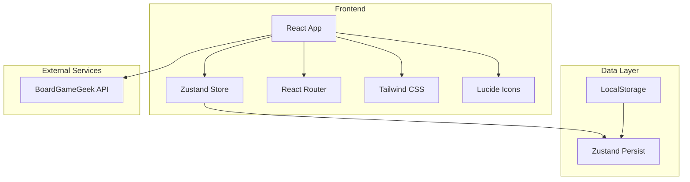
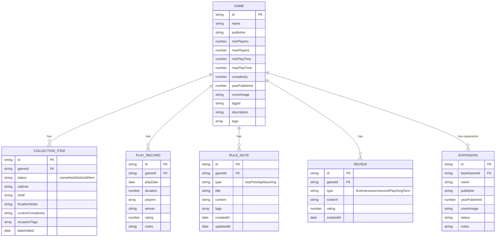

## 1. Architecture Design



## 2. Technology Description

- **Frontend**: React@18 + TypeScript + Tailwind CSS@3 + Vite
- **State Management**: Zustand (with persist middleware for LocalStorage)
- **Routing**: React Router DOM
- **Icons**: Lucide React
- **Data Storage**: Browser LocalStorage (通过 Zustand persist 持久化)
- **External API**: BoardGameGeek XML API (用于搜索和导入游戏信息)
- **Charts/Visualization**: Recharts (用于数据统计图表)

## 3. Route Definitions

| Route | Purpose | Page Component |
|-------|---------|----------------|
| / | 首页仪表盘 | Dashboard |
| /collection | 游戏收藏列表 | Collection |
| /collection/add | 添加新游戏 | GameForm |
| /collection/:id | 游戏详情 | GameDetail |
| /collection/:id/edit | 编辑游戏 | GameForm |
| /plays | 游玩记录列表 | Plays |
| /plays/add | 添加游玩记录 | PlayForm |
| /rules | 规则速查 | Rules |
| /recommend | 游戏推荐 | Recommend |
| /expansions | 扩展内容管理 | Expansions |

## 4. Data Model

### 4.1 Data Model Definition



### 4.2 TypeScript Interfaces

```typescript
interface Game {
  id: string;
  name: string;
  publisher: string;
  minPlayers: number;
  maxPlayers: number;
  minPlayTime: number;
  maxPlayTime: number;
  complexity: number; // BGG weight 1-5
  yearPublished: number;
  coverImage: string;
  bggId?: string;
  description?: string;
  tags: string[];
}

type CollectionStatus = 'owned' | 'wishlist' | 'sold' | 'lent';

interface CollectionItem {
  id: string;
  gameId: string;
  status: CollectionStatus;
  cabinet: string;
  shelf: string;
  locationNotes?: string;
  customComplexity?: number;
  occasionTags: string[];
  dateAdded: string;
}

interface Player {
  name: string;
  isWinner?: boolean;
  score?: number;
}

interface PlayRecord {
  id: string;
  gameId: string;
  playDate: string;
  duration: number; // minutes
  players: Player[];
  winner?: string;
  rating: number; // 1-10
  notes?: string;
}

type RuleNoteType = 'keyPoint' | 'qa' | 'teaching';

interface RuleNote {
  id: string;
  gameId: string;
  type: RuleNoteType;
  title: string;
  content: string;
  tags: string[];
  createdAt: string;
  updatedAt: string;
}

type ReviewType = 'firstImpression' | 'secondPlay' | 'longTerm';

interface Review {
  id: string;
  gameId: string;
  type: ReviewType;
  content: string;
  rating: number; // 1-10
  createdAt: string;
}

interface Expansion {
  id: string;
  baseGameId: string;
  name: string;
  publisher: string;
  yearPublished: number;
  coverImage: string;
  status: CollectionStatus;
  notes?: string;
}
```

## 5. Store Structure (Zustand)

```typescript
interface GameStore {
  // Games
  games: Game[];
  addGame: (game: Omit<Game, 'id'>) => void;
  updateGame: (id: string, game: Partial<Game>) => void;
  deleteGame: (id: string) => void;
  
  // Collection
  collectionItems: CollectionItem[];
  addCollectionItem: (item: Omit<CollectionItem, 'id'>) => void;
  updateCollectionItem: (id: string, item: Partial<CollectionItem>) => void;
  deleteCollectionItem: (id: string) => void;
  
  // Plays
  playRecords: PlayRecord[];
  addPlayRecord: (record: Omit<PlayRecord, 'id'>) => void;
  updatePlayRecord: (id: string, record: Partial<PlayRecord>) => void;
  deletePlayRecord: (id: string) => void;
  
  // Rules
  ruleNotes: RuleNote[];
  addRuleNote: (note: Omit<RuleNote, 'id' | 'createdAt' | 'updatedAt'>) => void;
  updateRuleNote: (id: string, note: Partial<RuleNote>) => void;
  deleteRuleNote: (id: string) => void;
  
  // Reviews
  reviews: Review[];
  addReview: (review: Omit<Review, 'id' | 'createdAt'>) => void;
  updateReview: (id: string, review: Partial<Review>) => void;
  deleteReview: (id: string) => void;
  
  // Expansions
  expansions: Expansion[];
  addExpansion: (expansion: Omit<Expansion, 'id'>) => void;
  updateExpansion: (id: string, expansion: Partial<Expansion>) => void;
  deleteExpansion: (id: string) => void;
}
```

## 6. Project Structure

```
src/
├── components/
│   ├── layout/
│   │   ├── Sidebar.tsx
│   │   ├── BottomNav.tsx
│   │   └── Header.tsx
│   ├── common/
│   │   ├── Card.tsx
│   │   ├── Button.tsx
│   │   ├── Modal.tsx
│   │   ├── Input.tsx
│   │   ├── Select.tsx
│   │   └── Tag.tsx
│   ├── games/
│   │   ├── GameCard.tsx
│   │   ├── GameForm.tsx
│   │   └── BGSearch.tsx
│   ├── plays/
│   │   ├── PlayCard.tsx
│   │   ├── PlayForm.tsx
│   │   └── StatsChart.tsx
│   └── rules/
│       ├── RuleCard.tsx
│       └── RuleForm.tsx
├── pages/
│   ├── Dashboard.tsx
│   ├── Collection.tsx
│   ├── GameDetail.tsx
│   ├── Plays.tsx
│   ├── Rules.tsx
│   ├── Recommend.tsx
│   └── Expansions.tsx
├── store/
│   └── useGameStore.ts
├── types/
│   └── index.ts
├── utils/
│   ├── bggApi.ts
│   ├── helpers.ts
│   └── seedData.ts
├── App.tsx
├── main.tsx
└── index.css
```

## 7. BGG API Integration

BoardGameGeek API 使用 XML API2：
- 搜索：`https://boardgamegeek.com/xmlapi2/search?query={name}&type=boardgame`
- 游戏详情：`https://boardgamegeek.com/xmlapi2/thing?id={bggId}&stats=1`

由于跨域限制，前端直接调用可能会有问题，我们将：
1. 使用模拟数据作为主要数据源
2. 提供演示搜索功能，展示 API 集成的 UI 流程
3. 实际部署时可配合 CORS 代理或后端服务

## 8. Styling Configuration

Tailwind CSS 自定义配置：
- 深色主题（桌游夜氛围）
- 自定义颜色：靛蓝主色、琥珀强调色
- 自定义字体：Playfair Display (标题), Inter (正文)
- 自定义动画和过渡效果
