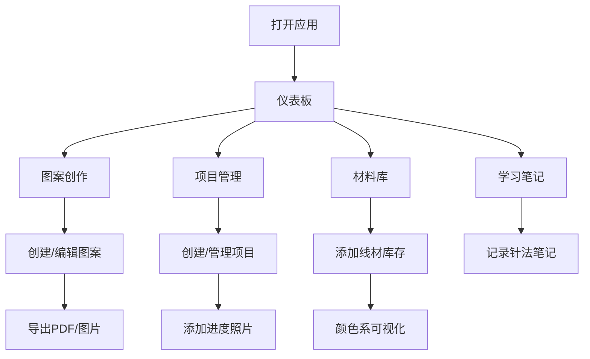

## 1. Product Overview

在线图案和织物设计管理工具，为手工编织、刺绣、针织爱好者提供从图案设计到项目管理的一体化解决方案。帮助用户管理线材库存、追踪项目进度、记录学习心得。

- 主要用途：设计编织图案、管理线材库存、追踪项目进度、记录学习经验
- 目标用户：手工编织/刺绣/针织爱好者、手工艺者、小型工作室
- 市场价值：整合分散的设计、库存、学习资源，提供一站式创作管理平台

## 2. Core Features

### 2.1 User Roles
| Role | Registration Method | Core Permissions |
|------|---------------------|------------------|
| Normal User | Email registration | 创建/编辑/管理图案、项目、材料库、学习记录 |

### 2.2 Feature Module
1. **图案创作模块**：像素网格编辑器、颜色线材调色盘、对称重复设置
2. **项目管理模块**：项目档案、材料用量计算、进度照片记录
3. **材料库管理模块**：线材库存追踪、颜色系可视化、使用历史
4. **图案导出模块**：PDF导出、材料清单导出、图案分享
5. **学习记录模块**：针法笔记、问题解决方案记录

### 2.3 Page Details
| Page Name | Module Name | Feature description |
|-----------|-------------|---------------------|
| 仪表板 | 概览模块 | 显示项目进度、最近图案、线材库存概览 |
| 图案编辑器 | 图案创作模块 | 像素网格编辑器，支持自定义格子大小、调色盘、对称设置 |
| 图案列表 | 图案管理模块 | 浏览、搜索、管理所有图案 |
| 项目列表 | 项目管理模块 | 浏览、搜索、管理所有项目 |
| 项目详情 | 项目管理模块 | 项目档案、材料用量计算、进度照片 |
| 材料库 | 材料库管理模块 | 线材库存列表、颜色系可视化、使用历史 |
| 学习笔记 | 学习记录模块 | 针法笔记、问题解决方案管理 |
| 设置 | 系统设置 | 用户信息、应用偏好设置 |

## 3. Core Process

1. **图案设计流程**：用户创建新图案 → 设置网格尺寸和格子大小 → 使用调色盘选择线材颜色 → 在网格上绘制图案 → 应用对称/重复效果 → 保存图案
2. **项目创建流程**：用户创建新项目 → 选择类型和尺寸 → 关联使用的图案 → 选择/匹配线材 → 系统计算材料用量 → 开始制作并记录进度
3. **材料管理流程**：添加新线材（品牌/色号/克重/颜色） → 查看按颜色系组织的库存 → 在项目中使用线材 → 自动扣减库存并记录使用历史
4. **导出分享流程**：选择图案 → 导出PDF网格图和材料清单 → 生成分享图片

## 4. User Interface Design

### 4.1 Design Style
- **主色调**：温暖米色（#F5F0E8）作为背景，搭配森林绿（#4A6741）作为主强调色，珊瑚橙（#E88A7A）作为次强调色
- **辅助色**：白色卡片，深灰色文字，浅灰色边框
- **按钮风格**：圆角矩形，轻微阴影，悬停时有颜色加深效果
- **字体**：Playfair Display（标题）+ Lato（正文）
- **布局风格**：侧边导航 + 卡片式内容区，简洁大方
- **Icon风格**：Lucide图标库，线性简约风格

### 4.2 Page Design Overview
| Page Name | Module Name | UI Elements |
|-----------|-------------|-------------|
| 仪表板 | 概览模块 | 统计卡片、最近项目列表、线材库存摘要、快捷操作入口 |
| 图案编辑器 | 图案创作模块 | 左侧工具栏（笔/橡皮擦/调色盘/对称设置）、中央画布网格、右侧属性面板 |
| 项目列表 | 项目管理模块 | 搜索过滤栏、项目卡片网格、进度条显示、新建按钮 |
| 项目详情 | 项目管理模块 | 项目信息表单、材料计算结果、照片时间线、进度跟踪 |
| 材料库 | 材料库管理模块 | 顶部标签（列表/颜色视图）、线材卡片、颜色系色盘、使用历史侧边栏 |
| 学习笔记 | 学习记录模块 | 针法卡片列表、笔记编辑器、问题解决方案标签页 |

### 4.3 Responsiveness
- 桌面端优先设计，适配1200px+宽度
- 平板端（768px-1199px）：侧边栏折叠为图标模式
- 移动端（<768px）：底部导航栏，卡片单列布局
- 触摸优化：按钮最小44x44px，适当的点击区域

### 4.4 Visual Details
- 背景使用微妙的织物纹理图案叠加
- 卡片有轻微的阴影和圆角（8px）
- 过渡动画：0.2s ease-in-out
- 网格编辑器使用真实线材颜色展示
