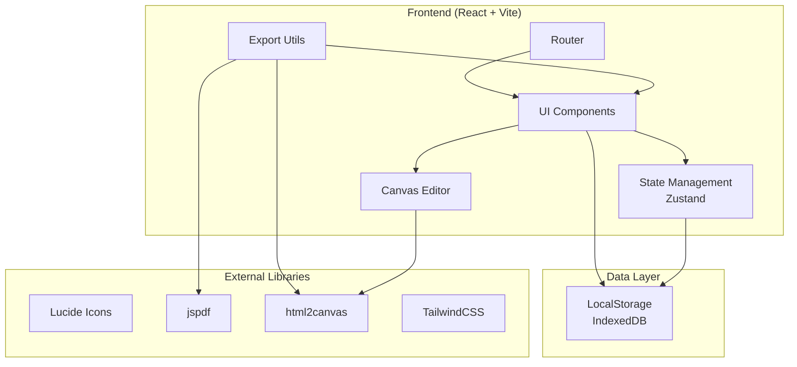

## 1. Architecture Design



## 2. Technology Description

- **Frontend**: React@18 + TypeScript + Vite
- **Styling**: TailwindCSS@3
- **State Management**: Zustand
- **Icons**: Lucide React
- **PDF导出**: jspdf
- **图片导出**: html2canvas
- **本地存储**: localStorage + IndexedDB (通过zustand-persist)
- **后端**: 纯前端应用，使用本地存储持久化数据

## 3. Route Definitions

| Route | Component | Purpose |
|-------|-----------|---------|
| / | Dashboard | 仪表板首页 |
| /patterns | PatternList | 图案列表页 |
| /patterns/new | PatternEditor | 新建图案 |
| /patterns/:id | PatternEditor | 编辑图案 |
| /projects | ProjectList | 项目列表页 |
| /projects/new | ProjectEditor | 新建项目 |
| /projects/:id | ProjectDetail | 项目详情页 |
| /materials | MaterialLibrary | 材料库 |
| /learning | LearningNotes | 学习笔记 |
| /settings | Settings | 设置页面 |

## 4. Project Structure

```
src/
├── components/
│   ├── common/
│   │   ├── Button.tsx
│   │   ├── Card.tsx
│   │   ├── Modal.tsx
│   │   ├── ProgressBar.tsx
│   │   └── SearchBar.tsx
│   ├── layout/
│   │   ├── Sidebar.tsx
│   │   ├── Header.tsx
│   │   └── MobileNav.tsx
│   ├── editor/
│   │   ├── PixelGrid.tsx
│   │   ├── Toolbar.tsx
│   │   ├── ColorPalette.tsx
│   │   └── SymmetryPanel.tsx
│   └── materials/
│       ├── MaterialCard.tsx
│       ├── ColorWheel.tsx
│       └── UsageHistory.tsx
├── pages/
│   ├── Dashboard.tsx
│   ├── PatternList.tsx
│   ├── PatternEditor.tsx
│   ├── ProjectList.tsx
│   ├── ProjectDetail.tsx
│   ├── MaterialLibrary.tsx
│   ├── LearningNotes.tsx
│   └── Settings.tsx
├── stores/
│   ├── patternStore.ts
│   ├── projectStore.ts
│   ├── materialStore.ts
│   └── learningStore.ts
├── types/
│   └── index.ts
├── utils/
│   ├── export.ts
│   ├── materialCalculator.ts
│   └── colorUtils.ts
├── hooks/
│   └── useLocalStorage.ts
├── App.tsx
├── main.tsx
└── index.css
```

## 5. Data Model

### 5.1 TypeScript Interfaces

```typescript
// 线材类型
interface Yarn {
  id: string;
  brand: string;
  colorCode: string;
  colorName: string;
  colorHex: string;
  weight: number;
  remainingWeight: number;
  category: string;
  createdAt: string;
  updatedAt: string;
}

// 像素点
interface Pixel {
  x: number;
  y: number;
  color: string;
  yarnId?: string;
}

// 对称设置
interface SymmetrySettings {
  horizontal: boolean;
  vertical: boolean;
  diagonal1: boolean;
  diagonal2: boolean;
  rotation: number;
  repeatX: number;
  repeatY: number;
}

// 图案
interface Pattern {
  id: string;
  name: string;
  description: string;
  gridWidth: number;
  gridHeight: number;
  cellSize: number;
  pixels: Pixel[];
  symmetry: SymmetrySettings;
  usedYarns: string[];
  createdAt: string;
  updatedAt: string;
}

// 项目
interface Project {
  id: string;
  name: string;
  type: 'knitting' | 'crochet' | 'embroidery' | 'weaving';
  patternId?: string;
  dimensions: {
    width: number;
    height: number;
    unit: 'cm' | 'in';
  };
  yarnsUsed: { yarnId: string; estimatedWeight: number; usedWeight: number }[];
  progress: number;
  status: 'planning' | 'in_progress' | 'completed';
  photos: { url: string; note: string; createdAt: string }[];
  notes: string;
  createdAt: string;
  updatedAt: string;
}

// 线材使用记录
interface YarnUsage {
  id: string;
  yarnId: string;
  projectId: string;
  weightUsed: number;
  createdAt: string;
}

// 针法笔记
interface StitchNote {
  id: string;
  name: string;
  type: string;
  instructions: string;
  tips: string;
  createdAt: string;
  updatedAt: string;
}

// 问题解决方案
interface ProblemSolution {
  id: string;
  title: string;
  problem: string;
  solution: string;
  tags: string[];
  createdAt: string;
  updatedAt: string;
}
```

### 5.2 Storage Structure

使用 IndexedDB 存储复杂数据结构，localStorage 存储应用偏好设置：

- **IndexedDB**: patterns, projects, yarns, usageHistory, stitchNotes, problemSolutions
- **localStorage**: theme, editorSettings, lastViewed

## 6. Core Utilities

### 6.1 材料计算工具
- 根据图案像素统计每种颜色使用量
- 结合项目尺寸估算所需线材克重
- 计算公式：`(像素数 × 单像素线材量 × 尺寸系数) / 线材密度`

### 6.2 导出工具
- PDF导出：使用 jspdf 生成网格图和材料清单
- 图片导出：使用 html2canvas 截取编辑器画布
- 材料清单导出：CSV/JSON格式

### 6.3 对称算法
- 水平/垂直镜像对称
- 对角对称
- 旋转对称（90°/180°/270°）
- 横向/纵向重复平铺

## 7. Feature Dependencies

```
图案编辑器 ──→ 材料库（选择线材颜色）
         └──→ 项目（关联图案）
项目 ──→ 材料库（计算用量、扣减库存）
     └──→ 图案（引用设计）
材料库 ──→ 项目（使用历史记录）
```
