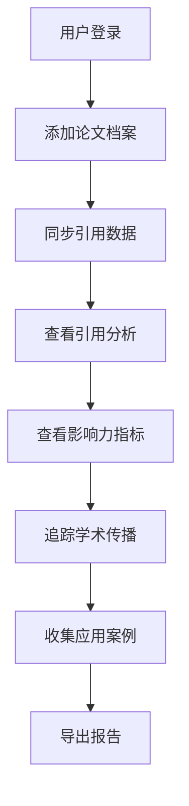

# 在线学术引用分析和影响力追踪工具 PRD

## 1. Product Overview

在线学术引用分析和影响力追踪工具是一款面向学术研究者的专业工具，帮助学者追踪自己论文的引用情况、分析学术影响力、监测社交媒体传播，并收集研究成果的实际应用案例。

- **主要目的**：提供全面的学术影响力可视化分析，帮助研究者了解自己论文的被引情况、传播范围和实际应用价值
- **目标用户**：大学教授、研究员、博士生等学术研究者
- **市场价值**：帮助学者更好地评估自身研究成果的影响力，为申请基金、职称评审、学术合作提供数据支持

## 2. Core Features

### 2.1 User Roles

| Role | Registration Method | Core Permissions |
|------|---------------------|------------------|
| Normal User | Email/Social login | 管理论文档案、查看引用分析、追踪传播数据、收集应用案例 |

### 2.2 Feature Module

1. **论文追踪模块**：论文档案管理、引用数据同步、历史曲线展示
2. **引用分析模块**：引用记录管理、场景分类、热点分析
3. **学术影响力指标模块**：H指数计算、引用可视化、同领域对比
4. **学术传播追踪模块**：社交媒体讨论、博客/新闻引用、下载量统计
5. **研究影响评估模块**：应用案例收集、分类管理

### 2.3 Page Details

| Page Name | Module Name | Feature description |
|-----------|-------------|---------------------|
| Dashboard | 概览页 | 显示核心指标概览、最新引用动态、引用趋势图 |
| 论文管理 | 论文档案管理 | 添加/编辑/删除论文信息（标题/期刊/发表时间/DOI/被引次数） |
| 引用分析 | 引用分析模块 | 查看引用来源、分类引用场景、分析热点趋势 |
| 影响力指标 | 学术影响力模块 | H指数计算、引用分布图表、同领域学者对比 |
| 传播追踪 | 学术传播模块 | 社交媒体关注、博客/新闻引用、下载量数据 |
| 应用案例 | 研究影响评估 | 添加/管理应用案例（产品/政策引用） |
| 设置 | 系统设置 | API密钥配置、同步频率设置、个人资料管理 |

## 3. Core Process

用户流程：
1. 用户注册/登录系统
2. 添加自己发表的论文信息到档案库
3. 系统通过API定期同步引用数据
4. 用户查看引用分析和影响力指标
5. 追踪社交媒体和博客传播情况
6. 收集研究成果的实际应用案例

## 4. User Interface Design

### 4.1 Design Style

- **主色调**：深蓝 #1E3A5F（学术专业感）
- **辅助色**：青色 #2DD4BF（强调色）、琥珀色 #F59E0B（警告/提示）
- **中性色**：灰色系 #1F2937, #374151, #9CA3AF, #E5E7EB
- **按钮风格**：圆角矩形，悬停有阴影效果，带有微动画
- **字体**：Playfair Display（标题，优雅学术风）+ IBM Plex Sans（正文，清晰专业）
- **布局风格**：左侧导航栏 + 主内容区，卡片式布局，信息层级分明
- **图标风格**：使用 Lucide 图标库，线条简洁，统一24px

### 4.2 Page Design Overview

| Page Name | Module Name | UI Elements |
|-----------|-------------|-------------|
| Dashboard | 概览 | 统计卡片（H指数、总引用、论文数量）、趋势图表、最近引用列表 |
| 论文管理 | 档案管理 | 论文列表表格、添加论文表单、批量操作按钮、搜索筛选框 |
| 引用分析 | 引用来源 | 引用记录表格、分类标签页、热点分析图表、时间轴视图 |
| 影响力指标 | 可视化分析 | 圆形进度条（H指数）、柱状图（单篇引用排名）、热力图（引用时间分布） |
| 传播追踪 | 社交媒体 | 社交媒体平台卡片、新闻列表、下载量趋势图、Altmetric分数展示 |
| 应用案例 | 影响评估 | 案例卡片网格、分类筛选、添加案例表单、案例详情弹窗 |
| 设置 | 系统配置 | API密钥输入框、同步频率选择器、个人信息表单、数据导出按钮 |

### 4.3 Responsiveness

- 桌面端（1200px+）：完整布局，左侧导航栏固定宽度240px
- 平板端（768px-1199px）：导航栏折叠为汉堡菜单，网格布局响应式调整
- 移动端（<768px）：垂直堆叠布局，卡片单列显示，简化交互

### 4.4 数据可视化设计

- 使用 Chart.js/recharts 实现图表
- 引用趋势：折线图，显示每月被引数量
- 引用分类：环形图，显示各类引用场景占比
- H指数对比：雷达图，与同领域学者对比
- 热点分析：热力图，显示引用时间分布密度
