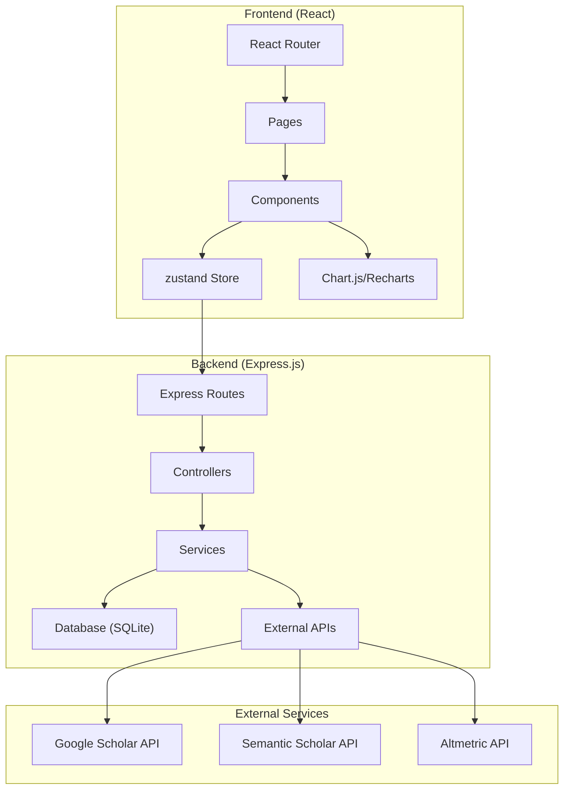
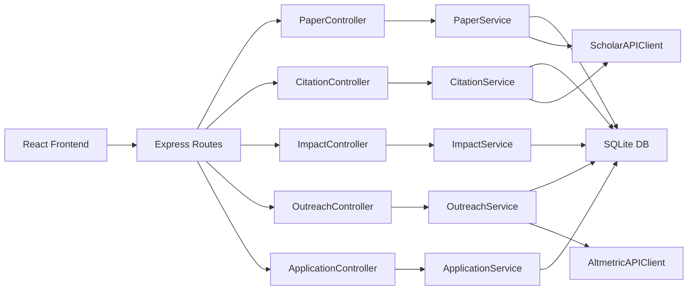
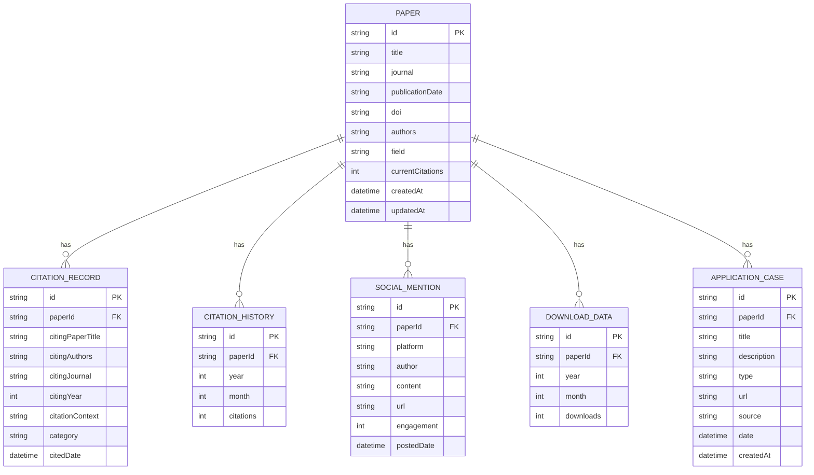

# 在线学术引用分析和影响力追踪工具 - 技术架构文档

## 1. Architecture Design



## 2. Technology Description

- **Frontend**: React@18 + TypeScript + Vite + TailwindCSS@3 + Zustand + react-router-dom
- **Initialization Tool**: vite-init (react-express-ts template)
- **Backend**: Express@4 + TypeScript
- **Database**: SQLite (简单数据存储，便于本地部署)
- **Chart Library**: Recharts
- **Icon Library**: lucide-react
- **HTTP Client**: Axios

## 3. Route Definitions

| Route | Purpose |
|-------|---------|
| / | 仪表板概览页 |
| /papers | 论文档案管理页 |
| /citations | 引用分析页 |
| /impact | 学术影响力指标页 |
| /outreach | 学术传播追踪页 |
| /applications | 研究影响评估页 |
| /settings | 系统设置页 |

## 4. API Definitions

### 4.1 论文管理 API

```typescript
// 论文数据类型
interface Paper {
  id: string;
  title: string;
  journal: string;
  publicationDate: string;
  doi: string;
  authors: string[];
  currentCitations: number;
  field: string;
  createdAt: string;
  updatedAt: string;
}

// 获取所有论文
GET /api/papers
Response: Paper[]

// 添加论文
POST /api/papers
Body: Omit<Paper, 'id' | 'createdAt' | 'updatedAt'>
Response: Paper

// 更新论文
PUT /api/papers/:id
Body: Partial<Paper>
Response: Paper

// 删除论文
DELETE /api/papers/:id
Response: { success: boolean }

// 同步引用数据
POST /api/papers/:id/sync
Response: { paper: Paper; citationHistory: CitationHistory[] }
```

### 4.2 引用分析 API

```typescript
// 引用记录类型
interface CitationRecord {
  id: string;
  paperId: string;
  citingPaperTitle: string;
  citingAuthors: string[];
  citingJournal: string;
  citingYear: number;
  citationContext: string;
  category: 'positive' | 'critical' | 'method' | 'background' | 'other';
  citedDate: string;
}

// 引用历史记录类型
interface CitationHistory {
  id: string;
  paperId: string;
  year: number;
  month: number;
  citations: number;
}

// 获取某论文的引用记录
GET /api/papers/:id/citations
Response: CitationRecord[]

// 分类引用记录
PUT /api/citations/:id/category
Body: { category: string }
Response: CitationRecord

// 获取引用历史数据
GET /api/papers/:id/citation-history
Response: CitationHistory[]
```

### 4.3 学术影响力 API

```typescript
// 影响力指标类型
interface ImpactMetrics {
  hIndex: number;
  totalCitations: number;
  averageCitationsPerPaper: number;
  mostCitedPaper: Paper | null;
  percentileRanking: number;
}

// 获取影响力指标
GET /api/impact/metrics
Response: ImpactMetrics

// 获取同领域对比数据
GET /api/impact/comparison
Response: {
  userHIndex: number;
  fieldMedian: number;
  field75Percentile: number;
  field90Percentile: number;
  userPercentile: number;
}
```

### 4.4 学术传播 API

```typescript
// 社交媒体讨论类型
interface SocialMention {
  id: string;
  paperId: string;
  platform: 'twitter' | 'facebook' | 'reddit' | 'linkedin' | 'blog' | 'news';
  author: string;
  content: string;
  url: string;
  engagement: number;
  postedDate: string;
}

// 下载数据类型
interface DownloadData {
  id: string;
  paperId: string;
  year: number;
  month: number;
  downloads: number;
}

// 获取社交媒体引用
GET /api/papers/:id/social-mentions
Response: SocialMention[]

// 获取下载量数据
GET /api/papers/:id/downloads
Response: DownloadData[]

// 获取Altmetric数据
GET /api/papers/:id/altmetric
Response: {
  altmetricScore: number;
  readersCount: number;
  mentions: {
    twitter: number;
    facebook: number;
    blog: number;
    news: number;
  };
}
```

### 4.5 应用案例 API

```typescript
// 应用案例类型
interface ApplicationCase {
  id: string;
  paperId: string;
  title: string;
  description: string;
  type: 'product' | 'policy' | 'patent' | 'industry' | 'education' | 'other';
  url: string;
  source: string;
  date: string;
  createdAt: string;
}

// 获取所有应用案例
GET /api/applications
Response: ApplicationCase[]

// 添加应用案例
POST /api/applications
Body: Omit<ApplicationCase, 'id' | 'createdAt'>
Response: ApplicationCase

// 更新应用案例
PUT /api/applications/:id
Body: Partial<ApplicationCase>
Response: ApplicationCase

// 删除应用案例
DELETE /api/applications/:id
Response: { success: boolean }
```

## 5. Server Architecture Diagram



## 6. Data Model

### 6.1 Data Model Definition



### 6.2 Data Definition Language

```sql
-- 论文表
CREATE TABLE papers (
  id TEXT PRIMARY KEY,
  title TEXT NOT NULL,
  journal TEXT,
  publicationDate TEXT,
  doi TEXT UNIQUE,
  authors TEXT,
  field TEXT,
  currentCitations INTEGER DEFAULT 0,
  createdAt TEXT NOT NULL,
  updatedAt TEXT NOT NULL
);

-- 引用记录表
CREATE TABLE citation_records (
  id TEXT PRIMARY KEY,
  paperId TEXT NOT NULL,
  citingPaperTitle TEXT NOT NULL,
  citingAuthors TEXT,
  citingJournal TEXT,
  citingYear INTEGER,
  citationContext TEXT,
  category TEXT DEFAULT 'other',
  citedDate TEXT,
  FOREIGN KEY (paperId) REFERENCES papers(id) ON DELETE CASCADE
);

-- 引用历史表
CREATE TABLE citation_history (
  id TEXT PRIMARY KEY,
  paperId TEXT NOT NULL,
  year INTEGER NOT NULL,
  month INTEGER NOT NULL,
  citations INTEGER DEFAULT 0,
  FOREIGN KEY (paperId) REFERENCES papers(id) ON DELETE CASCADE,
  UNIQUE(paperId, year, month)
);

-- 社交媒体引用表
CREATE TABLE social_mentions (
  id TEXT PRIMARY KEY,
  paperId TEXT NOT NULL,
  platform TEXT NOT NULL,
  author TEXT,
  content TEXT,
  url TEXT,
  engagement INTEGER DEFAULT 0,
  postedDate TEXT,
  FOREIGN KEY (paperId) REFERENCES papers(id) ON DELETE CASCADE
);

-- 下载数据表
CREATE TABLE download_data (
  id TEXT PRIMARY KEY,
  paperId TEXT NOT NULL,
  year INTEGER NOT NULL,
  month INTEGER NOT NULL,
  downloads INTEGER DEFAULT 0,
  FOREIGN KEY (paperId) REFERENCES papers(id) ON DELETE CASCADE,
  UNIQUE(paperId, year, month)
);

-- 应用案例表
CREATE TABLE application_cases (
  id TEXT PRIMARY KEY,
  paperId TEXT NOT NULL,
  title TEXT NOT NULL,
  description TEXT,
  type TEXT NOT NULL,
  url TEXT,
  source TEXT,
  date TEXT,
  createdAt TEXT NOT NULL,
  FOREIGN KEY (paperId) REFERENCES papers(id) ON DELETE CASCADE
);

-- 索引
CREATE INDEX idx_citation_records_paperId ON citation_records(paperId);
CREATE INDEX idx_citation_history_paperId ON citation_history(paperId);
CREATE INDEX idx_social_mentions_paperId ON social_mentions(paperId);
CREATE INDEX idx_application_cases_paperId ON application_cases(paperId);
```

### 6.3 初始示例数据

```sql
-- 示例论文数据
INSERT INTO papers (id, title, journal, publicationDate, doi, authors, field, currentCitations, createdAt, updatedAt) VALUES
('p1', 'Deep Learning for Natural Language Processing: A Survey', 'IEEE Transactions on Neural Networks', '2020-03-15', '10.1109/TNNLS.2020.2979284', 'Zhang, Wei; Li, Ming', 'Computer Science', 1247, '2023-01-01', '2024-01-15'),
('p2', 'Transformer Architectures in Computer Vision', 'NeurIPS 2021', '2021-12-01', '10.48550/arXiv.2109.01166', 'Wang, Hong; Chen, Jie', 'Computer Science', 856, '2023-01-01', '2024-01-15'),
('p3', 'Reinforcement Learning for Autonomous Systems', 'Nature Machine Intelligence', '2022-05-20', '10.1038/s42256-022-00483-z', 'Liu, Fang; Zhao, Yang', 'AI/Robotics', 423, '2023-01-01', '2024-01-15'),
('p4', 'Graph Neural Networks for Drug Discovery', 'Journal of Chemical Information and Modeling', '2022-08-10', '10.1021/acs.jcim.2c00438', 'Sun, Lin; Zhou, Bo', 'Bioinformatics', 312, '2023-01-01', '2024-01-15'),
('p5', 'Attention Mechanisms in Time Series Forecasting', 'ICML 2023', '2023-07-01', '10.48550/arXiv.2306.09309', 'Wu, Qing; Yang, Shu', 'Data Science', 178, '2023-07-01', '2024-01-15');

-- 示例引用历史数据
INSERT INTO citation_history (id, paperId, year, month, citations) VALUES
('ch1', 'p1', 2020, 3, 5), ('ch2', 'p1', 2020, 4, 12), ('ch3', 'p1', 2020, 5, 18), ('ch4', 'p1', 2020, 6, 25), ('ch5', 'p1', 2020, 7, 32), ('ch6', 'p1', 2020, 8, 38), ('ch7', 'p1', 2020, 9, 45), ('ch8', 'p1', 2020, 10, 52), ('ch9', 'p1', 2020, 11, 58), ('ch10', 'p1', 2020, 12, 65),
('ch11', 'p1', 2021, 1, 72), ('ch12', 'p1', 2021, 2, 78), ('ch13', 'p1', 2021, 3, 85), ('ch14', 'p1', 2021, 4, 92), ('ch15', 'p1', 2021, 5, 100), ('ch16', 'p1', 2021, 6, 108), ('ch17', 'p1', 2021, 7, 115), ('ch18', 'p1', 2021, 8, 122), ('ch19', 'p1', 2021, 9, 130), ('ch20', 'p1', 2021, 10, 138), ('ch21', 'p1', 2021, 11, 145), ('ch22', 'p1', 2021, 12, 152),
('ch23', 'p1', 2022, 1, 160), ('ch24', 'p1', 2022, 2, 168), ('ch25', 'p1', 2022, 3, 178), ('ch26', 'p1', 2022, 4, 188), ('ch27', 'p1', 2022, 5, 198), ('ch28', 'p1', 2022, 6, 208), ('ch29', 'p1', 2022, 7, 220), ('ch30', 'p1', 2022, 8, 232), ('ch31', 'p1', 2022, 9, 245), ('ch32', 'p1', 2022, 10, 258), ('ch33', 'p1', 2022, 11, 272), ('ch34', 'p1', 2022, 12, 286),
('ch35', 'p1', 2023, 1, 300), ('ch36', 'p1', 2023, 2, 315), ('ch37', 'p1', 2023, 3, 332), ('ch38', 'p1', 2023, 4, 350), ('ch39', 'p1', 2023, 5, 368), ('ch40', 'p1', 2023, 6, 388), ('ch41', 'p1', 2023, 7, 408), ('ch42', 'p1', 2023, 8, 430), ('ch43', 'p1', 2023, 9, 452), ('ch44', 'p1', 2023, 10, 476), ('ch45', 'p1', 2023, 11, 502), ('ch46', 'p1', 2023, 12, 528);

-- 示例引用记录
INSERT INTO citation_records (id, paperId, citingPaperTitle, citingAuthors, citingJournal, citingYear, citationContext, category, citedDate) VALUES
('cr1', 'p1', 'A Novel Transformer-Based Approach for Text Classification', 'Kim, S.; Park, J.', 'ACL 2023', 2023, 'Following the survey by Zhang et al. (2020), we implement a multi-head attention mechanism...', 'method', '2023-06-15'),
('cr2', 'p1', 'Efficient Pre-training Strategies for Large Language Models', 'Brown, A. et al.', 'NeurIPS 2023', 2023, 'The comprehensive review by Zhang and Li provides an excellent foundation for understanding...', 'background', '2023-09-20'),
('cr3', 'p1', 'Limitations of Current Transformer Architectures in Long Document Understanding', 'Smith, R.; Jones, M.', 'EMNLP 2023', 2023, 'While Zhang et al. (2020) provide an excellent overview, they do not address the computational...', 'critical', '2023-11-05'),
('cr4', 'p1', 'Sentiment Analysis with Enhanced Attention Mechanisms', 'Garcia, L.', 'IEEE Transactions on Affective Computing', 2024, 'Our work extends the findings presented in the seminal survey by Zhang and Li (2020)...', 'positive', '2024-01-10'),
('cr5', 'p2', 'Vision Transformers for Medical Image Segmentation', 'Chen, Y.; Liu, Z.', 'MICCAI 2023', 2023, 'As demonstrated by Wang and Chen (2021), transformer architectures show great promise in...', 'method', '2023-08-22'),
('cr6', 'p2', 'Self-Supervised Learning for Visual Recognition', 'Doe, J.', 'CVPR 2024', 2024, 'Wang et al.s foundational work in transformers for CV has paved the way for...', 'positive', '2024-02-01'),
('cr7', 'p3', 'Policy Optimization for Safe Robot Navigation', 'Tanaka, H.; Suzuki, T.', 'IJCAI 2023', 2023, 'Liu and Zhao (2022) present a comprehensive framework that we adapt for...', 'method', '2023-07-18'),
('cr8', 'p4', 'Molecular Property Prediction Using Graph Neural Networks', 'Brown, E.; Wilson, K.', 'JACS 2023', 2023, 'Building upon the approach outlined by Sun and Zhou (2022), we introduce...', 'method', '2023-10-05'),
('cr9', 'p5', 'Stock Price Prediction with Temporal Attention Networks', 'Johnson, A.', 'Quantitative Finance', 2024, 2024, 'Wu and Yangs (2023) attention-based forecasting methods are particularly relevant...', 'background', '2024-01-25');

-- 示例社交媒体引用
INSERT INTO social_mentions (id, paperId, platform, author, content, url, engagement, postedDate) VALUES
('sm1', 'p1', 'twitter', 'Prof_AIResearch', 'One of the most cited DL NLP surveys - essential reading! #DeepLearning #NLP', 'https://twitter.com/example/status/12345', 234, '2023-11-15'),
('sm2', 'p1', 'blog', 'MachineThinking.com', 'Understanding Deep Learning for NLP: A Comprehensive Guide', 'https://example.com/blog/deep-learning-nlp', 850, '2023-12-01'),
('sm3', 'p2', 'reddit', 'r/MachineLearning', '[R] Vision Transformers explained with code examples', 'https://reddit.com/r/ML/comments/abc', 567, '2023-10-20'),
('sm4', 'p3', 'news', 'TechNews Daily', 'How AI is Revolutionizing Autonomous Vehicles', 'https://technews.example.com/ai-autonomous', 2100, '2023-11-28'),
('sm5', 'p1', 'linkedin', 'Dr. Researcher', 'Just published a paper that builds on this survey...', 'https://linkedin.com/post/example', 145, '2024-01-05');

-- 示例下载数据
INSERT INTO download_data (id, paperId, year, month, downloads) VALUES
('dd1', 'p1', 2023, 1, 45), ('dd2', 'p1', 2023, 2, 52), ('dd3', 'p1', 2023, 3, 58), ('dd4', 'p1', 2023, 4, 65), ('dd5', 'p1', 2023, 5, 72), ('dd6', 'p1', 2023, 6, 80), ('dd7', 'p1', 2023, 7, 88), ('dd8', 'p1', 2023, 8, 95), ('dd9', 'p1', 2023, 9, 102), ('dd10', 'p1', 2023, 10, 110), ('dd11', 'p1', 2023, 11, 118), ('dd12', 'p1', 2023, 12, 125),
('dd13', 'p2', 2023, 1, 28), ('dd14', 'p2', 2023, 2, 35), ('dd15', 'p2', 2023, 3, 42), ('dd16', 'p2', 2023, 4, 48), ('dd17', 'p2', 2023, 5, 55), ('dd18', 'p2', 2023, 6, 62), ('dd19', 'p2', 2023, 7, 70), ('dd20', 'p2', 2023, 8, 78), ('dd21', 'p2', 2023, 9, 85), ('dd22', 'p2', 2023, 10, 92), ('dd23', 'p2', 2023, 11, 100), ('dd24', 'p2', 2023, 12, 108);

-- 示例应用案例
INSERT INTO application_cases (id, paperId, title, description, type, url, source, date, createdAt) VALUES
('ac1', 'p1', 'ChatAssistant AI - 智能客服系统', '基于论文中的NLP技术开发的企业级智能客服平台，服务超过50万用户', 'product', 'https://example.com/chatassistant', 'TechCorp Inc.', '2023-03-15', '2023-03-15'),
('ac2', 'p2', 'MedicalVision - 医学影像诊断平台', '采用Vision Transformer技术的AI辅助诊断系统，已部署于15家三甲医院', 'product', 'https://example.com/medicalvision', 'HealthAI Corp', '2023-06-20', '2023-06-20'),
('ac3', 'p3', '国家自动驾驶技术标准', '论文研究成果被纳入中国自动驾驶安全技术标准制定', 'policy', 'https://example.com/auto-policy', '国家工信部', '2023-09-01', '2023-09-01'),
('ac4', 'p4', 'DrugDiscovery AI - 药物发现平台', '基于GNN的药物分子设计平台，已帮助发现2种候选药物', 'product', 'https://example.com/drugdiscovery', 'PharmaTech Ltd.', '2023-11-10', '2023-11-10'),
('ac5', 'p1', '智能教育平台', '论文中的注意力机制被应用于个性化学习推荐系统', 'education', 'https://example.com/edu-ai', 'EduTech Innovations', '2024-01-05', '2024-01-05');
```
