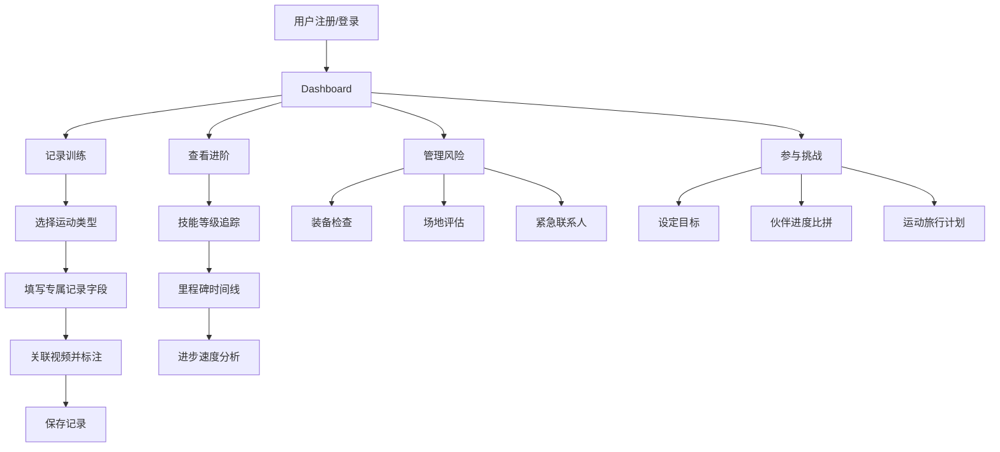

# 极限运动记录和训练规划平台 PRD

## 1. Product Overview

极限运动记录和训练规划平台是一个专为攀岩、滑板、冲浪爱好者设计的综合管理工具。平台帮助用户系统化地记录训练过程、追踪技能进阶、管理风险安全、以及参与社群挑战。

- 目标用户：攀岩、滑板、冲浪等极限运动爱好者，从初学者到专业运动员
- 核心价值：提供专属化记录、科学的进阶分析、全面的风险管理、社交化的挑战激励

## 2. Core Features

### 2.1 User Roles

| Role | Registration Method | Core Permissions |
|------|---------------------|------------------|
| Registered User | Email registration/Social login | 完整使用所有功能，管理个人数据 |

### 2.2 Feature Module

1. **Dashboard**：概览数据展示、快速操作入口、近期活动时间线
2. **训练记录模块**：运动专属记录、视频关联标注、伤病康复管理
3. **进阶追踪模块**：技能等级追踪、里程碑标注、进步速度分析
4. **风险管理模块**：装备检查记录、场地安全评估、紧急联系人管理
5. **社群挑战模块**：个人目标设定、伙伴比拼、运动旅行计划

### 2.3 Page Details

| Page Name | Module Name | Feature description |
|-----------|-------------|---------------------|
| Dashboard | 数据概览 | 展示训练统计、技能进度、即将到期的装备检查、近期目标 |
| 训练记录 - 攀岩 | 攀岩记录 | 路线难度、完成方式（红点/闪攀/ onsight）、动作要点、图片/视频关联 |
| 训练记录 - 滑板 | 滑板记录 | 技巧动作名称、成功次数、跌落记录、视频慢动作分析 |
| 训练记录 - 冲浪 | 冲浪记录 | 浪高、骑乘时间、动作序列、视频标记分析点 |
| 训练记录 - 伤病 | 伤病管理 | 受伤部位、处理方式、康复进度追踪、重返训练日期预测 |
| 进阶追踪 - 技能等级 | 技能追踪 | 攀岩难度等级图、滑板技巧树、冲浪进阶路径 |
| 进阶追踪 - 里程碑 | 里程碑展示 | 首次完成日期、突破记录、个人最佳成绩时间线 |
| 进阶追踪 - 进度分析 | 数据分析 | 学习曲线图表、掌握技能平均时间、进步趋势预测 |
| 风险管理 - 装备 | 装备管理 | 安全检查记录、更换周期提醒、装备清单 |
| 风险管理 - 场地 | 场地安全 | 危险因素评估、应急方案记录、危险等级评分 |
| 风险管理 - 紧急联系人 | 联系人管理 | 快速查看紧急联系人、一键呼叫、医疗信息 |
| 社群挑战 - 目标 | 目标管理 | 设定年度/季度目标、进度追踪、完成庆祝 |
| 社群挑战 - 伙伴 | 社交互动 | 伙伴邀请、进度对比、互相激励留言 |
| 社群挑战 - 旅行 | 旅行规划 | 运动地点发现、行程安排、装备清单提醒 |

## 3. Core Process

## 4. User Interface Design

### 4.1 Design Style

**设计理念**：现代动感、力量感、专业可靠

**色彩方案**：
- 主色：深橙色 #FF6B35（能量、运动、热情）
- 次色：深青色 #17A2B8（安全、专业、冷静）
- 背景：深色主题 #121212（减少疲劳、突出运动元素）
- 文本：高对比度白色/浅灰

**设计元素**：
- 卡片式布局，带微妙的渐变和阴影
- 动态进度条和技能树可视化
- 运动主题图标（攀岩墙、滑板、海浪等）
- 数据可视化图表（折线图、雷达图、热力图）

**排版**：
- 标题字体：粗体、现代无衬线
- 正文字体：清晰易读、高可读性
- 数据数字：等宽字体、醒目显示

**交互**：
- 悬停效果：轻微放大、亮度提升
- 滚动动画：渐入、视差效果
- 按钮：圆润边角、渐变填充、点击反馈

### 4.2 Page Design Overview

| Page Name | Module Name | UI Elements |
|-----------|-------------|-------------|
| Dashboard | 概览卡片 | 4个核心模块快捷入口卡片，统计数据展示，最近活动时间线 |
| 训练记录 | 表单 | 动态表单根据运动类型切换字段，视频上传和时间线标记，伤病日历视图 |
| 进阶追踪 | 数据可视化 | 技能树可交互展开，里程碑时间轴带图标，进度分析折线图和雷达图 |
| 风险管理 | 列表+卡片 | 装备检查日历提醒，场地风险评分热力图，紧急联系人一键拨打卡片 |
| 社群挑战 | 社交界面 | 目标进度环，伙伴排行榜，旅行计划地图视图 |

### 4.3 Responsiveness

- Desktop-first 设计，适配 1280px 及以上
- 平板：两列布局转单列，侧边栏折叠
- 移动端：底部导航，卡片堆叠，触摸优化按钮
- 关键操作始终保持单手可达

### 4.4 视觉设计细节

**动画效果**：
- 技能等级提升：环形进度条带动画填充
- 里程碑达成：粒子效果庆祝
- 数据加载：骨架屏占位、渐显过渡
- 表单提交：成功/失败状态动画反馈

**空状态设计**：
- 首次使用：引导式欢迎界面，快速开始教程
- 无记录：鼓励性文案，行动召唤按钮
- 数据加载中：优雅的加载动画

**主题色应用**：
- 攀岩模块：橙色系（岩石、火焰）
- 滑板模块：青色系（街头、潮流）
- 冲浪模块：蓝绿色系（海洋、自由）
- 安全模块：红色警示色渐变
