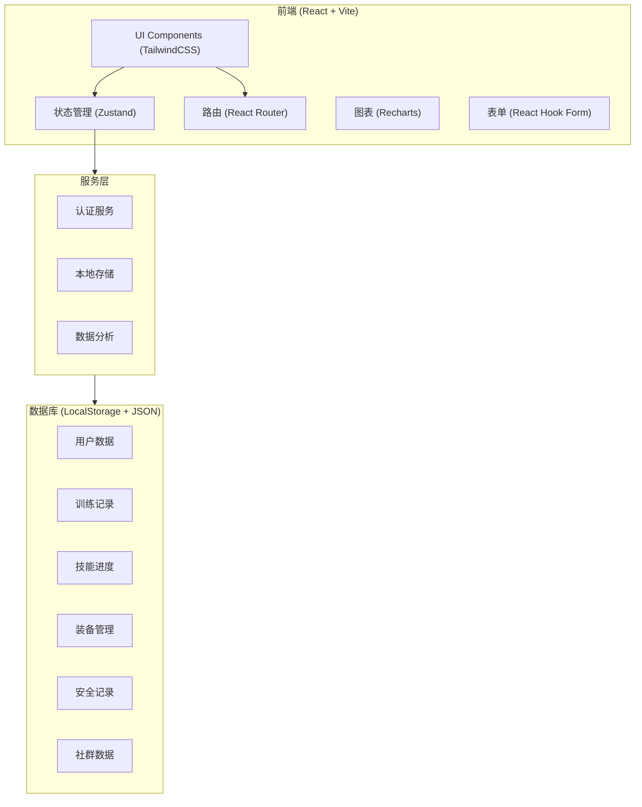

# 极限运动记录和训练规划平台 技术架构文档

## 1. Architecture Design



## 2. Technology Description

- **Frontend**: React@18 + TypeScript + TailwindCSS@3
- **Build Tool**: Vite@5
- **状态管理**: Zustand@4
- **路由**: React Router DOM@6
- **表单**: React Hook Form
- **图表**: Recharts
- **图标**: Lucide React
- **数据库**: LocalStorage + 前端模拟数据（演示模式）
- **初始化工具**: vite-init

## 3. Route Definitions

| Route | Purpose |
|-------|---------|
| / | 登录/欢迎页面 |
| /dashboard | 数据概览仪表盘 |
| /training/climbing | 攀岩训练记录 |
| /training/skateboarding | 滑板训练记录 |
| /training/surfing | 冲浪训练记录 |
| /training/injury | 伤病记录管理 |
| /progress/skills | 技能等级追踪 |
| /progress/milestones | 里程碑时间线 |
| /progress/analytics | 进步速度分析 |
| /safety/equipment | 装备安全检查 |
| /safety/locations | 场地安全评估 |
| /safety/emergency | 紧急联系人 |
| /community/goals | 个人挑战目标 |
| /community/partners | 训练伙伴比拼 |
| /community/trips | 运动旅行计划 |

## 4. Data Model

### 4.1 数据模型定义

```mermaid
erDiagram
    USERS ||--o{ TRAINING_RECORDS : "has"
    USERS ||--o{ INJURY_RECORDS : "has"
    USERS ||--o{ SKILLS : "tracks"
    USERS ||--o{ MILESTONES : "achieves"
    USERS ||--o{ EQUIPMENT : "owns"
    USERS ||--o{ LOCATIONS : "assesses"
    USERS ||--o{ EMERGENCY_CONTACTS : "has"
    USERS ||--o{ GOALS : "sets"
    USERS ||--o{ TRIPS : "plans"
    USERS ||--o{ PARTNERS : "connects"

    TRAINING_RECORDS {
        string id
        string sport_type "climbing|skateboarding|surfing"
        datetime date
        string location
        json details "运动专属字段"
        array video_annotations
        string notes
        datetime created_at
    }

    INJURY_RECORDS {
        string id
        string body_part
        string severity
        date injury_date
        string treatment
        string status "recovering|recovered|chronic"
        number recovery_progress
        date expected_return
        array rehabilitation_logs
    }

    SKILLS {
        string id
        string sport_type
        string skill_name
        string current_level
        number progress_percent
        date first_attempt_date
        date mastery_date
        array training_sessions
    }

    MILESTONES {
        string id
        string title
        string description
        string category
        date achieved_date
        string sport_type
        json achievement_details
        boolean is_public
    }

    EQUIPMENT {
        string id
        string name
        string type
        date purchase_date
        date last_check_date
        date next_check_date
        number check_interval_days
        string condition "excellent|good|fair|needs_replacement"
        array maintenance_logs
    }

    LOCATIONS {
        string id
        string name
        string type "climbing_gym|skate_park|surf_spot|outdoor"
        string address
        number safety_rating "1-5"
        json risk_factors
        json emergency_plan
        array photos
    }

    EMERGENCY_CONTACTS {
        string id
        string name
        string relationship
        string phone
        string email
        boolean is_primary
        string medical_info
    }

    GOALS {
        string id
        string title
        string description
        string sport_type
        date target_date
        number progress_percent
        string status "active|completed|abandoned"
        array milestones
    }

    TRIPS {
        string id
        string title
        date start_date
        date end_date
        array locations
        string status "planning|upcoming|completed"
        array packing_list
        array participants
    }

    PARTNERS {
        string id
        string name
        string avatar
        string sport_type
        number progress_comparison
        array shared_goals
        array messages
    }
```



### 4.2 本地存储数据结构

```typescript
// 用户数据结构
interface UserProfile {
  id: string;
  name: string;
  email: string;
  avatar?: string;
  primarySport: 'climbing' | 'skateboarding' | 'surfing';
  joinedDate: string;
}

// 攀岩记录详情
interface ClimbingDetails {
  routeName: string;
  grade: string;
  completionType: 'onsight' | 'flash' | 'redpoint' | 'attempt';
  attempts: number;
  keyMoves: string[];
  wallType: 'bouldering' | 'sport' | 'trad';
}

// 滑板记录详情
interface SkateboardingDetails {
  tricks: {
    name: string;
    attempts: number;
    successes: number;
    falls: number;
    notes: string;
  }[];
  locationType: 'street' | 'park' | 'vert' | 'bowl';
}

// 冲浪记录详情
interface SurfingDetails {
  waveHeight: string;
  rideTime: number;
  maneuvers: string[];
  boardType: string;
  conditions: string;
}

// 视频标注
interface VideoAnnotation {
  timestamp: number;
  label: string;
  description: string;
}

// 装备检查记录
interface EquipmentCheck {
  id: string;
  equipmentId: string;
  checkDate: string;
  inspector: string;
  findings: string;
  status: 'pass' | 'needs_action' | 'fail';
  nextAction?: string;
}

// 目标进度
interface GoalProgress {
  goalId: string;
  date: string;
  progress: number;
  notes: string;
}
```

## 5. 目录结构

```
project120/
├── src/
│   ├── components/
│   │   ├── common/
│   │   │   ├── Button.tsx
│   │   │   ├── Card.tsx
│   │   │   ├── Modal.tsx
│   │   │   ├── ProgressBar.tsx
│   │   │   └── Timeline.tsx
│   │   ├── training/
│   │   │   ├── ClimbingForm.tsx
│   │   │   ├── SkateboardingForm.tsx
│   │   │   ├── SurfingForm.tsx
│   │   │   ├── VideoAnnotation.tsx
│   │   │   └── InjuryCard.tsx
│   │   ├── progress/
│   │   │   ├── SkillTree.tsx
│   │   │   ├── MilestoneCard.tsx
│   │   │   └── ProgressChart.tsx
│   │   ├── safety/
│   │   │   ├── EquipmentCard.tsx
│   │   │   ├── LocationCard.tsx
│   │   │   └── EmergencyContactCard.tsx
│   │   └── community/
│   │       ├── GoalCard.tsx
│   │       ├── PartnerCard.tsx
│   │       └── TripCard.tsx
│   ├── pages/
│   │   ├── Dashboard.tsx
│   │   ├── Login.tsx
│   │   ├── training/
│   │   │   ├── Climbing.tsx
│   │   │   ├── Skateboarding.tsx
│   │   │   ├── Surfing.tsx
│   │   │   └── Injury.tsx
│   │   ├── progress/
│   │   │   ├── Skills.tsx
│   │   │   ├── Milestones.tsx
│   │   │   └── Analytics.tsx
│   │   ├── safety/
│   │   │   ├── Equipment.tsx
│   │   │   ├── Locations.tsx
│   │   │   └── Emergency.tsx
│   │   └── community/
│   │       ├── Goals.tsx
│   │       ├── Partners.tsx
│   │       └── Trips.tsx
│   ├── stores/
│   │   ├── useAuthStore.ts
│   │   ├── useTrainingStore.ts
│   │   ├── useProgressStore.ts
│   │   ├── useSafetyStore.ts
│   │   └── useCommunityStore.ts
│   ├── utils/
│   │   ├── storage.ts
│   │   ├── dateUtils.ts
│   │   ├── analytics.ts
│   │   └── mockData.ts
│   ├── types/
│   │   └── index.ts
│   ├── App.tsx
│   ├── main.tsx
│   └── index.css
├── .trae/
│   └── documents/
│       ├── PRD.md
│       └── TECHNICAL_ARCHITECTURE.md
├── package.json
├── tsconfig.json
├── vite.config.ts
├── tailwind.config.js
└── postcss.config.js
```

## 6. 状态管理设计

### 使用 Zustand 创建的 Store

```typescript
// useTrainingStore.ts
interface TrainingState {
  records: TrainingRecord[];
  injuries: InjuryRecord[];
  addRecord: (record: Omit<TrainingRecord, 'id' | 'created_at'>) => void;
  updateRecord: (id: string, updates: Partial<TrainingRecord>) => void;
  deleteRecord: (id: string) => void;
  addInjury: (injury: Omit<InjuryRecord, 'id'>) => void;
  updateInjury: (id: string, updates: Partial<InjuryRecord>) => void;
}

// useProgressStore.ts
interface ProgressState {
  skills: Skill[];
  milestones: Milestone[];
  getSkillProgress: (sport: string) => Skill[];
  addMilestone: (milestone: Omit<Milestone, 'id'>) => void;
  getAnalytics: (sport: string) => AnalyticsData;
}

// useSafetyStore.ts
interface SafetyState {
  equipment: Equipment[];
  locations: Location[];
  emergencyContacts: EmergencyContact[];
  overdueEquipment: Equipment[];
  addEquipment: (equipment: Omit<Equipment, 'id'>) => void;
  addLocation: (location: Omit<Location, 'id'>) => void;
}

// useCommunityStore.ts
interface CommunityState {
  goals: Goal[];
  partners: Partner[];
  trips: Trip[];
  activeGoals: Goal[];
  addGoal: (goal: Omit<Goal, 'id'>) => void;
  updateGoalProgress: (id: string, progress: number) => void;
  addTrip: (trip: Omit<Trip, 'id'>) => void;
}
```

## 7. 核心功能实现要点

### 7.1 专属运动记录表单
- 动态渲染不同运动类型的表单字段
- 基于 React Hook Form 的表单验证
- 视频上传与时间轴标注功能

### 7.2 技能树可视化
- 可展开折叠的技能层级结构
- 进度条动画效果
- 里程碑达成庆祝动画

### 7.3 数据分析
- Recharts 绘制学习曲线
- 进步速度计算（首次尝试到掌握的平均天数）
- 按运动类型的技能分布雷达图

### 7.4 装备检查提醒
- 下次检查日期计算
- 过期/即将过期装备高亮显示
- 检查历史记录时间线

### 7.5 响应式设计
- TailwindCSS 的响应式断点
- 移动端底部导航
- 桌面端侧边栏导航
