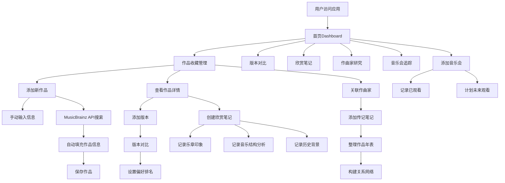

# 在线古典音乐欣赏和作品收藏管理工具 - PRD

## 1. Product Overview

一个完整的在线古典音乐欣赏和作品收藏管理工具，帮助古典音乐爱好者系统化地管理作品收藏、版本对比、欣赏笔记、作曲家研究和音乐会追踪。

- 主要用途：古典音乐作品档案管理、版本对比分析、聆听笔记记录、作曲家研究追踪、音乐会计划管理
- 目标用户：古典音乐爱好者、音乐专业学生、音乐收藏者

## 2. Core Features

### 2.1 User Roles

| Role | Registration Method | Core Permissions |
|------|---------------------|------------------|
| Normal User | Local storage / Supabase Auth | 全部功能，数据存储在本地或云端 |

### 2.2 Feature Module

1. **作品收藏模块**：作曲家/作品名称/作品编号/创作年代/时长/乐队编制管理，MusicBrainz API自动填充，个人评分和欣赏记录
2. **版本对比模块**：同一作品不同指挥/乐团版本收藏对比，演奏特点/时长差异/个人偏好排名，发行年代对比，历史背景记录
3. **欣赏笔记模块**：聆听笔记结构化记录，音乐结构学习记录，历史背景笔记
4. **作曲家研究模块**：作曲家传记笔记和时间线，作品年表整理，同时代作曲家关系网络
5. **音乐会追踪模块**：已观看音乐会记录，计划观看演出管理

### 2.3 Page Details

| Page Name | Module Name | Feature description |
|-----------|-------------|---------------------|
| 首页Dashboard | 总览卡片 | 收藏作品数量、最近聆听、待看音乐会统计 |
| 作品收藏 | 作品列表 | 作品卡片网格展示，支持筛选排序 |
| 作品收藏 | 作品详情 | 完整作品信息展示，版本列表，欣赏记录 |
| 作品收藏 | 作品编辑 | 添加/编辑作品，MusicBrainz API搜索填充 |
| 版本对比 | 版本对比视图 | 并排对比同一作品的不同版本 |
| 版本对比 | 偏好排名 | 拖拽排序版本，设置个人偏好 |
| 欣赏笔记 | 笔记列表 | 按作品/时间查看所有笔记 |
| 欣赏笔记 | 笔记编辑 | 结构化记录乐章印象、情感变化、时间戳 |
| 作曲家研究 | 作曲家列表 | 收藏的作曲家卡片 |
| 作曲家研究 | 作曲家详情 | 传记、时间线、作品年表、关系网络 |
| 音乐会追踪 | 音乐会日历 | 时间线视图展示已看和计划的音乐会 |
| 音乐会追踪 | 音乐会详情 | 演出曲目、地点、感受记录 |

## 3. Core Process

## 4. User Interface Design

### 4.1 Design Style

- **主色调**: 深栗色 (#6B2E2E) - 代表古典音乐的庄重与优雅
- **辅色调**: 金色 (#D4AF37) - 代表古典音乐的高贵与精致
- **中性色**: 米白色背景 (#FAF7F2)，深灰色文字 (#2C2C2C)
- **按钮风格**: 圆角 (8px)，优雅的阴影过渡效果
- **字体**: 
  - 标题: Playfair Display (衬线字体，古典气质)
  - 正文: Lato (无衬线字体，现代易读)
- **布局风格**: 卡片式布局，优雅的留白，分区明确
- **图标风格**: Lucide图标库，线性图标，金色/深栗色配色

### 4.2 Page Design Overview

| Page Name | Module Name | UI Elements |
|-----------|-------------|-------------|
| 首页Dashboard | 总览卡片 | 渐变色统计卡片，最近活动时间线，待办提醒 |
| 作品收藏 | 作品列表 | 网格布局作品卡片，悬停效果，筛选/排序工具栏 |
| 作品收藏 | 作品详情 | 分栏布局，左侧作品信息，右侧版本和笔记 |
| 版本对比 | 对比视图 | 并排卡片，差异高亮，偏好排名拖拽 |
| 欣赏笔记 | 笔记编辑 | 结构化表单，乐章分段，时间戳标记 |
| 作曲家研究 | 时间线 | 垂直时间线，作品年表可视化，关系网络图 |
| 音乐会追踪 | 日历视图 | 月份切换，已看/计划事件标记，详情模态框 |

### 4.3 Responsiveness

- **Desktop-first** 设计策略
- **移动端适配**: 网格转为单列，侧边栏转为抽屉，表格转为卡片
- **触摸优化**: 更大的点击区域，滑动操作支持

### 4.4 Visual Enhancement

- **背景纹理**: 细腻的古典乐谱纹理作为背景装饰（低透明度）
- **动画效果**: 卡片悬停微动画，页面加载淡入效果，表单提交反馈
- **深度层次**: 卡片阴影，渐变边框，微妙的分隔线
