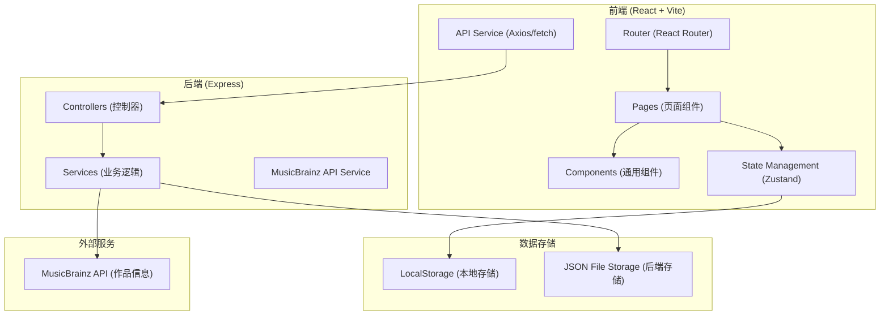
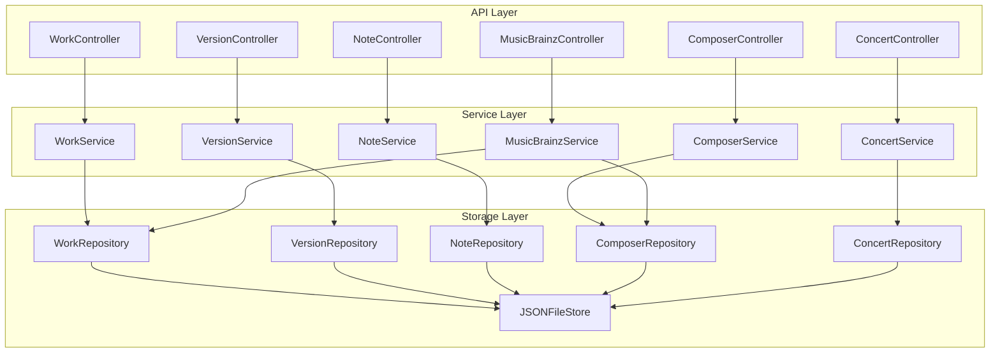
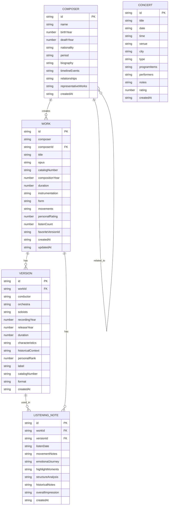

# 在线古典音乐欣赏和作品收藏管理工具 - 技术架构

## 1. Architecture Design



## 2. Technology Description

- **Frontend**: React@18 + TypeScript + tailwindcss@3 + vite
- **Initialization Tool**: vite-init with `react-express-ts` template
- **Backend**: Express@4 + TypeScript
- **State Management**: Zustand
- **Routing**: React Router DOM
- **Icons**: lucide-react
- **Data Storage**: LocalStorage (前端) + JSON File (后端)
- **External API**: MusicBrainz API

## 3. Route Definitions

| Route | Purpose |
|-------|---------|
| / | 首页 Dashboard |
| /works | 作品收藏列表 |
| /works/new | 添加新作品 |
| /works/:id | 作品详情 |
| /works/:id/edit | 编辑作品 |
| /versions/compare/:workId | 版本对比 |
| /notes | 欣赏笔记列表 |
| /notes/new | 新建笔记 |
| /notes/:id | 笔记详情 |
| /composers | 作曲家列表 |
| /composers/:id | 作曲家详情 |
| /concerts | 音乐会追踪 |
| /concerts/new | 添加音乐会 |

## 4. API Definitions

```typescript
// 作品类型
interface Work {
  id: string;
  composer: string;
  composerId?: string;
  title: string;
  opus?: string;
  catalogNumber?: string;
  compositionYear?: number;
  duration?: number;
  instrumentation?: string;
  form?: string;
  movements?: Movement[];
  personalRating?: number;
  listenCount: number;
  favoriteVersionId?: string;
  createdAt: string;
  updatedAt: string;
}

interface Movement {
  number: number;
  title: string;
  duration?: number;
  tempo?: string;
  key?: string;
}

// 版本类型
interface Version {
  id: string;
  workId: string;
  conductor: string;
  orchestra: string;
  soloists?: string;
  recordingYear?: number;
  releaseYear?: number;
  duration?: number;
  characteristics?: string;
  historicalContext?: string;
  personalRank?: number;
  label?: string;
  catalogNumber?: string;
  format?: string;
  createdAt: string;
}

// 笔记类型
interface ListeningNote {
  id: string;
  workId: string;
  versionId?: string;
  listenDate: string;
  movementNotes: MovementNote[];
  emotionalJourney?: string;
  highlightMoments: HighlightMoment[];
  structureAnalysis?: string;
  historicalNotes?: string;
  overallImpression?: string;
  createdAt: string;
}

interface MovementNote {
  movementNumber: number;
  title: string;
  impression?: string;
  structureNotes?: string;
}

interface HighlightMoment {
  timestamp: string;
  description: string;
}

// 作曲家类型
interface Composer {
  id: string;
  name: string;
  birthYear?: number;
  deathYear?: number;
  nationality?: string;
  period?: string;
  biography?: string;
  timelineEvents: TimelineEvent[];
  relationships: ComposerRelationship[];
  representativeWorks: RepresentativeWork[];
  createdAt: string;
}

interface TimelineEvent {
  year: number;
  event: string;
  type: 'birth' | 'work' | 'life' | 'death';
}

interface ComposerRelationship {
  composerId: string;
  composerName: string;
  relationship: string;
  description?: string;
}

interface RepresentativeWork {
  workId?: string;
  title: string;
  year?: number;
  form?: string;
}

// 音乐会类型
interface Concert {
  id: string;
  title: string;
  date: string;
  time?: string;
  venue: string;
  city?: string;
  type: 'attended' | 'planned';
  programItems: ConcertProgramItem[];
  performers?: string;
  notes?: string;
  rating?: number;
  createdAt: string;
}

interface ConcertProgramItem {
  order: number;
  composer: string;
  workTitle: string;
  workId?: string;
  intermission?: boolean;
}
```

## 5. Server Architecture



## 6. Data Model

### 6.1 Data Model Definition



### 6.2 Storage Structure

后端使用 JSON 文件存储数据，文件结构如下：

```json
{
  "works": [],
  "versions": [],
  "listeningNotes": [],
  "composers": [],
  "concerts": []
}
```

### 6.3 Seed Data

系统包含以下示例数据：

**作曲家示例**:
- Ludwig van Beethoven (1770-1827) - 古典主义/浪漫主义早期
- Wolfgang Amadeus Mozart (1756-1791) - 古典主义
- Johann Sebastian Bach (1685-1750) - 巴洛克
- Frédéric Chopin (1810-1849) - 浪漫主义

**作品示例**:
- Beethoven: Symphony No. 9 in D minor, Op. 125 "Choral"
- Mozart: Piano Concerto No. 21 in C major, K. 467
- Bach: Brandenburg Concerto No. 5 in D major, BWV 1050
- Chopin: Nocturne Op. 9, No. 2 in E-flat major
