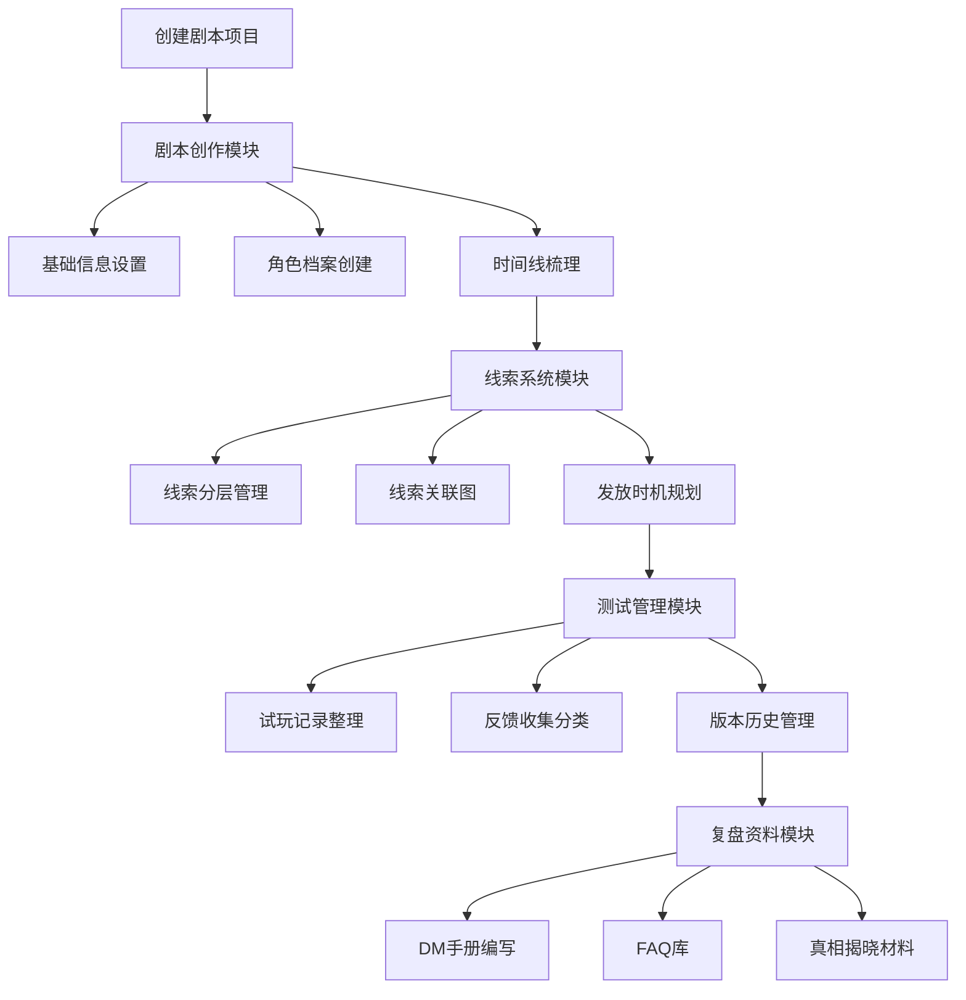

## 1. Product Overview
在线剧本杀内容创作和测试管理工具，帮助剧本杀作者和测试团队高效管理剧本创作、线索设计、测试反馈和复盘资料。

- 面向剧本杀创作者、DM（主持人）、测试团队
- 提供完整的端到端剧本创作和测试管理流程
- 降低剧本创作复杂度，提高测试效率

## 2. Core Features

### 2.1 User Roles
| Role | Registration Method | Core Permissions |
|------|---------------------|------------------|
| 创作者 | 本地存储（无需登录） | 创建、编辑、管理所有剧本和相关资料 |

### 2.2 Feature Module
1. **剧本创作模块**：剧本基础信息、角色档案、时间线梳理
2. **线索系统模块**：线索分层管理、线索关联图、发放时机规划
3. **测试管理模块**：试玩记录、玩家反馈收集、版本管理
4. **复盘资料模块**：DM手册、FAQ库、真相揭晓材料

### 2.3 Page Details
| Page Name | Module Name | Feature description |
|-----------|-------------|---------------------|
| 首页 | 项目列表 | 显示所有剧本项目，支持创建/编辑/删除项目 |
| 剧本创作页 | 基础信息 | 故事背景、时代、场景、人数、难度、游戏时长设置 |
| 剧本创作页 | 角色档案 | 角色名、身份、性格、动机、关系、秘密管理 |
| 剧本创作页 | 时间线梳理 | 完整时间线，角色行动轨迹可视化 |
| 线索系统页 | 线索分层 | 公开线索、隐藏线索、证据物件分类管理 |
| 线索系统页 | 线索关联图 | 线索指向真相的可视化关联 |
| 线索系统页 | 发放时机 | 按轮次规划线索发放 |
| 测试管理页 | 试玩记录 | 玩家构成、游戏时长、推理结果记录 |
| 测试管理页 | 反馈收集 | 线索明显度、角色趣味性等反馈分类 |
| 测试管理页 | 版本管理 | 修改历史和版本对比 |
| 复盘资料页 | DM手册 | 主持人须知和引导技巧 |
| 复盘资料页 | FAQ库 | 常见问题解答 |
| 复盘资料页 | 真相揭晓 | 游戏结束后的真相材料 |

## 3. Core Process
主要用户流程：
1. 用户创建新剧本项目
2. 在剧本创作模块填写基础信息、创建角色档案、梳理时间线
3. 在线索系统模块设计线索、建立关联、规划发放时机
4. 在测试管理模块记录试玩、收集反馈、管理版本
5. 在复盘资料模块编写DM手册、FAQ和真相揭晓材料

## 4. User Interface Design
### 4.1 Design Style
- **主色调**：深紫色（#4A148C）搭配暗红色（#7B1FA2），营造神秘悬疑氛围
- **辅助色**：金色（#FFD700）强调重要元素
- **背景**：深色主题（#1a1a2e），纹理暗纹增加层次感
- **按钮风格**：圆角方形，轻微立体感，悬停时有发光效果
- **字体**：'Noto Serif SC' 用于标题，'Noto Sans SC' 用于正文
- **布局风格**：卡片式布局，左侧导航栏，主内容区域左右分栏
- **图标**：使用 lucide-react 图标库，深色背景图标采用浅色

### 4.2 Page Design Overview
| Page Name | Module Name | UI Elements |
|-----------|-------------|-------------|
| 首页 | 项目列表 | 深色背景、金色标题、卡片网格布局、悬停发光效果、创建按钮带渐变动画 |
| 剧本创作页 | 基础信息 | 表单布局、标签式分区、文本域支持多行输入、下拉选择器 |
| 剧本创作页 | 角色档案 | 角色卡片列表、展开详情面板、关系图谱可视化、秘密区域标记 |
| 剧本创作页 | 时间线 | 纵向时间轴、角色标签、时间节点可折叠、滚动导航 |
| 线索系统页 | 线索分层 | 标签页切换（公开/隐藏/证据）、线索卡片、拖拽排序 |
| 线索系统页 | 线索关联图 | 节点连线图、可交互节点、缩放平移、真相高亮 |
| 线索系统页 | 发放时机 | 轮次卡片、时间轴视图、拖拽分配 |
| 测试管理页 | 试玩记录 | 表格视图、筛选器、分页、详情抽屉 |
| 测试管理页 | 反馈收集 | 分类标签、反馈卡片、情感色彩标识 |
| 测试管理页 | 版本管理 | 时间线视图、版本对比、回滚按钮 |
| 复盘资料页 | 所有模块 | 富文本编辑器、章节导航、打印/导出预览 |

### 4.3 Responsiveness
- Desktop-first 设计，针对 1280px+ 宽度优化
- 平板设备（768px-1279px）：侧边栏折叠为图标导航，主内容区自适应
- 移动设备（<768px）：底部导航栏，卡片单列布局，模态框替代侧边抽屉
- 触摸优化：增加按钮尺寸，支持滑动操作

### 4.4 动效设计
- 页面加载：渐入动画 + 内容区域交错显示
- 卡片悬停：边框发光 + 轻微上浮
- 表单输入：聚焦时边框高亮 + 输入提示
- 模态框：缩放淡入 + 背景模糊
- 时间线：节点逐个出现动画
