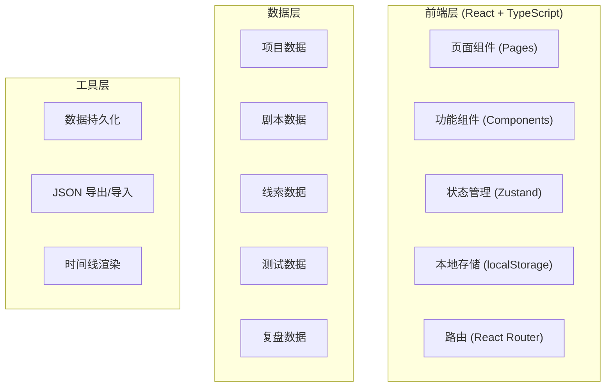
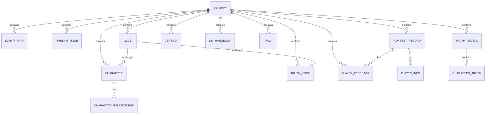

## 1. Architecture Design



## 2. Technology Description

- **前端框架**: React@18 + TypeScript
- **构建工具**: Vite@5
- **样式方案**: TailwindCSS@3
- **状态管理**: Zustand@4
- **路由管理**: React Router@6
- **图标库**: lucide-react
- **数据存储**: localStorage (无需后端)
- **初始化方式**: vite-init (react-ts 模板)

## 3. Route Definitions

| Route | Purpose |
|-------|---------|
| / | 首页 - 项目列表 |
| /project/:id/script | 剧本创作模块 |
| /project/:id/clues | 线索系统模块 |
| /project/:id/testing | 测试管理模块 |
| /project/:id/review | 复盘资料模块 |

## 4. API Definitions

本项目为纯前端应用，使用 localStorage 进行数据持久化，无需后端 API。

### 数据类型定义

```typescript
// 项目
interface Project {
  id: string;
  name: string;
  createdAt: string;
  updatedAt: string;
  currentVersion: string;
}

// 剧本基础信息
interface ScriptInfo {
  title: string;
  background: string;
  era: string;
  scenes: string[];
  playerCount: number;
  difficulty: 'easy' | 'medium' | 'hard' | 'expert';
  duration: number;
  description: string;
}

// 角色
interface Character {
  id: string;
  name: string;
  identity: string;
  personality: string;
  motivation: string;
  secrets: string;
  relationships: CharacterRelationship[];
  avatar?: string;
}

// 角色关系
interface CharacterRelationship {
  targetId: string;
  relationshipType: string;
  description: string;
}

// 时间线节点
interface TimelineNode {
  id: string;
  time: string;
  title: string;
  description: string;
  characterIds: string[];
  location?: string;
}

// 线索
interface Clue {
  id: string;
  name: string;
  description: string;
  type: 'public' | 'hidden' | 'evidence';
  round: number;
  location?: string;
  relatedTruthIds: string[];
  relatedCharacterIds: string[];
  imageUrl?: string;
}

// 真相节点
interface TruthNode {
  id: string;
  title: string;
  description: string;
  importance: number;
}

// 试玩记录
interface PlaytestRecord {
  id: string;
  date: string;
  players: PlayerInfo[];
  duration: number;
  finalConclusion: string;
  correctRate: number;
  notes: string;
}

// 玩家信息
interface PlayerInfo {
  name: string;
  characterId: string;
  role: string;
}

// 玩家反馈
interface PlayerFeedback {
  id: string;
  playtestId: string;
  category: 'clue_obvious' | 'clue_obscure' | 'character_boring' | 'timeline_confusing' | 'other';
  content: string;
  severity: 'low' | 'medium' | 'high';
  createdAt: string;
}

// 版本历史
interface Version {
  id: string;
  versionNumber: string;
  timestamp: string;
  changes: string;
  dataSnapshot: ProjectDataSnapshot;
}

// DM手册
interface DMHandbook {
  introduction: string;
  preparationGuide: string;
  flowGuide: string[];
  tips: string[];
  emergencyGuide: string;
}

// FAQ
interface FAQ {
  id: string;
  question: string;
  answer: string;
  category: string;
}

// 真相揭晓
interface TruthReveal {
  summary: string;
  fullStory: string;
  characterTruths: CharacterTruth[];
  keyClues: string[];
  timeline: TimelineNode[];
}

// 角色真相
interface CharacterTruth {
  characterId: string;
  trueIdentity?: string;
  realMotivation: string;
  keyActions: string[];
  secretRevealed: string;
}

// 完整项目数据快照
interface ProjectDataSnapshot {
  scriptInfo: ScriptInfo;
  characters: Character[];
  timeline: TimelineNode[];
  clues: Clue[];
  truthNodes: TruthNode[];
  playtestRecords: PlaytestRecord[];
  feedbacks: PlayerFeedback[];
  versions: Version[];
  dmHandbook: DMHandbook;
  faqs: FAQ[];
  truthReveal: TruthReveal;
}
```

## 5. Data Model

### 5.1 数据模型定义



### 5.2 数据结构说明

**存储结构 (localStorage)**:
- Key: `script-creator-projects` - 存储所有项目元数据列表
- Key: `script-creator-project-{id}` - 存储单个项目的完整数据

**项目数据结构**:
```json
{
  "project": {
    "id": "uuid",
    "name": "剧本名称",
    "createdAt": "ISO时间戳",
    "updatedAt": "ISO时间戳",
    "currentVersion": "v1.0.0"
  },
  "data": {
    "scriptInfo": {},
    "characters": [],
    "timeline": [],
    "clues": [],
    "truthNodes": [],
    "playtestRecords": [],
    "feedbacks": [],
    "versions": [],
    "dmHandbook": {},
    "faqs": [],
    "truthReveal": {}
  }
}
```

## 6. 项目结构

```
src/
├── components/
│   ├── layout/
│   │   ├── Sidebar.tsx
│   │   ├── Header.tsx
│   │   └── Modal.tsx
│   ├── common/
│   │   ├── Button.tsx
│   │   ├── Input.tsx
│   │   ├── Select.tsx
│   │   ├── Textarea.tsx
│   │   ├── Card.tsx
│   │   └── Tag.tsx
│   └── features/
│       ├── script/
│       │   ├── ScriptInfoForm.tsx
│       │   ├── CharacterCard.tsx
│       │   ├── CharacterEditor.tsx
│       │   ├── TimelineViewer.tsx
│       │   └── TimelineNodeEditor.tsx
│       ├── clues/
│       │   ├── ClueCard.tsx
│       │   ├── ClueEditor.tsx
│       │   ├── ClueTimeline.tsx
│       │   └── ClueRelationGraph.tsx
│       ├── testing/
│       │   ├── PlaytestCard.tsx
│       │   ├── FeedbackCard.tsx
│       │   └── VersionTimeline.tsx
│       └── review/
│           ├── DMHandbookEditor.tsx
│           ├── FAQCard.tsx
│           └── TruthRevealEditor.tsx
├── pages/
│   ├── Home.tsx
│   ├── ScriptCreation.tsx
│   ├── CluesSystem.tsx
│   ├── TestingManagement.tsx
│   └── ReviewMaterials.tsx
├── store/
│   ├── projectStore.ts
│   └── dataStore.ts
├── hooks/
│   ├── useLocalStorage.ts
│   └── useProject.ts
├── types/
│   └── index.ts
├── utils/
│   ├── storage.ts
│   ├── uuid.ts
│   ├── export.ts
│   └── format.ts
├── App.tsx
├── main.tsx
└── index.css
```
