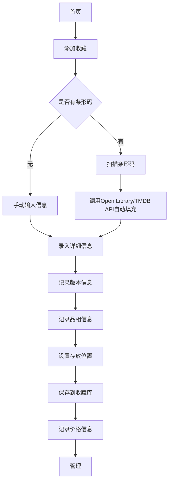

## 1. Product Overview

**在线碟片和实体媒体收藏管理工具

- 帮助用户系统化管理各类实体媒体收藏品（DVD/蓝光/黑胶/CD/游戏卡带）的综合性管理工具。

**产品简介：
- 目标用户：电影爱好者、音乐爱好者、游戏收藏家、音乐收藏家
- 解决问题：帮助用户有效组织、追踪和管理日益增长的实体媒体收藏品
- 目标价值：提供条形码扫描快速录入、智能版本管理、全方位价值追踪、借出管理等核心功能

**核心特色：
- 通过条码扫描自动填充（Open Library/TMDB API）
- 精细的存放位置管理
- 价值追踪和二手市场价格记录
- 愿望清单和推荐系统

## 2. Core Features

### 2.1 User Roles

| Role | Registration Method | Core Permissions |
|------|---------------------|------------------|
| Normal User | Email注册 | 完全访问所有功能，包括录入、管理、查看所有功能 |

### 2.2 Feature Module

1. **收藏档案模块**: 实体媒体录入、版本管理、品相记录
2. **存放管理模块**: 位置标注、排序视图、借出管理
3. **价值追踪模块**: 购入价格、估价追踪、购买渠道记录
4. **愿望清单模块**: 愿望列表、价格区间、出价记录
5. **推荐和评分模块**: 个人评分、观后感、推荐标记

### 2.3 Page Details

| Page Name | Module Name | Feature description |
|-----------|-------------|---------------------|
| 首页仪表盘 | 仪表盘概览 | 收藏统计、快速录入、最近添加 |
| 收藏列表页 | 收藏档案模块 | 媒体列表、筛选、搜索、版本筛选 |
| 媒体详情页 | 收藏档案模块 | 详细信息、版本管理、品相记录、价值追踪 |
| 添加/编辑媒体页 | 收藏档案模块 | 条形码扫描、详细信息录入、版本管理、品相记录 |
| 存放管理页 | 存放管理模块 | 书架管理、位置标注、排序视图、借出管理 |
| 价值追踪页 | 价值追踪模块 | 价格记录、价值变化趋势、购买渠道记录 |
| 愿望清单页 | 愿望清单模块 | 愿望列表、价格区间、出价记录 |
| 推荐和评分页 | 推荐和评分模块 | 个人评分、观后感、推荐标记 |

## 3. Core Process

**主要用户流程：

1. **添加收藏流程：
- 扫描条形码或手动输入媒体信息
- 系统自动从API获取信息或用户手动补充
- 记录版本和品相信息
- 保存到收藏库
- 记录存放位置和价格信息

2. **借出管理流程：
- 选择要借出的媒体
- 记录借出人信息和借出时间
- 设置预计归还时间
- 系统自动提醒归还

3. **价值追踪流程：
- 记录原始购入价格
- 定期更新当前市场价格
- 查看价值变化趋势
- 记录购买渠道信息

4. **愿望清单流程：
- 添加愿望清单
- 设置目标价格区间
- 记录二手市场出价信息
- 自动提醒价格变化

## 4. User Interface Design

### 4.1 Design Style

- **主色调**：深蓝紫色系（#1a1a2e, #16213e, #0f3460）
- **次要色**：金色系（#e94560 作为强调色）
- **按钮风格**：圆角按钮，悬停效果，平滑过渡
- **字体**：Playfair Display（标题）+ Open Sans（正文）
- **布局**：卡片式布局，卡片内边距充足
- **图标风格**：使用电影、唱片等与影视元素的卡片设计，强调媒体相关图标
- **动画效果**：平滑的阴影、悬停动画、滚动动画

### 4.2 Page Design Overview

| Page Name | Module Name | UI Elements |
|-----------|-------------|-------------|
| 首页仪表盘 | 仪表盘 | 深色主题、统计卡片、快速操作区、最近添加、借出提醒、价值趋势图表 |
| 收藏列表页 | 收藏档案 | 网格/列表视图切换、筛选器、搜索栏、媒体卡片 |
| 媒体详情页 | 收藏档案 | 媒体信息、版本管理、品相记录、价值追踪、借出状态、推荐信息 |
| 添加/编辑媒体页 | 收藏档案 | 表单、条形码扫描区、详细信息表单、版本管理、品相记录表单 |
| 存放管理页 | 存放管理 | 书架视图、位置标注、借出管理、排序切换、借出提醒
| 价值追踪页 | 价值追踪 | 价格记录、价值变化图表、购买渠道信息
| 愿望清单页 | 愿望清单 | 愿望列表、价格区间、出价记录、提醒
| 推荐和评分页 | 推荐和评分 | 评分、观后感、推荐标记

### 4.3 Responsiveness

- 桌面端：优先设计，采用响应式设计
- 移动端：适配移动端，优化布局，卡片堆叠布局
- 触控优化：触控优化

### 4.4 3D Scene Guidance

不适用

## 5. Non-Functional Requirements

- **性能**：页面加载时间 < 2秒
- **安全性**：本地存储数据，支持导出备份功能
- **可扩展性**：模块化设计，便于扩展
- **可访问性**：支持键盘导航、屏幕阅读器支持

## 6. 其他

- 支持导出/导入功能，防止数据丢失
- 深色主题
- 多语言支持（中文/英文）
- 数据备份与恢复
- 数据统计分析
