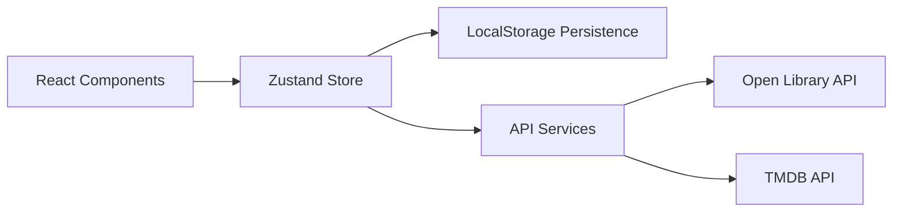
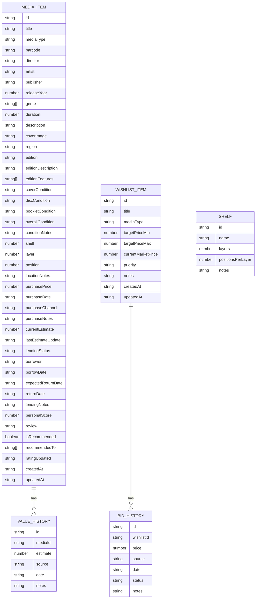

## 1. Architecture Design

```mermaid
graph TD
A[Frontend - React + Vite + Tailwind] --> B[Zustand Store]
B --> C[Local Storage (数据持久化]
A --> D[External APIs - Open Library/TMDB]
A --> E[Barcode Scanner API]
```

## 2. Technology Description

### 2.1 技术栈选择

- **前端**：
  - React@18 + TypeScript
  - Vite 5.x 构建工具
  - TailwindCSS 3.x 样式框架
  - Zustand 状态管理
  - React Router DOM 7.x 路由
  - Lucide React 图标库
  - Chart.js / Recharts 图表库

- **数据存储**：
  - LocalStorage（本地数据存储）
  - IndexedDB 备份存储
  - 支持导出/导入JSON

- **外部API**：
  - Open Library API（图书信息）
  - TMDB API（电影信息）
  - 条形码扫描API（Barcode Scanner API）
  - 市场价格查询（可选，使用mock数据）

- **开发工具**：
  - ESLint 代码规范
  - TypeScript 类型安全

## 3. Route Definitions

| Route | Purpose |
|-------|---------|
| / | 首页仪表盘 |
| /collections | 收藏列表页 |
| /collections/add | 添加新收藏 |
| /collections/:id | 媒体详情页 |
| /collections/:id/edit | 编辑媒体信息 |
| /storage | 存放管理页 |
| /value | 价值追踪页 |
| /wishlist | 愿望清单页 |
| /reviews | 推荐和评分页 |
| /settings | 设置页 |

## 4. API Definitions (Frontend Data Types)

### 4.1 核心数据类型

```typescript
// 媒体类型枚举
type MediaType = 'dvd' | 'bluray' | 'vinyl' | 'cd' | 'game'

// 版本类型
type EditionType = 'standard' | 'limited' | 'director_cut' | 'collector' | 'special'

// 品相等级
type ConditionGrade = 'mint' | 'near_mint' | 'very_good' | 'good' | 'fair' | 'poor'

// 借出状态
type LendingStatus = 'available' | 'lent' | 'overdue'

// 媒体类型接口
interface MediaItem {
  id: string
  title: string
  mediaType: MediaType
  barcode?: string
  // 基本信息
  director?: string
  artist?: string
  publisher?: string
  releaseYear?: number
  genre?: string[]
  duration?: number // 分钟
  description?: string
  coverImage?: string
  region?: string
  // 版本信息
  edition: EditionType
  editionDescription?: string
  editionFeatures?: string[]
  // 品相记录
  condition: {
    cover: ConditionGrade
    disc: ConditionGrade
    booklet: ConditionGrade
    overall: ConditionGrade
    notes?: string
  }
  // 存放位置
  location: {
    shelf: number
    layer: number
    position: number
    notes?: string
  }
  // 价值信息
  value: {
    purchasePrice: number
    purchaseDate: string
    purchaseChannel?: string
    purchaseNotes?: string
    currentEstimate: number
    lastUpdated: string
    valueHistory: ValueRecord[]
  }
  // 借出状态
  lending: {
    status: LendingStatus
    borrower?: string
    borrowDate?: string
    expectedReturnDate?: string
    returnDate?: string
    notes?: string
  }
  // 评分和推荐
  rating: {
    personalScore: number // 1-10
    review?: string
    isRecommended: boolean
    recommendedTo?: string[]
    lastUpdated: string
  }
  createdAt: string
  updatedAt: string
}

// 价值记录
interface ValueRecord {
  id: string
  mediaId: string
  estimate: number
  source: string
  date: string
  notes?: string
}

// 愿望清单
interface WishlistItem {
  id: string
  title: string
  mediaType: MediaType
  targetPrice: {
    min: number
    max: number
  }
  currentMarketPrice?: number
  priority: 'high' | 'medium' | 'low'
  notes?: string
  bidHistory: BidRecord[]
  createdAt: string
  updatedAt: string
}

// 出价记录
interface BidRecord {
  id: string
  wishlistId: string
  price: number
  source: string
  date: string
  status: 'active' | 'won' | 'lost' | 'expired'
  notes?: string
}

// 书架信息
interface Shelf {
  id: string
  name: string
  layers: number
  positionsPerLayer: number
  notes?: string
}
```

## 5. Server Architecture Diagram

本项目使用纯前端架构，数据存储在LocalStorage。



## 6. Data Model

### 6.1 Data Model Definition (Mermaid ER Diagram)



### 6.2 项目结构

```
project124/
├── src/
│   ├── components/          # 公共组件
│   │   ├── Layout/         # 布局组件
│   │   ├── MediaCard/      # 媒体卡片组件
│   │   ├── MediaForm/      # 媒体表单组件
│   │   ├── BarcodeScanner/ # 条码扫描组件
│   │   ├── ConditionRating/ # 品相评级组件
│   │   ├── ValueChart/     # 价值图表组件
│   │   └── common/         # 通用组件
│   ├── pages/              # 页面组件
│   │   ├── Dashboard/      # 仪表盘
│   │   ├── Collections/    # 收藏管理
│   │   ├── Storage/        # 存放管理
│   │   ├── ValueTracking/  # 价值追踪
│   │   ├── Wishlist/       # 愿望清单
│   │   ├── Reviews/        # 推荐评分
│   │   └── Settings/       # 设置页
│   ├── stores/             # Zustand状态管理
│   │   ├── mediaStore.ts   # 媒体数据store
│   │   ├── wishlistStore.ts # 愿望清单store
│   │   ├── shelfStore.ts   # 书架store
│   │   └── uiStore.ts      # UI状态store
│   ├── services/           # API服务
│   │   ├── openLibrary.ts  # Open Library API
│   │   ├── tmdb.ts         # TMDB API
│   │   └── barcode.ts      # 条码服务
│   ├── types/              # TypeScript类型
│   │   └── index.ts
│   ├── utils/              # 工具函数
│   │   ├── storage.ts      # 存储工具
│   │   ├── exportImport.ts # 导出导入
│   │   └── helpers.ts      # 辅助函数
│   ├── hooks/              # 自定义hooks
│   │   ├── useMediaFilter.ts
│   │   └── useLocalStorage.ts
│   ├── App.tsx             # 应用入口
│   ├── main.tsx            # 入口文件
│   └── index.css           # 全局样式
├── .trae/
│   └── documents/
│       ├── prd.md
│       └── technical-architecture.md
├── package.json
├── tsconfig.json
├── vite.config.ts
├── tailwind.config.js
└── postcss.config.js
```

## 7. State Management (Zustand Stores)

### 7.1 Media Store

```typescript
// stores/mediaStore.ts
import { create } from 'zustand'
import { persist } from 'zustand/middleware'
import { MediaItem, ValueRecord } from '@/types'

interface MediaState {
  media: MediaItem[]
  valueHistory: ValueRecord[]
  // Actions
  addMedia: (item: MediaItem) => void
  updateMedia: (id: string, updates: Partial<MediaItem>) => void
  deleteMedia: (id: string) => void
  addValueRecord: (record: ValueRecord) => void
  // Lending
  lendMedia: (id: string, lendingInfo) => void
  returnMedia: (id: string) => void
  // Rating
  updateRating: (id: string, ratingInfo) => void
}
```

### 7.2 Wishlist Store

```typescript
// stores/wishlistStore.ts
import { create } from 'zustand'
import { persist } from 'zustand/middleware'
import { WishlistItem, BidRecord } from '@/types'

interface WishlistState {
  wishlist: WishlistItem[]
  bidHistory: BidRecord[]
  // Actions
  addWishlistItem: (item: WishlistItem) => void
  updateWishlistItem: (id: string, updates) => void
  deleteWishlistItem: (id: string) => void
  addBidRecord: (record: BidRecord) => void
}
```

## 8. 核心功能实现要点

### 8.1 条码扫描与API集成

- 使用 Barcode Detection API 或第三方库进行条码扫描
- 实现 Open Library API 调用：`https://openlibrary.org/api/books?bibkeys=ISBN:{barcode}`
- 实现 TMDB API 调用：`https://api.themoviedb.org/3/search/movie`
- 自动填充表单字段

### 8.2 品相管理

- 实现分级品相记录：封面、光碟、手册、整体
- 使用可视化评级组件
- 支持自定义备注

### 8.3 存放位置管理

- 3维位置标注：书架、层、位置
- 可视化书架视图
- 支持快速定位

### 8.4 价值追踪

- 价格记录历史
- 价值趋势图表（使用 Recharts）
- 购买渠道和备注

### 8.5 数据持久化

- 使用 Zustand persist 中间件
- LocalStorage 存储
- 支持导出/导入JSON
- 数据备份与恢复

## 9. 外部API配置

### 9.1 Open Library API
- 无需API密钥
- 支持ISBN查询
- 文档：https://openlibrary.org/dev/docs/api/books

### 9.2 TMDB API
- 需要注册获取API Key
- 支持电影搜索
- 文档：https://developer.themoviedb.org/reference/intro/getting-started

## 10. 构建和部署

- 使用 `npm run dev` 启动开发服务器
- 使用 `npm run build` 生产构建
- 支持静态部署（Vercel/Netlify/GitHub Pages）
