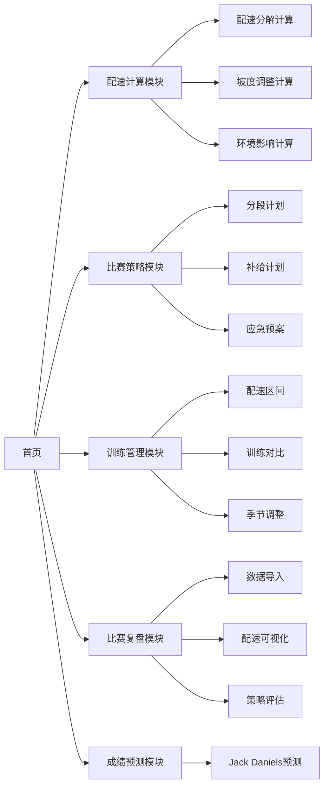

## 1. Product Overview

在线跑步配速和比赛策略规划工具，帮助跑者科学规划训练和比赛策略，提升跑步效率和比赛表现。

- 核心目的：提供专业的配速计算、比赛策略规划、训练管理和比赛复盘功能
- 目标用户：业余跑者、马拉松爱好者、跑步教练
- 市场价值：整合多种跑步计算工具，提供一站式跑步规划解决方案

## 2. Core Features

### 2.1 User Roles

| Role | Registration Method | Core Permissions |
|------|---------------------|------------------|
| 跑者用户 | 无需登录，本地存储 | 使用所有计算和规划功能，数据本地存储 |

### 2.2 Feature Module

1. **配速计算模块**: 目标完赛时间配速分解、坡度配速调整、气温湿度影响系数
2. **比赛策略规划模块**: 分段配速计划、补给站计划、应急预案
3. **训练配速管理模块**: 训练类型配速区间、训练对比、季节性调整
4. **比赛复盘模块**: 分段配速数据导入、配速分布可视化、策略执行评估
5. **预测工具模块**: 基于Jack Daniels公式的比赛目标成绩预测

### 2.3 Page Details

| Page Name | Module Name | Feature description |
|-----------|-------------|---------------------|
| 首页 | 导航面板 | 五大功能模块入口、快速计算器、跑步数据概览 |
| 配速计算 | 配速分解 | 输入目标完赛时间，计算10km/半马/全马每公里配速 |
| 配速计算 | 坡度调整 | 根据坡度百分比计算上坡/下坡配速调整 |
| 配速计算 | 环境影响 | 输入气温和湿度，计算配速影响系数 |
| 比赛策略 | 分段计划 | 制定前半程/后半程配速策略，防止撞墙 |
| 比赛策略 | 补给计划 | 规划补给站位置和补给内容 |
| 比赛策略 | 应急预案 | 提供状态不佳时的降速预案 |
| 训练管理 | 配速区间 | 显示轻松跑/马拉松配速/节奏跑/间歇跑的目标配速和心率 |
| 训练管理 | 训练对比 | 对比训练计划配速与实际配速 |
| 训练管理 | 季节调整 | 提供夏季高温配速放宽建议 |
| 比赛复盘 | 数据导入 | 支持GPX文件解析和手动录入每公里成绩 |
| 比赛复盘 | 可视化 | 图表展示每公里配速分布、最快最慢公里 |
| 比赛复盘 | 策略评估 | 评估比赛策略执行情况 |
| 成绩预测 | Jack Daniels预测 | 基于近期训练成绩预测比赛目标成绩 |

## 3. Core Process

用户从首页进入对应功能模块，输入相关参数，系统进行计算并展示结果，所有数据本地存储。

## 4. User Interface Design

### 4.1 Design Style

- 主色调：活力橙 (#FF6B35) 作为主色，代表运动活力
- 辅助色：深灰蓝 (#1E3A5F) 作为专业感背景色
- 强调色：绿色 (#10B981) 表示正常/达标，红色 (#EF4444) 表示警告/掉速
- 按钮风格：圆角矩形，悬停有微动画，主要按钮使用主色调
- 字体：现代无衬线字体，标题加粗，正文清晰易读
- 布局风格：卡片式布局，模块分区明确
- 图标风格：简洁的线性图标，符合运动主题

### 4.2 Page Design Overview

| Page Name | Module Name | UI Elements |
|-----------|-------------|-------------|
| 首页 | 导航面板 | 渐变背景、卡片式功能入口、图标展示、快速计算器 |
| 配速计算 | 计算器区域 | 表单输入区、实时计算结果展示、表格化每公里配速 |
| 比赛策略 | 计划区域 | 时间线可视化、补给站标记、策略选项卡 |
| 训练管理 | 配速区间 | 环形进度图、区间颜色区分、对比柱状图 |
| 比赛复盘 | 图表区域 | 折线图展示配速变化、颜色高亮异常公里、统计卡片 |
| 成绩预测 | 预测区域 | 输入表单、预测结果卡片、训练水平评估 |

### 4.3 Responsiveness

- 桌面端优先设计，支持平板和手机自适应
- 大屏：多列布局，图表展示更丰富
- 移动端：单列布局，简化操作流程

### 4.4 Visual Details

- 卡片阴影效果增强层次感
- 数据输入时实时反馈
- 图表数据点悬停显示详情
- 平滑的页面切换动画
