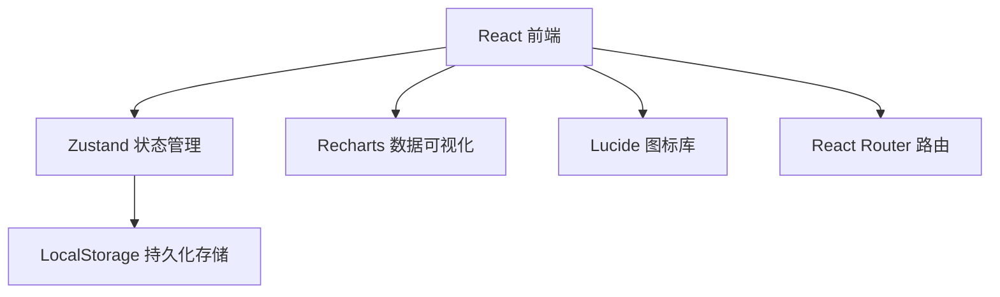
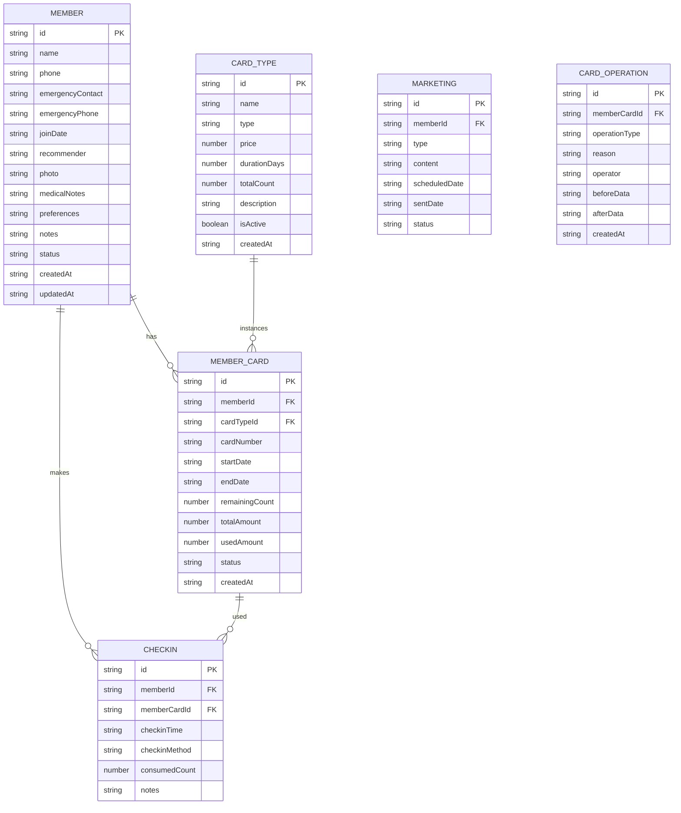

# 会员管理系统 技术架构文档

## 1. Architecture Design



## 2. Technology Description

- **前端框架**：React@18 + TypeScript
- **构建工具**：Vite@5
- **样式方案**：TailwindCSS@3
- **状态管理**：Zustand@4（轻量级状态管理，支持持久化）
- **路由管理**：React Router DOM@6
- **图标库**：Lucide React@0.4
- **数据可视化**：Recharts@2
- **数据存储**：浏览器 LocalStorage（纯前端方案）
- **初始化模板**：react-ts（vite-init）

## 3. Route Definitions

| Route | Page Component | Purpose |
|-------|----------------|---------|
| / | Dashboard | 首页仪表盘，展示关键指标和提醒 |
| /members | MemberList | 会员列表页面 |
| /members/:id | MemberDetail | 会员详情页面 |
| /members/new | MemberForm | 新增会员页面 |
| /cards | CardList | 会员卡列表页面 |
| /cards/config | CardConfig | 卡型配置页面 |
| /checkin | CheckinList | 签到记录页面 |
| /checkin/analysis | CheckinAnalysis | 活跃度分析页面 |
| /checkin/warning | CheckinWarning | 到期预警页面 |
| /marketing | Marketing | 营销管理页面 |
| /reports | Reports | 经营数据报表页面 |

## 4. Data Model

### 4.1 数据模型定义



### 4.2 卡型类型定义

| 类型 | type 值 | 计价方式 | 示例 |
|------|---------|----------|------|
| 月卡 | monthly | 有效期 | 30天内有效 |
| 季卡 | quarterly | 有效期 | 90天内有效 |
| 年卡 | yearly | 有效期 | 365天内有效 |
| 次卡 | count | 次数 | 10次/30次/50次 |
| 储值卡 | stored | 金额 | 充值金额，按次消费 |

### 4.3 状态定义

**会员状态 (MemberStatus)**：
- `active` - 正常
- `inactive` - 停用
- `expired` - 已过期

**会员卡状态 (CardStatus)**：
- `active` - 正常
- `paused` - 已暂停
- `expired` - 已过期
- `used_up` - 已用完
- `refunded` - 已退卡

**操作类型 (OperationType)**：
- `create` - 开卡
- `pause` - 暂停
- `resume` - 恢复
- `extend` - 延期
- `upgrade` - 升级
- `refund` - 退卡
- `recharge` - 充值

### 4.4 模拟数据初始化

系统启动时自动生成演示数据：
- 10-20个模拟会员（含照片占位符）
- 5-10种卡型配置
- 100-200条签到记录
- 5-10条营销提醒

## 5. Project Structure

```
src/
├── components/           # 通用组件
│   ├── Layout/          # 布局组件
│   ├── Card/            # 卡片组件
│   ├── Table/           # 数据表格
│   ├── Modal/           # 弹窗组件
│   └── Chart/           # 图表组件
├── pages/               # 页面组件
│   ├── Dashboard/
│   ├── Members/
│   ├── Cards/
│   ├── Checkin/
│   ├── Marketing/
│   └── Reports/
├── stores/              # Zustand 状态管理
│   ├── useMemberStore.ts
│   ├── useCardStore.ts
│   ├── useCheckinStore.ts
│   └── useMarketingStore.ts
├── types/               # TypeScript 类型定义
│   ├── member.ts
│   ├── card.ts
│   ├── checkin.ts
│   └── marketing.ts
├── utils/               # 工具函数
│   ├── date.ts
│   ├── storage.ts
│   └── mock.ts
├── App.tsx
├── main.tsx
└── index.css
```

## 6. State Management Strategy

使用 Zustand 进行状态管理，配合 persist 中间件实现 LocalStorage 持久化：

```typescript
const useStore = create(
  persist(
    (set, get) => ({
      // 状态定义
    }),
    {
      name: 'member-management-storage',
    }
  )
)
```

## 7. 数据统计逻辑

### 7.1 活跃会员定义
- 近30天内有签到记录的会员

### 7.2 流失会员定义
- 会员卡已过期超过60天且未续费

### 7.3 签到高峰时段分析
- 按小时统计（00:00-23:00），统计各时段签到次数

### 7.4 到期预警
- 会员卡有效期剩余 ≤ 7 天标记为"即将到期"
- 会员卡已过期标记为"已过期"
