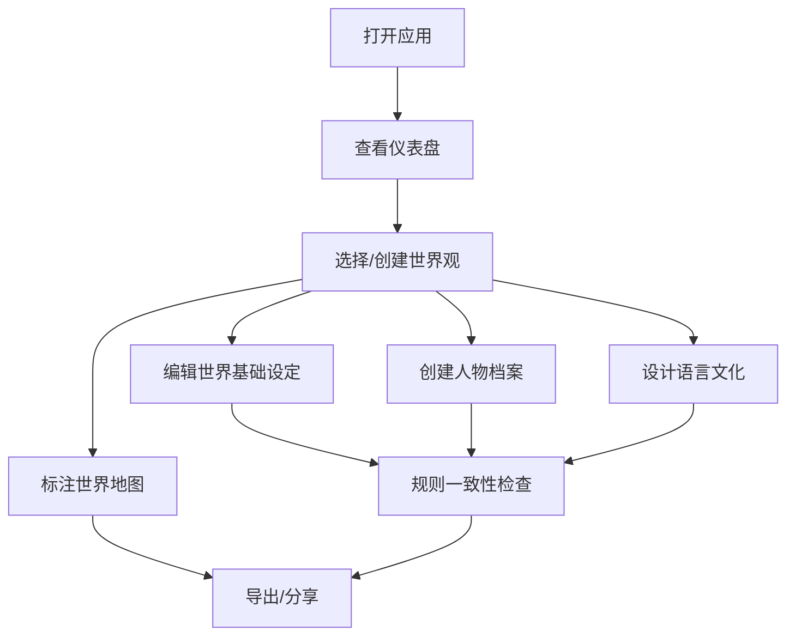

## 1. Product Overview
在线科幻/奇幻世界观构建和百科管理工具，帮助创作者系统化地构建、管理和展示虚拟世界的各个维度。

- **主要目的**：提供一套完整的工具链，让世界构建者能够创建、组织和维护复杂的世界观设定，确保设定的一致性和可检索性
- **目标用户**：科幻/奇幻作家、TRPG主持人、游戏设计师、影视编剧等需要构建虚拟世界的创作者
- **市场价值**：填补市场上缺乏一站式、模块化、可扩展的世界观构建工具的空白

## 2. Core Features

### 2.1 User Roles
| Role | Registration Method | Core Permissions |
|------|---------------------|------------------|
| 创作者 | 本地存储/云端同步 | 创建、编辑、管理所有世界观内容 |

### 2.2 Feature Module

1. **世界观文档模块**：世界基础设定、地理文明档案、规则一致性检查
2. **人物和阵营管理模块**：角色档案、阵营关系图、权力格局变化
3. **语言和文化模块**：语言词汇表、文化习俗、宗教神话体系
4. **地图和可视化模块**：基于Leaflet的世界地图、事件地点标注
5. **参考和灵感管理模块**：参考素材收集、灵感记录

### 2.3 Page Details
| Page Name | Module Name | Feature description |
|-----------|-------------|---------------------|
| 首页仪表盘 | 总览模块 | 世界观统计、最近编辑、快速入口 |
| 世界观文档 | 世界基础设定 | 宇宙起源、物理规则、魔法/科技体系、历史时间线 |
| 地理文明 | 地理和文明档案 | 大陆、国家、城市、种族、文化层级管理 |
| 规则检查 | 规则一致性自检 | 魔法规则冲突检测、科技水平一致性检查 |
| 人物档案 | 人物管理 | 角色创建、关系网络、能力记录 |
| 阵营组织 | 阵营管理 | 阵营关系图、盟友/敌人/中立势力 |
| 权力格局 | 势力消长 | 历史时期势力变化记录 |
| 语言设计 | 语言模块 | 词汇表、语法规则、翻译表 |
| 文化习俗 | 文化模块 | 节日、仪式、禁忌、价值观 |
| 宗教神话 | 宗教模块 | 神祇、神话、信仰体系 |
| 世界地图 | 地图模块 | Leaflet交互式地图、区域标注 |
| 事件地图 | 事件定位 | 重要事件发生地标注 |
| 参考素材 | 参考管理 | 影视/游戏/书籍参考收集 |
| 灵感笔记 | 灵感模块 | 创意灵感记录和标签管理 |

## 3. Core Process

### 主要用户流程
1. 用户打开应用，查看仪表盘了解当前世界观概览
2. 创建新世界观或选择已有世界观
3. 在对应模块中创建和编辑内容（世界设定、人物、文化等）
4. 在地图上标注重要地点和事件
5. 使用规则检查工具确保设定一致性
6. 收集参考素材和灵感笔记

## 4. User Interface Design

### 4.1 Design Style

#### 设计风格：暗黑奇幻
- **配色**：深色调为背景（深蓝/深紫渐变），金色/铜色为强调色，营造神秘典雅的氛围
- **按钮风格**：带有微妙渐变和边框，悬停时有发光效果
- **字体**：使用 Cinzel（标题，带有古典感）搭配 Inter（正文，现代易读）
- **布局**：侧边栏导航 + 主内容区，卡片式信息展示，支持折叠/展开
- **图标**：使用 lucide-react 图标库，统一线性风格

### 4.2 视觉规范
- **主色调**：`#1a1f35`（深蓝背景），`#2a2f4a`（卡片背景）
- **强调色**：`#d4af37`（金色），`#c77800`（铜色）
- **辅助色**：`#4a8f9e`（青色魔法系），`#8b5cf6`（紫色科技系）
- **字体层次**：H1 2.25rem，H2 1.875rem，H3 1.5rem，正文 1rem
- **动画**：微妙的过渡效果，卡片悬停上浮，展开/收起平滑动画

### 4.3 页面设计概述
| Page Name | Module Name | UI Elements |
|-----------|-------------|-------------|
| 仪表盘 | 总览 | 统计卡片、最近编辑列表、快捷操作按钮、时间线预览 |
| 世界观文档 | 表单与列表 | 结构化表单、分组标签、可折叠章节、富文本编辑 |
| 人物档案 | 详情页 | 头像、信息网格、关系图谱、时间线 |
| 地图模块 | 交互式 | Leaflet地图、自定义标记、图层切换、侧边详情面板 |
| 参考素材 | 卡片网格 | 图片卡片、标签筛选、分类管理 |

### 4.4 Responsiveness
- **Desktop-first** 设计，响应式适配
- **≥1200px**：四列网格，完整侧边栏
- **768px-1199px**：两到三列网格，可折叠侧边栏
- **<768px**：单列布局，底部导航，触摸优化
