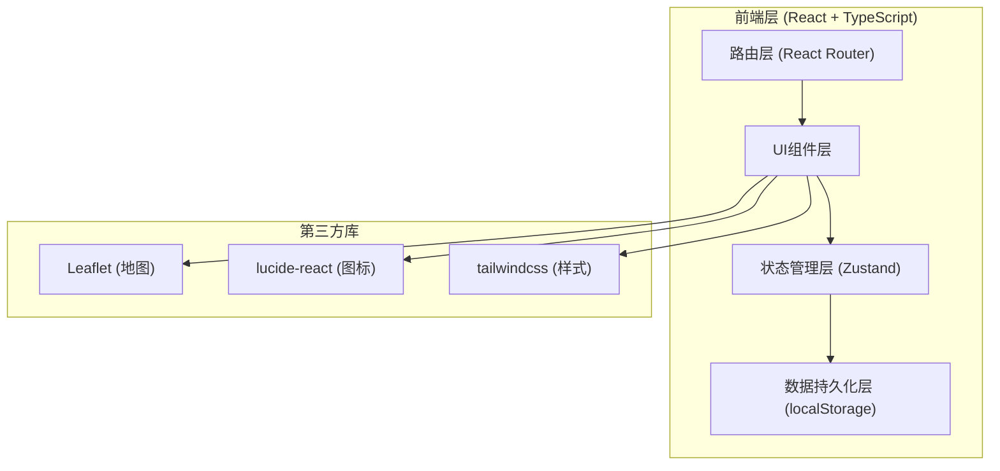
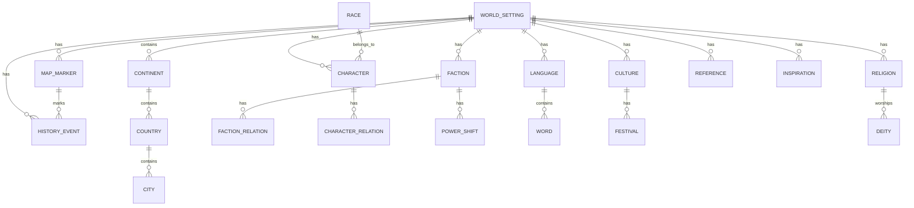

## 1. Architecture Design



## 2. Technology Description

- **Frontend**: React@18 + TypeScript + tailwindcss@3 + vite
- **Initialization Tool**: vite-init (react-ts template)
- **State Management**: Zustand
- **Routing**: react-router-dom
- **Map Library**: Leaflet + react-leaflet
- **Storage**: localStorage (JSON格式)
- **Icons**: lucide-react

## 3. Route Definitions

| Route | Purpose |
|-------|---------|
| / | 首页仪表盘 |
| /world | 世界基础设定 |
| /geography | 地理和文明档案 |
| /rules-check | 规则一致性检查 |
| /characters | 人物档案列表 |
| /characters/:id | 人物详情 |
| /factions | 阵营和组织 |
| /power-shifts | 权力格局变化 |
| /languages | 语言和词汇表 |
| /culture | 文化习俗 |
| /religion | 宗教和神话 |
| /map | 世界地图 |
| /references | 参考素材 |
| /inspirations | 灵感笔记 |

## 4. Data Model

### 4.1 Data Model Definition



### 4.2 Type Definitions

```typescript
interface WorldSetting {
  id: string;
  name: string;
  description: string;
  cosmicOrigin: string;
  physicsRules: string;
  magicSystem: MagicSystem | null;
  techSystem: TechSystem | null;
  createdAt: string;
  updatedAt: string;
}

interface MagicSystem {
  name: string;
  rules: string[];
  limitations: string[];
  sources: string[];
}

interface TechSystem {
  level: string;
  keyInventions: string[];
  limitations: string[];
}

interface Continent {
  id: string;
  name: string;
  description: string;
  geography: string;
}

interface Country {
  id: string;
  continentId: string;
  name: string;
  capital: string;
  government: string;
  population: string;
}

interface City {
  id: string;
  countryId: string;
  name: string;
  description: string;
  notableLocations: string[];
}

interface Race {
  id: string;
  name: string;
  physicalTraits: string;
  culturalTraits: string;
  lifespan: string;
}

interface Character {
  id: string;
  name: string;
  alias: string[];
  race: string;
  birthdate: string;
  deathdate: string | null;
  appearance: string;
  personality: string;
  abilities: string[];
  backstory: string;
  motivations: string[];
  factionId: string | null;
}

interface Faction {
  id: string;
  name: string;
  type: string;
  ideology: string;
  leadership: string;
  territory: string;
}

interface FactionRelation {
  id: string;
  factionA: string;
  factionB: string;
  type: 'ally' | 'enemy' | 'neutral' | 'vassal';
  description: string;
}

interface CharacterRelation {
  id: string;
  characterA: string;
  characterB: string;
  type: string;
  description: string;
}

interface PowerShift {
  id: string;
  factionId: string;
  period: string;
  change: string;
  description: string;
}

interface Language {
  id: string;
  name: string;
  family: string;
  speakers: string;
  grammarRules: string;
  writingSystem: string;
}

interface Word {
  id: string;
  languageId: string;
  original: string;
  translation: string;
  pronunciation: string;
  partOfSpeech: string;
}

interface Culture {
  id: string;
  name: string;
  values: string[];
  taboos: string[];
  socialStructure: string;
}

interface Festival {
  id: string;
  cultureId: string;
  name: string;
  date: string;
  purpose: string;
  traditions: string[];
}

interface Religion {
  id: string;
  name: string;
  type: string;
  coreBeliefs: string[];
  practices: string[];
}

interface Deity {
  id: string;
  religionId: string;
  name: string;
  domain: string;
  mythology: string;
}

interface HistoryEvent {
  id: string;
  date: string;
  title: string;
  description: string;
  participants: string[];
  consequences: string;
  locationId: string | null;
}

interface MapMarker {
  id: string;
  name: string;
  type: 'city' | 'landmark' | 'battlefield' | 'mystical';
  lat: number;
  lng: number;
  description: string;
}

interface Reference {
  id: string;
  title: string;
  type: 'book' | 'movie' | 'game' | 'other';
  author: string;
  url: string;
  notes: string;
  tags: string[];
}

interface Inspiration {
  id: string;
  title: string;
  content: string;
  tags: string[];
  createdAt: string;
}
```

## 5. Project Structure

```
src/
├── components/
│   ├── common/
│   │   ├── Card.tsx
│   │   ├── Button.tsx
│   │   ├── Input.tsx
│   │   ├── Modal.tsx
│   │   └── Sidebar.tsx
│   ├── world/
│   │   ├── WorldSettingForm.tsx
│   │   └── Timeline.tsx
│   ├── geography/
│   │   ├── ContinentList.tsx
│   │   └── HierarchyTree.tsx
│   ├── characters/
│   │   ├── CharacterCard.tsx
│   │   ├── CharacterDetail.tsx
│   │   └── RelationGraph.tsx
│   ├── factions/
│   │   ├── FactionList.tsx
│   │   └── FactionRelationChart.tsx
│   ├── language/
│   │   ├── VocabularyTable.tsx
│   │   └── TranslationTool.tsx
│   ├── culture/
│   │   ├── FestivalList.tsx
│   │   └── DeityCard.tsx
│   ├── map/
│   │   ├── WorldMap.tsx
│   │   └── MarkerForm.tsx
│   └── references/
│       ├── ReferenceCard.tsx
│       └── InspirationList.tsx
├── pages/
│   ├── Dashboard.tsx
│   ├── WorldSetting.tsx
│   ├── Geography.tsx
│   ├── RulesCheck.tsx
│   ├── Characters.tsx
│   ├── CharacterDetail.tsx
│   ├── Factions.tsx
│   ├── PowerShifts.tsx
│   ├── Languages.tsx
│   ├── Culture.tsx
│   ├── Religion.tsx
│   ├── WorldMap.tsx
│   ├── References.tsx
│   └── Inspirations.tsx
├── store/
│   └── useWorldStore.ts
├── hooks/
│   └── useLocalStorage.ts
├── types/
│   └── index.ts
├── utils/
│   ├── idGenerator.ts
│   └── rulesChecker.ts
├── App.tsx
├── main.tsx
└── index.css
```
